**Cellular Expert**

**1. Creating Workspace**

\
=

# Objective

This tutorial demonstrates how to create a personal geodatabase for use with Cellular Expert in a single-use configuration and introduces basic functions. By the end of the exercise, you will be able to:

- Create ArcGIS Pro project.

- Create a new Cellular Expert database.

- Add and manage topographical data.

## Single-User Environment

For the Single-User configuration of Cellular Expert, all information about radio network objects is stored in a personal geodatabase (GDB format) or locally on the disc (calculation results, raster data in GeoTIFF format, etc.).

# Create CE Workspace

## Create ArcGIS Pro project

This guide outlines the steps for creating and saving an ArcGIS Pro project, where we will store CE Workspace feature layer paths and layer visualizations. This will allow you to reopen the saved project at any time, view the added layers in the Contents pane, and continue working with them.

Start ArcGIS Pro application. Click on *Start without a template* option.

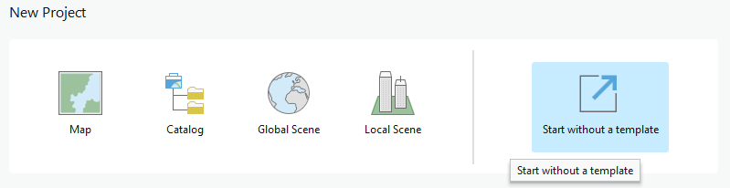

In the opened window, click on *New Map \> New Map*.

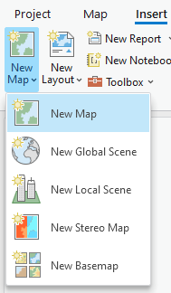

A new map with basemaps layers will be added to the project. Click on *Project, Save Project*.

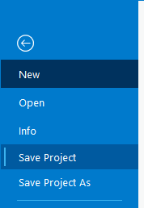

In the new opened dialog, navigate to *C:\CE_Course\CreateWorkspace*

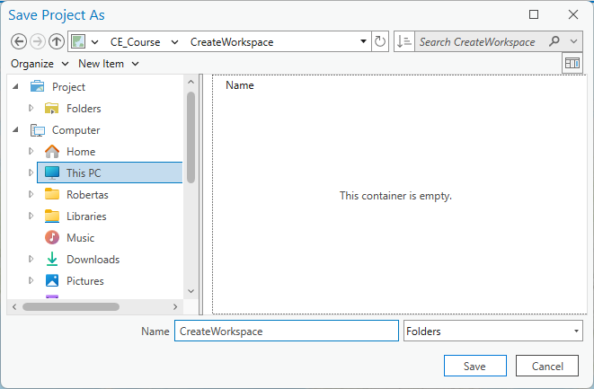

- If you are using ArcGIS Pro 3.3 version, just type **Project** in Name section.

- If you are using ArcGIS Pro 3.1, or 3.2 version, click on New Item and select Folder

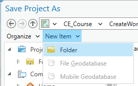

> Type Project.
>
> 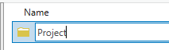
>
> Click on any location to deactivate folder name section, and select this newly created folder.
>
> 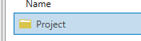

Press *Save* button and it will create all necessary ArcGIS Pro folders and files in this location.

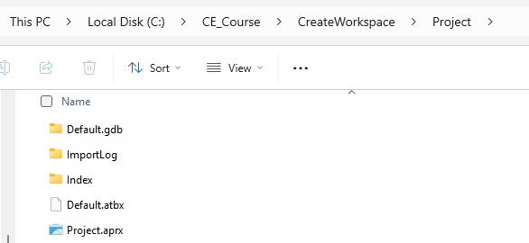

## Create CE database

Click on **CE RCP** tab and open *Workspace \> Create*.

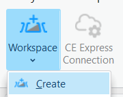

The *Create New Workspace* dialog will appear.

***New workspace path** –* it will be automatically filled based on ArcGIS Pro project location. Leave it as it is.

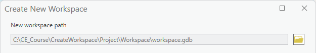

***Geodata folder path** -* catalog where geodata are stored. Click on  *Browse* button and navigate to *C:\CE_Course\Geodata* directory, and select **Vilnius** catalog.

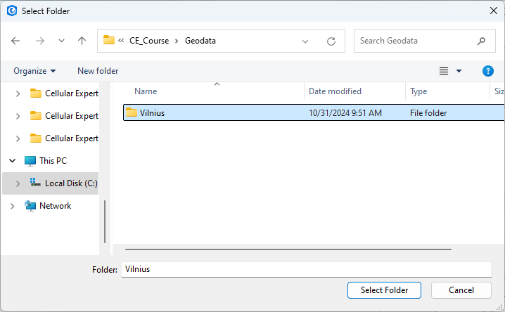

Press *Select Folder* button.

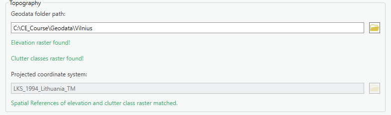

<u>*Note*:</u> *Projected Coordinate System* is filled automatically and taken from the defined *Elevation grid*. The purpose of this parameter is that the created workspace and geodata would have the same coordinate system.

***Also create Local Scene*** – check to create a second scene for 3D visualization.

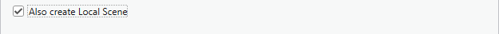

Click *OK* button to create a new workspace. It will create Cellular Expert tables, feature datasets and add the new Cellular Expert workspace to the project. This procedure may take a few seconds to complete.

As the results Workspace folder will be created in the same location as ArcGIS Pro project.

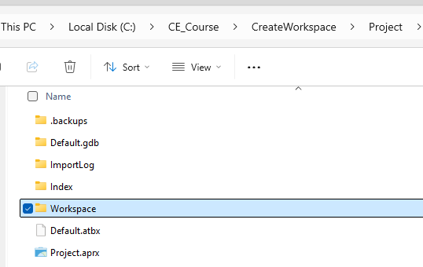

This folder contains all necessary information for CE project.

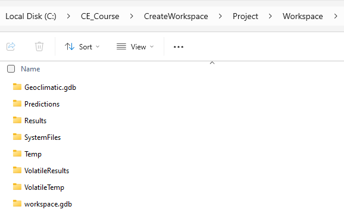

Get back to ArcGIS Pro and preview that two tabs were created in ArcGIS Pro view.

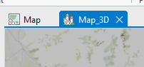

- Map_3D is Local Scene where you can work in 3D environment.

- Map is 2D map.

Click on Map view and continue to work with the project.

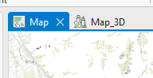

The created workspace and topograhical data will appear on the Table of Contents. Move elevation.tif raster above Topographic layer, and switch on/off layers above it.

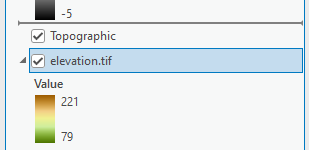

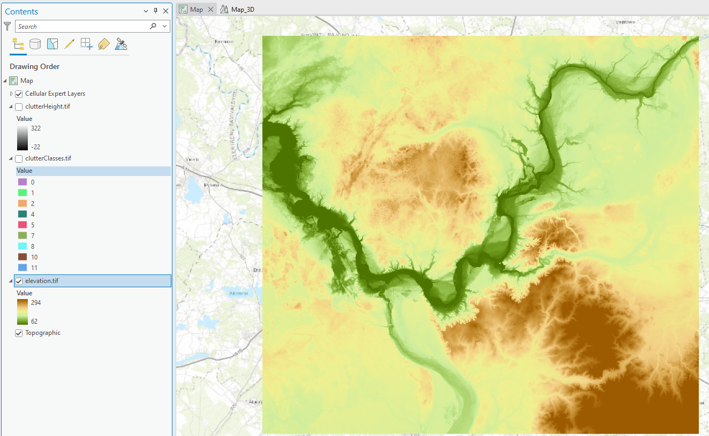

Adjust added rasters symbology by your requirements. Right click on the layer in Contents and choose Symbology.

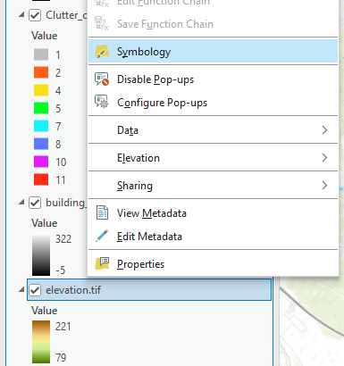

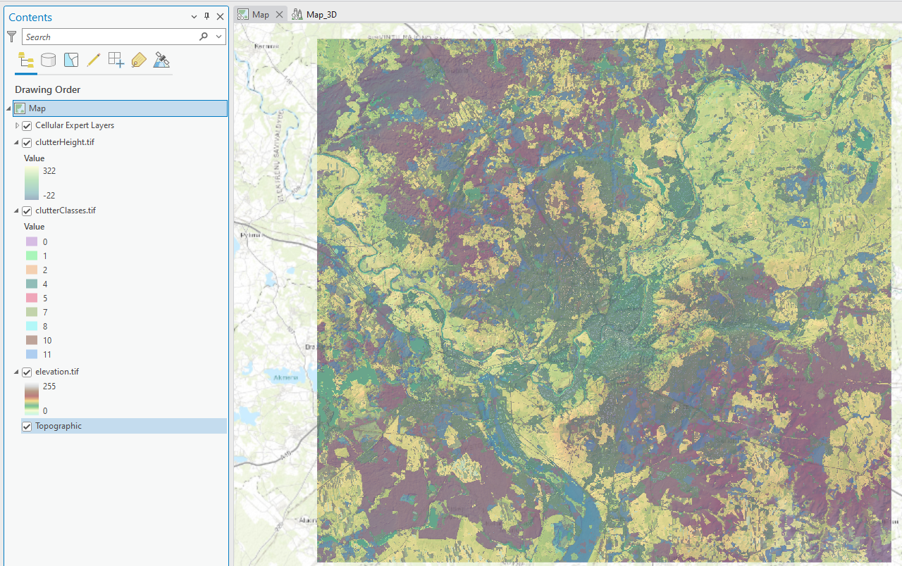

# Profile

Go to CE RCP tab, and open *Profile* tool. Here enter:

For Transmitter:

Latitude: 54.7539217

Longitude: 25.2326465

For Receiver

Latitude: 54.7461165\
Longitude: 25.2600037

Then Click on *Manual Profile* button. Preview profile and involved geodata.

Close Profile windows.

# 3D View

Right click on Map_3D and choose New Vertical Tab Group option.

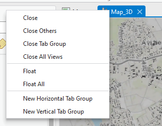

The project will be split into two windows.

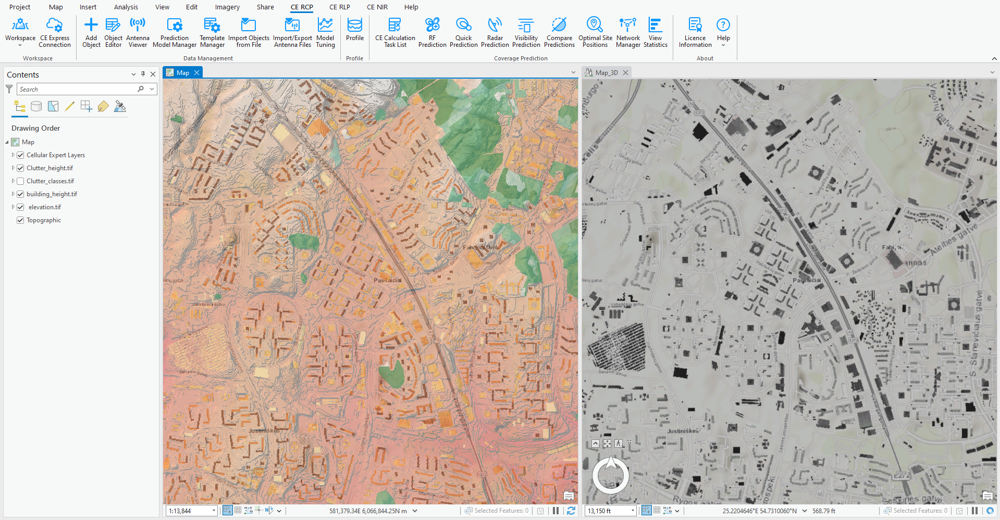

Navigate in the map, 2D and 3D maps will move simultaneously.

Using Explore button switch view angle on the 3D Map.

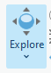

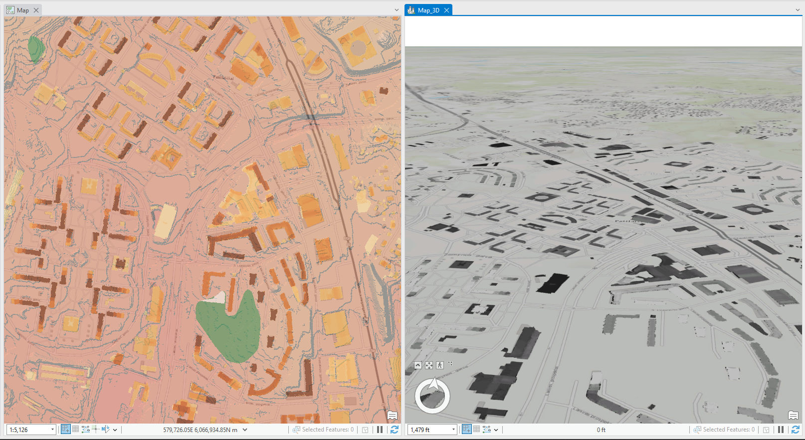

3D buildings can be added and visualized in Map_3D scene, as an example OpenStreetMap Buildings data can be added from LivingAtlas to the project.

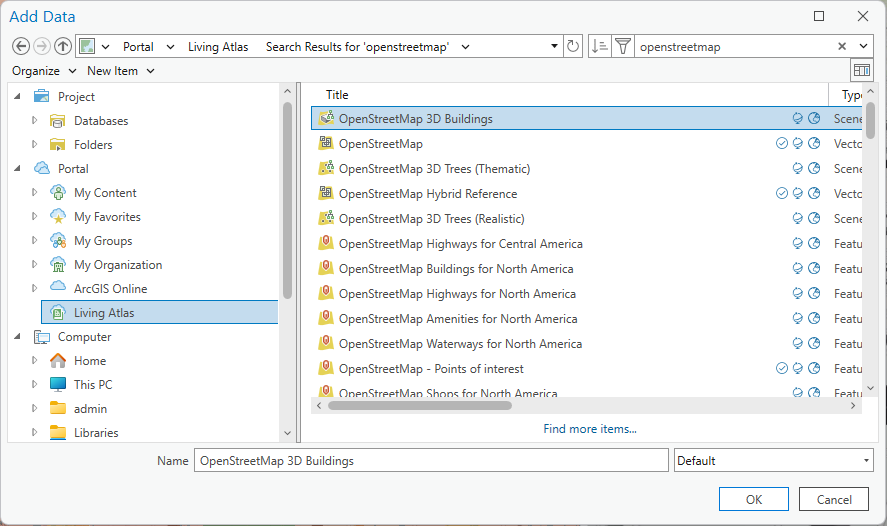

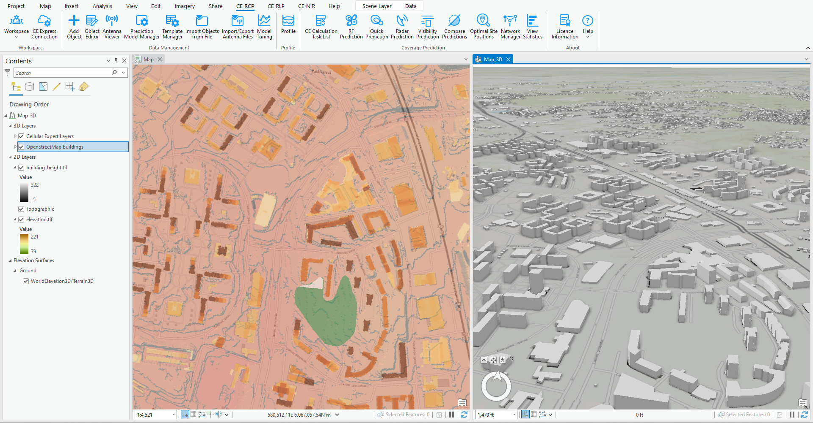
