# Objective

Explain and show the main parameters for Cell object and how they influence calculations.

At the end of exercise you will be able to:

- Analyze line-of-sight visibility with profiling tool;

- Perform visibility analysis with visibility tool.

# Initial data

Prepared project with:

- Network objects.

- Geodata.

- Equipment and models.

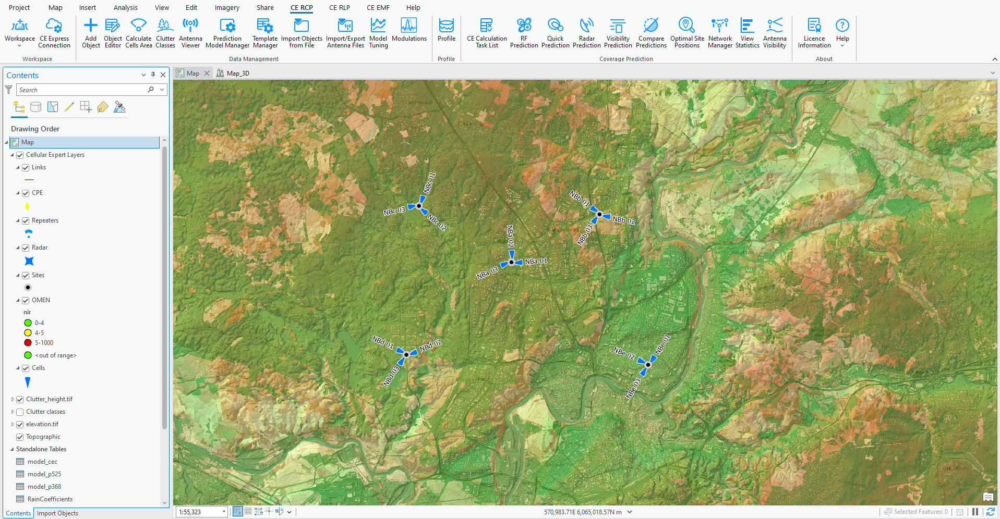

# Profiling

Navigate to C:\CE_Course\LineOfSight\Project and run Project.aprx file to open the prepared project for Profiling exercise.

The profile offers a detailed view of the topographical data between the transmitter and receiver, providing crucial insights into path loss at the receiver location, expected signal strength, angles, and other relevant information. This data is instrumental in making informed decisions regarding equipment, parameters and conditions of LOS, OLOS and NLOS. Additionally, Cellular Expert has incorporated advanced analyses such as antenna height optimization, what-if scenarios including the addition of obstacles, and reflection analysis. In this exercise, we will explore several of these functions in depth.

First, we need to identify the transmitter location. The transmitter point on the profile can be selected directly on the map, or by entering the coordinates in the Profile dialog. Open Profile tool in CE RCP or CE RLP tabs, and locate the NBa 01 cell, move the mouse cursor over it, and you'll notice the mouse icon change as it snaps to the cell.

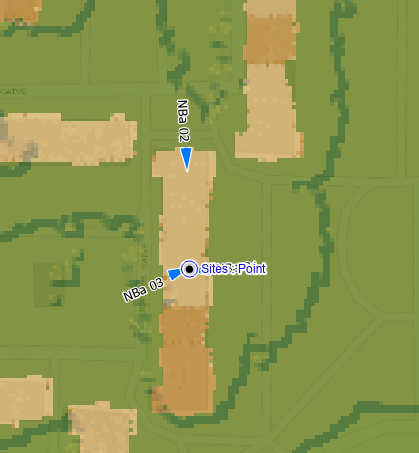

Click on NBa 01 once and then define receiver point (please select receiver position by your own).

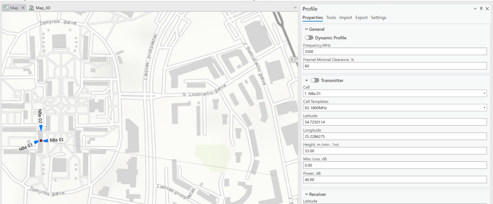

Once receiver position is selected, the profile will be generated and visible in your project. You will get a detailed information about LOS, OLOS and NLOS conditions in map view and graph view.

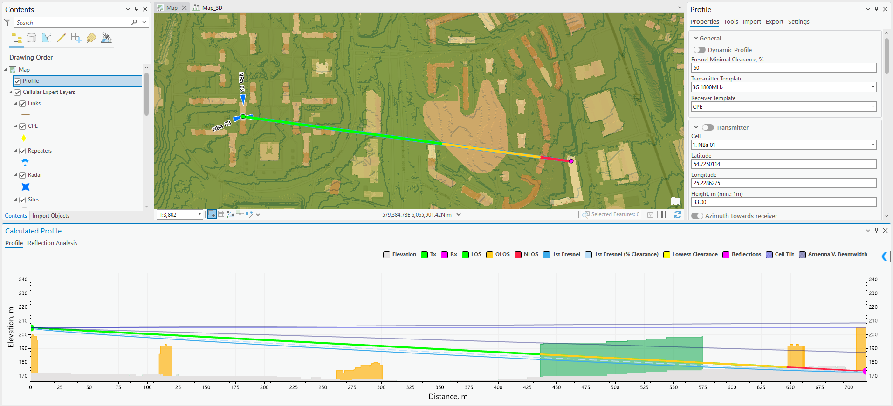

- Green color shows line of sight (LOS) condition.

- Yellow color shows that the path is obstructed by clutter (OLOS).

- Red color shows that the path is obstructed by elevation or buildings (NLOS).

Click on Show Table option to preview calculations.

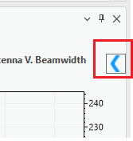

It will open additional view with the calculations of generated profile.

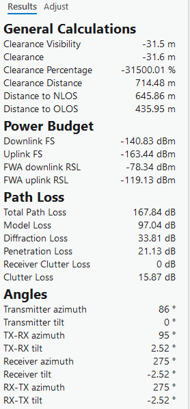

## Adjust Profile parameters

In a what-if scenario, we can modify the profile parameters. These parameters are automatically extracted from the snapped Cell object and populated in the Profile view, where they can be adjusted as needed. Once changes are made, the profile and all associated calculations will be automatically updated.

### Power

Change Power from 40 to 43 value and Downlink Field Strength and FWA downlink RSL will be recalculated automatically.

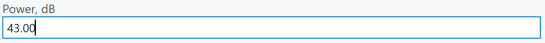

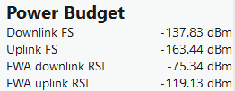

### Heights

Adjust the Receiver height value from 1.5 meters to any other value.

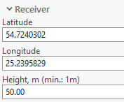

You can do this either through the graphical interface or by simply dragging the receiver point up or down in the graph view. Observe how the profile is recalculated in the map view, including the changes in the line colors, graphical interface, and Path Loss calculations.

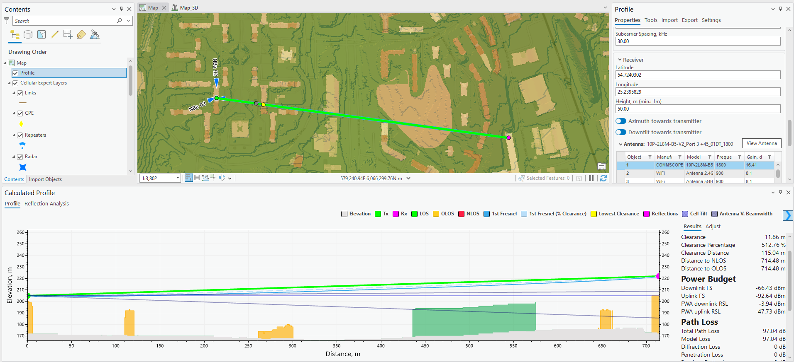

### Frequency

Change Frequency value from 3500 to 700.

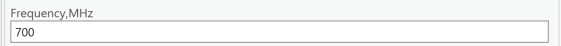

Preview Path Loss calculations and how it affected its value.

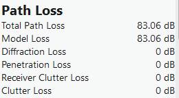

## Profiling with fixed transmitter location

Fixing the transmitter location allows for quicker profile drawing across multiple receiver positions. With the transmitter location fixed, there's no need to re-identify it each time a profile is drawn. Simply change the receiver position by clicking on the map.

Enable Fixed Transmitter option.

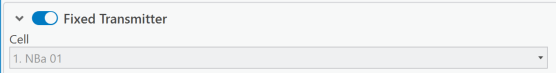

Transmitter point is fixed, and the receiver point can be defined by click on the map.

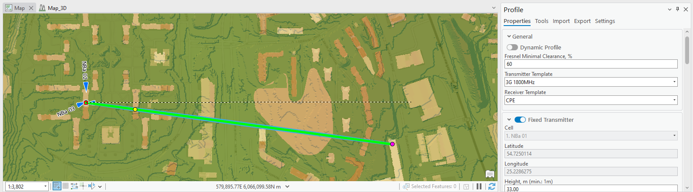

## Dynamic profile

Turn of Fixed Transmitter option.

There's no need to click on the map to set the receiver location. The profile is automatically redrawn based on the mouse's position on the map. However, this continuous redrawing with each mouse movement can be resource intensive for your workstation. Decide which method works best for you: the fixed transmitter tool or the dynamic profile.

Enable Dynamic Profile option

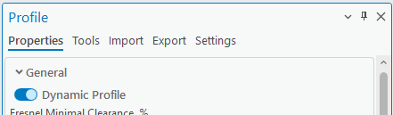

Then move mouse coursor on the map and profile will be automatically drawn based on the receiver location.

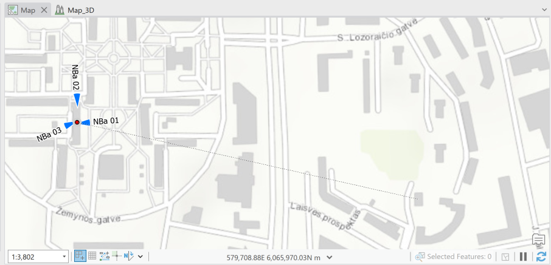

Uncheck Dynamic profile option.

## Reflections

Analyzing reflections in point-to-point communication, especially in the context of wireless technologies like 5G, is crucial for several reasons:

- Reflections can either reinforce or interfere with the original signal. By analyzing reflections, engineers can predict signal strength variations caused by multipath propagation, ensuring the quality and reliability of the transmitted signal.

- Reflections can cause interference, leading to signal degradation or loss. Understanding how reflections occur helps in designing systems that mitigate interference, improving the overall performance of point-to-point communication links.

- Reflection analysis aids in determining optimal antenna placement and alignment. It helps in identifying potential reflection points, allowing engineers to position antennas to minimize signal interference from reflections and optimize the link's performance.

- Reflection analysis helps in selecting appropriate frequencies and bandwidths for point-to-point links. By understanding the reflection characteristics at different frequencies, engineers can choose frequencies less prone to interference from reflections, optimizing link performance.

- In urban settings with many obstacles, reflections become more complex and impactful. Analyzing reflections helps in planning point-to-point communication systems in such environments, where multiple surfaces can cause reflections affecting the signal quality.

Make sure that your transmitter is NBa 01.

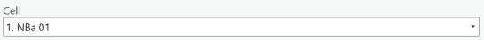

Define Receiver coordinates:

- Latitude: 54.7260853

- Longitude: 25.2339780

- Height: 35

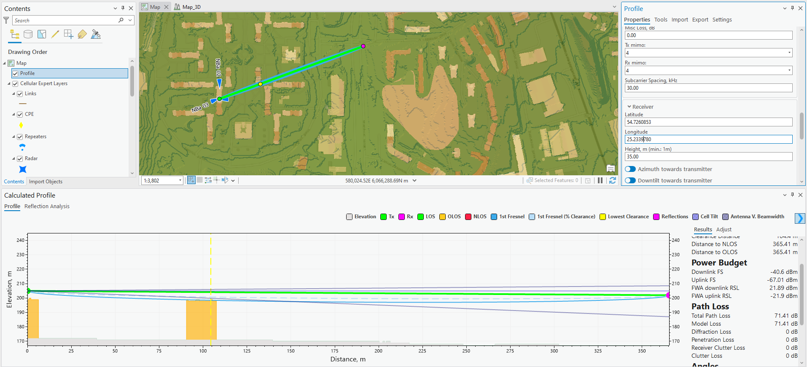

Click on Tools tab, expand Reflections option and enable Single Reflections.

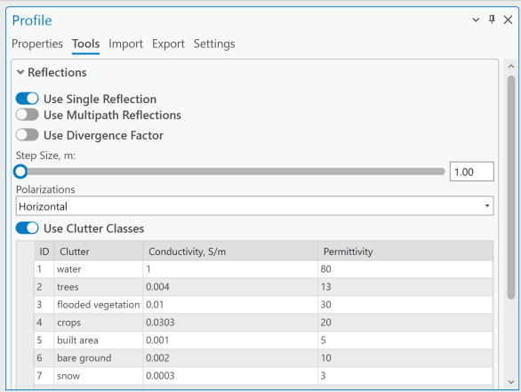

Profile will be automatically updated with reflection line.

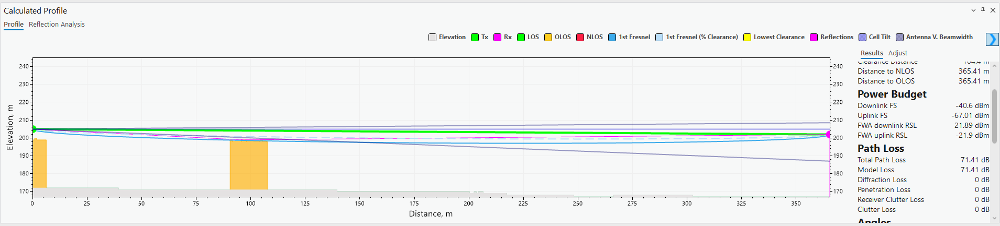

And preview Reflection calculations:

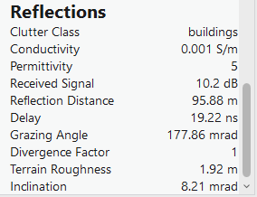

Review them, here is several explanations:

- **Grazing angle** refers to an extremely shallow angle of incidence at which an electromagnetic wave or a signal approaches a surface or boundary. It's called "grazing" because the wavefront almost skims or grazes the surface rather than hitting it head-on.

- **Terrain roughness** refers to the irregularity, unevenness, or variability of the Earth's surface features over a profile path. It encompasses a range of natural landscape elements, including hills, valleys, vegetation, buildings, and other obstructions or surface characteristics. It plays a significant role in determining how electromagnetic waves travel through or interact with the environment.

- **Indination** typically refers to the angle of incidence or the angle at which an electromagnetic wave strikes a surface or interface during its propagation between two points.

Change Transmitter or Receiver heights and preview how Receiver point and reflection calculations are changing.

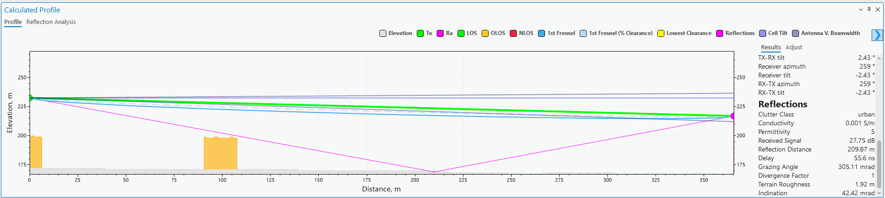

Turn off Single Reflection.

## Adjust Geodata

To quickly estimate how an obstacle might impact the path between the transmitter and receiver, you can use the Adjust tool. This allows you to modify the current elevation, or add and adjust buildings or clutter without altering the existing topographical data. This enables you to quickly preview general calculations, such as clearance, and assess the potential signal level at the receiver location.

Click on Adjust option (near profile Results).

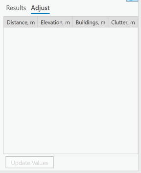

Next, click on the profile graph with the left mouse button and, while holding the button down, drag to select the area where a potential building might be located.

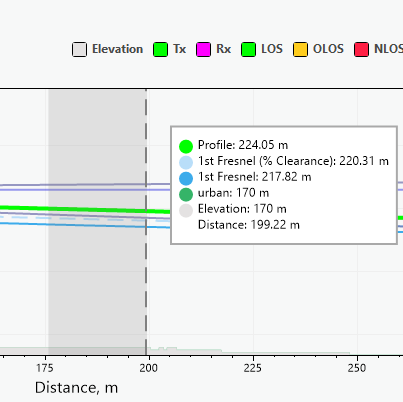

Then release mouse left button and the area will be selected, and on the right you will get elevation and clutter heights.

Select each row in the table (use CTRL or Shift buttons).

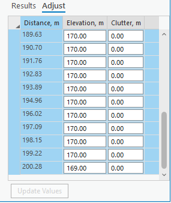

If you modify any selected row, the same value will be applied to all other selected rows as well. Enter the value 55 for any row.

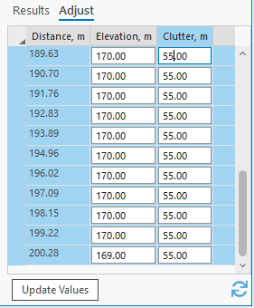

Press Update Values button, which will update Profile graph.

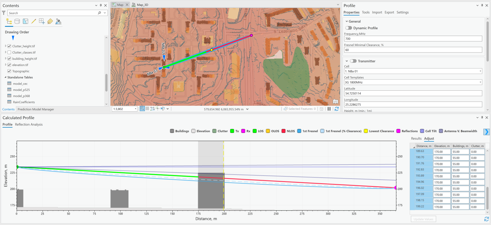

## Report

Click on Export tab in Profile.

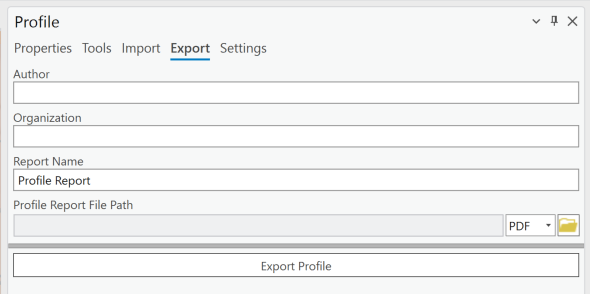

Define:

- Author: Student Name

- Organization: Company Name

- Report Name: NBa 01 Rx01

- Profile Report File Path: C:\CE_Course\LineOfSight, and define name Report_NBa01

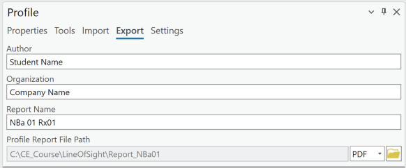

Click on Export Profile. The profile will be generated and opened for you automatically.

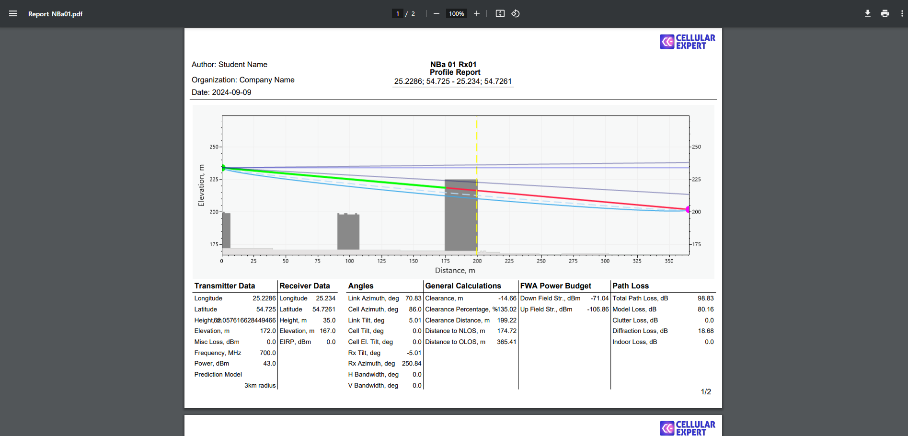

## Symbology

Back to ArcGIS Pro project and profile view.

You can click on any object symbology legend and change a color.

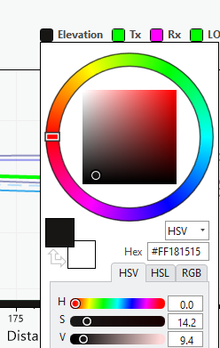

Change colors for several objects.

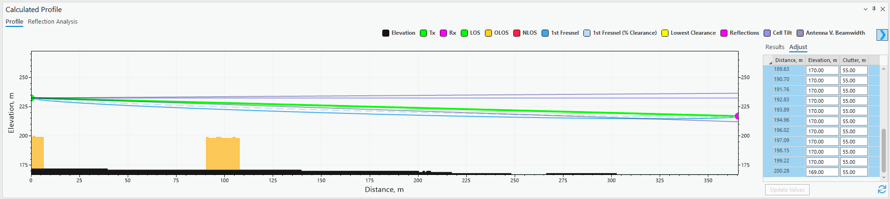

Close Profile tool.

# Visibility prediction

Profile tool is dedicated to analyzing point-to-point conditions. Visibility predictions can calculate point-to-area predictions.

Visibility prediction can be used:

- For mmWave bands to ensure Visibility areas. These frequencies are more susceptible to obstacles like buildings, trees, and even atmospheric conditions. Visibility prediction helps anticipate how these obstacles might affect signal propagation.

- Antenna Placement: Predicting visibility aids in optimal antenna placement. Placing antennas where there's a clear line of sight between the transmitter and receiver maximizes signal strength and quality.

- Cost-Efficiency: Understanding visibility patterns helps in cost-effective network deployment. By placing antennas strategically based on visibility predictions, operators can reduce the number of required installations while ensuring optimal coverage.

- 5G networks often utilize beamforming, where signals are concentrated and directed toward specific users. Line-of-sight (LOS) propagation is critical for beamforming to work effectively. Visibility prediction assists in determining the likelihood of LOS conditions between transmitters and receivers.

Find cell name: NBa 02, and select it on the map.

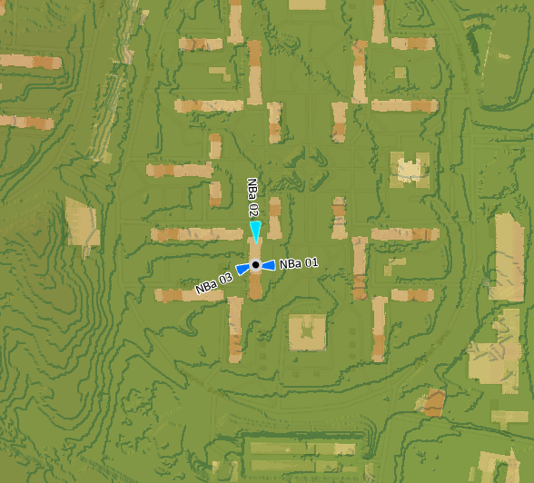

Select the object on the map and open Visibility prediction tool in CE RCP or CE RLP tabs.

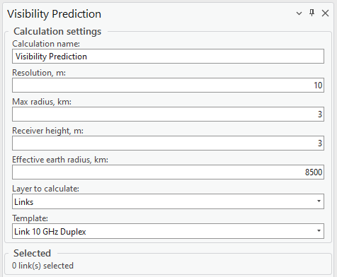

Define these parameters:

- Resolution: 2

- Max radius: 3

- Receiver height: 1.5

- Effective earth radius: 6400

- Layer to calculate: Cells

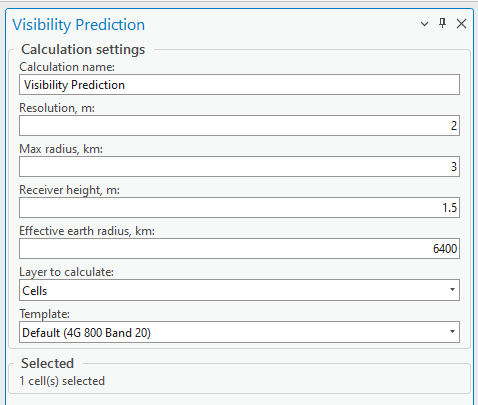

Press Run Calculations. After calculations, Visibility results will be loaded to Contents and visible on the map.

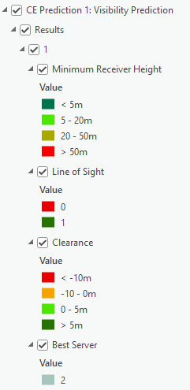

**Minimum Receiver Height** – the receiver height in meters, which ensure visibility between transmitter and receiver.

**Line of Sight** – Visibility condition, if value 1 – Visible, if value 0 – Not Visible.

**Clearance** – Fresnel zone obstruction in meters, if value is negative – Fresnel zone is obstructed by X meters.

**Best Server** – Cell Identification, which has highest Clearence value.

Preview all results.

Open Profile tool, and draw a profile from NBa 02 Cell to receiver coordinates:

- Latitude: 54.7248800

- Longitude: 25.2387187

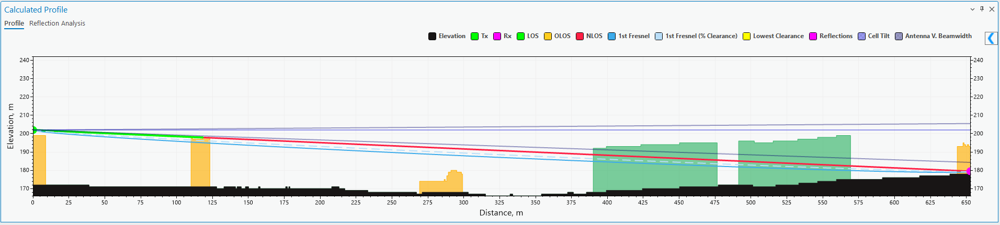

The receiver's height is determined using an elevation grid. In the context of Fixed Wireless Access, antennas are typically installed on building rooftops.

Open Workspace \> Properties.

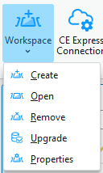

Find Receiver Height Reference option and change value to Clutter Height.

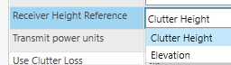

Press OK to close Parameters dialog.

Click on Manual Profile again.

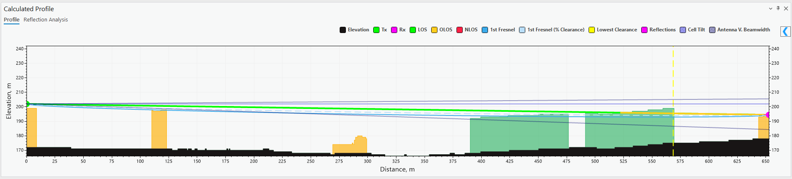

The receiver point now is on top of the clutter, adjust receiver height for Line of Sight condition. Close Profile dialogs.

Open Visibility tool. Run Visibility calculations with the same parameters.

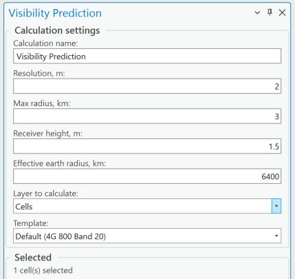

Compare newly loaded Visibility results with previous ones.

Leave Line of Sight results active for both predictions.

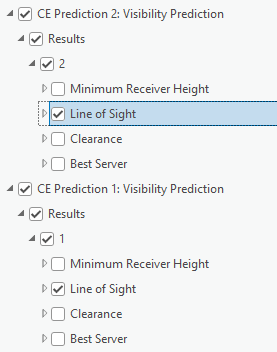

Select on 2nd result Line of Sight layer and choose Raster Layer tab in the top of the screen.

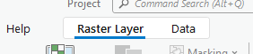

Click on Swipe tool, and click and hold left mouse button. Swipe on the map. You can also apply transparency value for both predicition layers. 

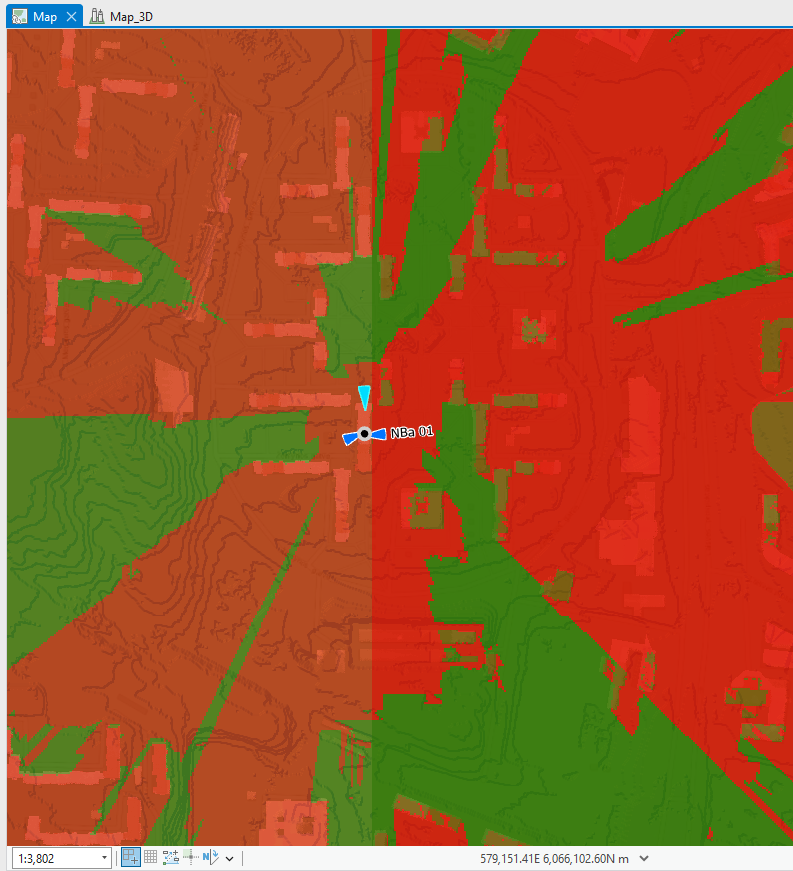
