# 02. Line of Sight (Profile)

> **Version:** CE Pro v4.9

## Geodata Layers Used

CE Pro uses three GIS data layers for precise RF propagation modelling:

| Layer | Description |
|-------|-------------|
| **DTM / DEM** | Digital Terrain Model — ground elevation above sea level |
| **Obstacles** | Buildings and structures above ground (principal impediments) |
| **Clutter** | Vegetation, crops, gardens — partially penetrable by radio waves |

Together these layers form the **DSM (Digital Surface Model)**:

```
DSM = DTM + Obstacles (buildings/vegetation)
```

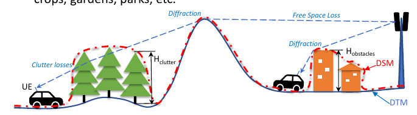

The map view shows the terrain cross-section as a colour-coded raster, with the calculated profile chart (elevation, clutter, Fresnel zones) displayed below it:

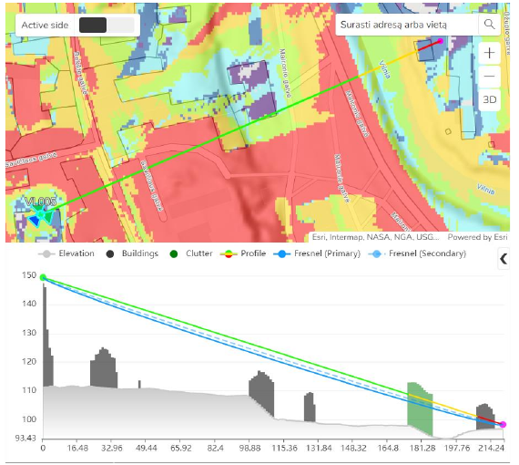

## Point-to-Point Profile

### Input Parameters

| Category | Parameter |
|----------|-----------|
| Geodata | Elevation, Buildings, Clutter |
| RF | Frequency (MHz), Fresnel Zone (%), Earth radius factor |
| Transmitter | Height (m), Power (dBm) |
| Receiver | Height (m), Power (dBm) |

A point-to-point profile is drawn between a transmitter and receiver location on the map:

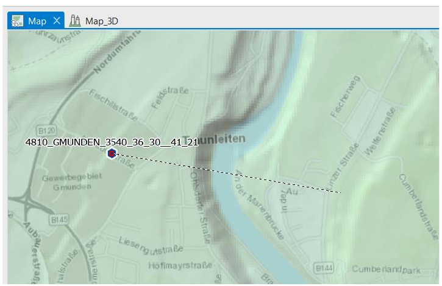

### Profile Calculation Results

**General Clearance:**

| Output | Description |
|--------|-------------|
| Clearance | Distance (m) between LOS line and highest obstacle |
| Clearance Percentage | Clearance as % of 1st Fresnel zone radius |
| Clearance Distance | Horizontal distance to first obstruction |
| Distance to NLOS | Distance at which path becomes NLOS |
| Distance to OLOS | Distance at which path becomes OLOS |

**Power Budget:**

| Output | Description |
|--------|-------------|
| Downlink FS | Downlink received signal (Free Space) |
| Uplink FS | Uplink received signal (Free Space) |
| FWA Downlink RSL | Fixed Wireless Access downlink received signal level |
| FWA Uplink RSL | Fixed Wireless Access uplink received signal level |

**Path Loss Breakdown:**

| Output | Description |
|--------|-------------|
| Total Path Loss | Sum of all loss components (dB) |
| Model Loss | Loss from selected propagation model |
| Diffraction Loss | Loss from obstacles per ITU-R P.526 |
| Penetration Loss | Outdoor-to-indoor loss (3GPP TR 38.901) |
| Receiver Clutter Loss | Loss due to clutter at receiver location |
| Clutter Loss | General clutter loss from ITU-R P.2108 |

**Angles:**
- Elevation angle of the LOS path (degrees)

The calculated profile panel plots elevation, LOS/OLOS/NLOS lines and the Fresnel zone, alongside the numeric results:

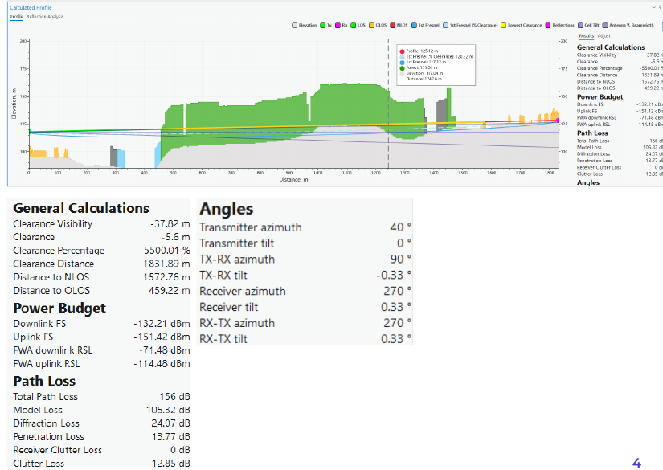

## Fresnel Zone Clearance

The Fresnel zone radius at distance d from transmitter:

```
r = sqrt(λ × d1 × d2 / (d1 + d2))

where:
  λ  = wavelength (m)
  d1 = distance from Tx to obstacle (m)
  d2 = distance from obstacle to Rx (m)
```

Recommended minimum clearance: **60% of 1st Fresnel zone radius** to avoid significant diffraction loss.

## Dynamic Profile Mode


- **Fix transmitter** — anchor one end of the profile at a fixed cell/antenna location
- **Dynamic option** — move the receiver endpoint interactively on the map; profile updates in real time

## Profile Symbology

Define custom colours for each element displayed in the profile view (elevation, Tx, Rx, LOS, OLOS, NLOS, Fresnel zones, reflections, cell tilt, antenna beamwidth):

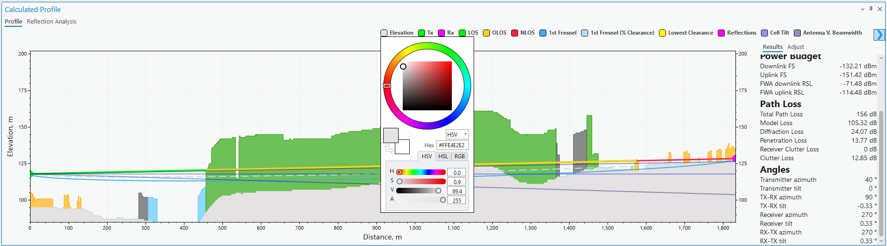

## Profile 3D (CE Express Web)

CE Express (the web client) can also render the profile in a 3D scene, showing transmitter and receiver antennas positioned over 3D building geometry alongside the 2D profile chart:


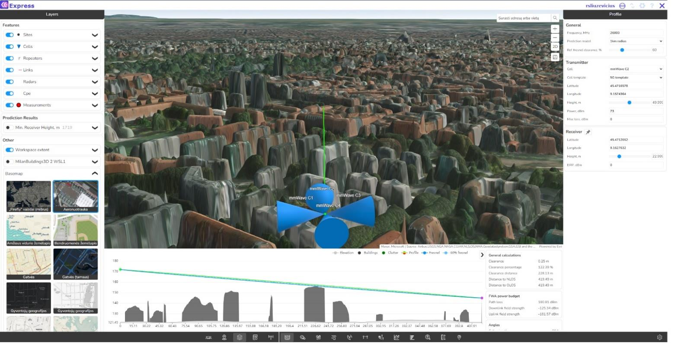


## Visibility (Point-to-Area) Prediction

### Input Parameters

| Parameter | Description |
|-----------|-------------|
| Geodata | Elevation + Obstacles |
| Frequency (MHz) | Used for Fresnel zone calculation |
| Calculation radius (km) | Area around transmitter to analyse |
| Earth radius factor | Accounts for atmospheric refraction (typically k = 4/3) |
| Transmitter height (m) | Fixed antenna height |
| Receiver height (m) | Height of mobile UE |


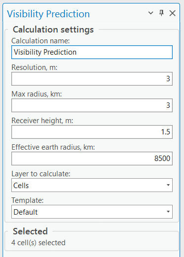

### Visibility Result Layers

| Layer | Values | Description |
|-------|--------|-------------|
| Line of Sight | 0 / 1 | 0 = NLOS, 1 = LOS |
| Required Height for LoS | meters | Minimum receiver height to achieve LOS |
| Clearance | meters | Clearance distance at receiver point |

**Example:** If Clearance = 6.5 m, the LOS line passes 6.5 m above the highest obstacle at that location.

Result layer rendered on the map, with the visibility legend classes:


**Line of Sight** — possible raster values are 0 (no LOS) and 1 (LOS):

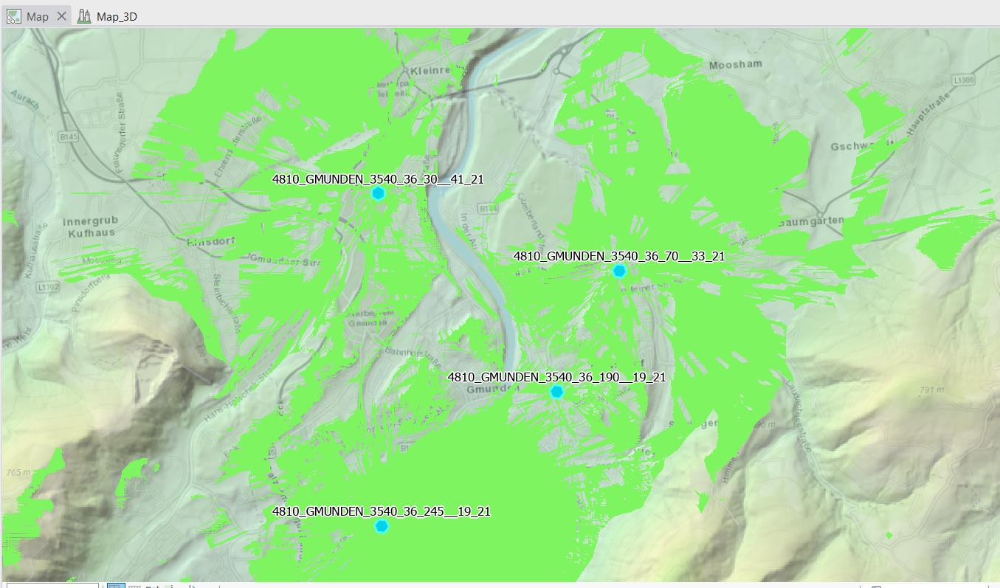

**Clearance** — clearance of the visibility line between Tx and Rx, expressed as a distance in metres:

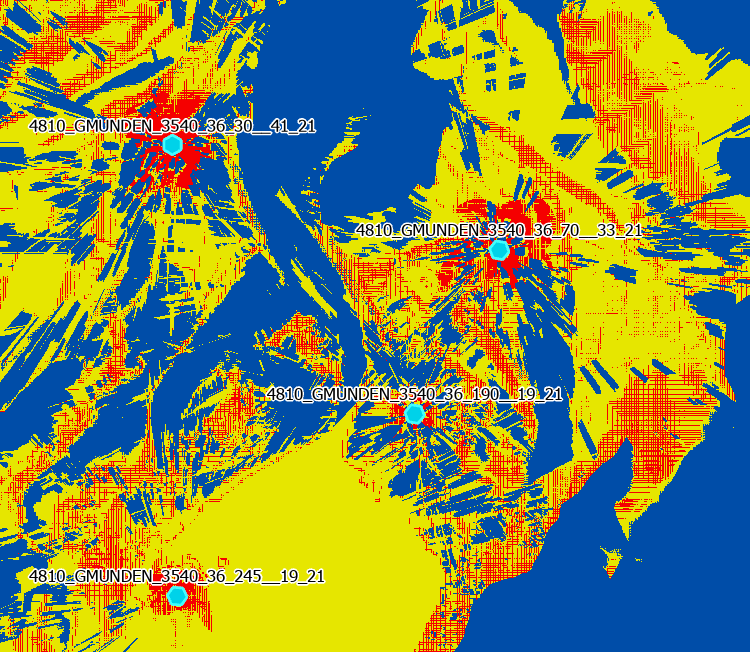


**Minimum Receiver Height** — calculates the required receiver height to achieve visibility:


## Sub-Metre Topography Data

Using higher-resolution (0.2 m) topography data in addition to standard 1 m data recovers visibility in areas where coarser data misses small obstructions:


## Surface Models Compared

```
Surface grid     = DTM + Obstacles + Clutter (full DSM)
Elevation grid   = DTM only (bare earth)
Obstacles grid   = Buildings and structures only
```

Comparing the **Surface grid** against **Elevation + Obstacles** shows how vegetation and clutter change which receiver points are actually visible from the transmitter:

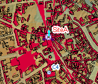

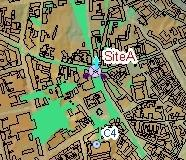

**Surface** (DTM + Obstacles + Clutter) — full DSM used for the visibility/profile calculation:

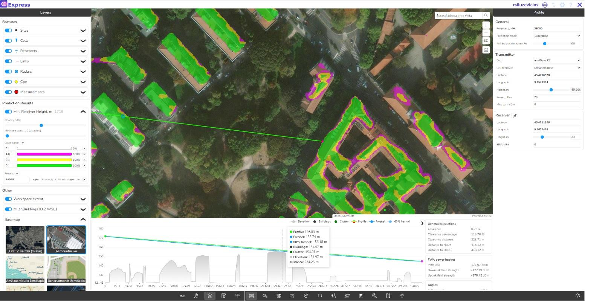

**DTM + Obstacles** (buildings only, no vegetation):


**DTM + Buildings + Vegetation** (full surface model):


Visual LOS check:
```
Tx ─────────────── Rx    (LOS — no obstruction)
Tx ──── [building] ─ Rx  (NLOS — building blocks path)
Tx ──── [trees] ─── Rx   (OLOS — partially penetrable)
```

**Exercise:** `C:\CE_Course\0. Descriptions\2. Line of Sight (Profile).pdf`

**Contact:** info@cellular-expert.com | +370 5 2150575 | www.cellular-expert.com
