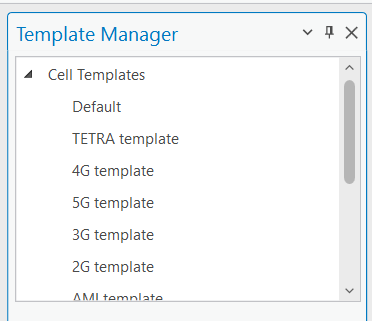
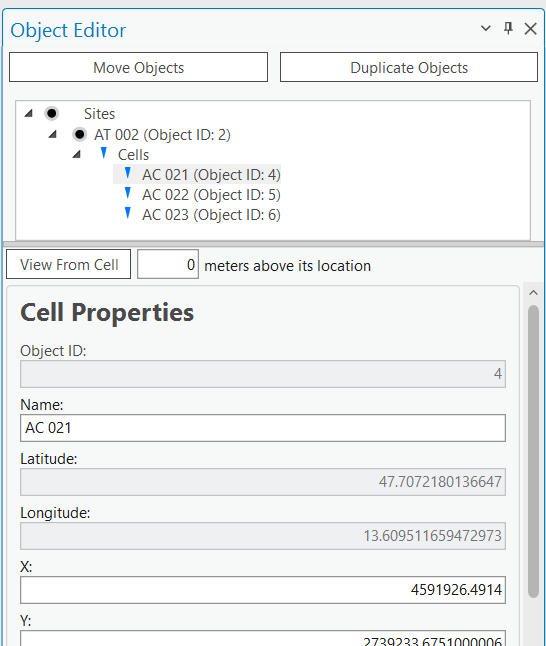

# 03. Creating Objects

> **Version:** CE Pro v4.9

## Overview

CE Pro objects (Cells, Sites, Links, etc.) are stored as feature classes in the Workspace geodatabase.

## Methods for Creating Objects

| Method | Best For |
|---|---|
| Import from text (CSV) | Bulk creation from existing network data |
| Create manually with the **Add Object** tool | Cell, Site, Radar, Repeater, CPE, OMEN, Link |
| Duplicate existing object(s) | Copying an object with similar parameters |
| Move existing object(s) | Relocating a cell or site to a new position |

The **Add Object** tool lets you pick which object type to place on the map:

## Manual Creation — Steps to Create a Cell

### Step 1 — Define Location

Choose one of these coordinate input methods:

- **Projected coordinate system** — enter X and Y values in metres
- **Geographic coordinate system** — enter Latitude and Longitude in decimal degrees
- **Click on map** — click the desired point; coordinates are filled automatically

### Step 2 — Define Direction (Azimuth)

Required if the cell's coordinates are taken by clicking on the map.

### Step 3 — Define Name

The **Cell Name** must be unique within the project. It is also used as the Best Server identifier in prediction outputs.

### Step 4 — Choose Template or Fill Parameters Manually

- **Template**: select a pre-configured template that auto-fills standard RF parameters (frequency, power, antenna, etc.)
- **Manual**: fill in each parameter individually

The **Cell Properties** panel and a map preview of the new cell's position and azimuth:

## Templates

Templates speed up object creation by automatically filling in the attributes:

- Managed under the **Template Manager**
- CE Pro ships with defaults per technology (TETRA, 2G–5G, AMI, LoRa, CBRS, etc.)
- Templates can also be stored in your own custom table

## Cell and Site Relationship

- **Cell** — logical information about a sector: a set of channels
- **Site** — a location point with a unique identifier (base station); one Site can group multiple Cells

> **Note:** RF prediction does **not** require a Site object — a Cell can be created without one. Every Cell still carries a `SiteID` value (must be an integer), which is used for **Carrier Aggregation**. Site and Cell are linked through this `SiteID` value; the Site name is defined on the Site object itself.

## Creating a Cell — Key Parameters

| Parameter | Field Name | Unit | Example |
|---|---|---|---|
| Cell name | cell_name | text | `5GCell_001` |
| Site name | site_name | text | `Site_Vilnius_01` |
| Latitude | latitude | decimal degrees | `54.6872` |
| Longitude | longitude | decimal degrees | `25.2797` |
| Height above ground | height | metres | `30` |
| Azimuth | azimuth | degrees | `120` |
| Mechanical tilt | tilt | degrees | `2` |
| Frequency | frequency | MHz | `3500` |
| Power | power | dBm | `40` |
| Antenna gain | antenna_gain | dBi | `18.2` |
| Misc. loss | misc_loss | dB | `1` |
| Technology | technology | text | `5G` |

## Creating a Site

1. Click **Add Object → Site**
2. Place the site on the map or enter coordinates
3. Enter a unique **Site Name**
4. Optionally link existing cells to this site via the **SiteID** field on each cell

## Creating a Link (Microwave / RL)

1. Click **Add Object → Link**
2. Click the **start point** (Tx site) on the map
3. Click the **end point** (Rx site) on the map
4. Enter link parameters: frequency, Tx power, antenna types, feeder losses
5. Click **Create**

## Object Editor

- Open **Object Editor**
- Select features
- Double-click on an object to edit it
- Click **Apply** to save changes
- Also used to assign a **prediction model** and **antenna** per object

## Moving and Duplicating Objects

1. Open **Object Editor**
2. Select the object(s) on the map
3. Choose **Move Objects** or **Duplicate Objects**
4. Select a new point on the map, or type in new coordinates
5. Click **Apply** / **Save**

Duplicated objects are placed at the same location with all parameters copied — move them to the new position and update the name. Moved objects have their coordinates updated automatically in the attribute table.

## Import from Text / CSV

For bulk import:

1. Click **CE Desktop → Import → From Text**
2. Select your CSV file (must include at minimum: cell_name, latitude, longitude)
3. Map CSV columns to CE field names
4. Click **Import**

See `C:\CE_Course\0. Descriptions\2. Import.pdf` for the full field mapping reference.

**Exercise:** `C:\CE_Course\0. Descriptions\3. Creating Objects.pdf`

**Contact:** info@cellular-expert.com | +370 5 2150575 | www.cellular-expert.com
