**Cellular Expert**

**3. Object Creation**

\
=

# Objective

Explain and show how to create objects from templates and edit them.

At the end of exercise you will be able to:

- Create object templates.

- Create objects from templates.

- Move and duplicate objects

- Edit objects’ parameters.

# Initial data

Prepared project with:

- Geodata.

# Create templates

Open ArcGIS Pro project named Project.aprx, from *C:\CE_Course\ObjectCreation\Project* catalog.

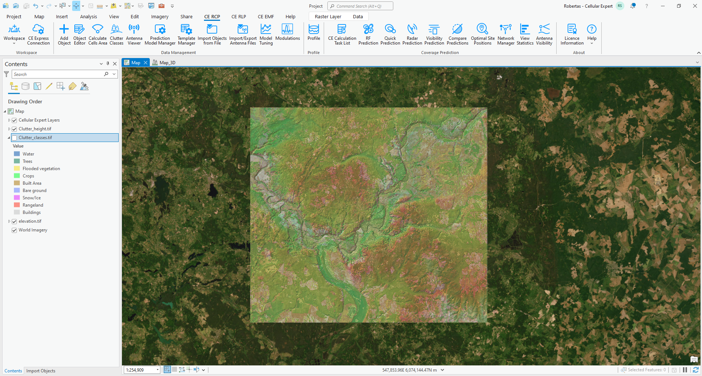

Open the *Template Manager* tool from the **CE RCP** toolbar to preview existing Cell templates. Templates help you quickly populate parameters, saving time compared to manual entry. The default workspace already includes several templates, which can be modified or deleted as needed. Templates can be used in several tools:

- Add Object – fills all necessary parameters from template to new object.

- Object Editor – changes existing parameters to new ones according to template.

- Import Objects from File – imports parameters from the template if something is missing in text (CSV, XLSX) file.

- Profile – takes a parameters from a template if Tx or Rx point is not snapped to Cell object.

- RF Prediction – uses template parameters if something is missing in the object.

- Link Prediction - uses template parameters if something is missing in the object.

- Radar Prediciton - uses template parameters if something is missing in the object.

- Visibility Prediction - uses template parameters if something is missing in the object.

- Optimal Site Positions - uses template parameters if something is missing in the object.

- Antenna Visibility - uses template parameters if something is missing in the object.

You can also create new templates and customize the parameters to fit your specific requirements.

To create your own template, right-click on Cell Templates and select *Create New*.

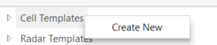

Create new templates based on the table below. After entering the parameters for each template, click *Save Changes*. Then, right-click on Cell Templates and select *Create New* to begin creating the next template.

<table style="width:95%;">
<colgroup>
<col style="width: 27%" />
<col style="width: 22%" />
<col style="width: 23%" />
<col style="width: 22%" />
</colgroup>
<thead>
<tr>
<th style="text-align: center;"><strong>Parameter</strong></th>
<th colspan="3" style="text-align: center;"><strong>Value</strong></th>
</tr>
</thead>
<tbody>
<tr>
<td>Cell Template Name</td>
<td style="text-align: center;">5G template 3500</td>
<td style="text-align: center;">5G template 900</td>
<td style="text-align: center;">TETRA</td>
</tr>
<tr>
<td>Bandwidth</td>
<td style="text-align: center;">100</td>
<td style="text-align: center;">10</td>
<td style="text-align: center;">0.015</td>
</tr>
<tr>
<td>Noise Figure</td>
<td style="text-align: center;">6</td>
<td style="text-align: center;">5</td>
<td style="text-align: center;">5</td>
</tr>
<tr>
<td>Subcarrier Spacing</td>
<td style="text-align: center;">30</td>
<td style="text-align: center;">15</td>
<td style="text-align: center;">15</td>
</tr>
<tr>
<td>TX MIMO</td>
<td style="text-align: center;">4</td>
<td style="text-align: center;">2</td>
<td style="text-align: center;">1</td>
</tr>
<tr>
<td>RX MIMO</td>
<td style="text-align: center;">4</td>
<td style="text-align: center;">2</td>
<td style="text-align: center;">1</td>
</tr>
<tr>
<td>Active Antenna Effect</td>
<td style="text-align: center;">0</td>
<td style="text-align: center;">0</td>
<td style="text-align: center;">0</td>
</tr>
<tr>
<td>Cell Load</td>
<td style="text-align: center;">30</td>
<td style="text-align: center;">30</td>
<td style="text-align: center;">0</td>
</tr>
<tr>
<td>Antenna ID</td>
<td style="text-align: center;">514</td>
<td style="text-align: center;">54</td>
<td style="text-align: center;">56</td>
</tr>
<tr>
<td>Height</td>
<td style="text-align: center;">30</td>
<td style="text-align: center;">30</td>
<td style="text-align: center;">30</td>
</tr>
<tr>
<td>Frequency</td>
<td style="text-align: center;">3500</td>
<td style="text-align: center;">900</td>
<td style="text-align: center;">390</td>
</tr>
<tr>
<td>Prediction Model ID</td>
<td style="text-align: center;">3</td>
<td style="text-align: center;">3</td>
<td style="text-align: center;">3</td>
</tr>
<tr>
<td>Prediction Model Configuration ID</td>
<td style="text-align: center;">4</td>
<td style="text-align: center;">5</td>
<td style="text-align: center;">11</td>
</tr>
<tr>
<td>Technology</td>
<td style="text-align: center;">5G</td>
<td style="text-align: center;">5G</td>
<td style="text-align: center;">2G</td>
</tr>
<tr>
<td>Frequency Group</td>
<td style="text-align: center;">3500</td>
<td style="text-align: center;">900</td>
<td style="text-align: center;">390</td>
</tr>
<tr>
<td>Carriers</td>
<td style="text-align: center;">[]</td>
<td style="text-align: center;">[]</td>
<td style="text-align: center;">[]</td>
</tr>
<tr>
<td>Downlink Duplex Factor</td>
<td style="text-align: center;">0.6</td>
<td style="text-align: center;">1</td>
<td style="text-align: center;">1</td>
</tr>
<tr>
<td>Tilt</td>
<td style="text-align: center;">0</td>
<td style="text-align: center;">0</td>
<td style="text-align: center;">0</td>
</tr>
<tr>
<td>Duplex Mode</td>
<td style="text-align: center;">TDD</td>
<td style="text-align: center;">FDD</td>
<td style="text-align: center;">FDD</td>
</tr>
<tr>
<td>Power</td>
<td style="text-align: center;">40</td>
<td style="text-align: center;">40</td>
<td style="text-align: center;">43</td>
</tr>
<tr>
<td>Misc Loss</td>
<td style="text-align: center;">0</td>
<td style="text-align: center;">0</td>
<td style="text-align: center;">0</td>
</tr>
<tr>
<td>Electrical_tilt</td>
<td style="text-align: center;">0</td>
<td style="text-align: center;">0</td>
<td style="text-align: center;">0</td>
</tr>
</tbody>
</table>

# Add objects

Add objects tool helps to create objects manually.

## Site object

Open *Add Object* 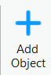 tool, expand the dropdown list menu, and choose Sites.

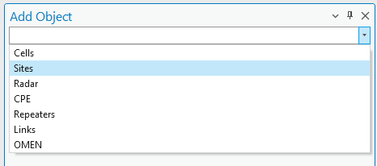

Define:

- Name: ST01

- Latitude: 54.73962527

- Longitude: 25.18876518

- Height above ground, m: 55

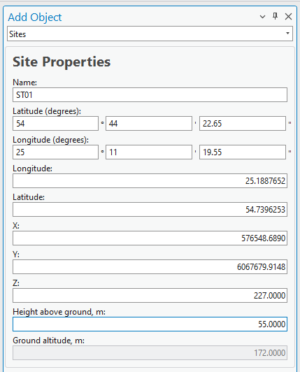

Press Save Changes. Site object will be created in the project.

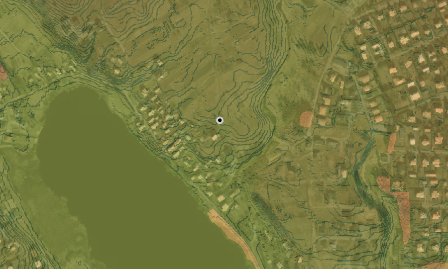

Click once on the map in any other location, coordinates will be changed according to map click.

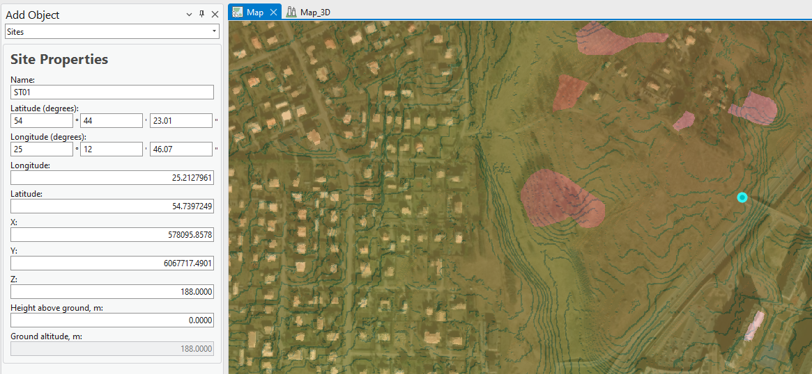

Change:

- Name: ST02

- Height above ground, m: 30

Press Save Changes.

Click on the location, which has a building. Height above ground value will be automatically filled based on building height on location.

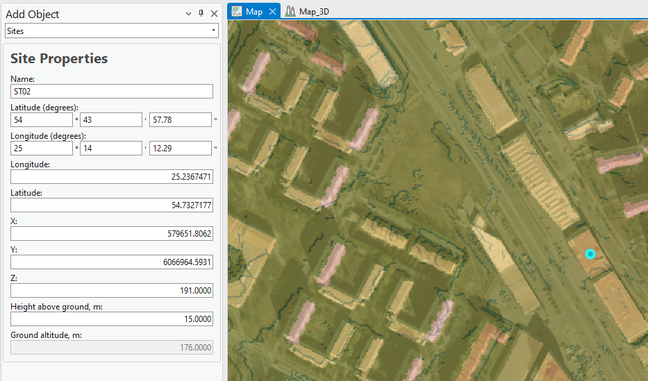

Change Site Name to ST03 and press Save changes.

## Add Cell

Zoom back to first created Site object. Expand the dropdown list menu and choose Cells.

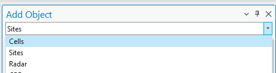

Click once on the Site object on the map.

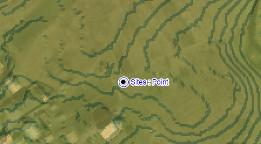

Click second time to define Cell azimuth.

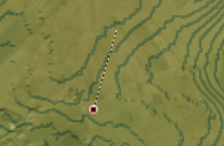

The New Cell will appear on the map.

Enter parameters as defined below:

- **Template**: TETRA 400MHz Sector

- **Name**: CellA

- **Azimuth**: 5

- **Height above ground, m**: 55

- **Prediction model**: CEC ITU-R: 15km radius

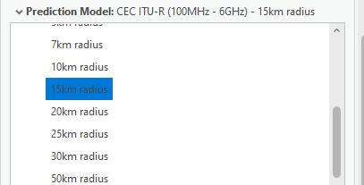

Click Save Changes.

Change only the following parameters in the dialog and click Save Changes:

- **Name**: CellB

- **Azimuth**: 120

Change only the following parameters in the dialog and click Save Changes:

- **Name**: CellC

- **Azimuth**: 240

Now you should see three cells on the map.

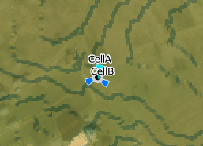

Zoom to the Site, which was created on the building.

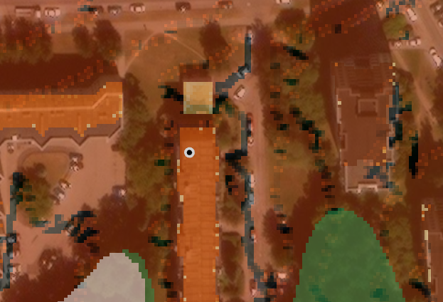

Cell objects do not require Site object. Create several Cell objects at the corner of the building.

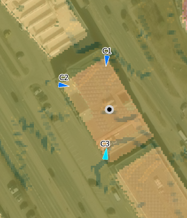

If Site object exist on this building, and you would like to assign it for the Cells. Select Site and Cells on the map using Select Feature tool.

Open Object Editor tool.

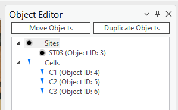

You need to apply Site ID value for each Cell.

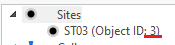

Double-click on the first Cell, and find Site ID parameter.

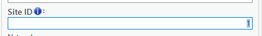

Change it depending on Site Object ID in your project.

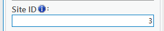

Press Save Changes button.

Do it for other Cells. Cells will go under Site object.

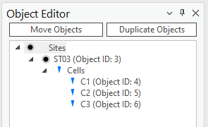

Note. You can apply the correct SiteID value in Add Cells tool too. If Cell is created on top of Site (snapped), then it will automatically take Site_ID value.

## Move objects

Open *Object Editor* 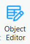 tool. With *Select Features* button 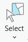 select previously created site with 3 cells.

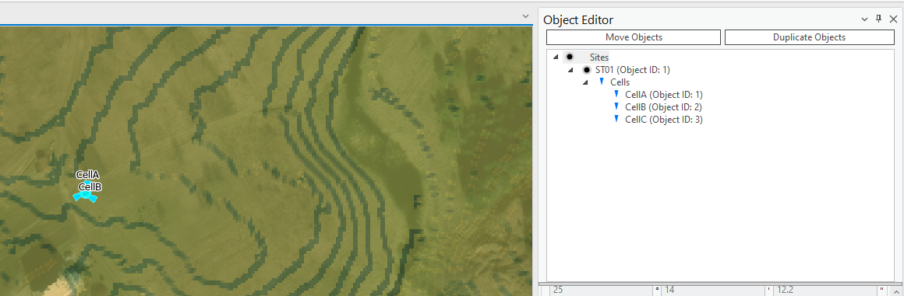

Press the **Move Objects** button in the Object Editor dialog.

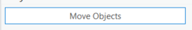

Define:

- Latitude: 54.7389744

- Longitude: 25.1917101

- Height above ground, m: 60

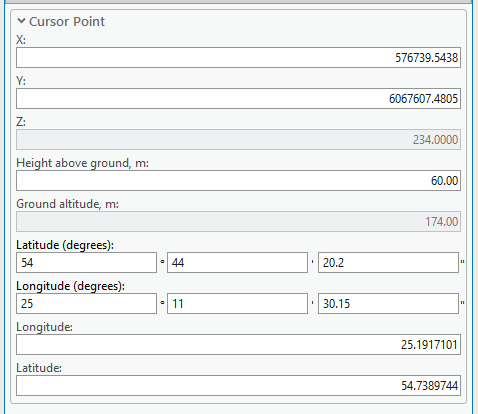

Press Save Changes. Objects will be moved to another location based on defined coordinates.

Objects can be moved based on selected location. Choose Select Point button 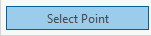

Click on the map to define Site and Cells location.

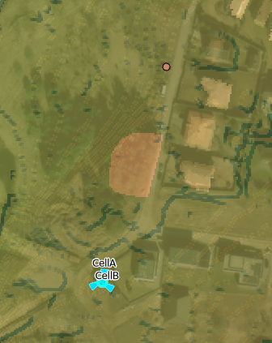

Press Save changes to move the site object.

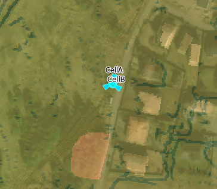

## Duplicate objects

Click on Duplicate Objects option.

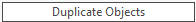

The objects can be duplicated in the same way as Moved. You can enter coordinates directly in the dialog, or use Select Point tool to define a location on the map.

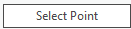

Once it is selected, click on the map. The potential position and coordinates will be updated. Define Height above the ground, m: 50

Pres Save Changes

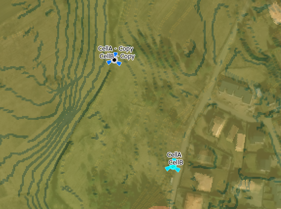

## Change object parameters

With Select tool select Duplicated Cells and Site.

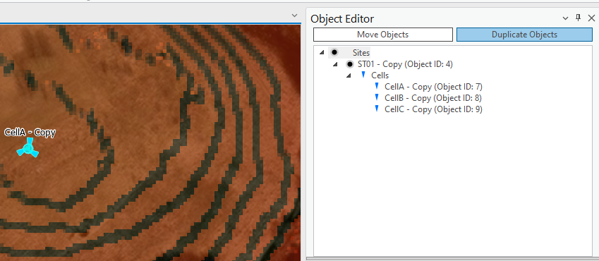

Change newly created objects’ parameters.

Double click on CellA – Copy object and define:

- Name: CellA1

- Azimuth: 20

- Power 43

Press Save Changes.

Do it for other cells, and do not forget to press Save Changes when finishing to change a parameters for a object.

- Name:

  - CellB1

  - CellC1

- Azimuth:

  - For CellB1: 135

  - For CellC1: 270

- Power: 43

Close Object Editor tool.

## Change parameters in Attribute table

Select all objects on the map and open Cells attribute table (right click on Cells \> Attribute Table). Find Power field and right click on it, choose Calculate Field.

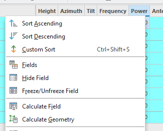

Define value 45.

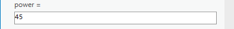

Press OK button to recalculate value.

Preview Power parameter in Object Editor tool.

# Add Microwave Link

Open Add Object tool and choose Link object in drop-down list menu.

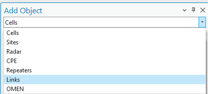

Click once on ST01 site, it will be the transmitter (Site A).

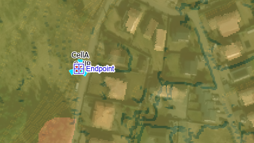

Click second time on ST02 – it will be a receiver (Site B).

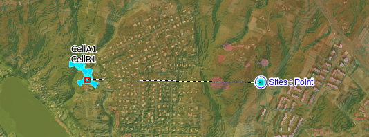

The coordinates will be filled according snapped objects.

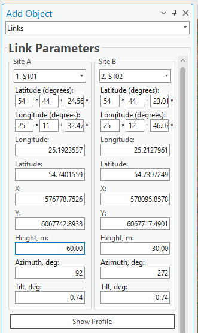

Adjust Height values.

Note. A link can be created on empty locations and does not require Site object. For this case, Site will be created automatically.

Link profile can be generated before creating a new link.

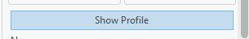

It would show detail view from Tx to Rx locations.

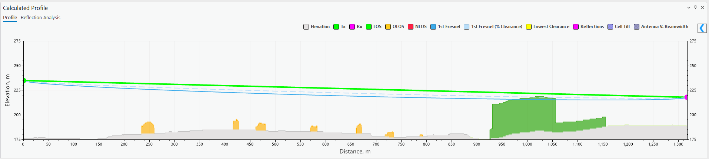

Close Profile view.

## Frequency Plan

The frequency plan is used to define frequencies for new Microwave link. A set of available frequencies will be displayed based on selected frequency plan.

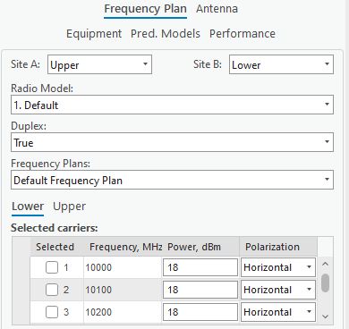

Before it, define that Site A will use Lower frequencies.

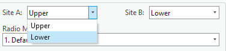

Site B section will be changed automatically to Upper.

Then if MW link will be Duplex or Simplex. If Duplex option is Yes, then it will be duplex link, of No – simplex. Leave value Yes.

Select carriers 1 and 3.

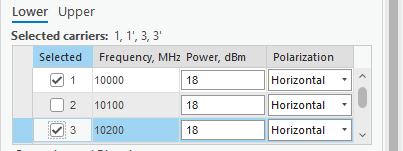

Change Power for Carrier 3 to 20.

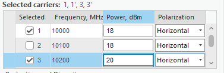

## Antenna

Parabolic antennas can be defined for Tx and Rx. Preview selected antenna with option View Antenna.

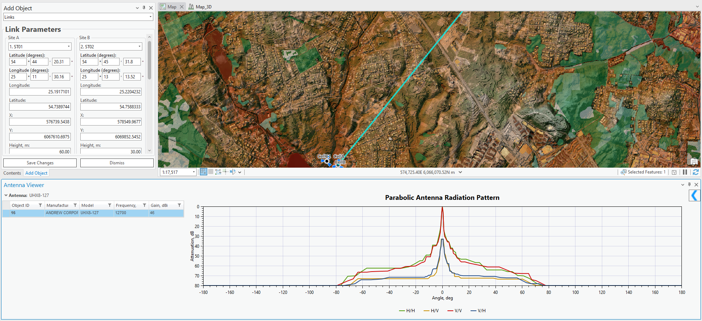

Close Antenna Viewer dialog.

## Equipment

Radio parameters such as bandwidth, power and modulations are defined here. Leave default radio.

## Name

Define Link name:

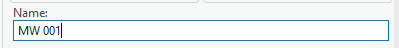

Press Save Changes and new Link object will be created in the project.

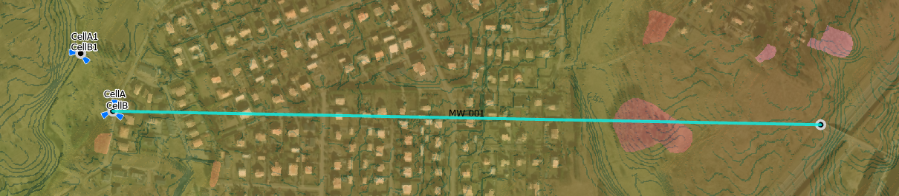
