**Cellular Expert**

**4. Cell Prediction Exercise**

**\**

# Objective

Explain and show the main parameters for Cell object and how they influence calculations.

At the end of exercise you will be able to:

- Get familiar with main parameters of the cell.

- How geodata is included in the predictions.

- Manage and edit data.

# Initial data

Prepared project with:

- Network objects.

- Geodata.

- Equipment and models.

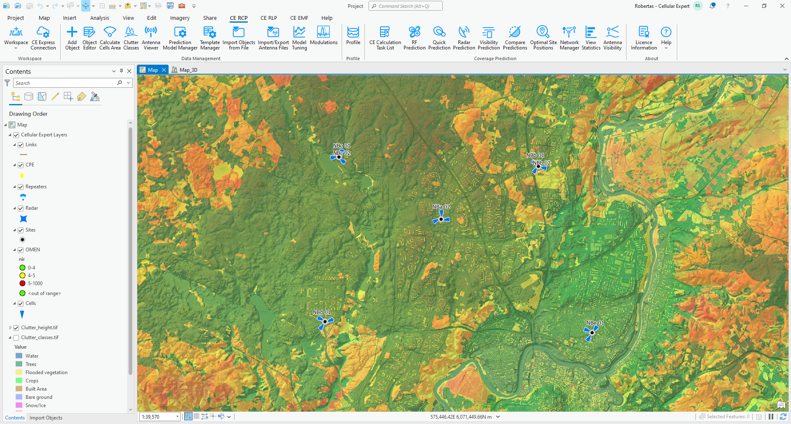

# Cell Parameters

## Network object parameters

Open ArcGIS Pro project from C:\CE_Course\CellPrediction\Project catalog, name Project.aprx.

To perform a Cell prediction, the tool retrieves the necessary parameters from the database to calculate signal strength and other prediction layers. Locate Cell NBa 02 using the cell name parameter and select it on the map. Then, open the Object Editor tool. 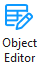

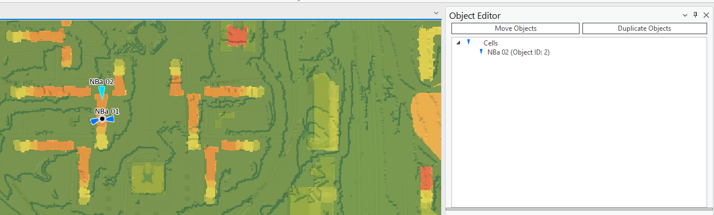

Double-click on the cell object in Object Editor to display its parameters. Preview them one by one to get better understanding of available parameters in Cellular Expert.

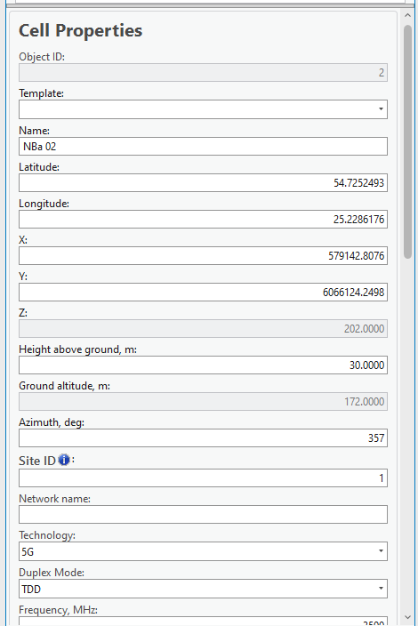 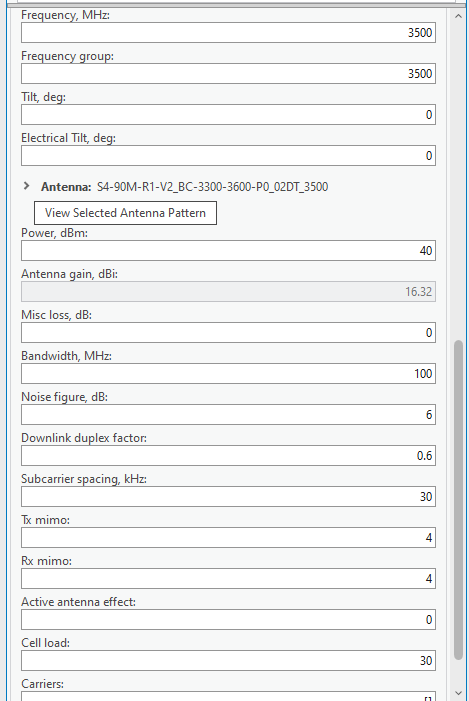

Close Object Editor tool.

# Cell Area Predictions

To estimate expected cell coverage without topographical data, we can use Calculate Cells Area tool. It will take several parameters from Cell object:

- Prediction model radius.

- Antenna 3dB level patterns.

It helps very quickly estimate antenna or antennas coverage without topographical data.

Make sure that NBa 02 cell is selected and Calculate Cell Area tool.

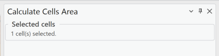

Press Run Calculations and the tool will provide you a feature class layer in the map view.

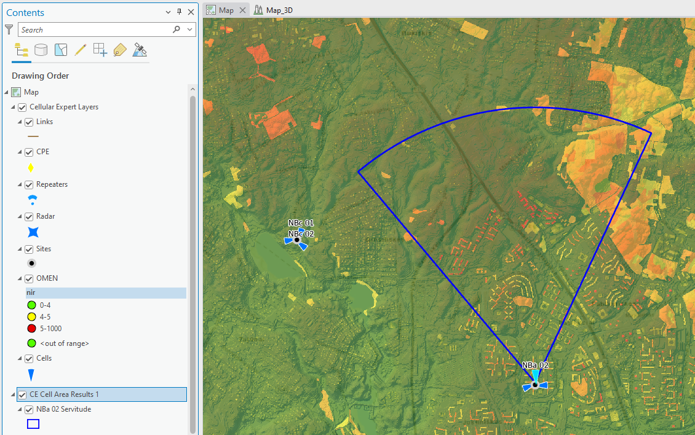

Close Calculate Cell Area tool and disable NBa 02 Servitude results in the Contents.

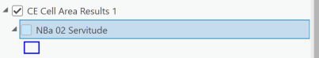

# Quick prediction

The tool allows for calculations without altering any parameters in the database and is designed specifically for evaluating "what if" scenarios. The prediction output is a signal strength raster in dBm, which considers all necessary parameters such as cell properties, antenna specifications, the prediction model, and topographical data.

Open Quick Prediction tool. Move mouse cursor on top of selected Cell and click on it to snap it.

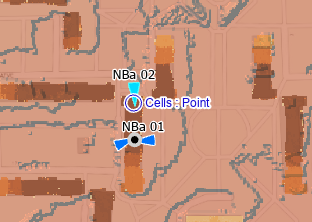

Coordinates and other parameters will be taken from snapped Cell.

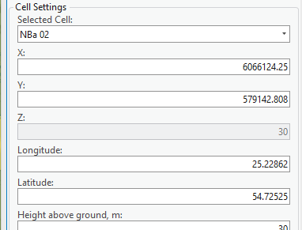

Change resolution from 10 to 2, run predictions and preview results.

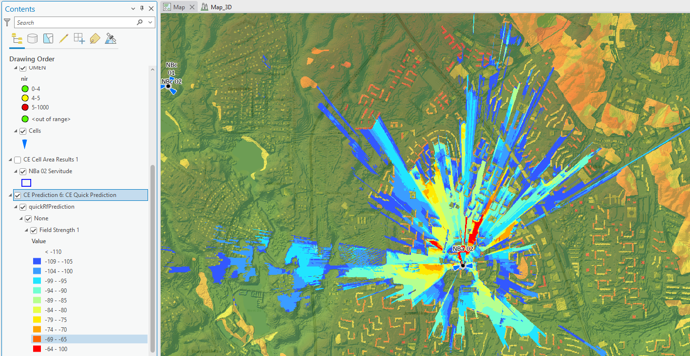Change Azimuth from 357 to 50 in Quick prediction tool and run predictions.

Compare predictions.

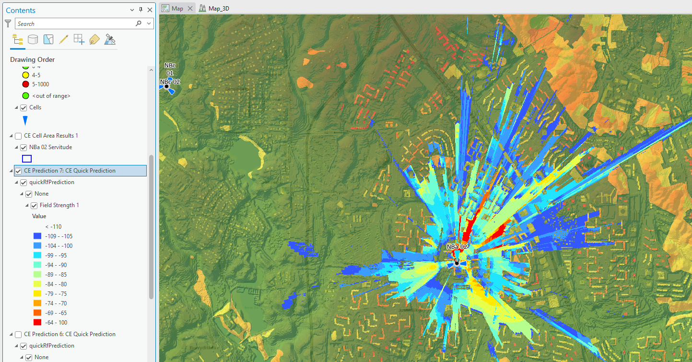Run several more predictions by changing the parameter. Change parameters one by one and run RF predictions for each new parameter defined in the table below.

| **Parameter name**  |                         **Value** |
|---------------------|----------------------------------:|
| Height above ground |                                35 |
| Downtilt            |                                 2 |
| Tx MIMO             |                                 8 |
| Power               |                                45 |
| Antenna             | ObjectID: 451, Alpha Wireless Ltd |
| Frequency           |                              1800 |

# RF Prediction

The RF Prediction tool is designed to simultaneously calculate multiple cells and provide overall coverage for all selected objects. It also performs additional calculations, including best server, interference, and throughput analyses.

Select NBe 02 cell on the map.

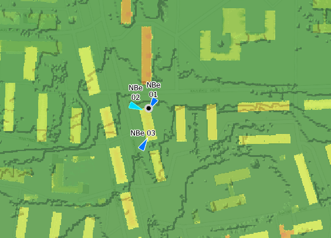

Open RF Prediction tool and run calculations with the same parameters as defined in the picture below.

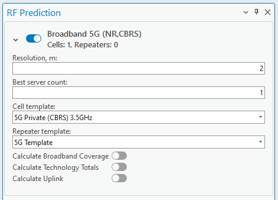

Preview results are loaded in the Contents and visible on the map. The meaning of each prediction rasters will be covered in 5G Prediction exercise.

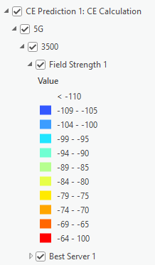

Turn off Best Server 1, so only Field Strength 1 raster will be visible on the map.

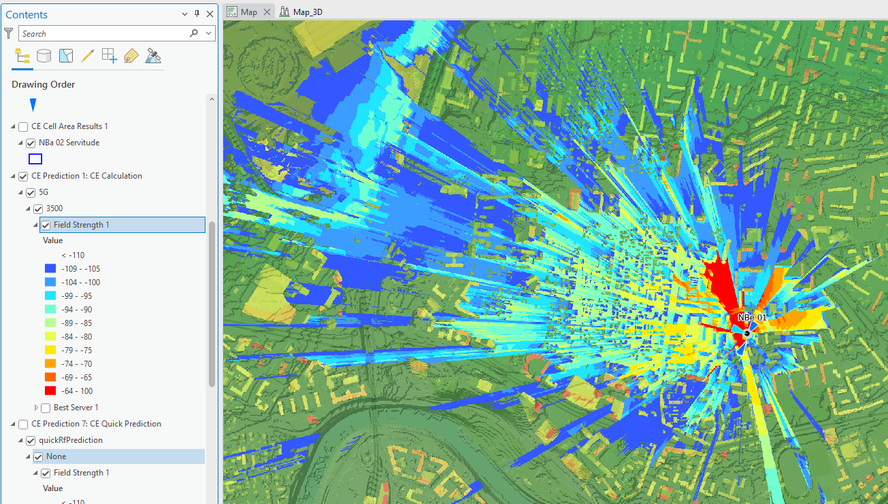

Right click on Field Strength 1 raster and choose Symbology. Define colors and thresholds the same as in the picture below:

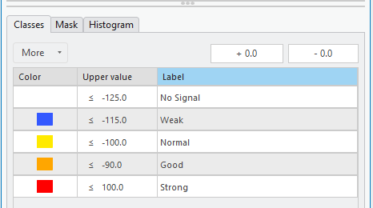

Then leave Field Strength 1 selected in Contents

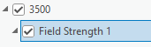

Open Raster Layer, and change Transparency to 50.

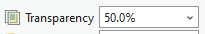

Field Strength raster looks like this one.

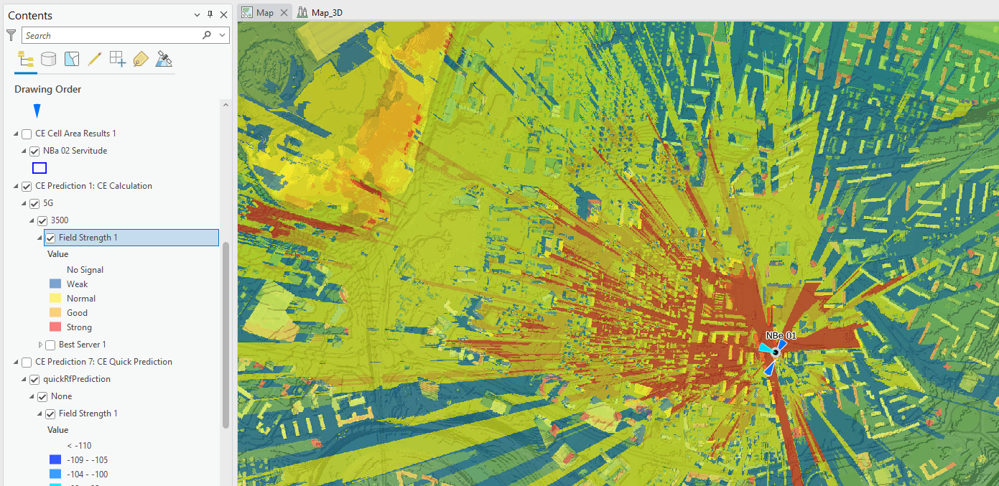

Close Symbology tool.

Blue, yellow color shows lower signal strength values. Open Profile tool and do a profile from NBe 02 Cell to these areas. Use fixed transmitter option to quickly change the receiver point.

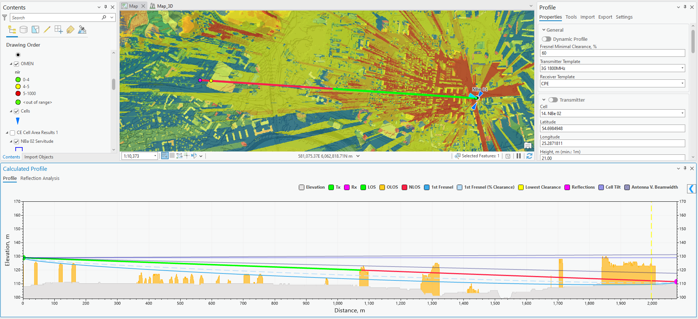

Close Profile windows.

## Antenna

To include different parameters in RF Predictions, you'll need to update those parameters for the cell in the database. This can be done using the dedicated graphical interface, Object Editor, or by directly modifying the parameter in the table.

Turn off prediction results. Open Object Editor for the same selected Cell. Double click on NBe 02 cell.

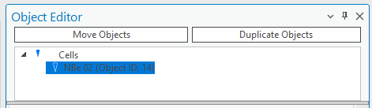

Find antenna parameters. Click on Model field to filter the antennas.

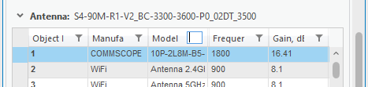

Here type Telrad and it will automatically provide the list with defined letters.

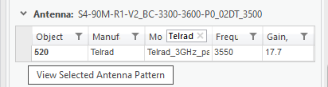

Double click on Telrad_3GHz_panel_antenna antenna to define it for the cell.

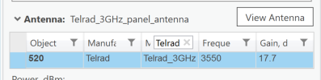

Before defining the antenna, you can press View Antenna button 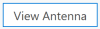 to open Antenna Viewer dialog. It will open the assigned antenna pattern visualization, you can also find and preview another antennas here.

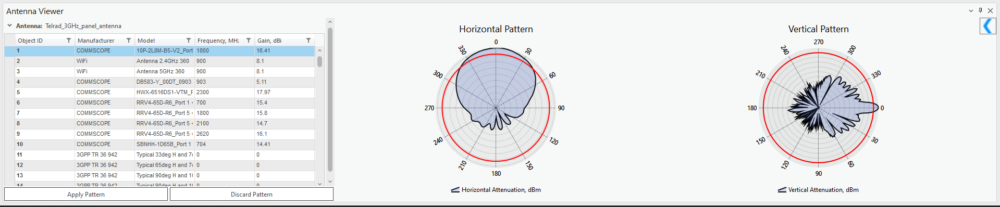

Close Antenna Viewer dialog, and press Save Changes button.

Run RF Predictions with the same settings.

Turn off newly loaded Best Server 1 layer, and right click on newly loaded Field Strength 1 layer and choose Symbology.

Expand Options and choose Import from layer.

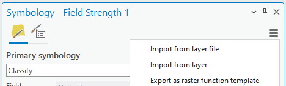

For Symbology layer choose firstly calculated Field Strength layer.

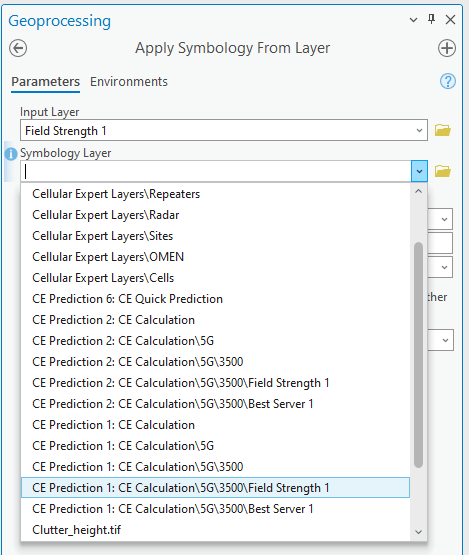

Run symbology conversion. It will apply the same symbology as a first field strength layer.

Compare both results.

# Compare predictions

To compare predictions, users can utilize the functionality created by CE or use GIS tools, such as Raster Calculator.

Turn off newly calculated prediction layers, open View \> Geoprocessing, and in search line type: Raster Calculator

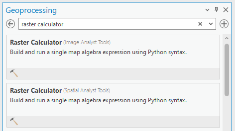

Open Raster Calculator (Spatial Analyst Tools), and define the formula:

"CE Prediction 2: CE Calculation\5G\3500\Field Strength 1" - "CE Prediction 1: CE Calculation\5G\3500\Field Strength 1"

Output path: C:\CE_Course\CellPrediction\Calculations\Difference.tif

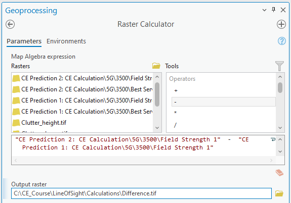

Preview results, if a value is:

- Positive – the second prediction signal strength value with Telrad antenna is higher.

- Negative - the second prediction signal strength value with Telrad antenna is lower.

Close Geoprocessing window.

# Cell Statistic

Cellular Expert includes its own statistics tools that use polygons to determine overall coverage and coverage for each polygon segment. Coverage analysis by polygon is covered in a separate exercise. Here, we will focus on analyzing coverage for individual points and how to obtain the signal value for each point.

Zoom to s3 site object, which contains three cells: NBc 01, NBc 02 and NBc 03.

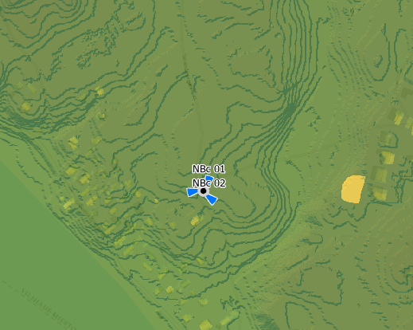

Open Map \> Add Data and navigate to C:\CE_Course\CellPrediction\Shape.gdb, select Address_points and click OK to add it to the map.

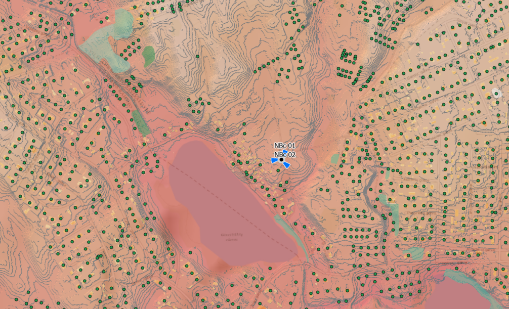

Select NBc 01, NBc 02 and NBc 03 on the map, and run RF Prediction with these settings:

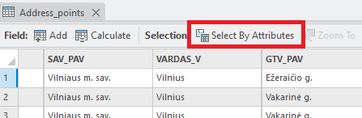

Preview loaded results especially Field Strength 1 and Best Server 1 rasters.

Open Geoprocessing tool, in Search line type Extract Multi Values, and open Extract Multi Values to Points tool.

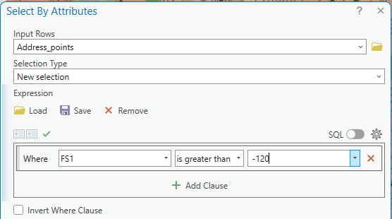

Define:

- Input point features: Address_points

- Input rasters: Currently calculated Field Strength 1, Best Server 1, Field Strength 2, and Best Server 2 rasters.

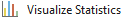

Press Run.

Turn off prediction layers, then right click on Address_points layer and click on Attribute Table.

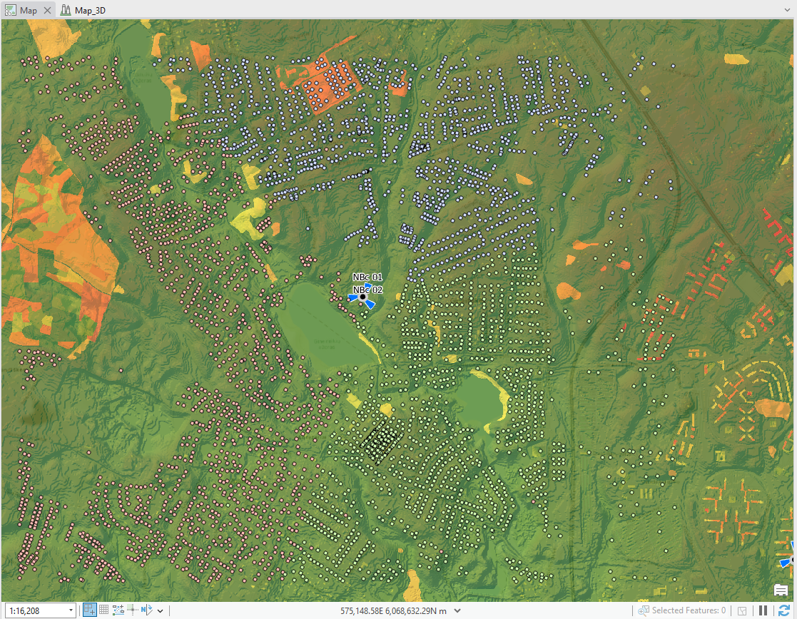

Scroll right in the opened table, and preview newly generated values.

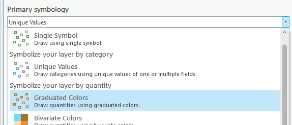

Click on Select By Attribute, and in the opened tool define as in the picture below.

Press Apply button. The tool will select all points with FS1 value greated than -120dBm.

Right click on FS1 field and choose 

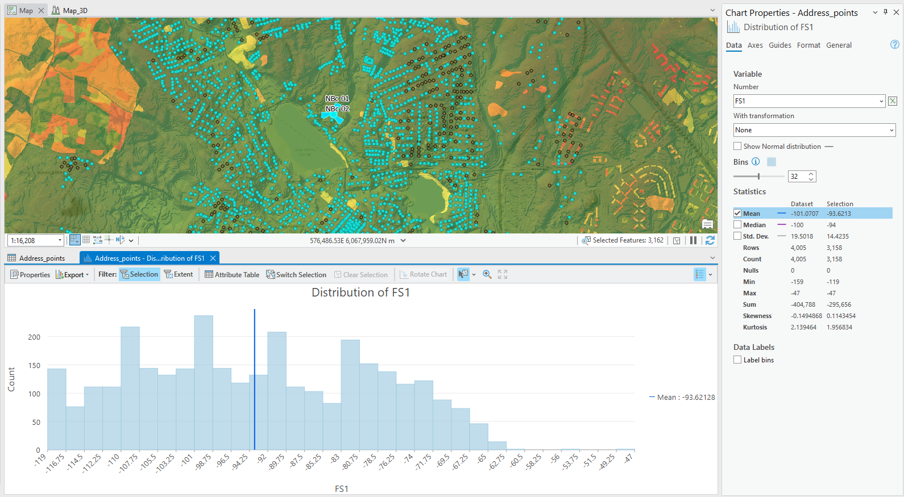

Go back to table view, and open Select By Attribute tool again. Define parameters as defined in the picture below.

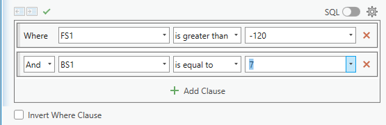

Press OK, the tool will select anly these points which is operated by Cell ID 7 (Cell Name NBc 01), and FS1 value is greater than -120dBm.

Statistics will be updated too.

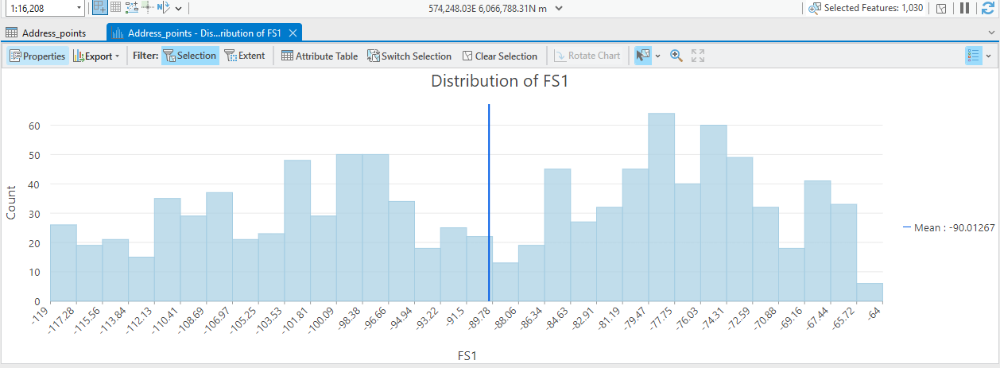

Close the table.

Points can be symbolized based on field strength values. Right click on Address_points layer and choose Symbology, here define these settings:

Uniques values.

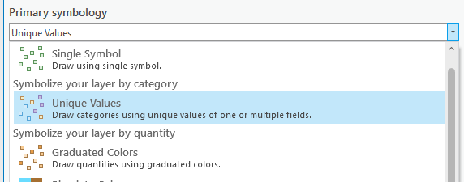

Field 1: BS1

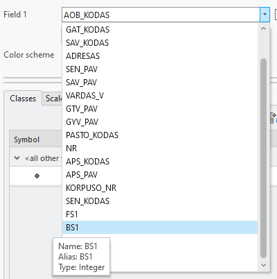

Preview points on the map.

Then choose Gradeuated Colors.

| Field: FS1 | Classes: 4 |
|----|----|
| 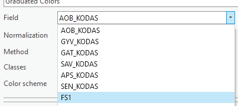 | 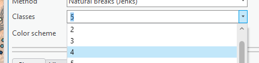 |

Define color range:

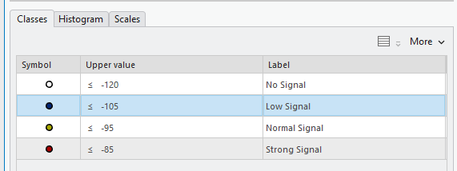

Preview on the map.

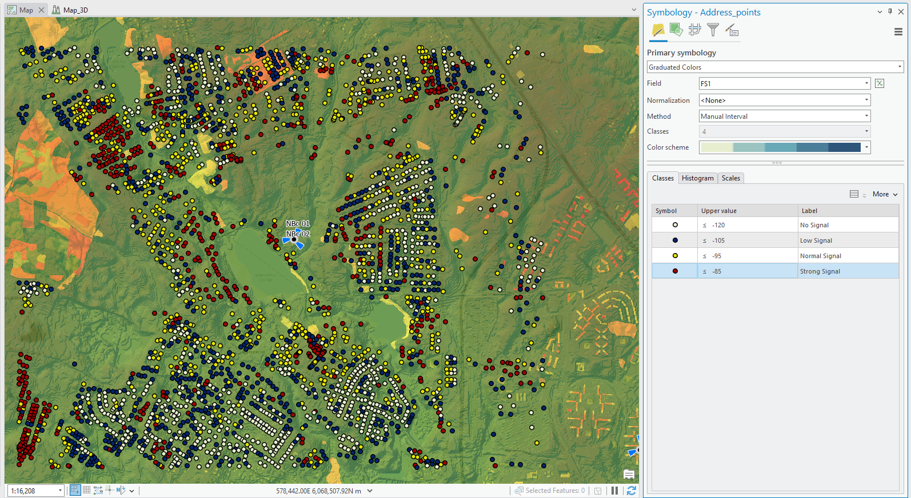
