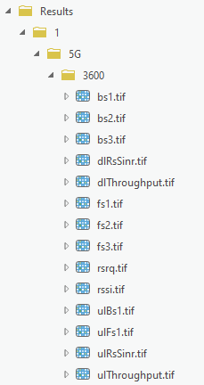
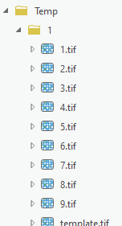

# 04. Cell Prediction

> **Version:** CE Pro v4.9

## Cell Structure

Each cell in CE Pro has two categories of parameters:

**Physical parameters:**
- Coordinates (X/Y or Latitude/Longitude)
- Height (above ground)
- Azimuth (direction)

**Logical parameters:**
- Power (dBm or EIRP)
- Bandwidth (MHz)
- Frequency (MHz)

The **Object Editor → Cell Properties** panel (physical parameters) and the **Optional Properties** panel (logical/RF parameters, including the assigned antenna and antenna pattern table):

## Cell Coordinates

CE Pro supports two coordinate systems:

| System | Fields | Notes |
|--------|--------|-------|
| Projected (CRS) | X, Y | Meters in project CRS |
| Geographic (WGS 1984) | Longitude, Latitude | Decimal degrees |
| Z — total cell height above sea level | | |

## Cell Name

- The cell name is a **unique parameter** within the project
- **Best Server** prediction uses the same cell name as its identifier

## Cell Parameters Reference

| CE Field | Units | Example | Description |
|----------|-------|---------|-------------|
| `latitude` | decimal degrees | `49.9993` | Y coordinate, WGS 1984 |
| `longitude` | decimal degrees | `33.6573` | X coordinate, WGS 1984 |
| `cell_name` | text | `5G cell XXYY` | Cell identification, usually a name |
| `site_name` | text | `Site 55 ID` | Site identification, usually a name |
| `height` | meters | `40` | Cell height above ground |
| `azimuth` | degrees (0–360) | `50` | Cell direction from north |
| `tilt` | degrees | `1` | Mechanical tilt value |
| `frequency` | MHz | `3500` | Frequency value |
| `power` | dBm | `40` | Cell power — see *Power vs EIRP* below |
| `antenna_gain` | dBi | `18.2` | Gain of the antenna assigned to the cell |
| `misc_loss` | dB | `1` | Total cell loss |
| `bandwidth` | MHz | `0.015` | Especially required for 3G, 4G, and 5G technologies |
| `subcarrier_spacing` | kHz | `15` | Especially required for 5G, as 4G uses a constant value of 15 |
| `tx_mimo` | number | — | Transmitter MIMO configuration: 1, 2, 4, 8, 16, 32, 64 |
| `rx_mimo` | number | — | Receiver MIMO configuration: 1, 2, 4, 8, 16, 32, 64 |
| `cell_load` | percent (0–100) | `30` | How loaded the cell is in real time; used for broadband calculations |
| `technology` | text | `2G` | Possible values: 2G, 3G, 4G, 5G |
| `antenna_id` | number | `1` | Represents the Antenna ID value |

### Power vs EIRP

- If the workspace parameter **Calculate EIRP = Yes**: enter cell power — EIRP is calculated from antenna gain and misc loss
- If the workspace parameter **Calculate EIRP = No**: the `power` field represents EIRP directly

## RF Predictions Structure

Prediction results are stored in three subfolders within the project:

- **Predictions** — per-calculation folders containing raw output rasters (e.g. `path_loss.tif`)
- **Results** — organised output rasters per technology and frequency (e.g. `bs1.tif`, `dlRsSinr.tif`, `dlThroughput.tif`, `rsrq.tif`, `rssi.tif`, `ulThroughput.tif`)
- **Temp** — temporary calculation files

**Exercise:** `C:\CE_Course\0. Descriptions\4. Cell Prediction.pdf`

**Contact:** info@cellular-expert.com | +370 5 2150575 | www.cellular-expert.com
