**Cellular Expert**

**5. Prediction Models Exercise**

**\**

# Objective

Do calculations with different prediction models and analyze their differences.

At the end of exercise, you will be able to:

- Create prediction model.

- Change predictions model.

- Get familiar with prediction model parameters.

# Initial data

Prepared project with:

- Network objects.

- Geodata.

- Equipment and models.

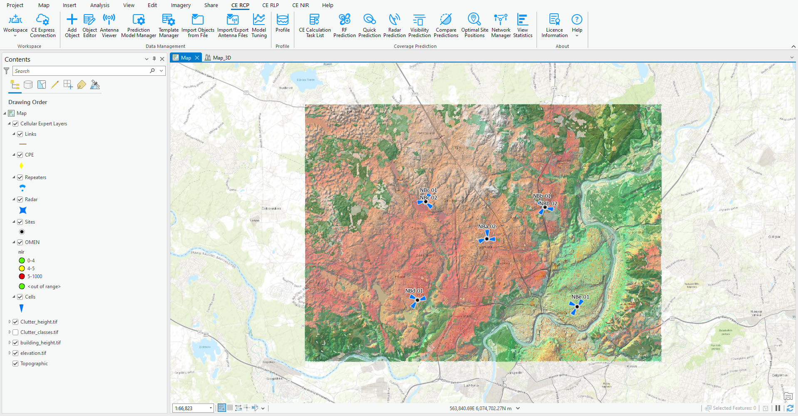

# CEC ITU-R Model (100MHz – 6GHz)

Open a project from C:\CE_Course\PredictionModels\Project location.

Open Prediction Model Manager tool and preview each Default prediction model. These models will be automatically created with new workspace.

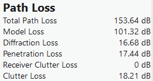

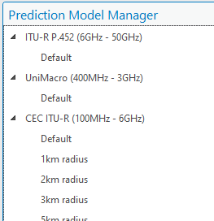

Find cells by cell name attribute on the map:

- NBa 01

- NBa 02

- NBa 03

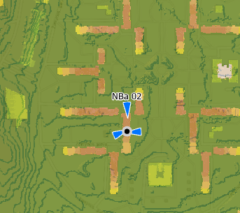

Select these cells and open Object Editor tool. Double click on first cell to open its attribute, then scroll down in parameters option to find Prediction model parameter.

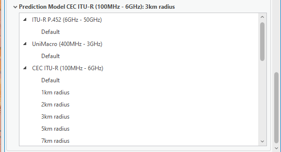

The heading shows which type and model is applied for the cell.

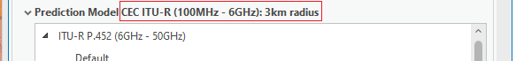

Preview other cells’ prediction model. Then open Prediction Model Manager tool again and find this model there.

Double click to open it attributes.

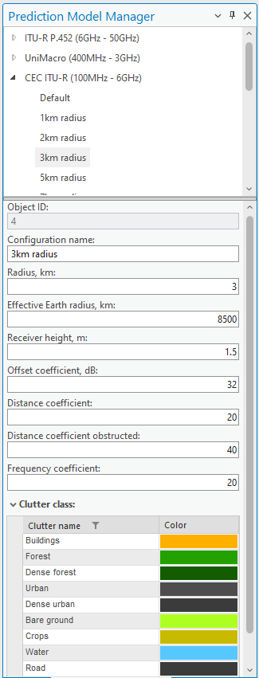

Then open RF Prediction tool and run the calculations with defined parameters in the picture below.

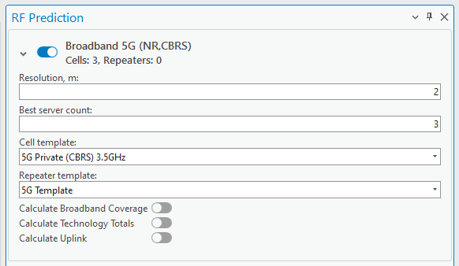

After successful calculation, preview the results.

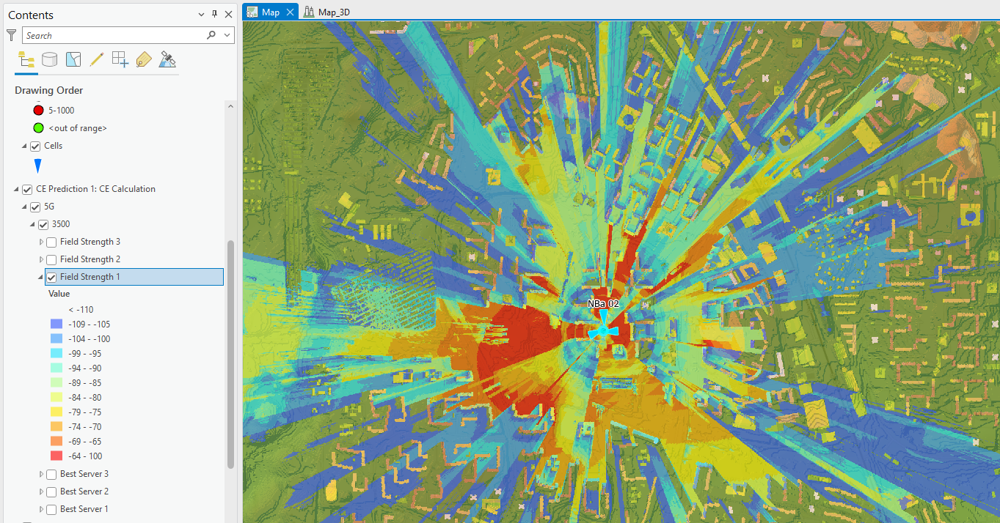

If prediction model provides too optimistical output to all conditions: LOS, OLOS and NLOS, then open ***3km radius*** prediction model parameters and change Offset coefficient, dB from 32 to 45. It simply works as a offset in Field Strength calculations, and would add additional 13dB loss (45 – 32 = 13 dB).

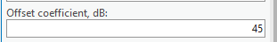

Press Apply button. Run RF Predictions with the same parameters.

Leave enabled only Field Strength 1 layers from both predictions.

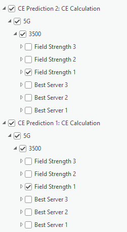

Click on Map \> Explore, and then click once on the map. The tool will provide information about raster values on this location.

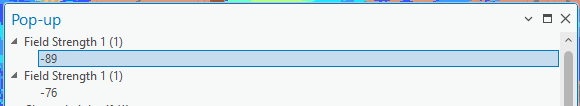

Field Strength for second prediction is lower by 13 (because we defined higher Offset value by 13).

If Path Loss should slope higher or slower depend on distance, we can adjust two parameters:

- Distance coefficient – it affects only Line of Sight areas.

- Distance coefficient obstructed – it affects only NLOS and OLOS areas.

There is possibility to define different slope coeficients how radio wave would slope when it goes through obstacle. Change Distance coefiecient obstructed value from 40 to 30.

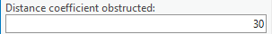

Press Apply and RF run predictions again. Compare the predictions using Explore tool. It gives higher effect in higher distance from Cell location. So signal value provides higher signal near transmitter.

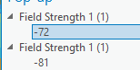

And lower signal after 1km.

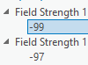

Open 3km radius prediction model parameters again, and change other parameters:

- Frequency coefficient: from 20 to 15

- Receiver height: from 1.5 to 10

## Clutter

Open the Clutter Classes tool to preview the available clutter types. These represent the default clutter categories within the project. Here, you should map your clutter classes raster and define ID values for each clutter class. If multiple clutter classes apply, separate them with a comma.

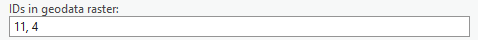

For this project, we use the Sentinel-2 land raster, with its clutter types mapped in the Clutter Classes dialog. Below is the clutter classes raster table:

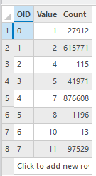

Value 2 corresponds to the *Trees* class and is assigned as *Forest*.

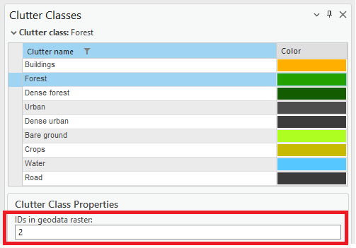

Clutter classes has additional information – buildings.

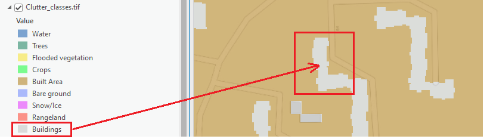

That can be added separately to each clutter class raster, and buildings data ID value applied in Clutter Classes dialog.

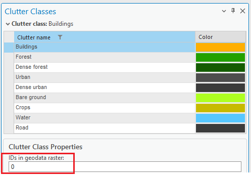

This is done already, preview this data.

Open 3km radius prediction model and double click on Buildings clutter class.

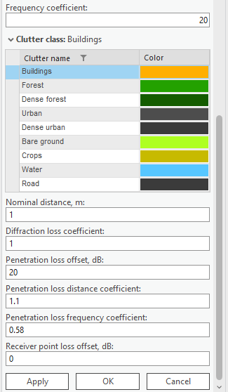

It provides additional parameters for how the prediction model behaves when encountering this obstacle. By default, Buildings data is treated as a solid obstacle and will be recognized in any CE prediction.

Generate a profile from NBa 02 cell object to Rx location:

- Latitude: 54.7272125

- Longitude: 25.2291091

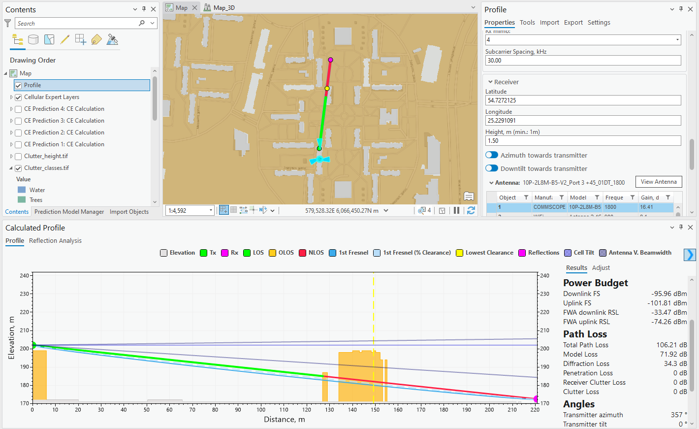

The Path Loss option displays the Total Path Loss, which includes both model loss and diffraction loss.

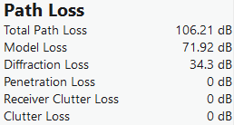

The Buildings clutter class is specifically used to define building locations. If the path crosses this clutter class, it will be identified as a solid obstacle, and diffraction loss will be added to the final path loss value.

### Diffraction coefficient

Open Prediction Model Manager, then CEC ITU-R prediction model and 3km radius configuration. Double click on Buildings layer, and change Diffraction loss coefficient to 0.6.

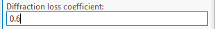

A lower coefficient can be applied for lower frequencies, where the signal is less affected.

- Press Apply button and draw a profile from the same cell to the same Rx location as previously. (54.7272125; 25.2291091)

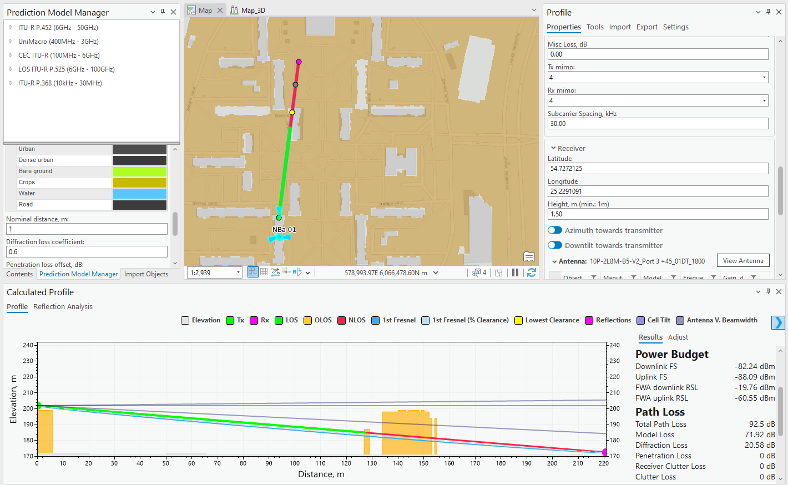

Compare results, previously it was 34.3 dB loss, and now 20.58 dB.

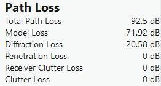

Do the same for other clutter classes, as an example Forest clutter class with Diffraction loss coefficient 0.5:

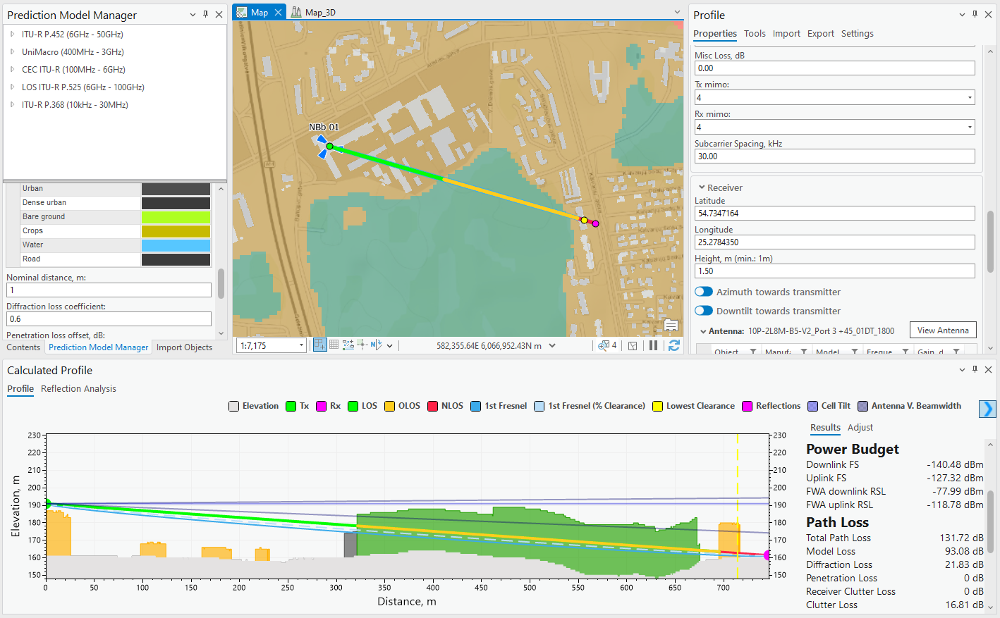

And using Diffraction loss coefficient – 0.7, it will change Clutter loss value from 16.81 dB to 20.6 dB.

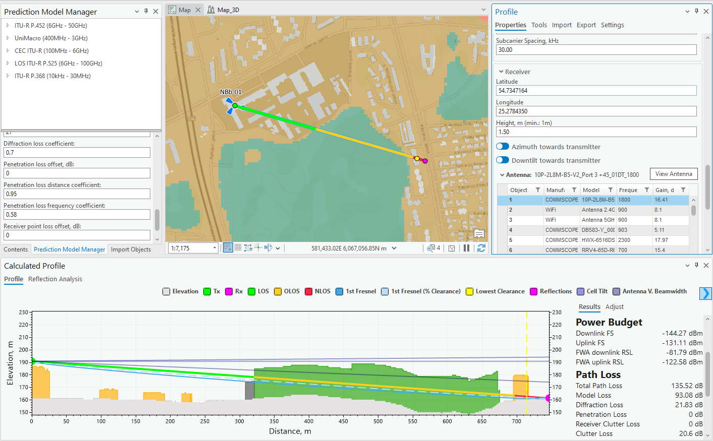

### Penetration loss

Penetration loss describes how a signal is affected as it enters an obstacle and attenuates within it, as in an Outdoor-to-Indoor scenario. This loss includes several parameters and is only applied when the RX location falls within the specified clutter class.

- Penetration loss offset – the entry loss to clutter object.

- Penetration loss distance coefficient – how signal slope inside clutter class object.

- Penetration loss frequency coefficient – how signal slope inside clutter class based on frequency.

Draw a profile from NBb 01 cell to RX location:

- Latitude: 54.7349136

- Longitude: 25.2857285

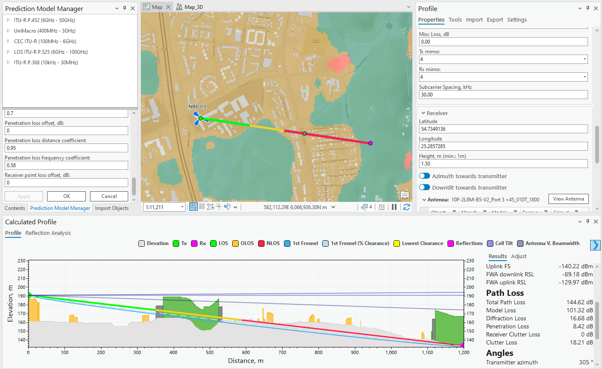

Leave profile open, and open Prediction Model Manager, then CEC ITU-R prediction model and 3km radius configuration. Double click on Buildings layer, and change Penetration loss coefficient from 0 to 8 dB.

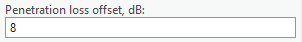

Press Apply button and click Manual Profile button in Profile.

Profile will be regenerated with updated Path Loss values. Penetration loss is now 8 dB higher than previously.

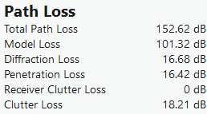

Change other penetration values and regenerate profile.

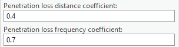

And result is now:

Close Profile tool.

## New Prediction Model

Open Prediction Model Manager, right click on CEC ITU-R (100MHz – 6GHz) model and choose Create New.

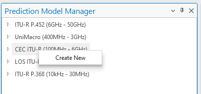

Define:

- Model Name: PM 1km radius

- Maximum Radius (km): 1

- Effective Earth Radius: 8500

- Receiver Height: 1.5

- Offset coefficient: 45

- Distance coefficient: 30

- Distance coefficient obstructed: 40

- Frequency coefficient: 20

- Leave clutter values as it is.

Press Apply.

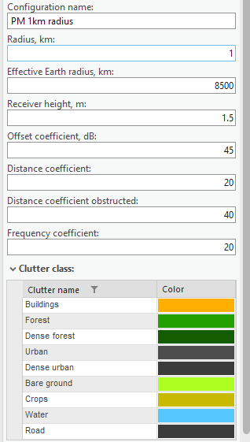

Open Object Editor for Cells NBa 01, NBa 02, NBa 03 and change prediction model to PM 1km radius for these Cells.

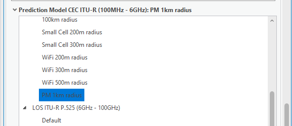

Run RF predictions and preview results loaded in the Contents.

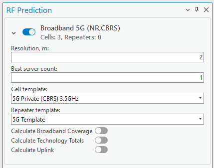

Prediction radius will be limited to 1 kilometer.

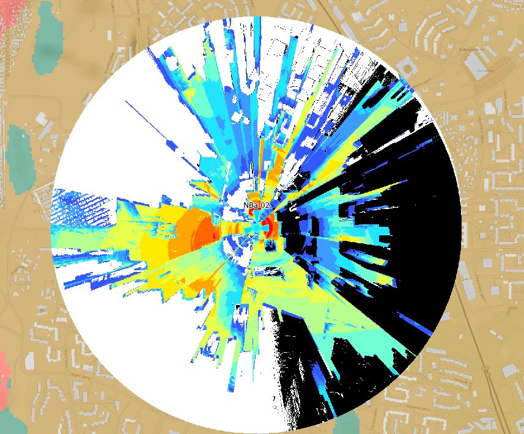

# UniMacro

UniMacro model acts similary to CEC – ITU model, just here it has additional 9999 model coefficients.

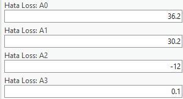

Open prediction dialog, expand UniMacro model and double click on Default prediction model. Preview parameters.

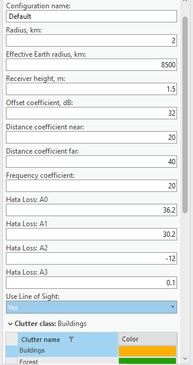

Select NBb 01, 02 and 03 cells, then right click on Cells in the contents and open Attribute Table.

Find Prediction model type ID field, right click on and choose Calculate Field.

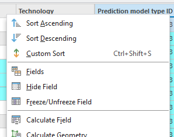

Define value 2 and press OK. By defining value 2, we change prediction model type for selected cells. If prediction model type is 2 – then it is UniMacro model. Here is prediction model table:

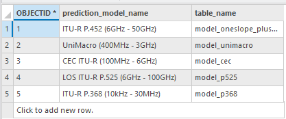

Find prediction_model_configuration_id field and calculate value 1 for selected Cells.

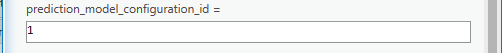

Open Object Editor for selected Cells, double click on any cell in Object Editor and preview assigned prediction model.

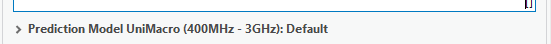

Open RF Prediction tool, and run predictions with defined parameters.

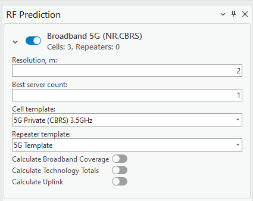

Preview loaded results.

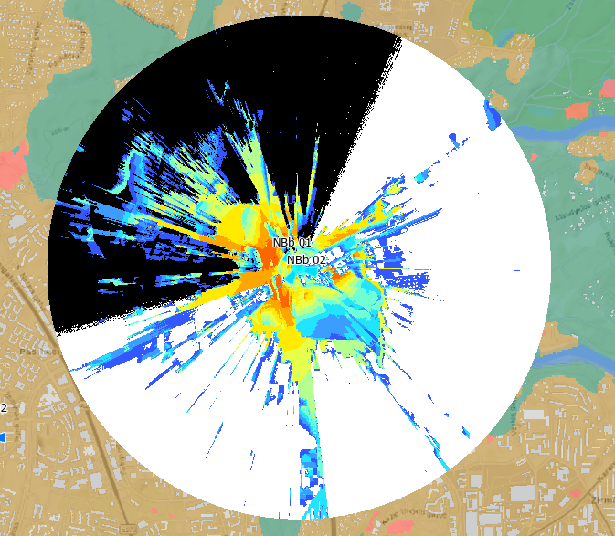

Open Prediction Model Manager, UniMacro model \> Default and one by one change:

- Define A0: 45, and run RF Prediction.

- Define A1: 40, and run RF Prediction.

After that, compare all three predictions using Explore tool.

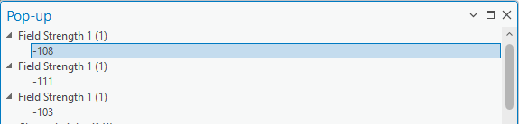

# LOS ITU-R P.525 (6GHz – 100GHz)

The prediction model is dedicated to higher frequencies, usually for mmWave 5G bands. It gives the results for only LOS areas. Leave the same cells selected and open Cells Attribute Table (right click on Cells \> Attribute Table).

- Find Prediction model type ID field and using Calculate field change value from 2 to 4.

- For prediction_model_configuration_id define value 3.

- Change:

  - Power to 25;

  - Frequency to 26000;

  - Bandwidth to 200;

  - Subcarrier spacing to 60;

  - TxMIMO to 32

  - RxMIMO to 32

  - Active antenna effect to 6;

  - Frequency group: mmWave Band.

Open RF Prediction tool. Run predictions with the same parameters.

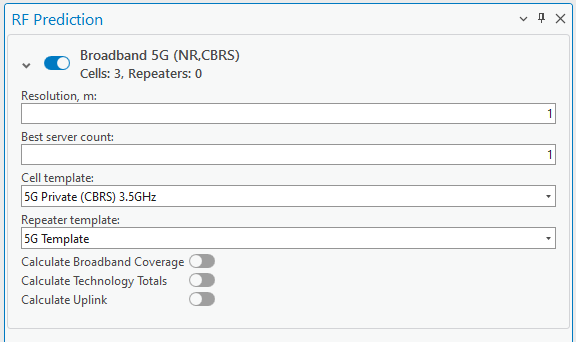

It will provide coverage results where only LOS condition exist. Additionally, each cell will have signal strength value.

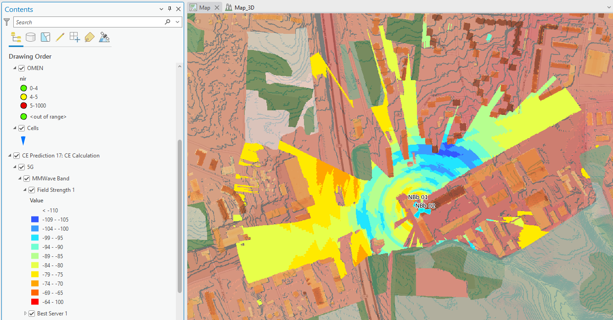
