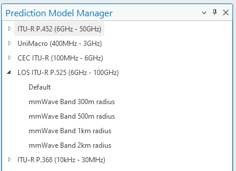
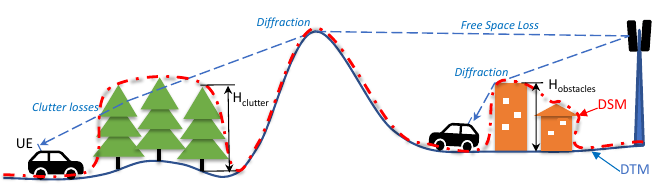
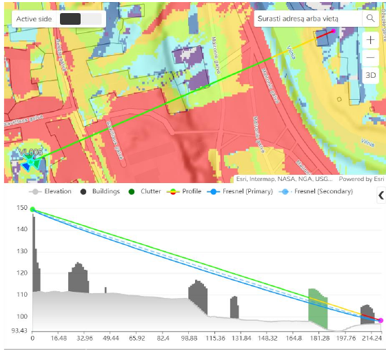
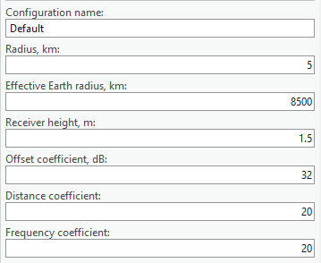

# 05. Prediction Models

> **Version:** CE Pro v4.9

## Path Loss

The fundamental relationship used in CE Pro predictions:

```
Field Strength = EIRP – Antenna Attenuation – Path Loss
```

## Prediction Models Overview

CE Pro ships with five path loss models, managed in the **Prediction Model Manager**:

- **ITU-R P.452** (6 GHz – 50 GHz)
- **UniMacro** (400 MHz – 3 GHz)
- **CEC ITU-R** (100 MHz – 6 GHz)
- **LOS ITU-R P.525** (6 GHz – 100 GHz)
- **ITU-R P.368** (10 kHz – 30 MHz)


## CE Path Loss Models

1. **CEC ITU-R Model** (100 MHz – 6 GHz) is a combination model intended for use in a variety of different radiocommunication systems, derived explicitly from ITU-R path loss modelling methods:
   - Receive antenna in **LOS** condition — path loss calculated as FSL based on Recommendation ITU-R P.525
   - Receive antenna in **OLOS** condition — total path loss modelled as a combination of basic FSL (ITU-R P.525) and clutter loss (ITU-R P.2108)
   - Receive antenna in **NLOS** condition — path loss as a combination of basic FSL (ITU-R P.525), additional losses due to diffraction (ITU-R P.526), and clutter losses (ITU-R P.2108)
2. **ITU-R P.452 Model** (6 GHz – 50 GHz) is a universally applicable model with a very wide frequency range from 0.1–50 GHz, based on the methodology in Recommendation ITU-R P.452. It does not define an OLOS visibility condition — clutter is treated as part of the general obstacles category, so only two radio visibility cases are distinguished:
   - Receive antenna in **LOS** condition — path loss modelled based on the FSL principle
   - Receive antenna in **NLOS** condition — total path loss modelled using a combination of basic transmission losses and losses due to diffraction
3. **LOS ITU-R P.525 Model** (6 GHz – 100 GHz) is the FSL path loss calculated based on the method in Recommendation ITU-R P.525. It could be used for modelling radio links where LOS is considered a necessary condition, e.g. for fixed (point-to-point) links or mobile systems in mmWave bands.
4. **UniMacro Model** (400 MHz – 3 GHz) is CE's proprietary combination model developed over the years of practical experience with the operational planning of cellular mobile networks in the 400–2600 MHz range. It has been fine-tuned to produce coverage predictions most closely aligned with actual mobile network user experience in the field, modelling different path losses depending on radio visibility conditions:
   - Receive antenna in **LOS** condition — path loss modelled based on the FSL principle
   - Receive antenna in **OLOS** condition — path loss modelled using Extended Hata (Open Area) with additional clutter loss based on Recommendation ITU-R P.2108
   - Receive antenna in **NLOS** condition — path loss modelled using Extended Hata with additional diffraction losses (ITU-R P.526) as well as clutter losses (ITU-R P.2108)
5. **ITU-R P.368** (10 kHz – 30 MHz)

Every model can be configured with multiple named calibrations — for example, the built-in **ITU-R P.525** model ships with `mmWave Band 300m/500m/1km/2km radius` presets, and **ITU-R P.368** ships with radius presets from `1km` up to `100km`, plus `Small Cell` and `WiFi` presets:





## Common Input Data

Every model draws on the same three categories of input:

| Category | Inputs |
|---|---|
| **Geographic data** | Elevation, Clutter classes*, Clutter height grid* |
| **Network data** | Receiver settings |
| **Algorithm** | Prediction model settings |

\* Optional — improves OLOS/NLOS accuracy but is not required.

## 1. CEC ITU-R (100 MHz – 6 GHz)

For frequencies from about 30 MHz to about 6 GHz. Modelling distinguishes three radio visibility conditions — **LOS**, **OLOS**, **NLOS**:





### Path Loss Equation (LOS / OLOS)

```
L = K_off + K_LogD × log(d) + K_LogF × log(f)
```

| Parameter | Description | Default |
|-----------|-------------|---------|
| K_off | Constant offset (dB) | 32 |
| K_LogD | Distance influence coefficient | 20 |
| K_LogF | Frequency influence coefficient | 20 |
| d | Distance (km) | — |
| f | Frequency (MHz) | — |


### Path Loss Equation (NLOS)

```
L = K_off + K_LogD_obs × log(d) + K_LogF × log(f)
```

K_LogD_obs (obstructed distance coefficient) default = **30**

### Clutter Loss

- **Diffraction loss** for solid obstacles, based on the building clutter class and elevation
- **Clutter loss** — based on the diffraction calculation, per **ITU-R P.2108**
- **Penetration loss** (Outdoor → Indoor)
- **Receiver loss**


Solid obstacle (building) diffraction uses **Single Knife Edge (SKE)** per ITU-R P.526 — an idealised model of diffraction over a single obstruction:

```
Tx ---d1--- [obstacle h > 0] ---d2--- Rx
```

**ITU-R P.2108 clutter loss estimation** (Method 1: additional clutter shadowing loss with diffraction as the dominant effect) — worked example at 2.1 GHz, 1.5 m antenna height, 27 m street width, 10 m representative clutter height:

| Result | Value |
|---|---|
| Clutter loss for open area scenarios | 22.4 dB |
| Clutter loss for obstructed area scenarios | 19.6 dB |


### Penetration Loss (Outdoor → Indoor) — 3GPP TR 38.901

CE's outdoor-to-indoor path loss calculation is based on the method recommended in 3GPP TR 38.901, which accounts for the indoor portion of the total radio signal propagation path. Two building-entry loss profiles are assumed:

- **Low-loss BEL Model** — average traditional buildings
- **High-loss BEL Model** — modern, thermally insulated buildings (higher wall penetration coefficients)

```
L_glass     = 2.0 + 0.2f
L_concrete  = 5.0 + 4.0f
L_IIR_glass = 23.0 + 0.3f        (f = frequency in GHz)
```


## 2. ITU-R P.452 (6 GHz – 50 GHz)

For frequencies from about 6 GHz to about 50 GHz. Only **LOS** and **NLOS** are distinguished (no separate OLOS — clutter is treated as part of general obstacles):


Uses the same Input Data, Path Loss Equation, Clutter, SKE Diffraction, and Penetration Loss methodology described above for CEC ITU-R.

## 3. LOS ITU-R P.525 (6 GHz – 100 GHz)

For frequencies from about 6 GHz to about 100 GHz. Pure Free Space Loss — use when LOS is guaranteed, such as fixed microwave links or 5G NR mmWave (FR2):



## 4. UniMacro (400 MHz – 3 GHz)

Frequency range approximately 100 MHz – 2 GHz (up to 3 GHz), for distances up to 100 km. Based on the **9999 Ericsson** model:


### Path Loss Equation: 9999 Ericsson

```
L_H = a0 + a1×log(d) + a2×log(hB) + a3×log(hB)×log(d)
        + 3.2×[log(11.75×hM)]² + g(f)

g(f) = 44.49×log(f) – 4.78×[log(f)]²
```

| Parameter | Description | Default |
|-----------|-------------|---------|
| a0 | Constant offset (dB). Simply added to the loss grid — adjusting it minimises mean error and regulates the absolute level of the loss curve | 36.8 |
| a1 | Distance influence coefficient — loss dependent on distance (atmospheric losses etc.); regulates the slope of the curve | 30.2 |
| a2 | Transmitter height influence coefficient — related to errors in DTM, real Earth curvature, etc.; regulates the curve's vertical position like a0, but with respect to antenna height | -12.0 |
| a3 | Okumura-Hata type multiplying factor for log(hB)×log(d) | 0.1 |
| hB | Base station antenna height (m) | — |
| hM | Mobile (UE) antenna height (m) | — |
| d | Distance (km) | — |
| f | Frequency (MHz) | — |

The 9999 model is convenient for calibration: parameters **a0–a3** can be deduced from measured path loss dependence on distance (drive tests).

- **a0** — constant offset of the path loss curve (mean-error correction)
- **a1** — regulates the slope of the curve with distance
- **a2** — regulates the curve's vertical position with respect to antenna height (h)
- **a3** — defines the slope of the curve for different base station antenna heights

## 5. ITU-R P.368 (10 kHz – 30 MHz)

Ground wave propagation model for HF/VHF broadcast and land mobile systems. Unlike the other models, its path loss equation distinguishes **near** and **far** distance coefficients rather than a single obstructed/unobstructed pair:

```
L = K_off + K_LogD × log(d) + K_LogF × log(f)
```

| Parameter | Description | Default |
|-----------|-------------|---------|
| K_off | Constant offset (dB) | 32 |
| Distance coefficient (near) | K_LogD | 20 |
| Distance coefficient (far) | K_LogD | 40 |
| K_LogF | Frequency influence coefficient | 20 |


Uses the same Clutter, SKE Diffraction, and Penetration Loss methodology described above.


## Prediction Model Manager

Navigate to: **Cellular Expert tab → Prediction Model Manager**

- The **Default** calibration cannot be deleted, and new calibrations copy their parameters from Default as a starting point
- Each model/calibration can be independently tuned per environment

## Required Input Data

| Data | Required | Notes |
|------|----------|-------|
| DTM / DEM | ✅ Yes | Terrain elevation grid |
| Clutter classes | Optional | Improves OLOS/NLOS |
| Clutter height grid | Optional | Required for P.2108 |
| Receiver height | ✅ Yes | UE height above ground |
| Model coefficients | ✅ Yes | K_off, K_LogD, K_LogF |

**Exercise:** `C:\CE_Course\0. Descriptions\5. Prediction models.pdf`

**Contact:** info@cellular-expert.com | +370 5 2150575 | www.cellular-expert.com
