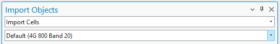

# 06. Importing Data

> **Version:** CE Pro v4.9

## Network Import for CE for ArcGIS Pro

- **From:** Excel, CSV, or an SDE table
- **To Cellular Expert Workspace:** the `.gdb` database, via an intermediate JSON mapping step

## Network Objects

- **Cells**
  - **Sites** (created automatically if the `site_id` parameter is defined)

## Mapping File

A JSON-type file that can be edited with Notepad, controlling how source columns map to CE fields:

### Mapping File Structure

- **`current_name`** — the name of the value as written in the data file. For example, `freq_mhz` is a column name in the data file and will be changed to `frequency` when the mapping file is applied and objects are imported
- **`destination_name`** — the proper name of the property (table column name) in the Cellular Expert database
- **`default_value`** — applied when an object in the data file lacks a specific property; the same value is applied to all imported objects

## Cells: Generate Cell Name

Check the **Generate Cell Name** option to auto-generate cell names from:

- Latitude
- Longitude
- Azimuth
- Frequency
- Power
- Height
- Antenna gain

## Apply Prediction Model

**Select Territory Polygon** (optional):

- Polygon type feature class / shape file
- `ModelID` and `ConfigID` are required
- This option appears when the **Import HCM patterns** option is active

## Parameters for Cell Object

| Field | Description |
|---|---|
| `cell_name` | Cell identifier (recommended unique value) |
| `latitude` | Decimal degrees Y coordinate, WGS 1984 |
| `longitude` | Decimal degrees X coordinate, WGS 1984 |
| `height` | Cell height above the terrain |
| `azimuth` | Cell direction from north, in degrees |
| `tilt` | Mechanical tilt value |
| `frequency` | Frequency value in MHz |
| `power` | Power value in dBm |
| `antenna_gain` | Antenna gain value from the applied antenna |
| `misc_loss` | Miscellaneous loss value in dB |
| `bandwidth` | Value in MHz. Required for 4G and 5G. For other technologies, define as `0.015` |
| `noise_figure` | Value in dB. Required for 4G and 5G |
| `downlink_duplex_factor` | Value range 0–1. Required for 4G and 5G; used for Downlink Throughput calculations |
| `subcarrier_spacing` | Value in kHz. Required for 4G and 5G. For other technologies, define as `15` |
| `tx_mimo` | Transmitter antenna count. Available values: 1, 2, 4, 8, 16, 32, 64 |
| `rx_mimo` | Receiver antenna count. Available values: 1, 2, 4, 8, 16, 32, 64 |
| `active_antenna_effect` | Dedicated to smart antenna modelling. Default `0`; if massive MIMO is used, include a smart antenna effect to lower interference and boost throughput. Recommended: MIMO 32×32 → `6`, MIMO 64×64 → `9` |
| `cell_load` | Percentage, 0–100, describing how loaded the cell is. Affects RSSI, RSRQ, and DL Throughput calculations — a higher cell load means lower DL Throughput |
| `technology` | Cell technology: `2G`, `3G`, `4G`, `5G`, or `WiFi` |
| `prediction_model_id` | Prediction model identification: `1` = ITU-R P.452, `2` = UniMacro, `3` = CEC ITU-R, `4` = LOS ITU-R P.525, `5` = ITU-R P.368 |
| `prediction_model_configuration_id` | Prediction model configuration ID within the chosen `prediction_model_id` |
| `frequency_group` | Manages different frequency groups — RF prediction runs a separate prediction automatically per `frequency_group` value |
| `antenna_id` | Antenna identification in the database |
| `duplex_mode` | Required for 4G and 5G. Possible values: `FDD` or `TDD` |
| `site_id` | Define a site name here to automatically create a Site object for the cell. Must be text format |

**Exercise:** `C:\CE_Course\0. Descriptions\6. Importing data.pdf`

**Contact:** info@cellular-expert.com | +370 5 2150575 | www.cellular-expert.com
