**6. Importing data**

# Objective

This tutorial will show you how to import network objects using different data structures to Cellular Expert workspace.

At the end of exercise you will be able to:

- Create Json mapping file.

- Import objects.

# Initial data

Prepared project with:

- Geodata.

# Excel/CSV file

Navigate to C:\CE_Course\ImportingData\Project location and run Project.aprx to open the prepared project for this exercise.

Right-click on Cells layer in Contents window and choose Attribute Table, preview table structure, and fields.

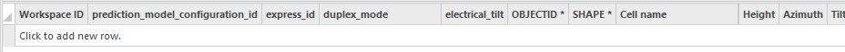

Click on Table Options button and select Field View.

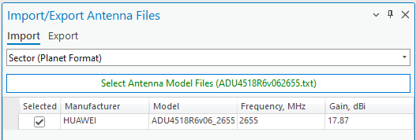

It will provide more detailed information about table structure.

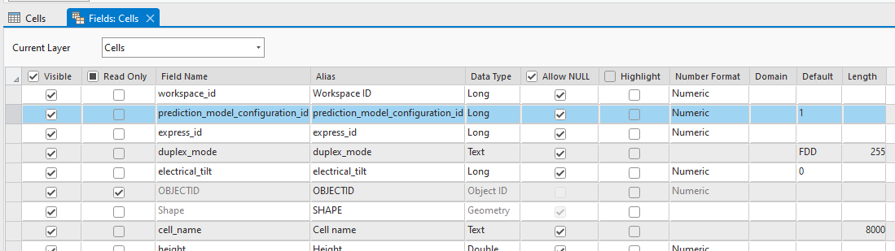

Close tables.

# Mapping file

An Excel or CSV file can be imported directly into the CE workspace without a mapping file, provided that the text file has the same field names as the Cells table in the CE workspace.

The Excel/CSV file might contain discrepancies in names, values, and units compared to the Cellular Expert database. To tackle these conflicts, an extra Mapping file is recommended to address these discrepancies.

If the import file aligns perfectly with the Cellular Expert database, a Mapping file isn't needed. However, when there are disparities, using mapping files becomes essential for a successful import. Here is a structure of one field in a mapping file.

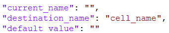

**“current_name”** - name of the value that is written in the data file. As an example “freq_mhz” is a column name in the data file and will be changed to “frequency” when the mapping file is applied and objects are imported.

**“destination_name”** - the proper name of the property (table column name) in the Cellular

**“default_value”** – The default value applies when an object in the data file lacks a specific property. The same value will be applied for all imported objects.

On your computer, navigate to C:\CE_Course\ImportingData\Network and open the cells_mapping.json file. Review the contents of the file. Then, from the same Network folder, open the Cells.csv file and review it as well. Keep both files open. Your next step is to create a mapping file that will be used during the import process.

Define values in the mapping file based on this table:

|         **current_name**          | **destination_name** | **default_value** |
|:---------------------------------:|---------------------:|------------------:|
|             cell_name             |            Cell Name |     *Leave empty* |
|             latitude              |             latitude |     *Leave empty* |
|             longitude             |            longitude |     *Leave empty* |
|              height               |  Height Above Ground |     *Leave empty* |
|              azimuth              |              Azimuth |     *Leave empty* |
|               tilt                |                 Tilt |     *Leave empty* |
|             frequency             |            Frequency |     *Leave empty* |
|               power               |           Cell Power |     *Leave empty* |
|             misc_loss             |        *Leave empty* |     *Leave empty* |
|               eirp                |        *Leave empty* |     *Leave empty* |
|             bandwidth             |            Bandwidth |     *Leave empty* |
|           noise_figure            |        *Leave empty* |                 6 |
|      downlink_duplex_factor       |        *Leave empty* |               0.6 |
|        subcarrier_spacing         |        *Leave empty* |                30 |
|              tx_mimo              |               TxMIMO |     *Leave empty* |
|              rx_mimo              |               RxMIMO |     *Leave empty* |
|       active_antenna_effect       |        *Leave empty* |                 0 |
|             cell_load             |        *Leave empty* |                30 |
|           network_name            |        *Leave empty* |     *Leave empty* |
|            color_index            |        *Leave empty* |     *Leave empty* |
|            technology             |                 Tech |     *Leave empty* |
|        prediction_model_id        |        *Leave empty* |                 3 |
| prediction_model_configuration_id |        *Leave empty* |                 4 |
|          frequency_group          |            Frequency |     *Leave empty* |
|            antenna_id             |        *Leave empty* |               514 |
|             carriers              |        *Leave empty* |              \[\] |
|          electrical_tilt          |        *Leave empty* |     *Leave empty* |
|              site_id              |           Tower Name |     *Leave empty* |

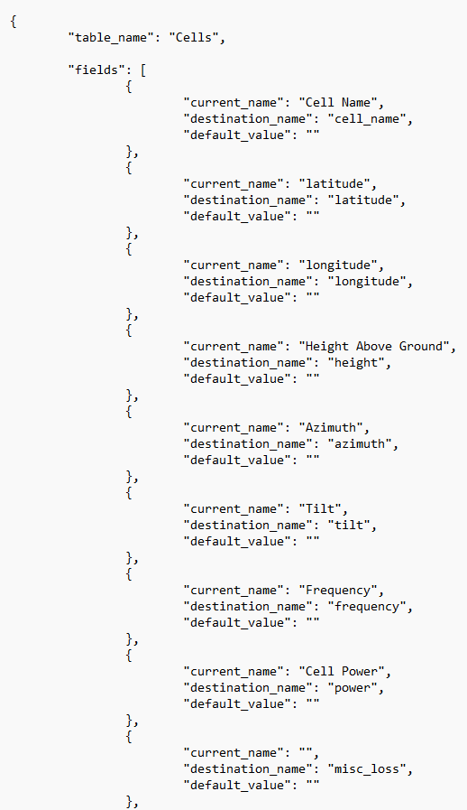 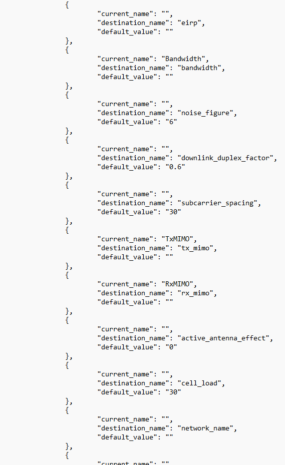

When the fields are filled, save the .json file. Close json and excel files.

# Importing

In CE RCP toolbar open *Import Objects from Files*  *.* Choose Import Cells from the dropdown menu.

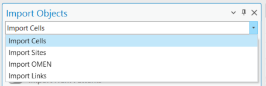

Choose *5G 3500 Band n48* template. Values from this template will be taken during the import process, if mapping_file would be missing some parameters.

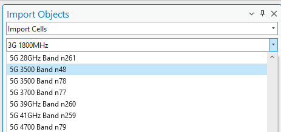

Click Select Data Files button.

Navigate to *C:\CE_Course\ImportingData\Network.* Switch from Microsoft Excel files to Comma-separated value files (.csv).

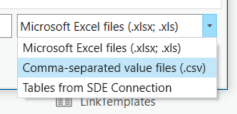

Select Cells CSV file and click OK.

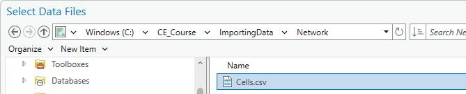

View the imported data fields. The column names should be the same as in the .csv file.

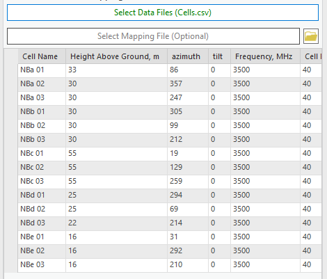

Click Select Mapping File button.

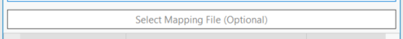

Navigate to *C:\CE_Course\ImportingData\Network.* Select cells_mapping JSON file and click OK.

Click Yes in the Information window.

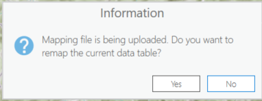

Press Import Cells button.

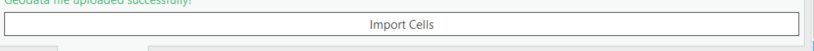

All imported cells and sites should appear on the map.

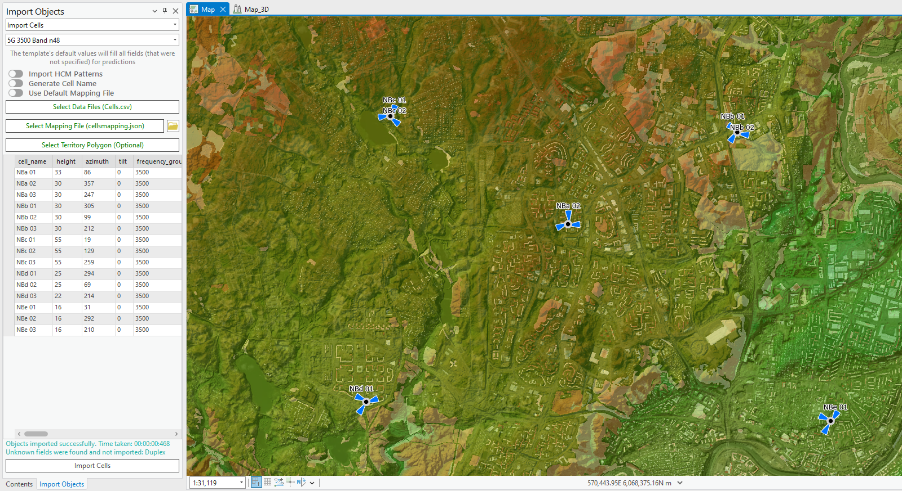

# Antennas

Navigate to C:\CE_Course\ImportingData\Antenna. Open ADU4518R6v06_2655.txt antenna file with Notepad.

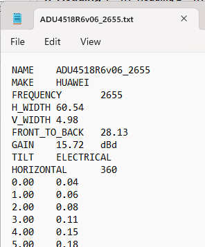

The antenna pattern file is in Planet format and its structure:

- General information.

- HORIZONTAL patterns.

- VERTICAL patterns.

Such kind of antenna pattern format can be imported into Cellular Expert database.

Open Import/Export Antenna Files tool. Then click on Select Antenna Model Files

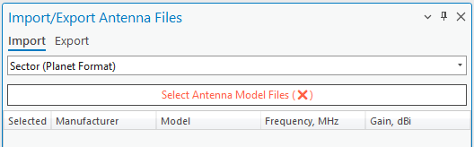

Navigate to C:\CE_Course\ImportingData\Antenna, select ADU4518R6v06_2655.txt file and press Open. It will be added to the import tool.

Press Import Antennas button. After that you will get the message, that the antenna was imported successfully.

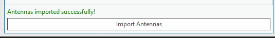

Close this tool, then open Antenna Viewer tool, using the scroll bar go to the bottom and double click on the imported antenna.

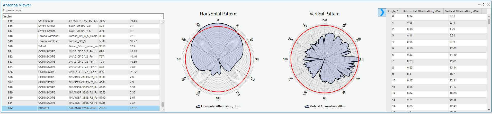

# Cell import with minimum required information

Minimum required data to import Cell object is:

- Name;

- Latitude;

- Longitude.

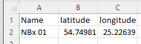

Navigate to C:\CE_Course\ImportingData\Network and open Cells_small.csv file to preview it. Also, open cells_mapping_small.json file to preview the parameters and default values, which would be applied to this cell object.

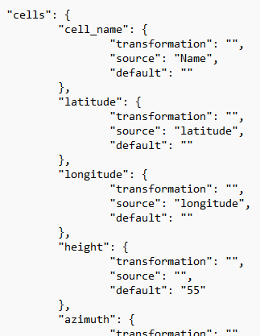

Close csv and json files.

Refresh Import tool, choose Import Sites.

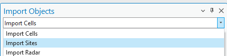

Then go back to Import Cells.

Define template: 5G 3500 Band n48 is set.

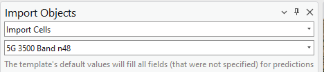

Click on Select Data Files button.

Switch from Microsoft Excel files to Comma-separated value files (.csv).

Select Cells_small.csv file and press OK to add it.

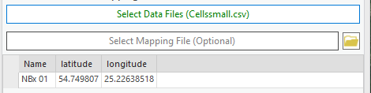

Click on Select Mapping file and define mapping_cells_small.json file.

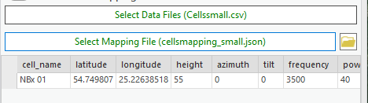

Press Import Cells button. New objects will be imported into the northern region.

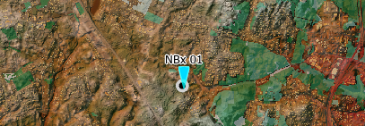
