**7. RL Introduction**

# Objective

This tutorial will show you how to add new MW links, manage and do predictions.

At the end of the exercise you will be able to:

- Create and import MW equipment.

- Create MW links in the project.

- Do MW Predictions.

# Initial data

Prepared project with:

- Network objects.

- Geodata.

- Equipment and models.

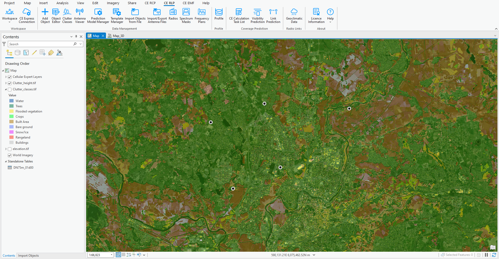

# Manage MW equipment

Navigate to C:\CE_Course\RL_Prediction\Project and run Project.aprx file to open the prepared project for RL Introduction exercise.

Microwave links involve additional equipment settings compared to point-to-area predictions. These settings include frequency plans, radio equipment, and parabolic antennas, which are used for predicting power budget, interference, or availability. In this section, we will cover how to create and, if necessary, import this data into the project.

## Parabolic antennas

Open Antenna Viewer in CE RLP tab, and change antenna type from Sector to Parabolic.

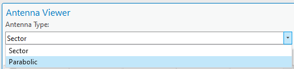

All parabolic antennas will be displayed.

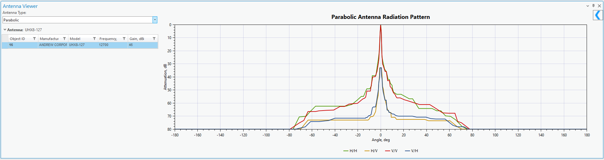

Close Antenna Viewer tool. To import a new parabolic antenna, open Import/Export Antenna Files tool. Select Parabolic (NSMA Format).

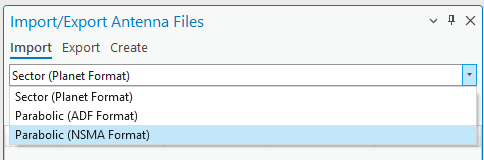

Click on Select Antenna Model Files

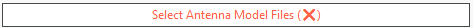

Browse to C:\CE_Course\RL_Prediction\Equipment, select Antenna10GHz.txt file and press OK button. It will appear in Import/Export Antenna Files dialog.

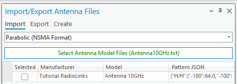

Select Check box near the antenna and press Import Antennas button.

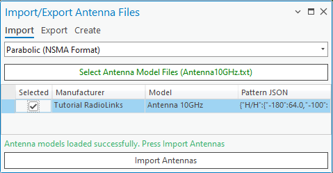

Antenna will be imported successfully, you can go back you Antenna Viewer dialog and preview it.

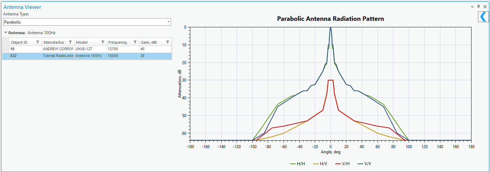

Close Antenna Viewer and Import tools.

## Radios

This equipment category encompasses details about radio transceivers utilized in microwave links. It comprises information on transmitter power, receiver sensitivity, noise figure, nonlinearity characteristics, and maximum data capacity.

Open Radios tool in CE RLP tab and preview available Radio within default CE workspace.

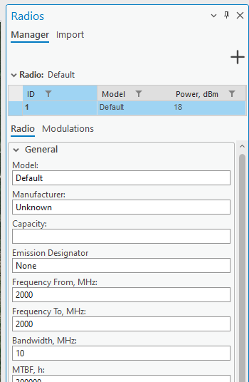

It has parameter section, and Modulations section.

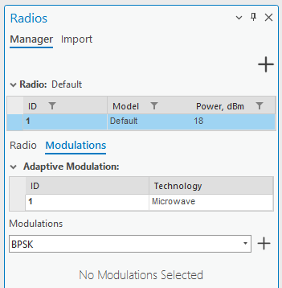

Click on Add button in top right corner of the dialog.

Define the same parameters as defined below:

- Model: RL Radio

- Manufacture: CE

- Frequency From, MHz: 9500

- Frequency To, MHz: 10500

- Bandwidth, MHz: 10

- MTBF, h: 300000

- MTTR, h: 24

- Bit Rate, kbps: 2048

- Block Size, bits: 2048

- Burst Errors: 1

- Dispersive Fade Margin, dB: 50

- BER 10-3 Threshold, dBm: -76

- BER 10-6 Threshold, dBm: -72

- Noise Figure, dB: 5

- Residual BER: 1E-12

- IIP2, dBm: 30

- IIP3, dBm: 29

- XPIF, dB: 20

- Power, dBm: 20

- Power Low, dBm: 10

- Power High, dBm: 26

- Automatic Transfer Power Control Range, dB: 20

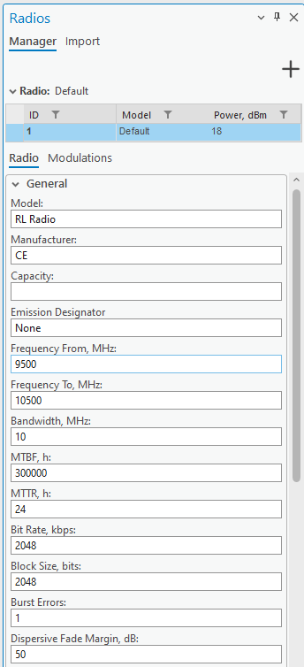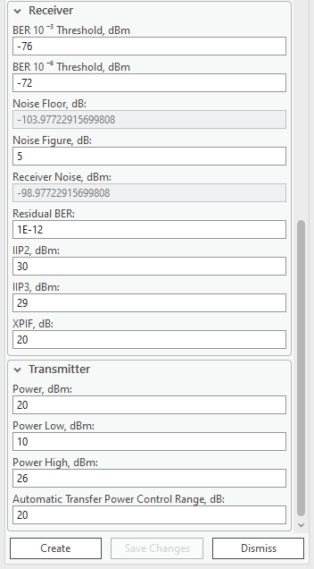

Click on Modulations tab, and include these modulations:

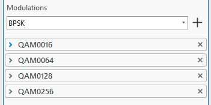

You can do it simply selecting modulation from the list and press + button to add it for the radio.

Each modulation has its own default parameters.

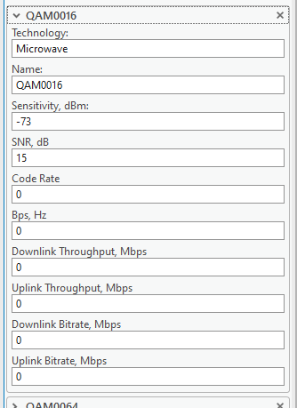

Leave default parameters and press Create button. The new radio will be added in the list.

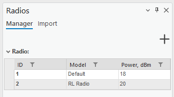

Close Radios tool.

## Frequency plans

Frequency planning is important for microwave link design, optimizing spectrum use, and preventing interference. By strategically allocating frequency bands, it enhances efficiency, complies with regulations, and coordinates with other services. This planning considers propagation characteristics and facilitates scalability, ensuring optimal performance for microwave links in various environments and supporting future technology upgrades.

Frequency plans can be imported from a text file, or created manually.

### Create manually

Open Frequency Plans tool in CE RLP tab.

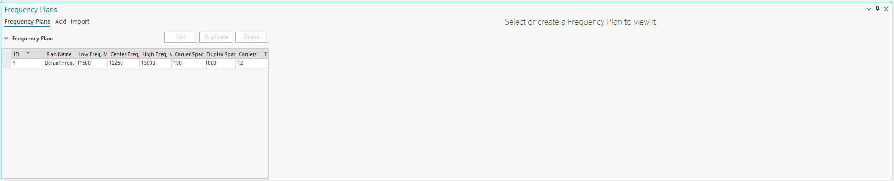

Click on Add section and define:

- Frequency Plan Name: FP 10MHz 8 Carriers

- Low Frequency, MHz: 9800

- Carrier Spacing, MHz: 50

- Duplex Spacing, MHz: 300

- Carriers: 8

High Frequency, MHz will be filled automatically.

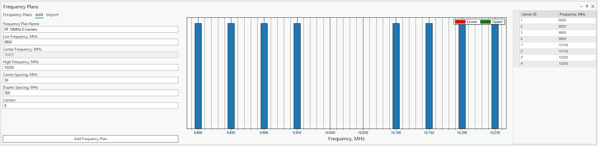

Press Add Frequency Plan button.

The new frequency plan will appear in the main dialog.

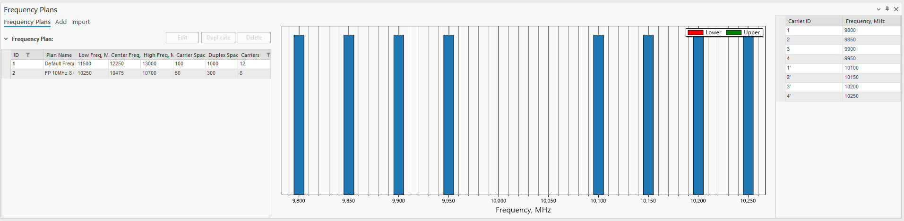

### Import

Click on Import option, and then on Select Data Files.

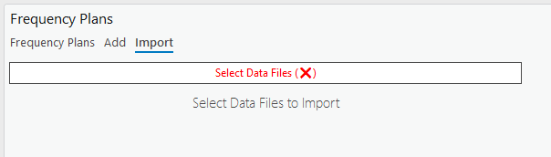

Navigate to C:\CE_Course\RL_Prediction\Equipment\FrequencyPlans, select all files and press OK button.

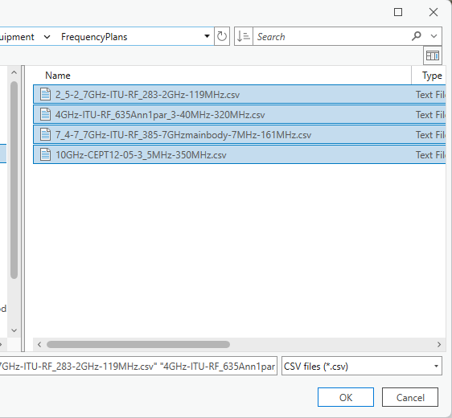

Frequency Plans will be added to the preview.

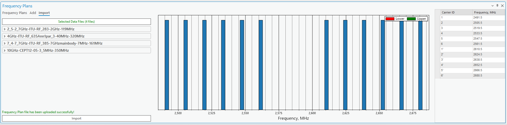

Press Import button and they will be imported to the database.

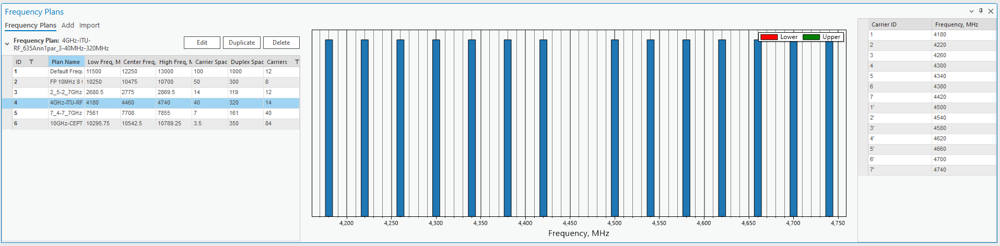

Close Frequency Plans dialog.

# Add Links

The link objects can be imported or created manually using Add functionality. Open Add Object tool and select Link option from drop-down menu list.

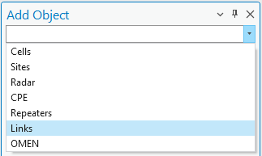

Click once on T1 site and second time to D1 site.

It will fill general parameters automatically.

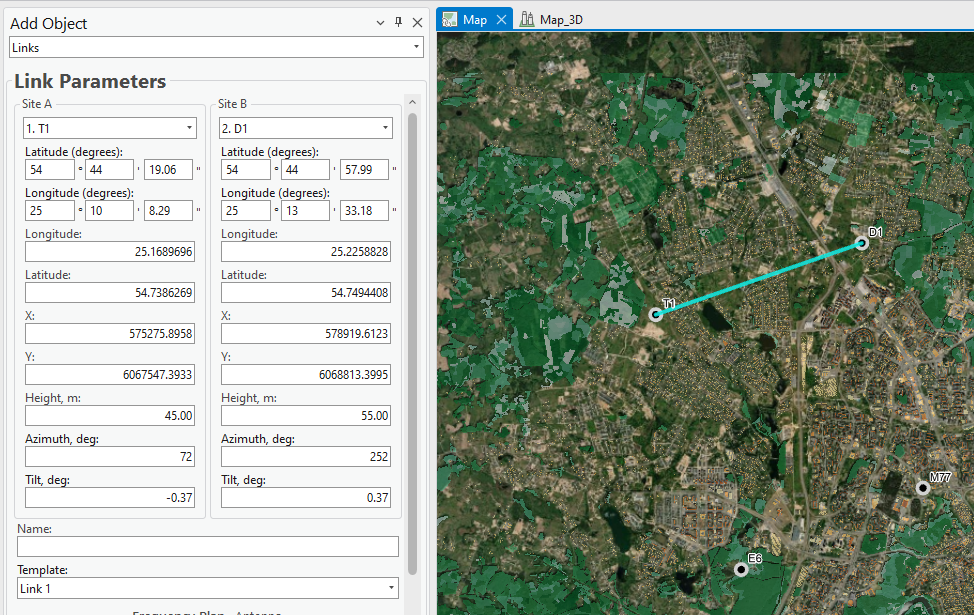

Height, azimuth and other parameters are calculated automatically, leave them as it is.

Define parameters are defined below:

- Name: MW001

- Radio Model: 2. RL Radio

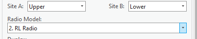

- Frequency Plan: FP 10MHz 8 Carriers

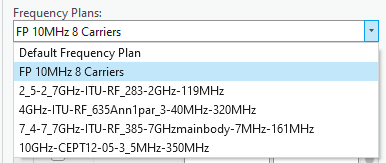

- Carriers: 1 and 3 (1’ and 3’ will be automatically assigned).

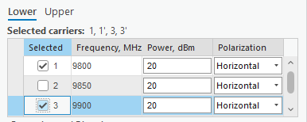

- Go to Antenna section and change antenna to Antenna 10MHz

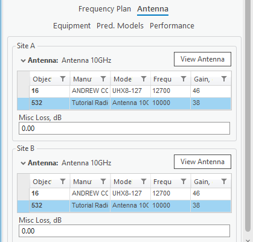

Press Save Changes button.

Do not close the dialog, create new links and define parameters:

- Between D1 and E2

  - Name: MW002

  - SiteA: Lower

> 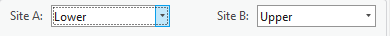

- Carriers: 2 and 4

> 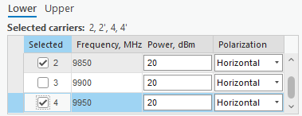

- Leave other parameters as it is.

Press Save Changes

- Between E6 and M77

  - Name: MW003

  - SiteA: Lower

> 

- Carriers: 1 and 4

> 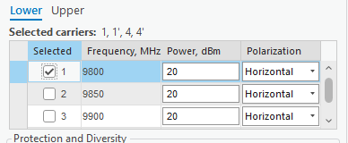

- Leave other parameters as it is.

Press Save Changes

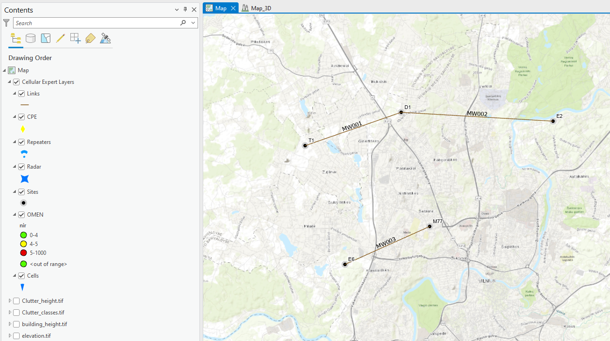

# RL Predictions

The predictions are working between selected links and provides all necessary information about power budget, interference or availability.

Select all links on the map and open Link Prediction tool. Before launching the predictions, enable Calculate Interference option.

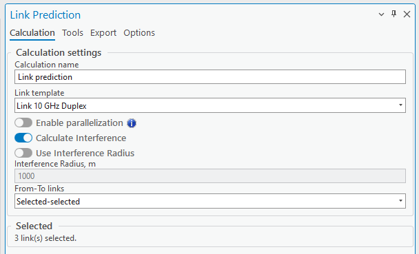

Press Run button and wait will prediction are completed and results loaded into your project.

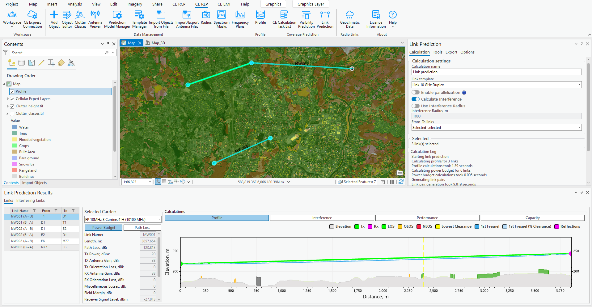

The primary results are Power Budget and Profile between Tx and Rx. On the left, select another link and results will be updated accordingly.

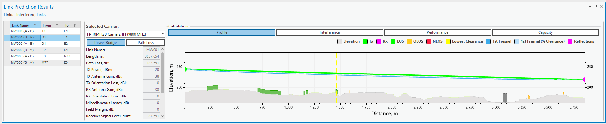

Selected Link can have several carriers, to preview the results expand Carrier option.

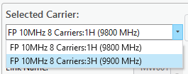

Click on Interference tab to display interfering links and interfered links information.

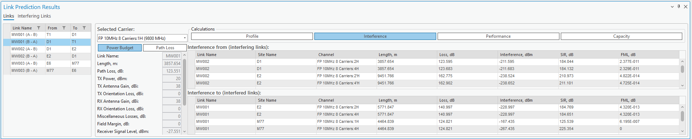

Total Interference is shown in Power Budget section.

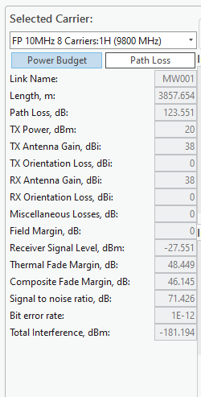

Interference link predictions can be previewed too. Click on Interfering Link in top left corner and it will display selected interfering link Power Budget, Path Loss and draw a line on the map.

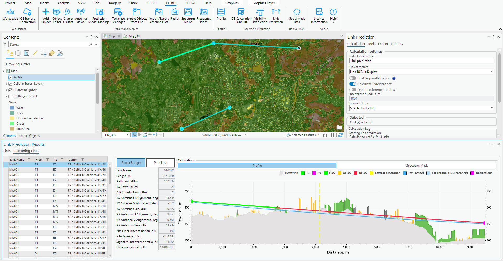

Go back to Links section, sekect MW003 from M77 to E6.

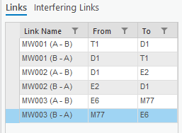

It has carrier 1’ where interference comes from MW001 Site T1:

- Interference, dBm: -181.6 dBm

- FML, dB: 2.36E 10-8

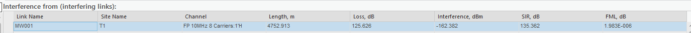

Close Link Prediction results, select MW001 link on the map and open Object Editor. Double click on the link.

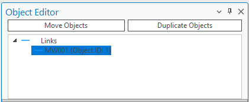

Find Frequency Plan table, select Upper and change carrier 1’ polarization to Vertical.

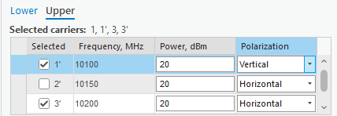

Save Changes.

Select all links on the map, open Link Prediction tool again and run predictions.

After predictions are done, open MW003 (B-A) interference predictions and preview how Interference From is changed for MW001 link, Site S1.
