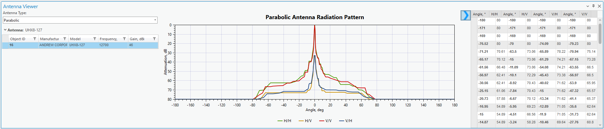
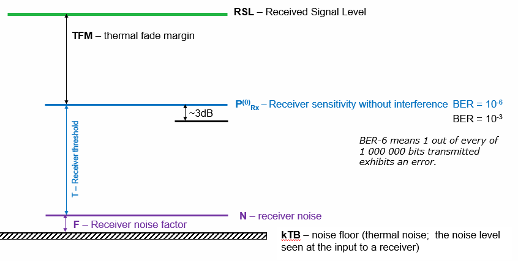
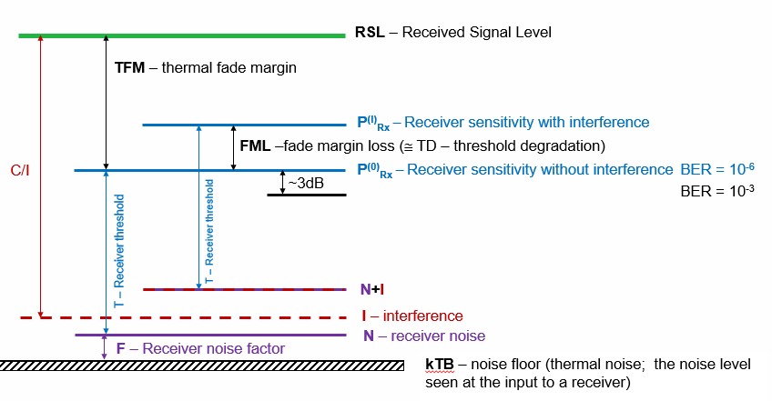
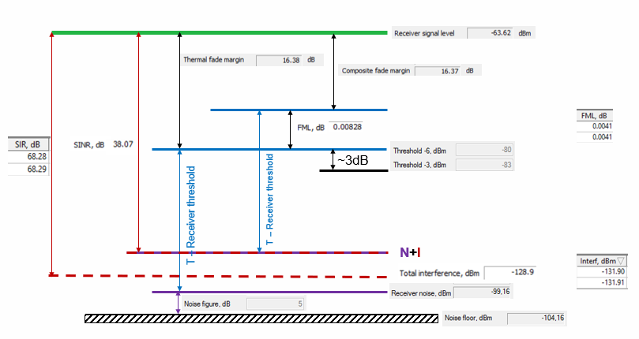
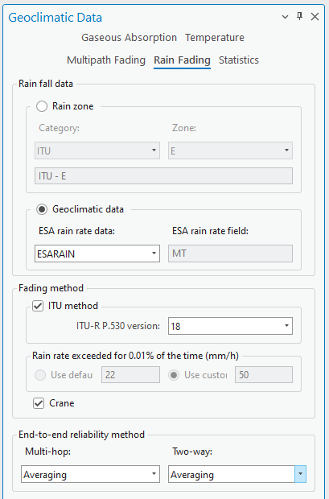
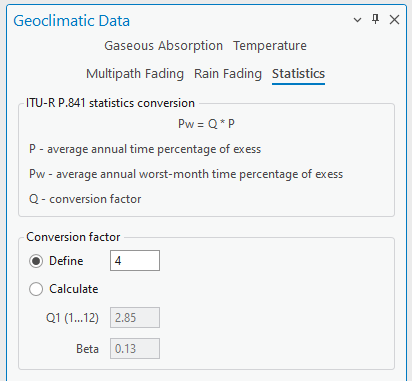
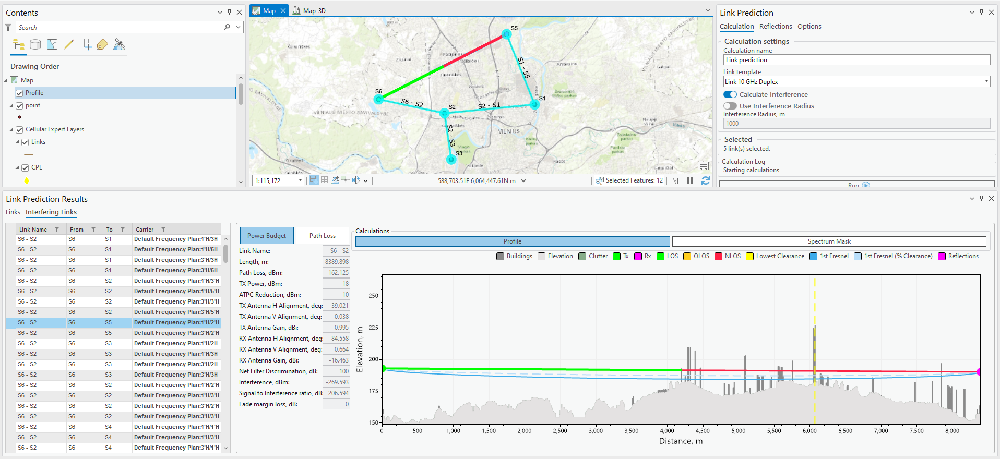

# 07. RL Introduction

> **Version:** CE Pro v4.9

CE Pro includes a full **Radio Link (RL) / Microwave planning** module for fixed point-to-point links. It covers power budget calculation, interference analysis, and geoclimatic availability.

## Equipment

Before planning links, set up the equipment library:

- **Antennas → Parabolic**
- **Radio Models**
- **Frequency Plans**
- **Spectrum Mask**

### Antennas

The **Antenna Viewer** shows the parabolic antenna radiation pattern (H/H, H/V, V/V, V/H polarisation planes) alongside the antenna table (manufacturer, model, frequency, gain):

### Radio Models

The **Radios** manager defines equipment specs across three tabs: general radio parameters (model, manufacturer, capacity, frequency range, bandwidth, bit rate), receiver/transmitter parameters (BER thresholds, noise figure, power), and adaptive modulation (per-modulation sensitivity, SNR, throughput):

### Frequency Plans

Define channel plans — low/center/high frequency, carrier spacing, duplex spacing, and the resulting carrier list:

### Spectrum Mask

Defines out-of-band emission attenuation vs. frequency offset, used for interference checks between links:

## Transmission Network

A transmission (microwave) network breaks down into three parts: **Transmitter → Cable → Antenna**, **radio wave propagation** through the environment, and **Antenna → Cable → Receiver**:

A transmission network in CE Pro is a collection of microwave links connecting sites, drawn on the map between site objects:

## Microwave Link Planning

Each link provides the following analysis:

- Power budget
- Path loss
- Profile graphical view
- Interference From
- Interference To

The **Link Prediction** panel combines the map view, calculation settings, and results — including the path/elevation profile chart and the Interference From / Interference To tables:

### Power Budget

The power budget diagram plots the key levels for a link, from the noise floor up to the received signal level:

- **kTB** — noise floor (thermal noise level at the receiver input)
- **F** — receiver noise factor
- **N** — receiver noise
- **T** — receiver threshold
- **P⁽⁰⁾ᵣₓ** — receiver sensitivity without interference (at a given BER, e.g. BER 10⁻⁶ or 10⁻³ — a BER of 10⁻⁶ means 1 out of every 1,000,000 bits transmitted has an error)
- **TFM** — thermal fade margin
- **RSL** — Received Signal Level

When interference is present, the diagram adds:

- **I** — interference
- **N+I** — noise plus interference
- **P⁽ᴵ⁾ᵣₓ** — receiver sensitivity with interference
- **FML** — fade margin loss (≈ threshold degradation, TD)
- **C/I** — carrier-to-interference ratio

The same diagram populated with calculated values from a real link (Receiver Signal Level, Thermal/Composite Fade Margin, SIR, SINR, total interference, noise floor):

### Geoclimatic Data

CE Pro uses geoclimatic data across several panels — **Gaseous Absorption**, **Temperature**, **Multipath Fading** and **Rain Fading** (per **ITU-R P.530**), and **Statistics** (ITU-R P.841 worst-month-to-annual conversion):

### Interfering Links

For each link, CE Pro also shows:

- Interfering link on the map
- Power budget
- Path loss
- Profile graphical view
- Spectrum mask overlap

**Exercise:** `C:\CE_Course\0. Descriptions\7. RL Introduction.pdf`

**Contact:** info@cellular-expert.com | +370 5 2150575 | www.cellular-expert.com
