# 00. Data types

Introduction: Data types

www.cellular-expert.com
Data Types

Data can be:
1. Vector
     •   Points
     •   Lines
     •   Polygons
2. Raster
     •   GeoTIFF
3. Tabular

                    2
Modelling Outdoor coverage

The CE tools make use o
---
 three distinct GIS data layers to obtain high
precision modelling o
---
 radio wave propagation losses:
1. Digital Terrain Model (DTM), also known as Digital Elevation
   Model (DEM), which describes Earth sur
---
ace, i.e., path terrain
   pro
---
ile in terms o
---
 ground elevation above uni
---
orm sea level.
2. Obstacles layer, delineating buildings and other such objects
   above Earth sur
---
ace that may be considered to be principal
   impediments 
---
or radio wave propagation.
3. Clutter layer, delineating natural occurring or human cultivated
   ground cover that may be partially penetrable by radio waves,
   such as natural vegetation (e.g., 
---
orests, trees, bushes) or various
   crops, gardens, parks, etc.
                                Di
---

---
raction           Free Space Loss

                                                     Di
---

---
raction
                                                                        Hobstacles
                           Hclutter                                                  DSM
   Clutter losses

  UE
                                                                                       DTM

                                                                                             3
Raster Type Input: Elevation

•   Digital terrain model (DTM)
    • Represents Earth’s ground/water level above sea level
    • GeoTIFF raster 
---
ormat
    • Height values in meters
    • Coordinate system – projected
    • Resolution (cell size) – centimeter level
    • Raster name: elevation.ti
---

                                                              4
Raster Type Input: Clutter height

•   Clutter height
     • Represents objects height above elevation raster.
     • GeoTIFF raster 
---
ormat
     • Height values in meters
     • Coordinate system – projected
     • Resolution (cell size) – centimeter level
     • Raster name: clutterHeight.ti
---

                                                           5
DTM vs. Sur
---
ace

          Tx
                                  Visible
                                         Rx

                  Visible

                            Rx
                                               Sur
---
ace grid
          Tx

                                               Obstacles grid
                  Visible        Not visible
                       Rx               Rx
                                               Elevation grid

                                                                6
Clutter classes

•   Clutter classes
     • Represents land use classes.
     • GeoTIFF raster 
---
ormat
     • Coordinate system – projected
     • Resolution (cell size) – centimeter level
     • Raster name: clutterClasses.ti
---

                                                   7
Clutter types
 Corine Land Cover

                     8
Raster 
---
rom vector data

Following should be de
---
ined: input layer,
output raster cell size, data 
---
ield that will be
converted to grid, output raster 
---
ile name.
Note: i
---
 some 
---
eatures in input layer are selected,
only selected ones will be converted.

                                                      9
Environment Settings

                       10
Raster Calculator

                    11
Model Builder
Automate your GIS tasks

                          12
Questions?

www.cellular-expert.com

## Slide Images

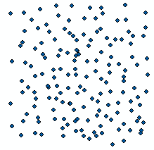

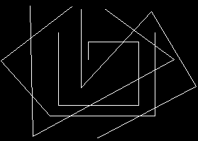

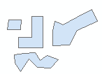

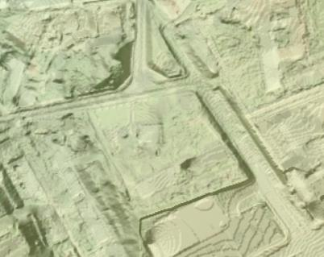

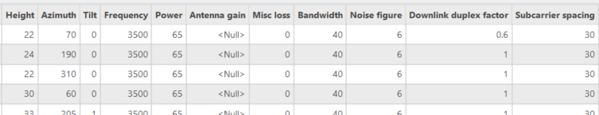

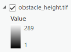

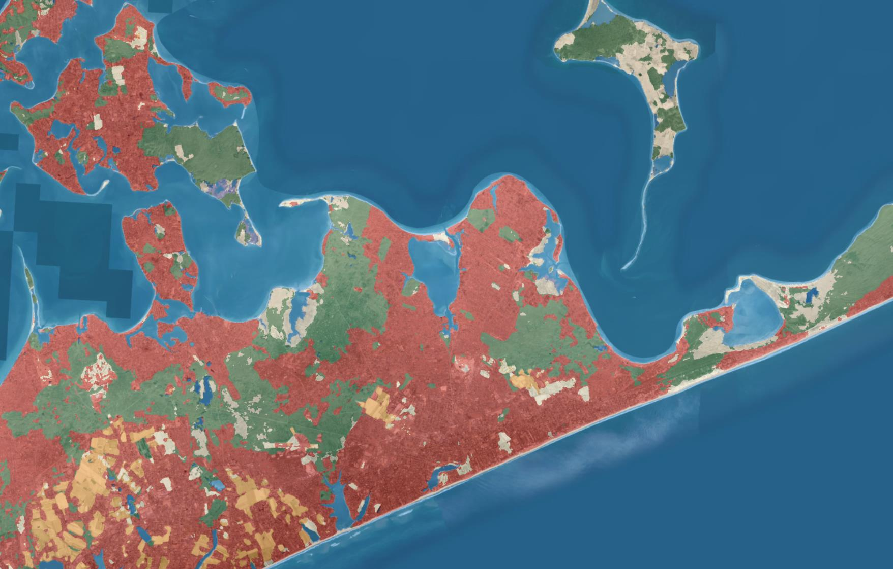

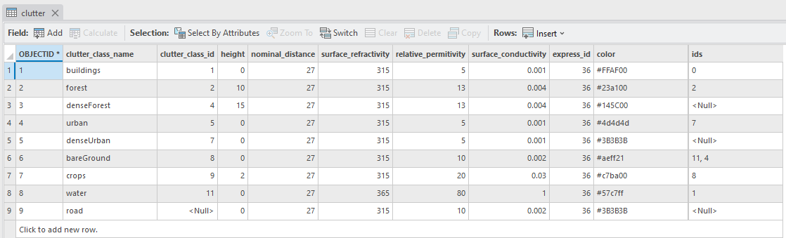

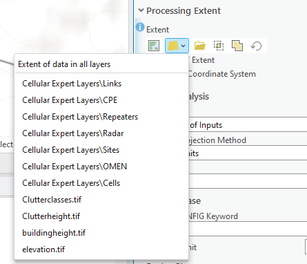

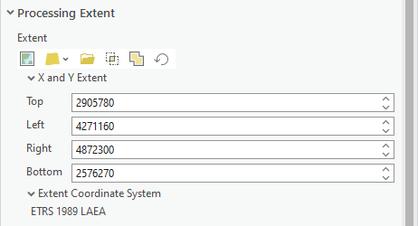

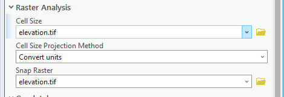

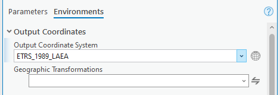

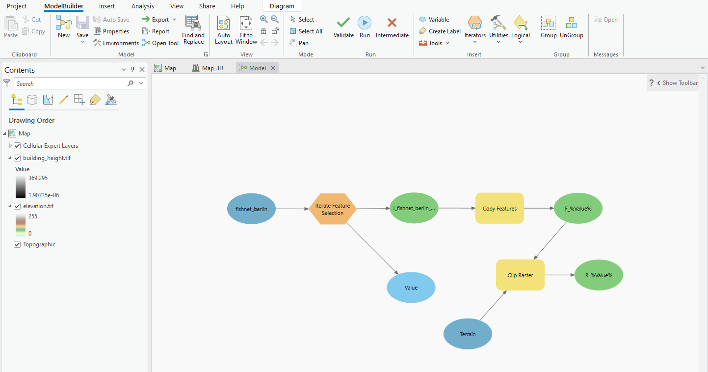

