# 000. Architecture

Introduction: CE Structure

www.cellular-expert.com
CE Products and Solutions

                        CE Desktop                                       CE Express
                      For ArcGIS Pro                                For ArcGIS Enterprise

         • Desktop, Single Use Radio Planning system       • Web-based Radio Planning system
         • Wireless planning tools, together with          • Server-based, Multi User system
           ArcGIS Pro 
---
unctionality                        • Includes CE Inventory3D
         • Can be used as a client o
---
 CE Express system    • Dashboard o
---
 Network Coverage Statistics

                                             CE Customized solutions

                                         ArcGIS            CE COTS
CE Pro

         3
Cellular Expert 
---
or ArcGIS Pro Architecture

       Cellular Expert 
---
or ArcGIS Pro
                    RCP | RLP | EMF

                              Basic or higher license
  ArcGIS Pro 3.1 and
        above
                           Additional extensions are not
                                      required

   Local Database         All 
---
iles are saved in local disk

                                                              4
Cellular Expert 
---
or ArcGIS Pro
License Structure

• RCP – Radio Coverage Prediction

• RLP – Radio Link Prediction

• EMF – Electromagnetic Field

                                    5
Geospatial In
---
ormation

✓   Field measurements
✓   Network coverage
✓   Network data
✓   Demography
✓   Land cover / use
✓   Obstacles
✓   Elevation
✓   Sur
---
ace

                         6
Project 
---
iles

Project > Save Project/Save Project As

                                         7
Cellular Expert Project Structure

•   Predictions
•   Results
•   SystemFiles
•   Temp
•   VolatileResults
•   VolatileTemp
•   Workspace.gdb

                                    8
Workspace database 
---
iles

                           9
Environment

• Geographic data
• Cellular Expert Workspace
• Results

                              10
Cellular Expert Workspace

                            11
Inside Workspace

➢ Network Data
➢ Equipment Data
➢ Modelling Settings

                       12
Network Data Structure

                                                  RF prediction does not require Site
                     Cell – logical               object. Cells can be created
                     in
---
ormation                  without Site object.
     Cells           about sector:                Cell still has SiteID value, which
                     a set o
---
 channels            can be de
---
ine in the attributes.
                                                  SiteID is used 
---
or Carrier
                                                  Aggregation.

                                                  Site and Cell is connected through
                     Site – location point with   SiteID value.
                     unique identi
---
ier:
    Site             Base station                 SiteID must be Integer.
                                                  Site name is de
---
ined 
---
or Site object.

             Cells

                                                                                          13
Cell

       ➢ 800 MHz
       ➢ 1800 MHz
       ➢ 2100 MHz

                    14
Site

       15
Antenna

          16
     CE Path Loss models (10kHz - 350 GHz)
1.   CEC ITU-R Model (100MHz – 6GHz) is a combination model intended 
---
or use in a variety o
---
 di
---

---
erent radiocommunication systems which is derived explicitly
     
---
rom ITU-R path loss modelling methods as 
---
ollows:
       a. Receive antenna in LOS condition – path loss calculated as FSL based on Recommendation ITU-R P.525 (re
---
 URL);
       b. Receive antenna in OLOS condition – total path loss modelled as a combination o
---
 basic FSL calculated based on Recommendation ITU-R P.525 (re
---

           URL) and clutter loss calculated based on Recommendation ITU-R P.2108 (re
---
 URL);
       c. Receive antenna in NLOS condition – path loss as a combination o
---
 basic FSL calculated based on Recommendation ITU-R P.525 (re
---
 URL), additional
           losses due to di
---

---
raction calculated based on Recommendation ITU-R P.526 (re
---
 URL) and the clutter losses calculated based on Rec. ITU-R P.2108
           (re
---
 URL).
2.   ITU-R P.452 Model (6GHz – 50GHz) is provided as a universally applicable model with very wide 
---
requency range 
---
rom 0.1-50 GHz. Its implementation is
     based on the methodology described in the Recommendation ITU-R P.452 (re
---
 URL). This model does not provide 
---
or de
---
inition o
---
 OLOS visibility condition;
     instead it considers clutter as part o
---
 general obstacles category and accordingly distinguishes only two radio visibility cases:
       a. Receive antenna in LOS condition – path loss modelled based on FSL principle;
       b. Receive antenna in NLOS condition – total path loss modelled using a combination o
---
 basic transmission losses and losses due to di
---

---
raction.
3.   LOS ITU-R P.525 Model (6GHz – 100GHz) is the FSL path loss calculated based on method in Recommendation ITU-R P.525 (re
---
 URL). As such it could be
     used 
---
or modelling o
---
 radio links where LOS is considered a necessary condition, e.g., 
---
or Fixed (Point-to-Point) Links or Mobile Systems in mmWave bands.
4.   UniMacro Model (400MHz – 3GHz) is the CE’s proprietary combination model developed over the years o
---
 practical experience with the operational planning
     o
---
 cellular mobile networks in the 
---
requency ranges 
---
rom 400-2600 MHz. It had been 
---
ine tuned to produce coverage predictions that are most closely aligned
     with what could be expected to be experienced by the actual mobile network users in the 
---
ield. The model will model di
---

---
erent path losses depending on radio
     visibility conditions as 
---
ollows:
       a. Receive antenna in LOS condition – path loss modelled based on FSL principle;
       b. Receive antenna in OLOS condition – path loss modelled using Extended Hata (Open Area) model with additional clutter loss calculated based on
            Recommendation ITU-R P.2108 (re
---
 URL);
       c. Receive antenna in NLOS condition – path loss modelled using Extended Hata model with additional losses due to di
---

---
raction calculated based on
            Recommendation ITU-R P.526 (re
---
 URL) as well as clutter losses based on Rec. ITU-R P.2108 (re
---
 URL).
5.   ITU-R P.368 Model (10kHz – 30MHz)

                                                                                                                                                         17
CE prediction models

                       18
Other

        19

## Slide Images

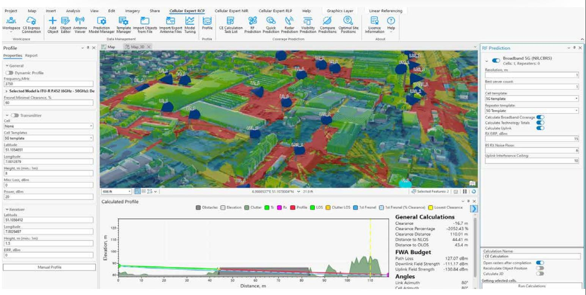

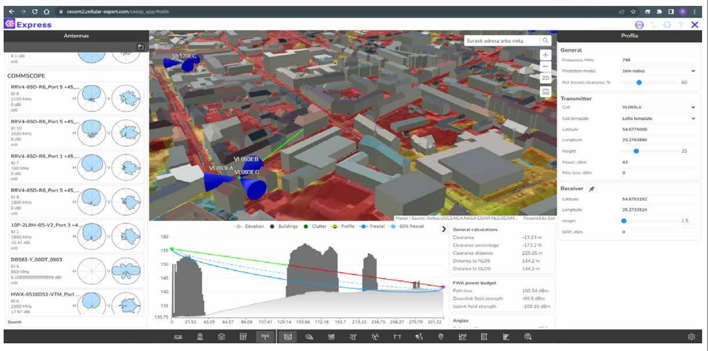

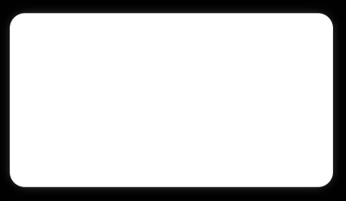

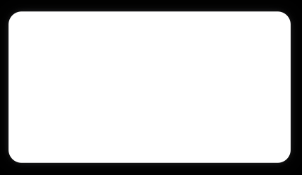

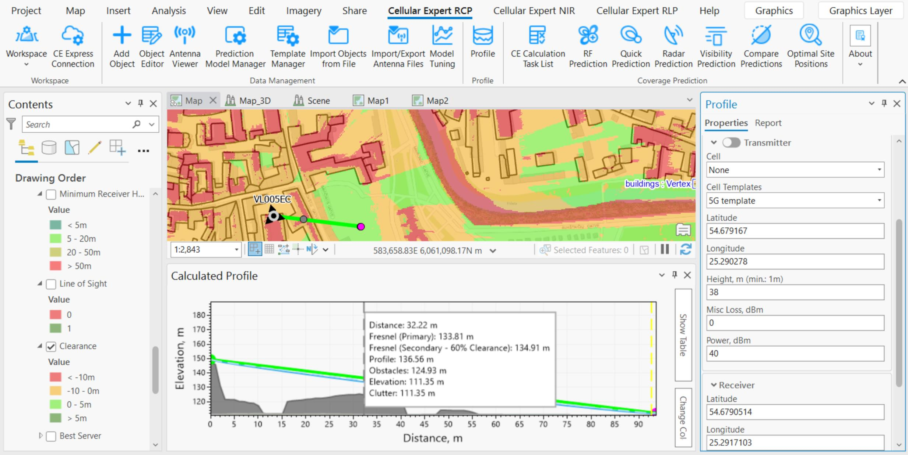

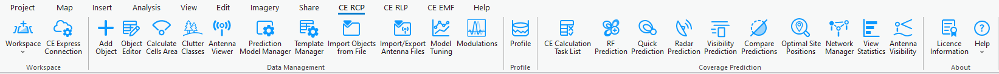

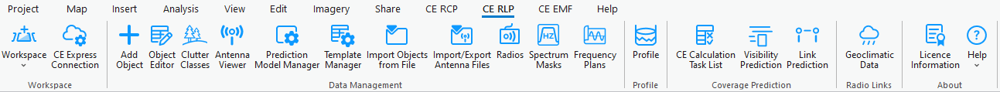

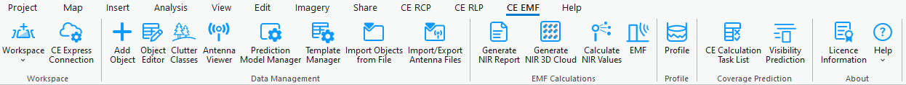

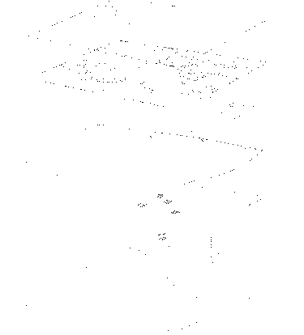

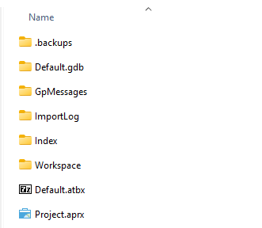

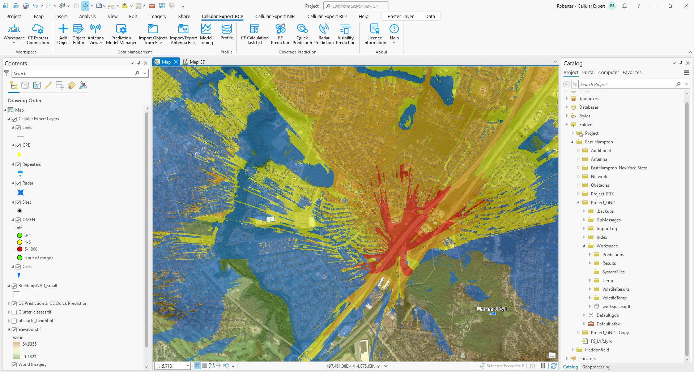

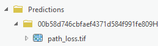

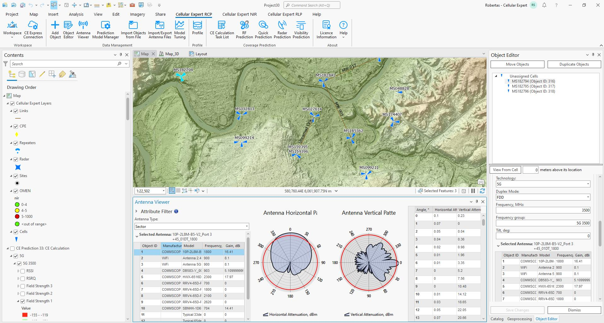

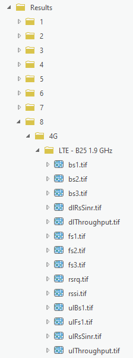

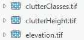

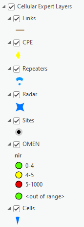

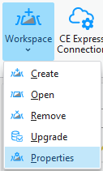

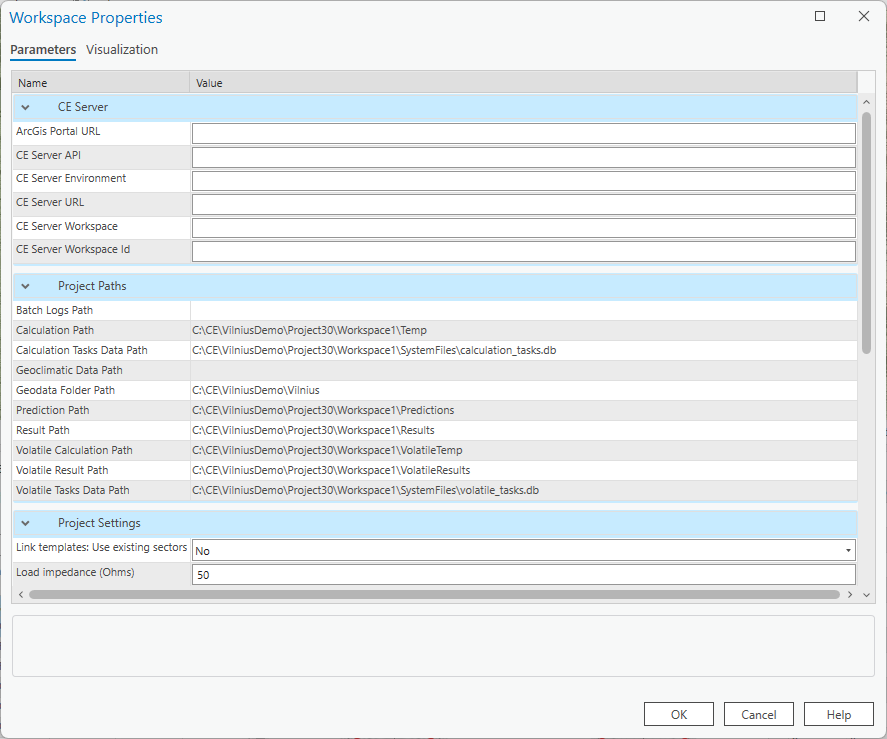

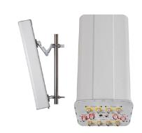

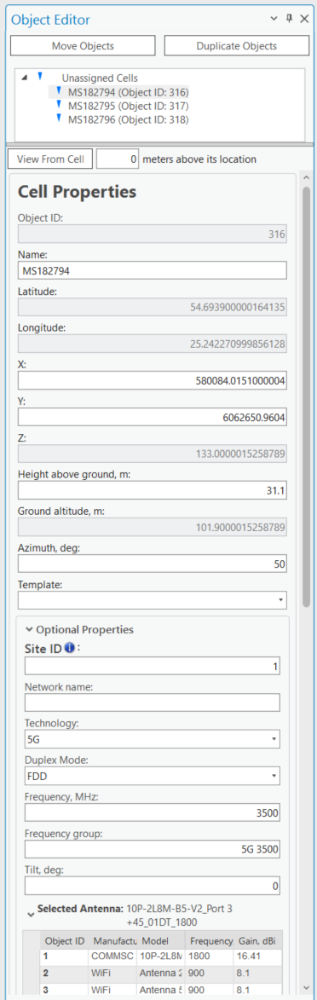

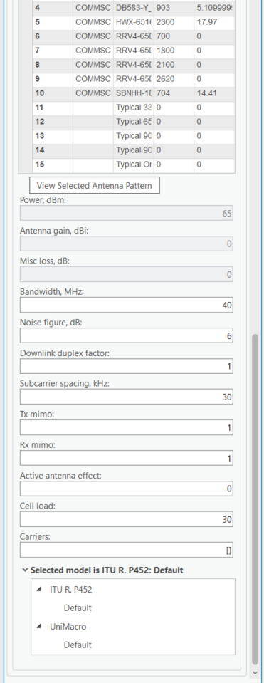

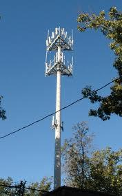

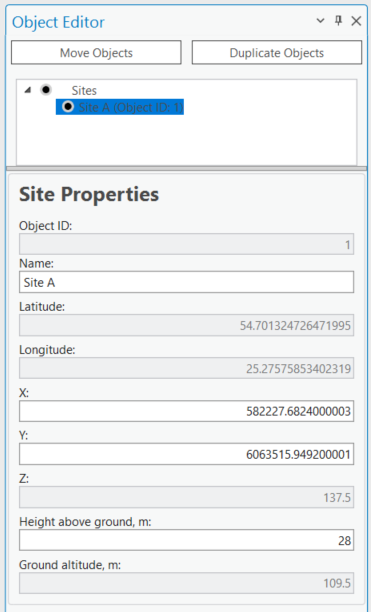

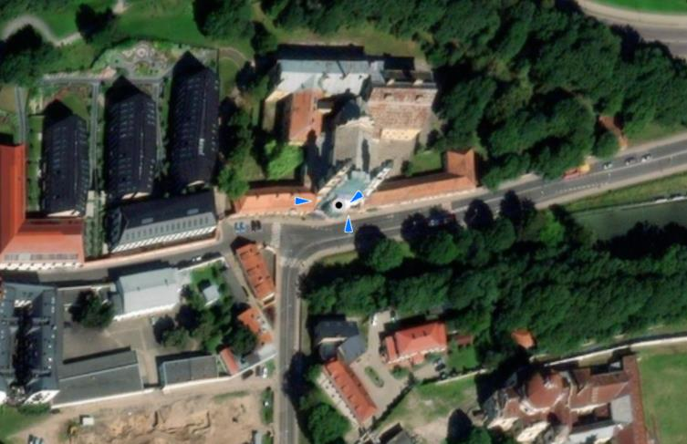

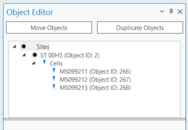

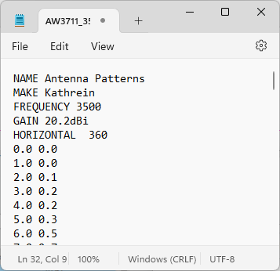

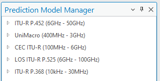

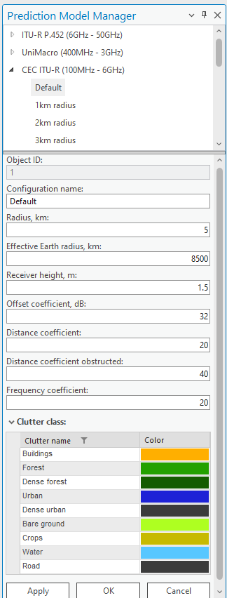

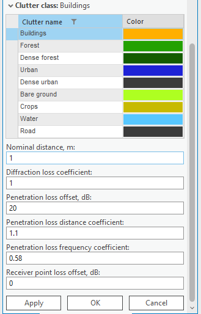

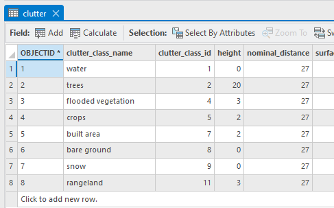

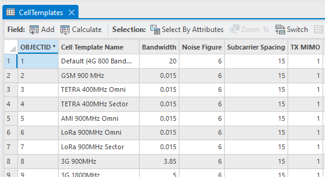

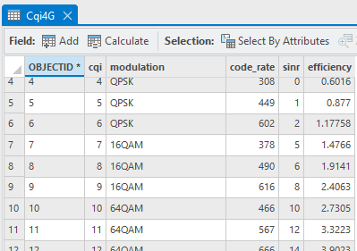

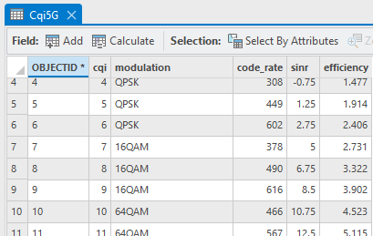

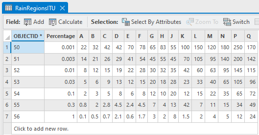

