# 1. Creating Workspace

1. Creating workspace

www.cellular-expert.com
Cellular Expert 
---
or ArcGIS Pro project

                                         2
CE Tools

• Workspace is not added

• Workspace is added

• Workspace is added, but Geodata is missing

                                               3
Create Workspace

•   New workspace path
•   Geodata 
---
older path
•   Projected coordinate system
•   Also create Local Scene

                                  4
Cellular Expert Project Structure

•   Predictions
•   Results
•   SystemFiles
•   Temp
•   VolatileResults
•   VolatileTemp
•   Workspace.gdb

                                    5
Cellular Expert Dataset

•   Cell
•   Site
•   Radar
•   Repeater
•   CPE
•   OMEN
•   Link

                          6
Change project’s path

• Geodata
• Calculation paths

                        7
Project Settings and Rounding

                                8
 Workspace Upgrade

• Automatically tracking
  database structure
• Workspace > Upgrade
• Provides in
---
ormation
  about new tables and
  
---
ields
• Upgrade Database

                           9
Exercise

Description: C:\CE_Course\0. Descriptions

Name: 1. Create workspace.pd
---

                                            10
Thank you!
Tel.: +370 5 2150575
Email: in
---
o@cellular-expert.com

S.Konarskio g. 28A LT-03127 Vilnius
Lithuania

www.cellular-expert.com

## Slide Images

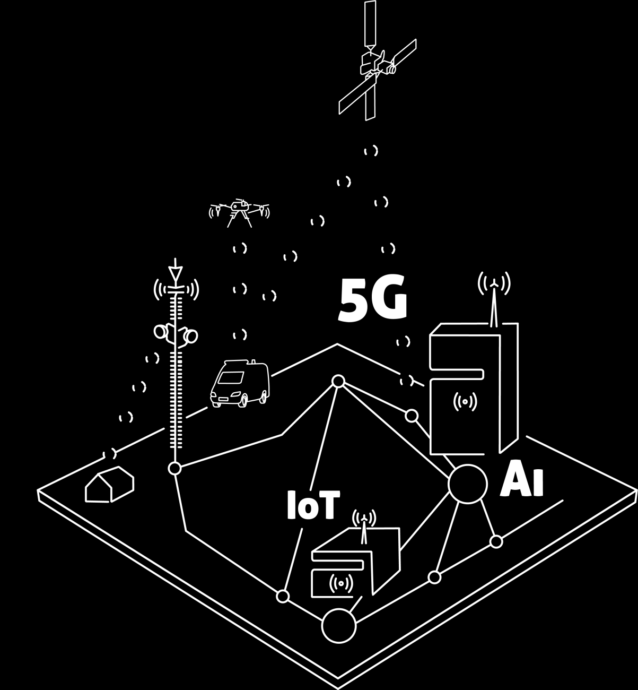

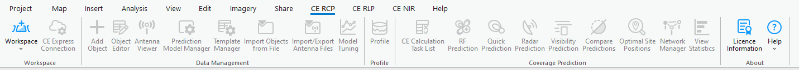

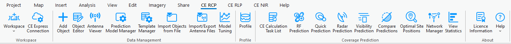

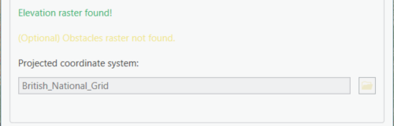

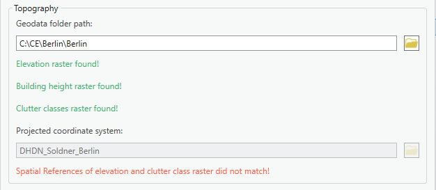

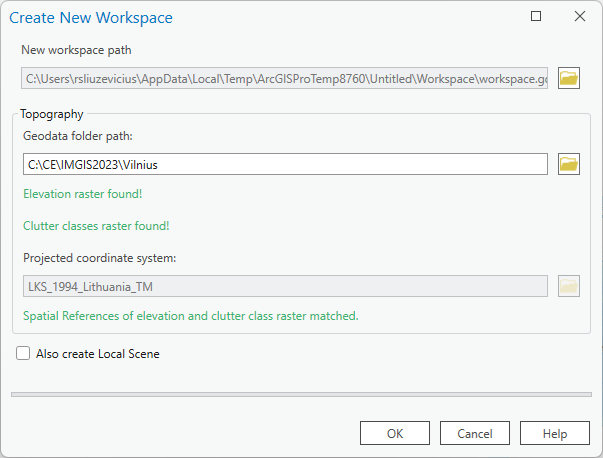

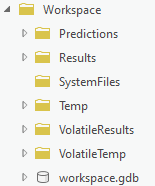

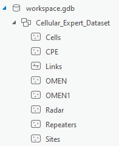

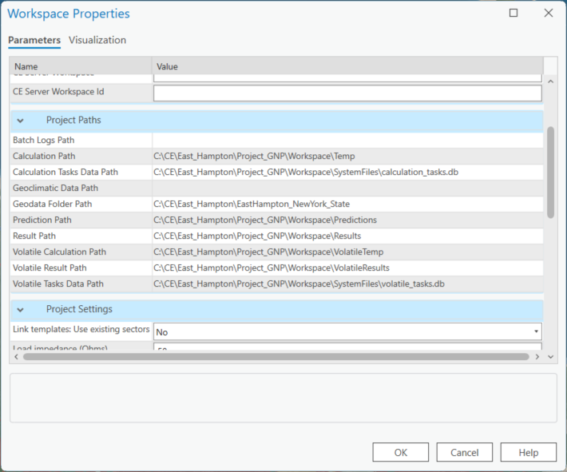

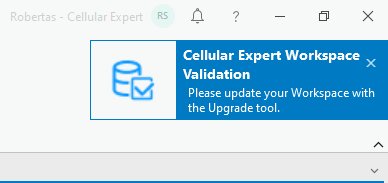

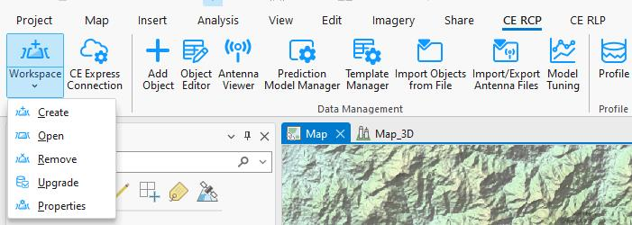

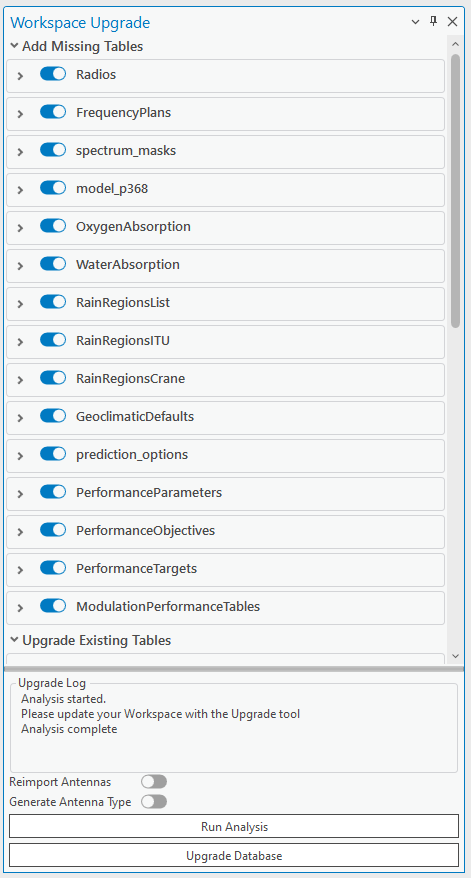

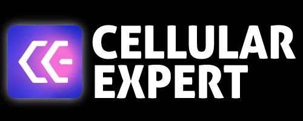

