# 2. Line of Sight (Profile)

2. Line o
---
 Sight (Pro
---
ile)

www.cellular-expert.com
Modelling Outdoor coverage

The CE tools make use o
---
 three distinct GIS data layers to obtain high
precision modelling o
---
 radio wave propagation losses:
1. Digital Terrain Model (DTM), also known as Digital Elevation
   Model (DEM), which describes Earth sur
---
ace, i.e., path terrain
   pro
---
ile in terms o
---
 ground elevation above uni
---
orm sea level.
2. Obstacles layer, delineating buildings and other such objects
   above Earth sur
---
ace that may be considered to be principal
   impediments 
---
or radio wave propagation.
3. Clutter layer, delineating natural occurring or human cultivated
   ground cover that may be partially penetrable by radio waves,
   such as natural vegetation (e.g., 
---
orests, trees, bushes) or various
   crops, gardens, parks, etc.
                                Di
---

---
raction           Free Space Loss

                                                     Di
---

---
raction
                                                                        Hobstacles
                           Hclutter                                                  DSM
   Clutter losses

  UE
                                                                                       DTM

                                                                                             2
Point to point (Pro
---
ile) input

 • Geodata
      • Elevation
      • Buildings
      • Clutter
 •   Frequency
 •   Fresnel zone (%)
 •   Earth radius
 •   Transmitter
      • Height
      • Power
 •   Receiver
      • Height
      • Power

                                 3
Pro
---
ile calculations
•   General
    •   Clearance
    •   Clearance Percentage
    •   Clearance Distance
    •   Distance to NLOS
    •   Distance to OLOS
•   Power Budget
    •   Downlink FS
    •   Uplink FS
    •   FWA downlink RSL
    •   FWA uplink RSL
•   Path Loss
    •   Total Path Loss
         •    Model Loss
         •    Di
---

---
raction Loss
         •    Penetration Loss
         •    Receiver Clutter Loss
         •    Clutter Loss
•   Angles

                                      4
Dynamic pro
---
ile

• Fix transmitter
• Dynamic option

                    5
Pro
---
ile symbology

• De
---
ine colors 
---
or each object in pro
---
ile

                                             6
Pro
---
ile 3D

             7
Pro
---
ile 3D

             8
Visibility prediction input

 • Geodata
     • Elevation
     • Obstacle
 •   Frequency
 •   Calculation radius
 •   Earth radius
 •   Transmitter
 •   Receiver (height)

                              9
Visibility Results

 • Line o
---
 Sight
 • Required height 
---
or LoS
 • Clearance

                             10
Visibility: Line o
---
 Sight

 Possible values:
 • 0
 • 1

                            11
Visibility: Clearance

   • Clearance – clearance o
---
 visibility line between Tx to Rx as a distance in
     meters

Height, m       Clearance = 6.5 m

 75
 70
 65
 60
 55

            0   100       200       300   400 Distance, m

                                                                                  12
Visibility: Minimum Receiver Height

• Receiver height – calculate required receiver heights to have a visibility

                                                                               13
Visibility: Line o
---
 Sight sum meter topo data

                                                14
Sur
---
ace vs Eelevation+Obstacles
      Tx
                               Visible
                                      Rx

               Visible

                         Rx
                                            Sur
---
ace grid
      Tx

                                            Obstacles grid
               Visible        Not visible
                    Rx               Rx
                                            Elevation grid

                                                             15
Sur
---
ace

          16
DTM + Obstacles (Buildings/Vegetation)

                                         17
DTM + Buildings + Vegetation

                               18
Exercise

Description: C:\CE_Course\0. Descriptions

Name: 2. Line o
---
 Sight (Pro
---
ile).pd
---

                                            19
Thank you!
Tel.: +370 5 2150575
Email: in
---
o@cellular-expert.com

S.Konarskio g. 28A LT-03127 Vilnius
Lithuania

www.cellular-expert.com

## Slide Images

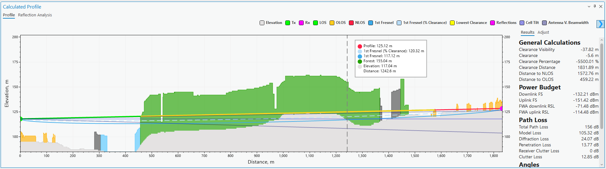

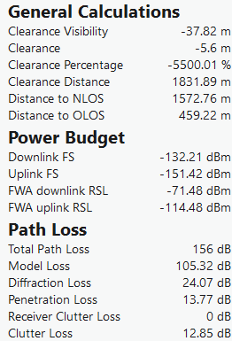

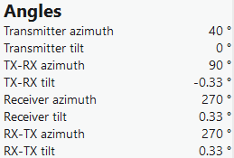

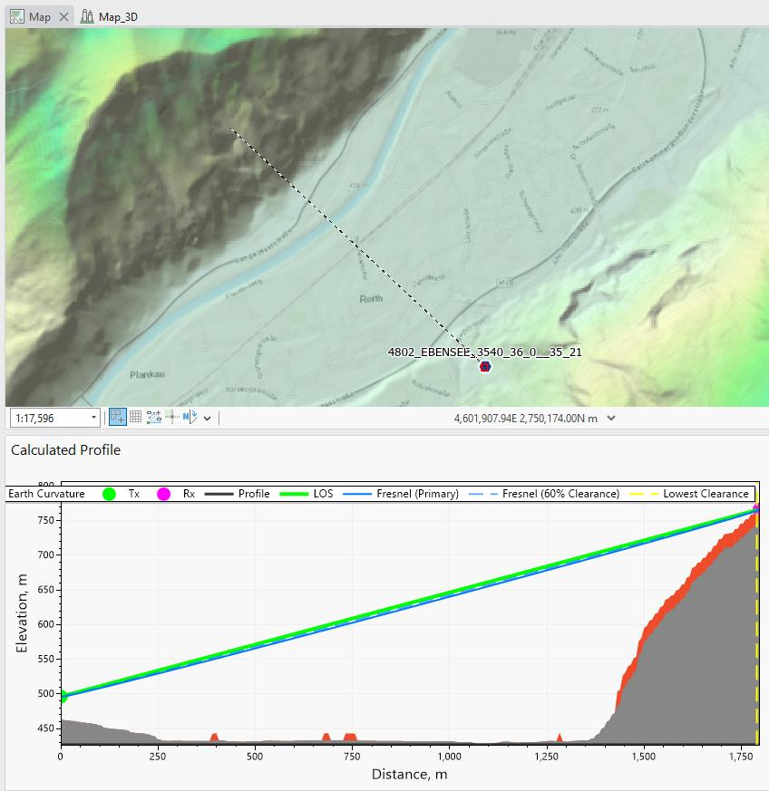

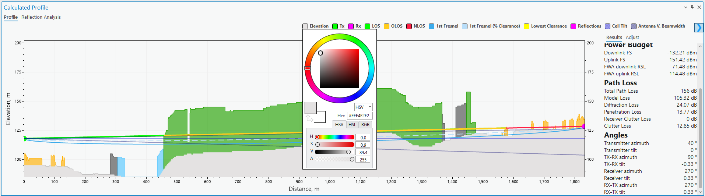

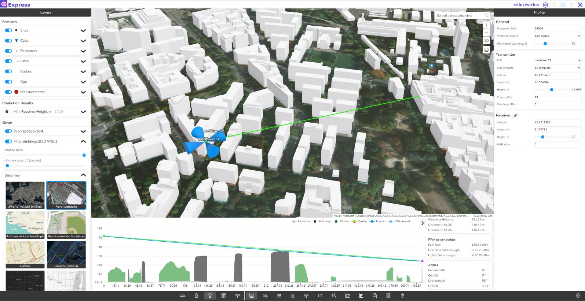

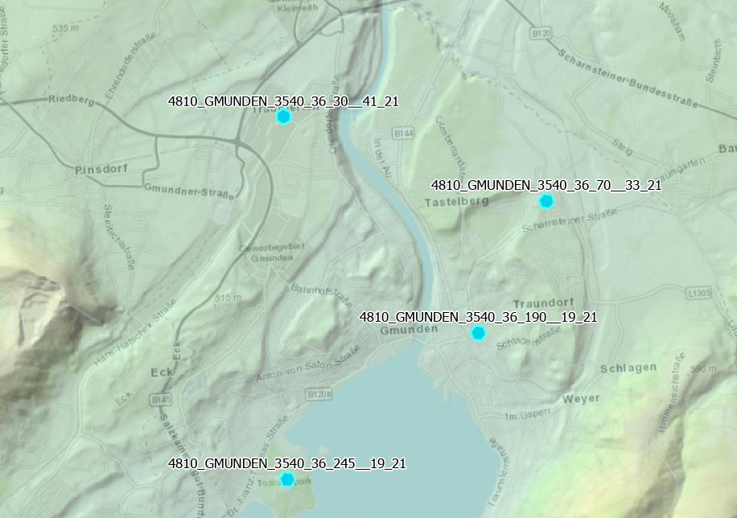

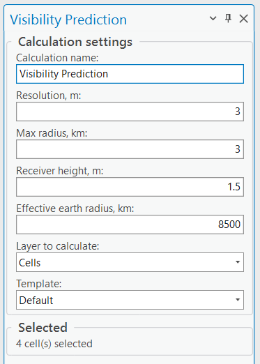

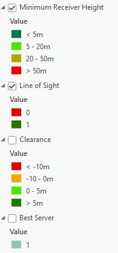

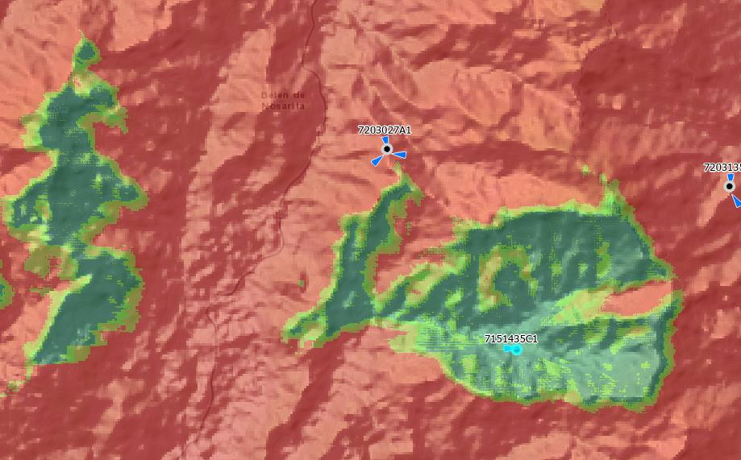

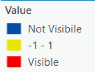

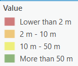

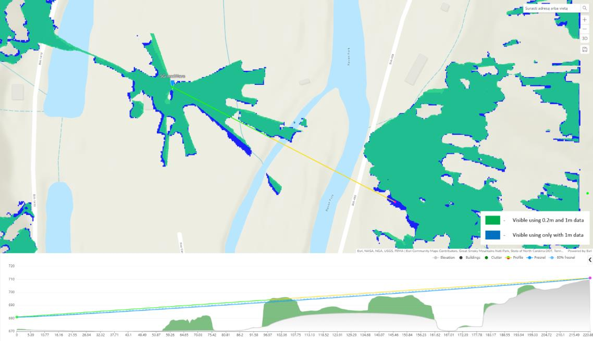

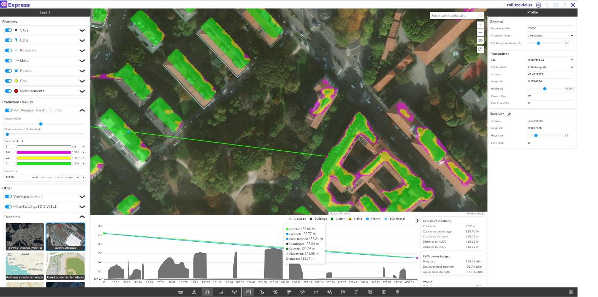

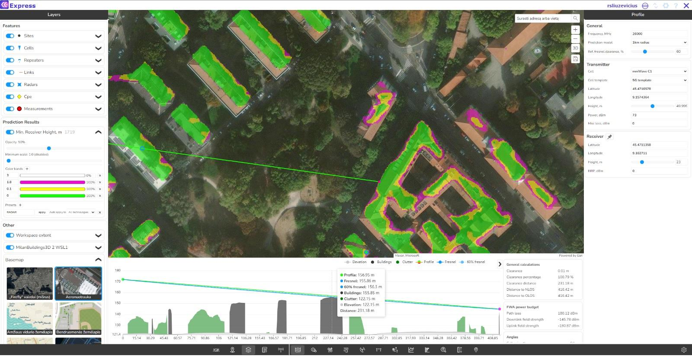

