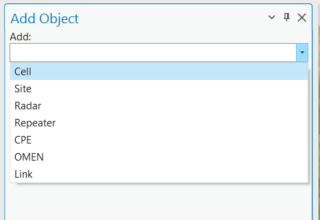
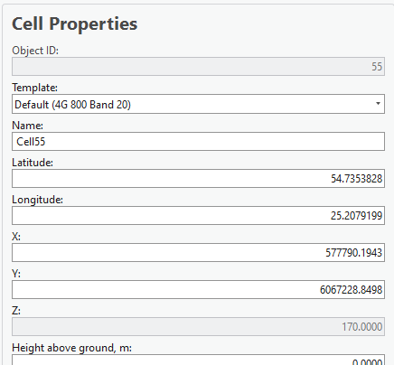
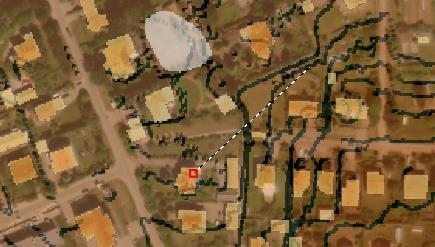
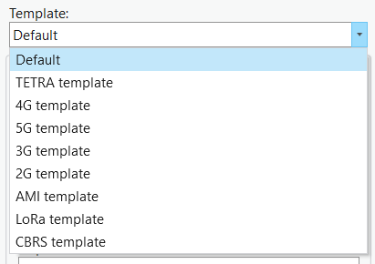
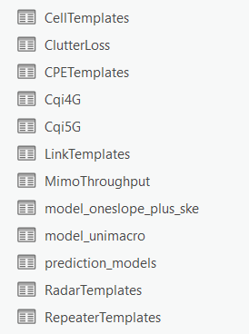

# 3. Creating objects

3. Creating objects

www.cellular-expert.com
Create object

• Import 
---
rom text (done in previous exercise)
• Create manually using Add Object tool:
   •   Cell;
   •   Site;
   •   Repeater;
   •   CPE;
   •   Etc..
• Duplicate existing object or objects in the project
• Move existing object or objects in the project

                                                        2
Steps to create cell

• De
---
ine location
   • Type speci
---
ic coordinates in:
      •   Projected coordinate system – X and Y coordinates;
      •   Geographical coordinate system – Latitude and Longitude
          coordinates
   • Click on the map: coordinates will be 
---
illed
     automatically 
---
rom point de
---
ined on the map.
• De
---
ine direction (azimuth) – this will be
  required i
---
 Cell object coordinates will be taken
  by click on the map.
• De
---
ine name
• Choose Template or 
---
ill parameters manually

                                                                    3
Template

• Automatically 
---
ills the attributes
• Template Manager
• Own table

                                       4
Create Cell

                                                  RF prediction does not require Site
                     Cell – logical               object. Cells can be created
                     in
---
ormation                  without Site object.
     Cells           about sector:                Cell still has SiteID value, which
                     a set o
---
 channels            can be de
---
ine in the attributes.
                                                  SiteID is used 
---
or Carrier
                                                  Aggregation.

                                                  Site and Cell is connected through
                     Site – location point with   SiteID value.
                     unique identi
---
ier:
    Site             Base station                 SiteID must be Integer.
                                                  Site name is de
---
ined 
---
or Site object.

             Cells

                                                                                          5
Object Editor

•   Open Object Editor
•   Select 
---
eatures
•   Double click on object
•   Apply – to save changes
•   Prediction model
•   Antenna

                              6
Move / Duplicate

•   Object Editor
•   Select objects
•   Move / Duplicate
•   Select point / De
---
ine coordinates
•   Save

                                        7
Exercise

Description: C:\CE_Course\0. Descriptions

Name: 3. Creating Objects.pd
---

                                            8
Thank you!
Tel.: +370 5 2150575
Email: in
---
o@cellular-expert.com

S.Konarskio g. 28A LT-03127 Vilnius
Lithuania

www.cellular-expert.com

## Slide Images

