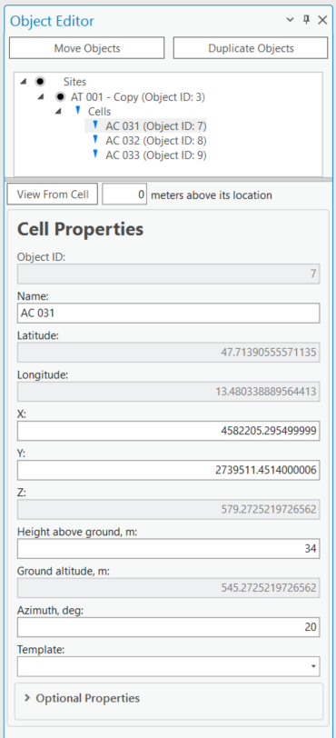
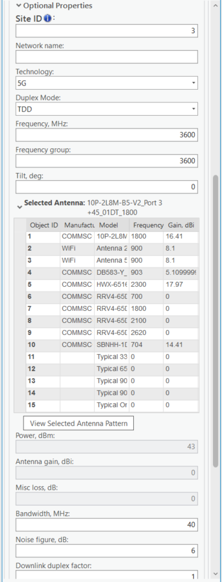
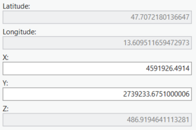
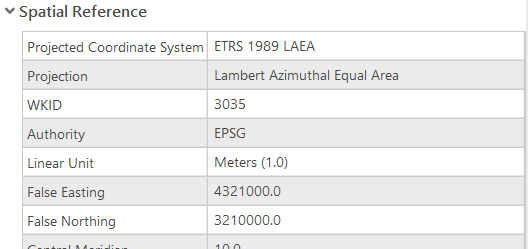
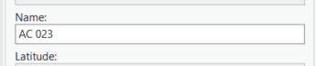
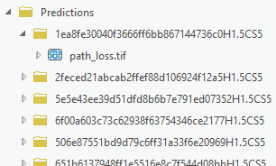

# 4. Cell prediction

4. Cell prediction

www.cellular-expert.com
Cell structure

 • Physical parameters
    •   Coordinates
    •   Height
    •   Azimuth
    •   …
 • Logical parameters
    •   Power
    •   Bandwidth
    •   Frequency
    •   …

                         2
Cell: Coordinates

• Projected coordinate system:
   • X
   • Y
• Geographic coordinate system in meters:
   • Longitude
   • Latitude

• Z – total cell height above sea level.

                                            3
Cell Name

• Unique parameter in the project.
• Best server – the same.

                                     4
General cells parameter
             Value          CE Field        Units        Example                                             Description
 Latitude              latitude             Meters   49.9993        Y point coordinate in Decimal degrees and in WGS 1984 geographical coordinate system.

 Longitude             longitude            Meters   33.6573        X point coordinate in Decimal degrees and in WGS 1984 geographical coordinate system.

 Cell identi
---
ication   cell_name            [text]   5G cell XXYY   Represents cell identi
---
ication, usually name.
 Site identi
---
ication   site_name            [text]   Site 55 ID     Represents site identi
---
ication, usually name.
 Cell height           height               meters   40             Cell height above the ground.
 Cell azimuth          azimuth              degree   50             Cell direction 
---
rom the north, value ranges 
---
rom 0 to 360.
 Mechanical tilt       tilt                 degree   1              Cell mechanical tilt value.
 Frequency             
---
requency            MHz      3500           Frequency value in MHz.
 Power                 power                dBm      40             Based on Workspace parameter, it can be only Cell power, and EIRP will be calculated 
---
rom
                                                                    antenna gain and misc loss. It can represent EIRP value too, i
---
 Workspace parameter Calculate
                                                                    EIRP is de
---
ined to No.
 Antenna Gain          Antenna_gain         dBi      18.2           Gain o
---
 antenna which is assigned 
---
or Cell.
 Misc. Loss            Misc_loss            dB       1              Total Cell loss.
 Bandwidth             bandwidth            MHz      0.015          Cell bandwidth value in MHz. Especially required 
---
or 3G, 4G, and 5G technologies.

 Subcarrier spacing    Subcarrier_spacing   kHz      15             Especially required 
---
or 5G, as 4G uses constant value 15.
 MIMO con
---
iguration    tx_mimo              Number 4                Transmitter MIMO con
---
iguration, possible values 1, 2, 4, 8, 16, 32, 64.
 MIMO con
---
iguration    rx_mimo              Number 4                Receiver MIMO con
---
iguration, possible values 1, 2, 4, 8, 16, 32, 64.
 Cell load             cell_load            Percent 30              Parameter ranges are 
---
rom 0 to 100 percent. Describes how the cell is loaded in real-time. Load is
                                                                    taken 
---
or broadband calculations.

 Technology            technology           Text     2G             Possible values: 2G, 3G, 4G, 5G. Describes cell technology.

 Antenna name          antenna_id           Number 1                Represents Antenna ID value.

                                                                                                                                                                         5
RF Predictions structure

• Predictions
• Results
• Temp

                           6
Exercise

Description: C:\CE_Course\0. Descriptions

Name: 4. Cell Prediction.pd
---

                                            7
Thank you!
Tel.: +370 5 2150575
Email: in
---
o@cellular-expert.com

S.Konarskio g. 28A LT-03127 Vilnius
Lithuania

www.cellular-expert.com

## Slide Images

