# 5. Prediction models

5. Prediction models

www.cellular-expert.com
Path Loss

𝐹𝑖𝑒𝑙𝑑 𝑆𝑡𝑟𝑒𝑛𝑔ℎ𝑡 = 𝐸𝐼𝑅𝑃 − 𝐴𝑛𝑡𝑒𝑛𝑛𝑎𝐴𝑡𝑡𝑒𝑛𝑢𝑎𝑡𝑖𝑜𝑛 -
PathLoss

                                               2
Prediction Models

•   ITU-R P.452 (6GHz to 50GHz)
•   UniMacro (400MHz to 3GHz)
•   CEC ITU-R (100MHz to 6GHz)
•   LOS ITU-R P.525 (6GHz to 100 GHz)
•   ITU-R P.368 (10kHz to 30MHz)

                                        3
     CE Path Loss models (10kHz - 100 GHz)
1.   CEC ITU-R Model (100MHz – 6GHz) is a combination model intended 
---
or use in a variety o
---
 di
---

---
erent radiocommunication systems which is derived explicitly
     
---
rom ITU-R path loss modelling methods as 
---
ollows:
       a. Receive antenna in LOS condition – path loss calculated as FSL based on Recommendation ITU-R P.525 (re
---
 URL);
       b. Receive antenna in OLOS condition – total path loss modelled as a combination o
---
 basic FSL calculated based on Recommendation ITU-R P.525 (re
---

           URL) and clutter loss calculated based on Recommendation ITU-R P.2108 (re
---
 URL);
       c. Receive antenna in NLOS condition – path loss as a combination o
---
 basic FSL calculated based on Recommendation ITU-R P.525 (re
---
 URL), additional
           losses due to di
---

---
raction calculated based on Recommendation ITU-R P.526 (re
---
 URL) and the clutter losses calculated based on Rec. ITU-R P.2108
           (re
---
 URL).
2.   ITU-R P.452 Model (6GHz – 50GHz) is provided as a universally applicable model with very wide 
---
requency range 
---
rom 0.1-50 GHz. Its implementation is
     based on the methodology described in the Recommendation ITU-R P.452 (re
---
 URL). This model does not provide 
---
or de
---
inition o
---
 OLOS visibility condition;
     instead it considers clutter as part o
---
 general obstacles category and accordingly distinguishes only two radio visibility cases:
       a. Receive antenna in LOS condition – path loss modelled based on FSL principle;
       b. Receive antenna in NLOS condition – total path loss modelled using a combination o
---
 basic transmission losses and losses due to di
---

---
raction.
3.   LOS ITU-R P.525 Model (6GHz – 100GHz) is the FSL path loss calculated based on method in Recommendation ITU-R P.525 (re
---
 URL). As such it could be
     used 
---
or modelling o
---
 radio links where LOS is considered a necessary condition, e.g., 
---
or Fixed (Point-to-Point) Links or Mobile Systems in mmWave bands.
4. UniMacro Model (400MHz – 3GHz) is the CE’s proprietary combination model developed over the years o
---
 practical experience with the operational planning
   o
---
 cellular mobile networks in the 
---
requency ranges 
---
rom 400-2600 MHz. It had been 
---
ine tuned to produce coverage predictions that are most closely aligned
   with what could be expected to be experienced by the actual mobile network users in the 
---
ield. The model will model di
---

---
erent path losses depending on radio
   visibility conditions as 
---
ollows:
     a. Receive antenna in LOS condition – path loss modelled based on FSL principle;
     b. Receive antenna in OLOS condition – path loss modelled using Extended Hata (Open Area) model with additional clutter loss calculated based on
          Recommendation ITU-R P.2108 (re
---
 URL);
     c. Receive antenna in NLOS condition – path loss modelled using Extended Hata model with additional losses due to di
---

---
raction calculated based on
          Recommendation ITU-R P.526 (re
---
 URL) as well as clutter losses based on Rec. ITU-R P.2108 (re
---
 URL).
5. ITU-R P.368 (10kHz – 30MHz)

                                                                                                                                                        4
Prediction Models. De
---
ault

                             5
CEC ITU-R (30MHz – 6GHz)

• For 
---
requencies 
---
rom about 30 MHz
  to about 6 GHz.
• Modelling:
          • LOS
          • OLOS
          • NLOS
                        Di
---

---
raction    Free Space Loss

                                      Di
---

---
raction
                                                         Hobstacles
                   Hclutter                                           DSM
 Clutter losses

UE
                                                                        DTM

                                                                              6
Input Data

• Elevation

• Clutter classes*            Geographic data

• Clutter height grid*

• Receiver settings           Network data

• Prediction model settings   Algorithm

* Optional                                      7
Path loss equation

Path loss in dB:
   L = k o
---

---
 + k log D  log(d ) + k log F  log( 
---
 )
O
---

---
set coe
---

---
icient (KO
---

---
 ) - Constant o
---

---
set (dBm). De
---
ault value 32
Distance coe
---

---
icient (KLogD ) - Distance in
---
luence coe
---

---
icient. De
---
ault value 20
Frequency coe
---

---
icient (KLogF ) - Frequency in
---
luence coe
---

---
icient. De
---
ault value 20

                                                                                     8
Path loss equation

Path loss in dB:
   L = k o
---

---
 + k log D  log(d ) + k log F  log( 
---
 )
O
---

---
set coe
---

---
icient (KO
---

---
 ) - Constant o
---

---
set (dBm). De
---
ault value 32
Distance coe
---

---
icient obstructed (KLogD ) - Distance in
---
luence coe
---

---
icient. De
---
ault value 30
Frequency coe
---

---
icient (KLogF ) - Frequency in
---
luence coe
---

---
icient. De
---
ault value 20

                                                                                              9
Clutter

• Di
---

---
raction loss 
---
or solid obstacle:
   • Building clutter class
   • Elevation

• Clutter loss
   • Based on di
---

---
raction calculation
   • P.2108 Clutter Loss

• Penetration loss (Outdoor – Indoor)

• Receiver loss

                                         10
SKE Di
---

---
raction

Rec. ITU-R P.526
Idealized model o
---
 di
---

---
raction over a single obstruction.

                                 

            d1                                    d2
                        h>   0
                                             
                 1                                2

                                                            11
Clutter LOS

P.2108 Clutter Loss Estimation

• Method 1: Additional clutter shadowing
   loss with di
---

---
raction as dominant e
---

---
ect
   (section 3.1)

                                              12
Penetration loss (Outdoor – Indoor)
CE Outdoor to Indoor Path Loss calculation is realised based on method
recommended in 3GPP TR 38.901 (re
---
 URL). This method accounts 
---
or
indoor portion o
---
 the total radio signal propagation path as shown in picture:

                      De
---
inition o
---
 indoor propagation path in 3GPP TR 38.901

  For general purpose modelling o
---
 typical building entry losses, two types o
---
 loss pro
---
iles are assumed:
  • Low-loss BEL Model assumes a wall penetration losses characteristic o
---
 average traditional
     buildings;
  • High-loss BEL Model assumes a wall penetration losses characteristic o
---
 modern thermally
     insulated buildings.
  The corresponding BEL and building penetration losses are calculated as 
---
ollows:

 Where:
 Lglass = 2 + 0.2 
---
          Lconcrete = 5 + 4 
---
     LIIRglass = 23 + 0.3 
---
        
---
 – 
---
requency in GHz.    13
Prediction model manager

• Cellular Expert tab > Prediction Model
  Manager
• De
---
ault can not be deleted and it takes
  parameters 
---
rom it 
---
or new models

                                            14
LOS ITU-R P.542 (6GHz – 50GHz)

• For 
---
requencies 
---
rom about 6 GHz to about 100 GHz

                         Di
---

---
raction    Free Space Loss

                                       Di
---

---
raction
                                                          Hobstacles
                    Hclutter                                           DSM
   Clutter losses

  UE
                                                                         DTM

                                                                               15
Input Data

• Elevation

• Clutter classes*            Geographic data

• Clutter height grid*

• Receiver settings           Network data

• Prediction model settings   Algorithm

* Optional                                      16
Path loss equation

Path loss in dB:
   L = k o
---

---
 + k log D  log(d ) + k log F  log( 
---
 )
O
---

---
set coe
---

---
icient (KO
---

---
 ) - Constant o
---

---
set (dBm). De
---
ault value 32
Distance coe
---

---
icient (KLogD ) - Distance in
---
luence coe
---

---
icient. De
---
ault value 20
Frequency coe
---

---
icient (KLogF ) - Frequency in
---
luence coe
---

---
icient. De
---
ault value 20

                                                                                     17
Clutter

• Di
---

---
raction loss
   • Building clutter class
   • Elevation

• Penetration loss (Outdoor – Indoor)

                                        18
Single Kni
---
e Edge Di
---

---
raction

Rec. ITU-R P.526
Idealized model o
---
 di
---

---
raction over a single obstruction.

                                 

            d1                                    d2
                        h>   0
                                             
                 1                                2

                                                            19
Penetration loss (Outdoor – Indoor)
CE Outdoor to Indoor Path Loss calculation is realised based on method
recommended in 3GPP TR 38.901 (re
---
 URL). This method accounts 
---
or
indoor portion o
---
 the total radio signal propagation path as shown in picture:

                      De
---
inition o
---
 indoor propagation path in 3GPP TR 38.901

  For general purpose modelling o
---
 typical building entry losses, two types o
---
 loss pro
---
iles are assumed:
  • Low-loss BEL Model assumes a wall penetration losses characteristic o
---
 average traditional
     buildings;
  • High-loss BEL Model assumes a wall penetration losses characteristic o
---
 modern thermally
     insulated buildings.
  The corresponding BEL and building penetration losses are calculated as 
---
ollows:

 Where:
 Lglass = 2 + 0.2 
---
          Lconcrete = 5 + 4 
---
     LIIRglass = 23 + 0.3 
---
        
---
 – 
---
requency in GHz.    20
LOS ITU-R P.525 (6GHz – 100GHz)

• For 
---
requencies 
---
rom about 6 GHz to about 100 GHz

                         Di
---

---
raction    Free Space Loss

                                       Di
---

---
raction
                                                          Hobstacles
                    Hclutter                                           DSM
   Clutter losses

  UE
                                                                         DTM

                                                                               21
Input Data

• Elevation

• Clutter classes*            Geographic data

• Clutter height grid*

• Receiver settings           Network data

• Prediction model settings   Algorithm

* Optional                                      22
Path loss equation

Path loss in dB:
   L = k o
---

---
 + k log D  log(d ) + k log F  log( 
---
 )
O
---

---
set coe
---

---
icient (KO
---

---
 ) - Constant o
---

---
set (dBm). De
---
ault value 32
Distance coe
---

---
icient (KLogD ) - Distance in
---
luence coe
---

---
icient. De
---
ault value 20
Frequency coe
---

---
icient (KLogF ) - Frequency in
---
luence coe
---

---
icient. De
---
ault value 20

                                                                                     23
UniMacro

• Frequency: ~ 100 MHz - 2 GHz (3 GHz)
• Distance: up to 100 km
• 9999 Model (Ericsson)

                         Di
---

---
raction    Free Space Loss

                                       Di
---

---
raction
                                                          Hobstacles
                    Hclutter                                           DSM
   Clutter losses

  UE
                                                                         DTM

                                                                               24
Input Data

• Elevation

• Clutter classes*            Geographic data

• Clutter height grid*

• Receiver settings           Network data

• Prediction model settings   Algorithm

* Optional                                      25
Equation

• Line-O
---
-Sight Model Loss

• 9999 Ericsson

• Single Kni
---
e Edge Di
---

---
raction

                                  26
Path Loss Equation: 9999 Ericsson

  Path loss in dB:         LH = a0 + a1  log( d ) + a2  log( hB ) + a3  log( hB )  log( d )
                                   + 3.2  (log (11.75  hM ))2 + g ( 
---
 )

                           g ( 
---
 ) = 44.49  log( 
---
 ) + 4.78  (log( 
---
 ))2
                                                                                                   De
---
ault
    Parameter                                    Description
                                                                                                   Value
        a0      Constant o
---

---
set in dB. This value is simply added to loss grid. By adjusting
                this value, the mean error can be minimized. It regulates the absolute level o
---
     36.8
                the loss curve.

        a1      Distance in
---
luence coe
---

---
icient. Physically it represents loss dependant on
                distance such as atmospheric (dust, hydrometeors, etc...) losses. It regulates      30.2
                slope o
---
 the curve.

        a2      Transmitter height in
---
luence coe
---

---
icient. It is related to errors in DTM, real
                Earth curvature, etc. It regulates loss curve vertical position like the a0, but    -12.0
                with respect to antenna height

        a3      Okumura-Hata type o
---
 multiplying 
---
actor 
---
or log(hB)log(d)                            0.1

                                                                                                             27
9999 Ericsson: A0

•     9999 Model is very convenient 
---
or calibration
•     Empirical parameters a0-a3 can be deduced 
---
rom the measured path
      loss dependence on distance – drive-tests
•     a0 is a constant o
---

---
set o
---
 path loss curve
    Path Loss, 190
                                                         A0 = 26.2
          dBm
             170                                         A0 = 36.2
                                                         A0 = 46.2
             150

             130

             110

               90
                     1           10                100
                              Distance, km

                                                                         28
9999 Ericsson: A1

•    9999 Model is very convenient 
---
or calibration
•    a1 regulates slope o
---
 the path loss curve
             210                                       A1 = 20.7
Path Loss,
      dBm                                              A1 = 30.7
             190                                       A1 = 40.7

             170

             150

             130

             110

              90
                   1         10                  100
                           Distance, km

                                                                   29
9999 Ericsson: A2

•      9999 Model is very convenient 
---
or calibration
•      a2 regulates loss curve vertical position like a0, but with respect to
       antenna height
             180
    Path Loss,
                                                             A2 = -12 h=20m
          dBm 170
                                                             A2 = -14 h=20m
             160                                             A2 = -12 h=50m
             150                                             A2 = -12 h=80m
             140                                             A2 = -14 h=80m

             130
             120
             110
             100
              90
                    1            10                 100
                               Distance, km

                                                                                30
9999 Ericsson: A3

•    9999 Model is very convenient 
---
or calibration
•    a3 de
---
ines slope o
---
 the path loss curve 
---
or di
---

---
erent base station
     antenna heights
             180
    Path Loss,
                                                        A3 = -0.5
          dBm 170
                                                        A3 = 0.1
             160                                        A3 = 0.6
             150
             140
             130
             120
             110
             100
                    1          10              100
                             Distance, km

                                                                          31
Path loss equation

Path loss in dB:
   L = k o
---

---
 + k log D  log(d ) + k log F  log( 
---
 )
KO
---

---
 - Constant o
---

---
set (dBm). De
---
ault value 32 (!)
KLogD - Distance in
---
luence coe
---

---
icient. De
---
ault value 20
KLogF - Frequency in
---
luence coe
---

---
icient. De
---
ault value 20

                                                            32
Clutter

• Di
---

---
raction loss 
---
or solid obstacle:
   • Building clutter class
   • Elevation

• Clutter loss
   • Based on di
---

---
raction calculation
   • P.2108 Clutter Loss

• Penetration loss (Outdoor – Indoor)

• Receiver loss

                                         33
SKE Di
---

---
raction

Rec. ITU-R P.526
Idealized model o
---
 di
---

---
raction over a single obstruction.

                                 

            d1                                    d2
                        h>   0
                                             
                 1                                2

                                                            34
Clutter LOS

P.2108 Clutter Loss Estimation

• Method 1: Additional clutter shadowing
   loss with di
---

---
raction as dominant e
---

---
ect
   (section 3.1)

                                              35
Penetration loss (Outdoor – Indoor)
CE Outdoor to Indoor Path Loss calculation is realised based on method
recommended in 3GPP TR 38.901 (re
---
 URL). This method accounts 
---
or
indoor portion o
---
 the total radio signal propagation path as shown in picture:

                      De
---
inition o
---
 indoor propagation path in 3GPP TR 38.901

  For general purpose modelling o
---
 typical building entry losses, two types o
---
 loss pro
---
iles are assumed:
  • Low-loss BEL Model assumes a wall penetration losses characteristic o
---
 average traditional
     buildings;
  • High-loss BEL Model assumes a wall penetration losses characteristic o
---
 modern thermally
     insulated buildings.
  The corresponding BEL and building penetration losses are calculated as 
---
ollows:

 Where:
 Lglass = 2 + 0.2 
---
          Lconcrete = 5 + 4 
---
     LIIRglass = 23 + 0.3 
---
        
---
 – 
---
requency in GHz.    36
Exercise

Description: C:\CE_Course\0. Descriptions

Name: 5. Prediction models.pd
---

                                            37
Thank you!
Tel.: +370 5 2150575
Email: in
---
o@cellular-expert.com

S.Konarskio g. 28A LT-03127 Vilnius
Lithuania

www.cellular-expert.com

## Slide Images

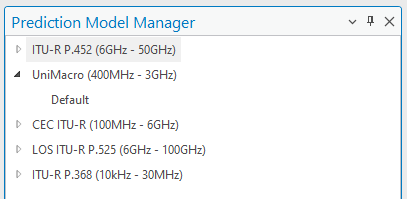

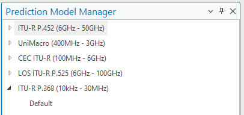

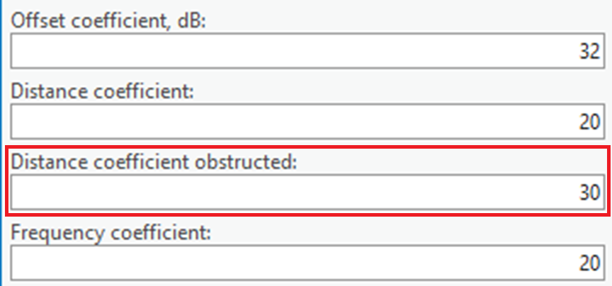

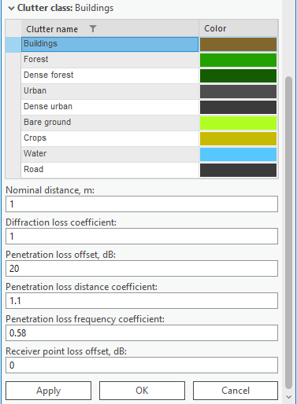

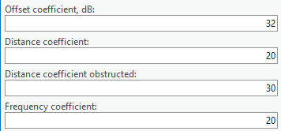

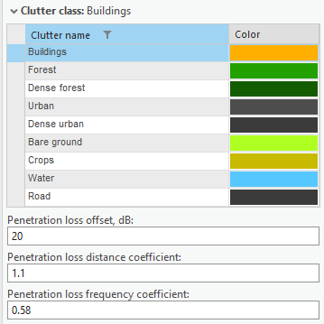

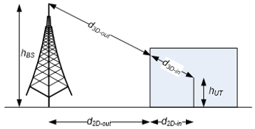

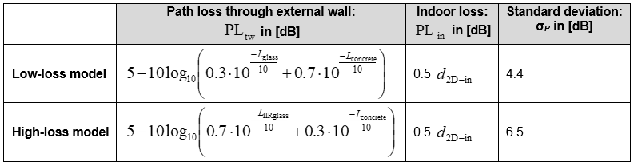

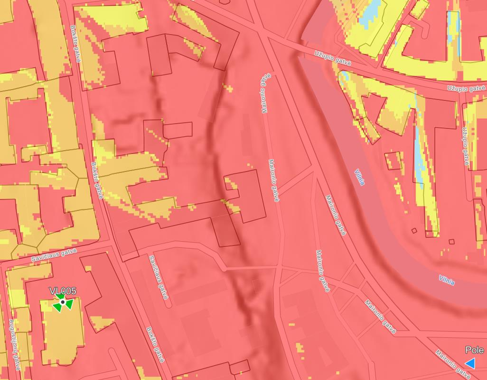

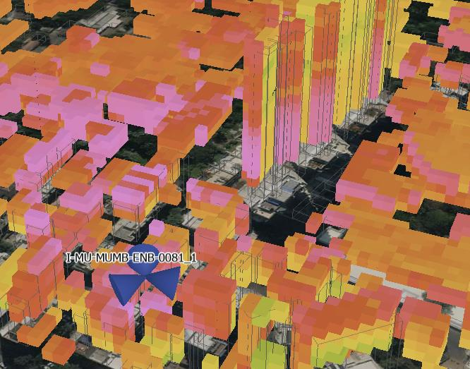

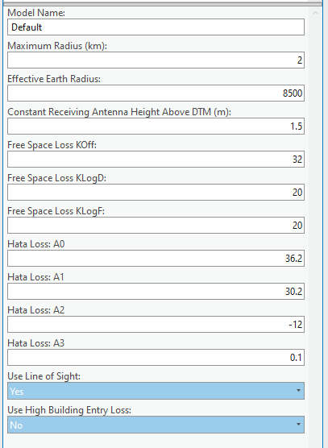

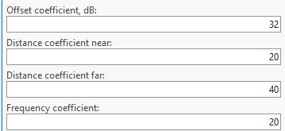

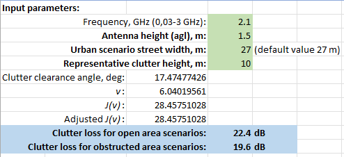

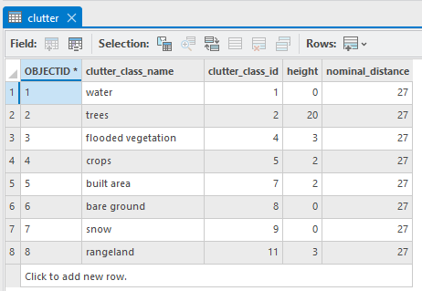

