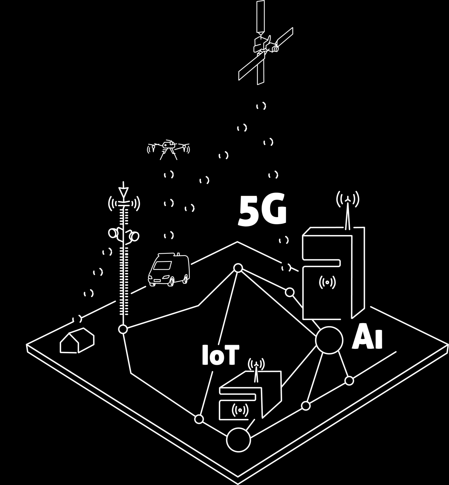
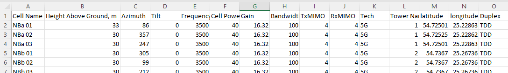
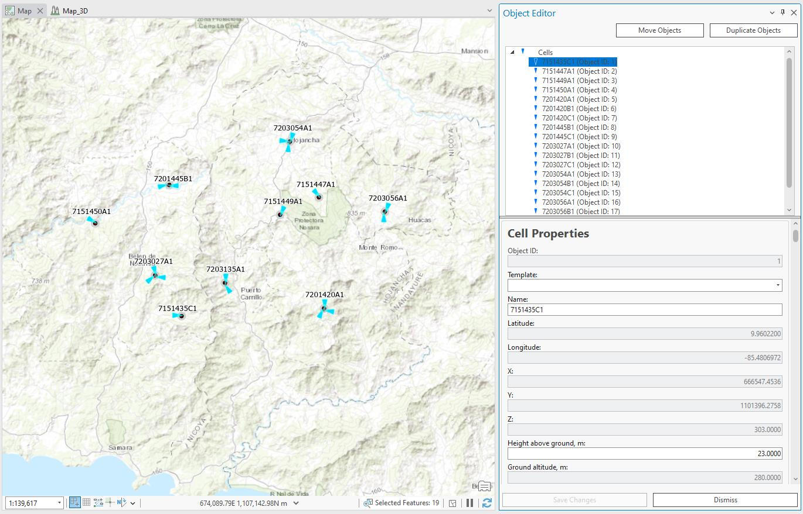

# 6. Importing data

6. Importing data

www.cellular-expert.com
Network import 
---
or CE 
---
or ArcGIS Pro

 • From:
   • Excel
   • CSV
   • SDE table

 • To Cellular Expert Workspace:
    • gdb database

                                       2
Network objects

• Cells
   • Sites
• Sites (i
---
 siteid
  parameter is
  de
---
ined)

                     3
Mapping 
---
ile

• Json type 
---
ile, can be edited with Notepad

                                               4
Mapping 
---
ile structure

•    “current_name” - name o
---
 the value that is written in the data 
---
ile.
    As an example “
---
req_mhz” is a column name in the data 
---
ile and will
    be changed to “
---
requency” when the mapping 
---
ile is applied and
    objects are imported.

•    “destination_name” - the proper name o
---
 the property (table
    column name) in the Cellular

•    “de
---
ault_value” – The de
---
ault value applies when an object in the
    data 
---
ile lacks a speci
---
ic property. The same value will be applied 
---
or
    all imported objects.

                                                                              5
Cells: generate Cell Name

• Check option: Generate Cell Name
   •   Latitude
   •   Longitude
   •   Azimuth
   •   Frequency
   •   Power
   •   Height
   •   Antenna gain

                                     6
Apply prediction model

• Polygon type 
---
eature class/shape 
---
ile
• ModelID and Con
---
igID is a must
• Option appears when Import HCM patterns option is active.

                                                              7
Parameters 
---
or Cell object

cell_name – cell identi
---
ier (recommended unique value).
latitude - Decimal degrees Y type coordinate in the WGS 1984 geographical
coordinate system.
longitude - Decimal degrees X type coordinate in the WGS 1984 geographical
coordinate system.
height – Cell height above the terrain.
azimuth - Cell direction 
---
rom the North in degrees.
tilt - Mechanical tilt value.

---
requency - Frequency value in MHz.
power - Power value in dBm.
antenna_gain - Antenna gain value 
---
rom the applied antenna.
misc_loss - Miscellaneous loss value in dB.

                                                                             8
Parameters 
---
or Cell object
bandwidth - Value in MHz. Required 
---
or 4G and 5G technologies. For other technologies
de
---
ine the value as 0.015.
noise_
---
igure - Value in dB. Required 
---
or 4G and 5G technologies.
downlink_duplex_
---
actor - Value range 
---
rom 0 to 1. Required 
---
or 4G and 5G technologies, and
used 
---
or Downlink Throughput calculations.
subcarrier_spacing - Value in kHz. Required 
---
or 4G and 5G technologies. For other
technologies de
---
ine value 15.
tx_mimo - Transmitter antenna count. Available values: 1, 2, 4, 8, 16, 32 and 64.
rx_mimo - Receiver antenna count. Available values: 1, 2, 4, 8, 16, 32 and 64.
active_antenna_e
---

---
ect - The parameter is dedicated to smart antenna modelling. The de
---
ault
value is 0, but i
---
 massive MIMO is used, a smart antenna e
---

---
ect can be included to lower the
inter
---
erence and boost throughput. Recommended
values:
        For MIMO 32x32 – value 6.
        For MIMO 64x64 – value 9.

                                                                                               9
Parameters 
---
or Cell object
cell_load - The parameter is described in percentages and varies 
---
rom 0 to 100. It describes how the cell is loaded.
The Cell load a
---

---
ects RSSI, RSRQ, DL Throughput calculations. For example, i
---
 the Cell load is higher, the DL
Throughput is lower.
technology - Describes the technology o
---
 cell. Possible values are 2G, 3G, 4G, 5G and WiFi.
prediction_model_id – prediction model identi
---
ication:
          I
---
 value 1 – ITU-R P.452
          I
---
 value 2 – UniMacro
          I
---
 value 3 – CEC ITU-R
          I
---
 value 4 – LOS ITU-R P.525
          I
---
 value 5 – ITU-R P.368
prediction_model_con
---
iguration_id – prediction model con
---
iguration identi
---
ication in de
---
ine prediction model
(prediction_model_id value).

---
requency_group – helps to manage di
---

---
erent 
---
requency groups, RF prediction will do separate prediction 
---
or
di
---

---
erent 
---
requency_group value automatically.
antenna_id- antenna identi
---
ication in the database.
duplex_mode - Required 
---
or 4G and 5G technologies, possible values FDD or TDD.
site_id – to automatically create Site object 
---
or cells, de
---
ine site name 
---
ield here. Must be a text 
---
ormat.

                                                                                                                       10
Exercise

Description: C:\CE_Course\0. Descriptions

Name: 6. Importing data.pd
---

                                            11
Thank you!
Tel.: +370 5 2150575
Email: in
---
o@cellular-expert.com

S.Konarskio g. 28A LT-03127 Vilnius
Lithuania

www.cellular-expert.com

## Slide Images

