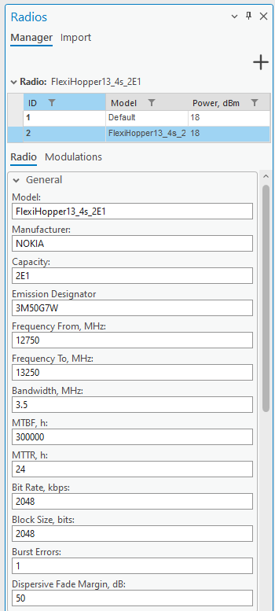
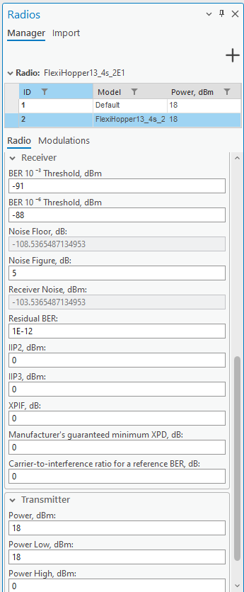
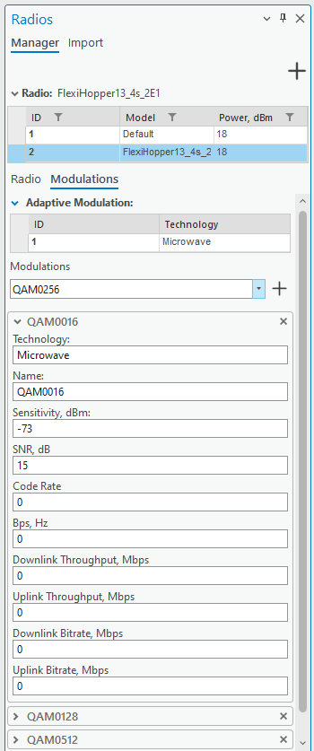
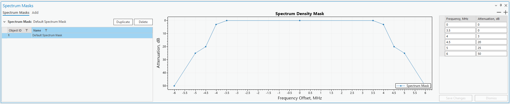
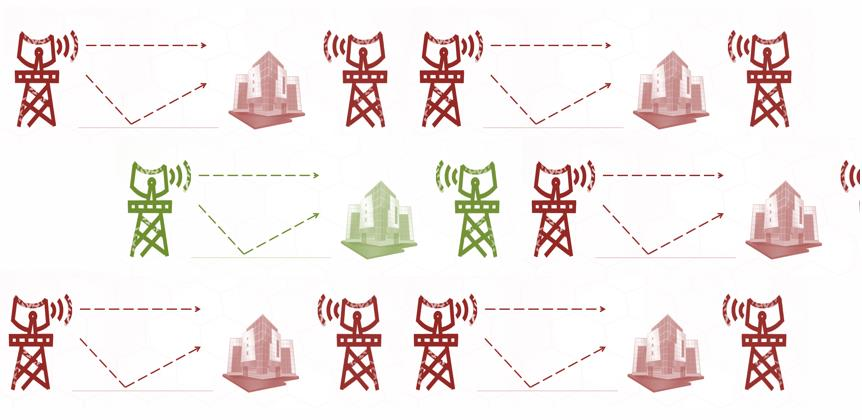
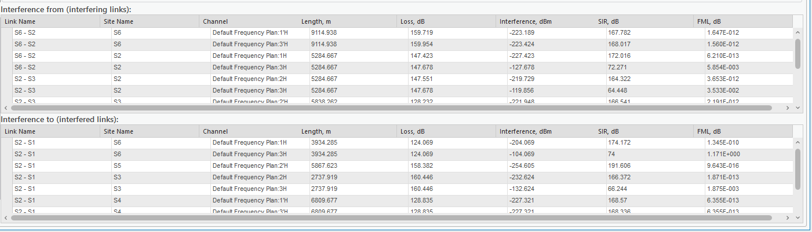
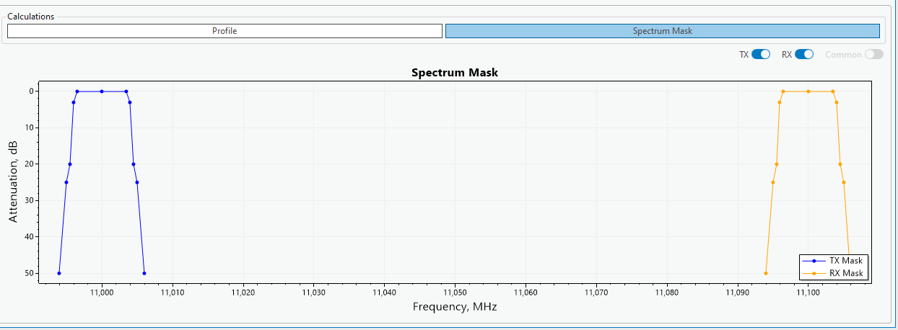

# 7. RL Prediction

7. RL Introduction

www.cellular-expert.com
Equipment

•   Antennas > Parabolic
•   Radio Models
•   Frequency Plans
•   Spectrum Mask

                           2
Antennas

           3
Radio Models

               4
Frequency Plans

                  5
Spectrum Mask

                6
Transmission Network

                       7
Transmission Network

                       8
Microwave link planning

❑ Power budget

❑ Path loss

❑ Pro
---
ile graphical view

❑ Inter
---
erence From

❑ Inter
---
erence To

                           9
Microwave link planning. Power Budget

                                        10
Microwave link planning. Power Budget

                                        11
Microwave link planning. Power Budget

                                        12
Microwave link planning. Geoclimatic data

                                            13
Microwave link planning: Inter
---
ering Links

❑ Inter
---
ering link on the map

❑ Power budget

❑ Path loss

❑ Pro
---
ile graphical view

❑ Spectrum Mask

                                             14
Exercise

Description: C:\CE_Course\0. Descriptions

Name: 7. RL Introduction.pd
---

                                            15
Thank you!
Tel.: +370 5 2150575
Email: in
---
o@cellular-expert.com

S.Konarskio g. 28A LT-03127 Vilnius
Lithuania

www.cellular-expert.com

## Slide Images

