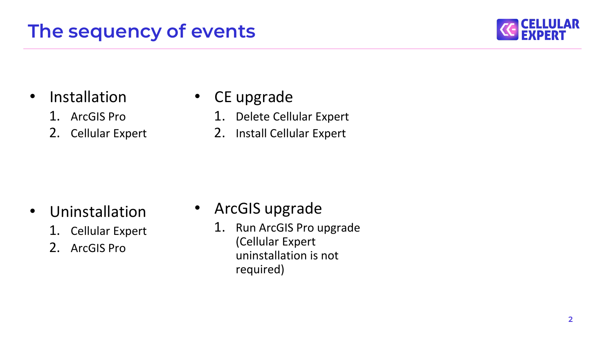
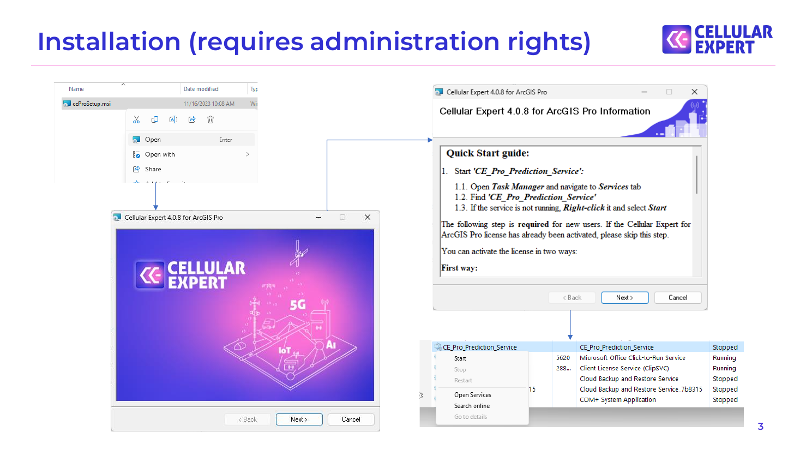
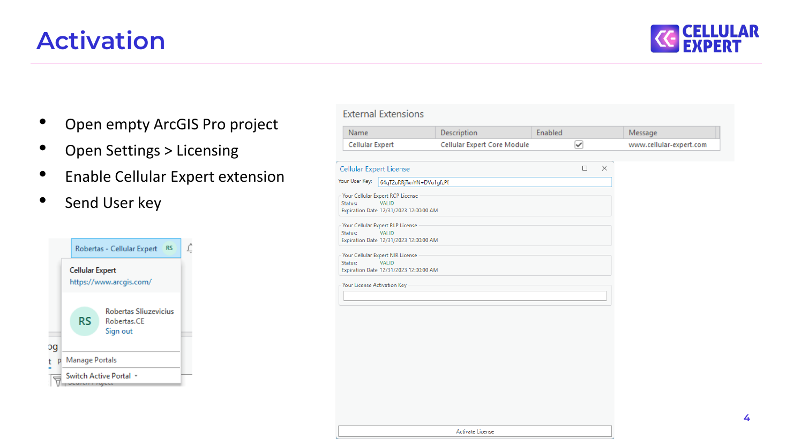
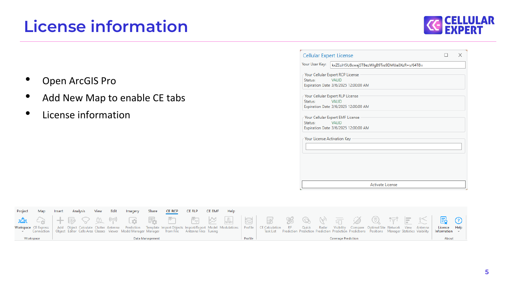

# Software Installation & Upgrades

## The sequency of events

- Installation         • CE upgrade 1. ArcGIS Pro          1. Delete Cellular Expert 2. Cellular Expert     2. Install Cellular Expert

- Uninstallation       • ArcGIS upgrade 1. Cellular Expert     1. Run ArcGIS Pro upgrade (Cellular Expert 2. ArcGIS Pro              uninstallation is not required)

## Installation (requires administration rights)

## Activation

- Open empty ArcGIS Pro project

- Open Settings > Licensing

- Enable Cellular Expert extension

- Send User key

## License information

- Open ArcGIS Pro

- Add New Map to enable CE tabs

- License information

