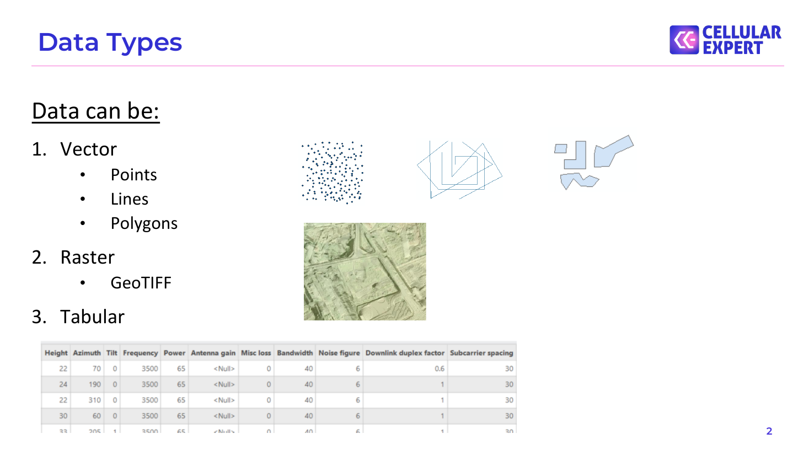
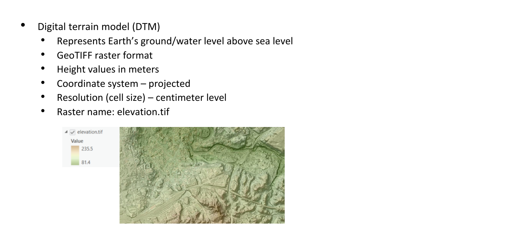
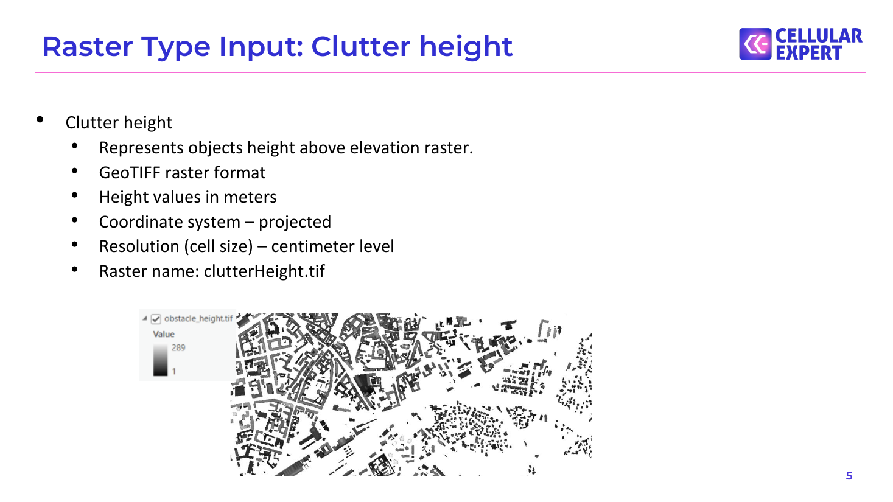
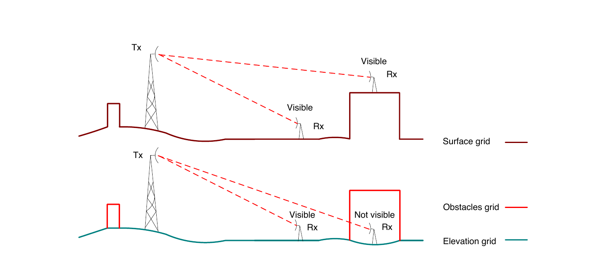
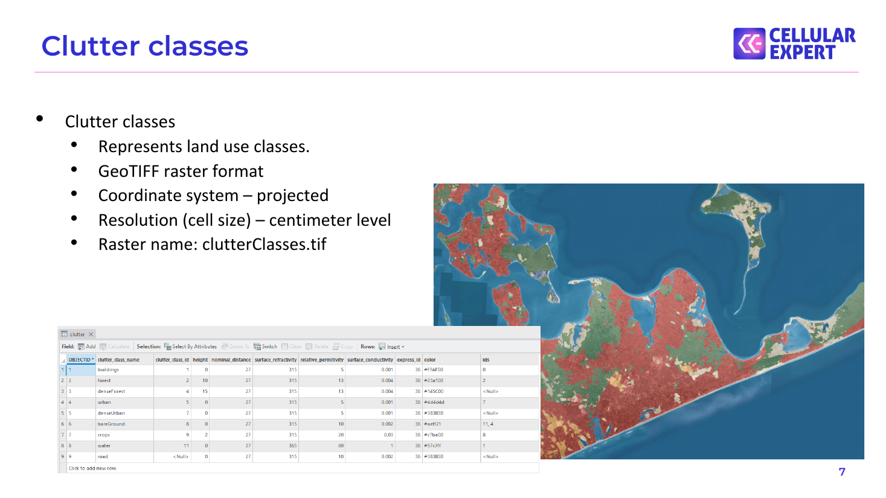
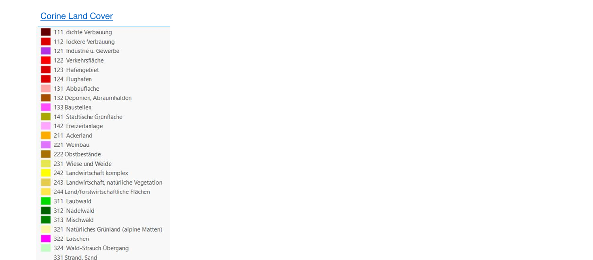
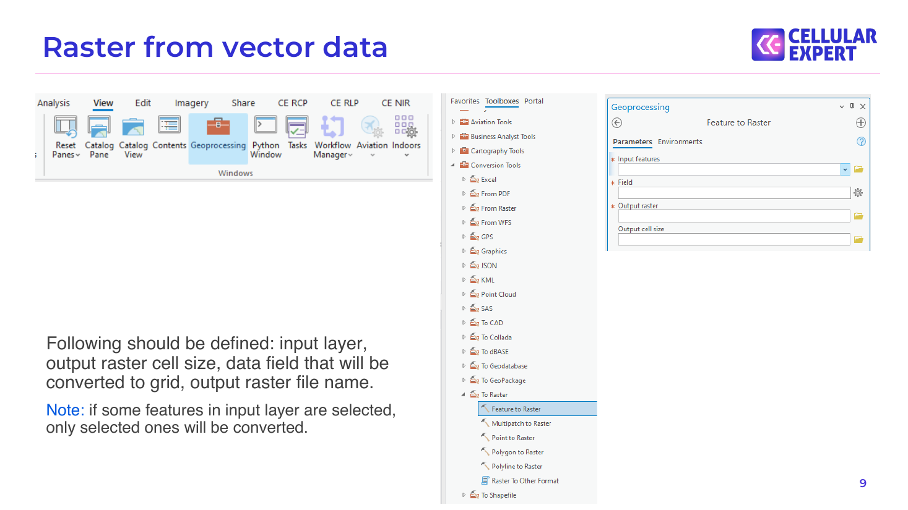
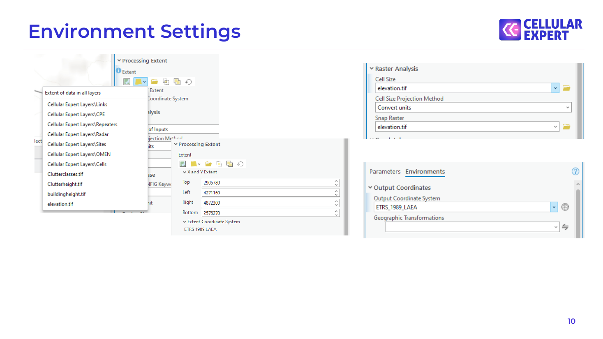
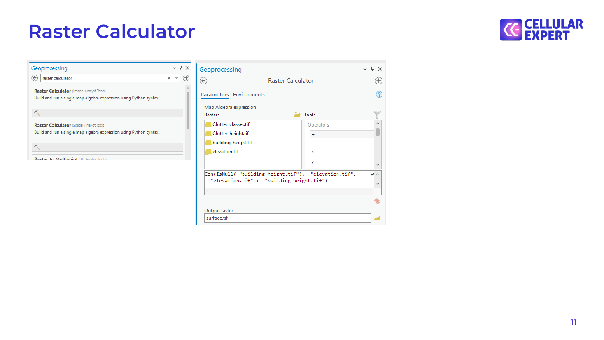
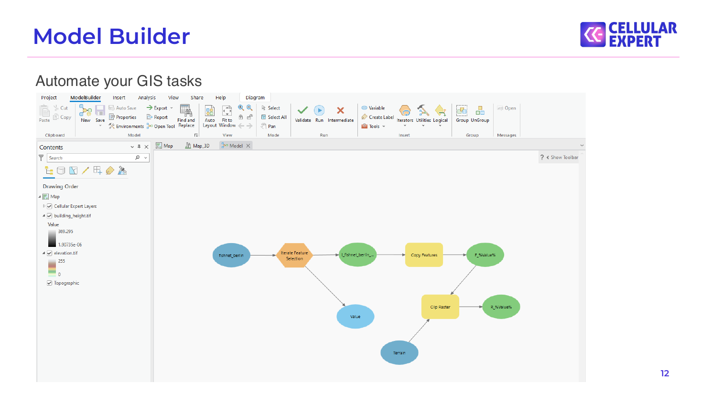

# Data Types

## Data Types

Data can be: 1. Vector

- Points

- Lines

- Polygons 2. Raster

- GeoTIFF 3. Tabular

## Modelling Outdoor coverage

The CE tools make use of three distinct GIS data layers to obtain high precision modelling of radio wave propagation losses: 1. Digital Terrain Model (DTM), also known as Digital Elevation Model (DEM), which describes Earth surface, i.e., path terrain profile in terms of ground elevation above uniform sea level. 2. Obstacles layer, delineating buildings and other such objects above Earth surface that may be considered to be principal impediments for radio wave propagation. 3. Clutter layer, delineating natural occurring or human cultivated ground cover that may be partially penetrable by radio waves, such as natural vegetation (e.g., forests, trees, bushes) or various crops, gardens, parks, etc. Diffraction           Free Space Loss

Diffraction Hobstacles Hclutter                                                  DSM Clutter losses

UE DTM

## Raster Type Input: Elevation

- Digital terrain model (DTM)

- Represents Earth’s ground/water level above sea level

- GeoTIFF raster format

- Height values in meters

- Coordinate system – projected

- Resolution (cell size) – centimeter level

- Raster name: elevation.tif

## Raster Type Input: Clutter height

- Clutter height

- Represents objects height above elevation raster.

- GeoTIFF raster format

- Height values in meters

- Coordinate system – projected

- Resolution (cell size) – centimeter level

- Raster name: clutterHeight.tif

## DTM vs. Surface

Tx Visible Rx

Visible

Rx Surface grid Tx

Obstacles grid Visible        Not visible Rx               Rx Elevation grid

## Clutter classes

- Clutter classes

- Represents land use classes.

- GeoTIFF raster format

- Coordinate system – projected

- Resolution (cell size) – centimeter level

- Raster name: clutterClasses.tif

## Clutter types

Corine Land Cover

## Raster from vector data

Following should be defined: input layer, output raster cell size, data field that will be converted to grid, output raster file name. Note: if some features in input layer are selected, only selected ones will be converted.

## Environment Settings

## Raster Calculator

## Model Builder

Automate your GIS tasks

## Questions?

