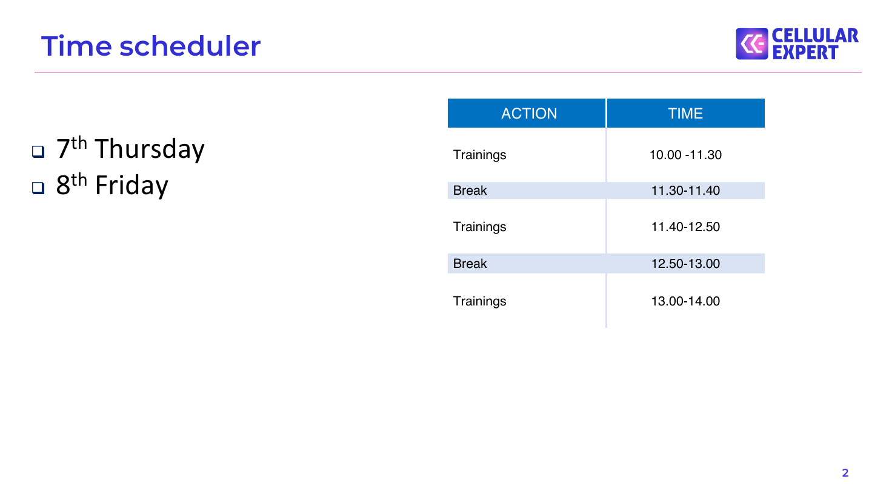
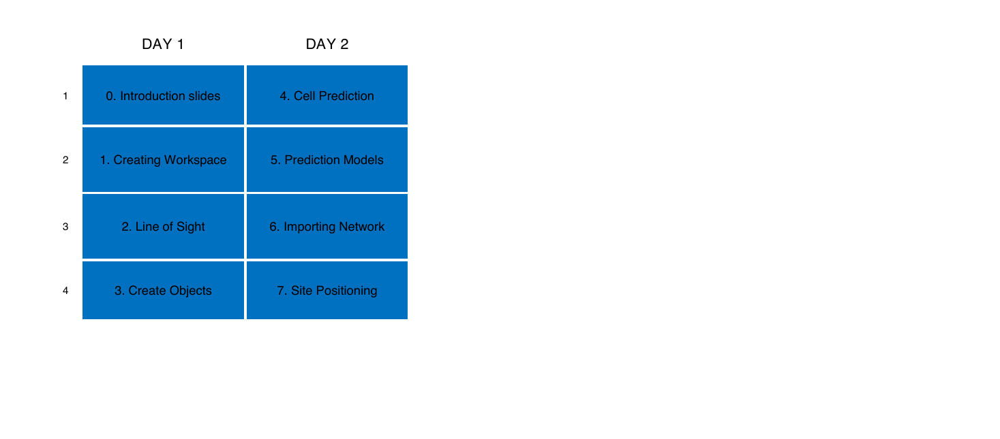
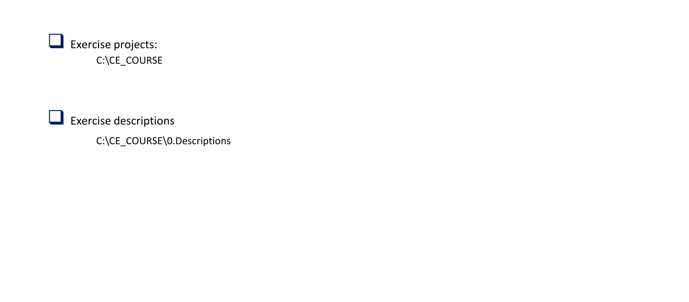
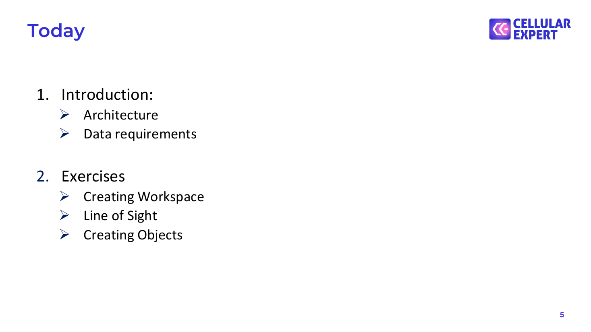

# Agenda

## Time scheduler

ACTION      TIME

❑ 7th Thursday   Trainings        10.00 -11.30

th ❑ 8 Friday       Break            11.30-11.40

Trainings        11.40-12.50

Break            12.50-13.00

Trainings        13.00-14.00

## Exercises for CE Desktop

DAY 1                    DAY 2

1    0. Introduction slides    4. Cell Prediction

2   1. Creating Workspace     5. Prediction Models

3       2. Line of Sight      6. Importing Network

4     3. Create Objects        7. Site Positioning

## Course Materials

❑ Exercise projects: C:\CE_COURSE

❑ Exercise descriptions C:\CE_COURSE\0.Descriptions

## Today

1. Introduction: ➢ Architecture ➢ Data requirements

2. Exercises ➢ Creating Workspace ➢ Line of Sight ➢ Creating Objects

