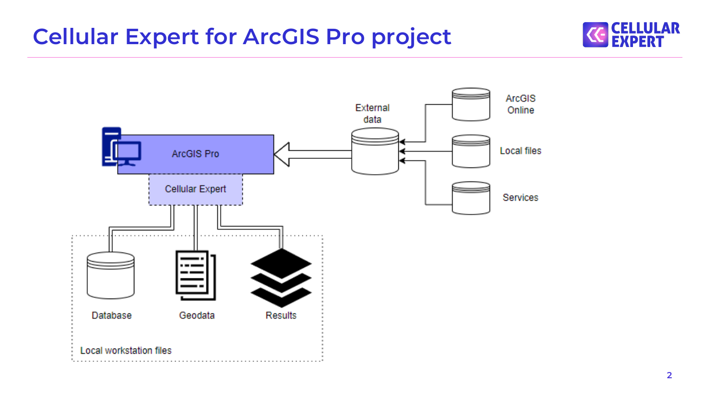
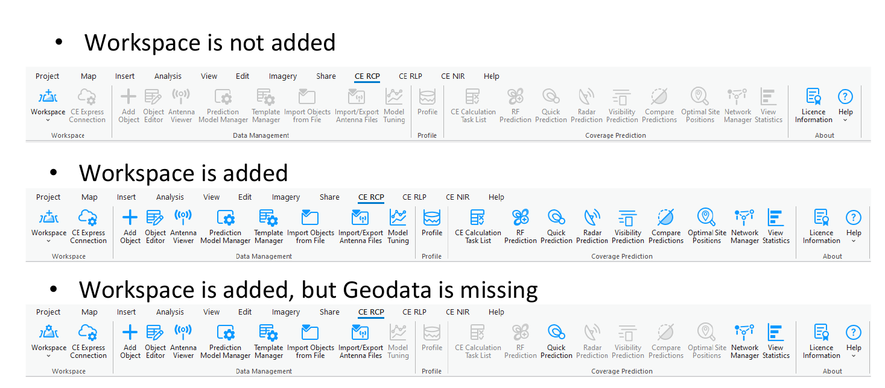
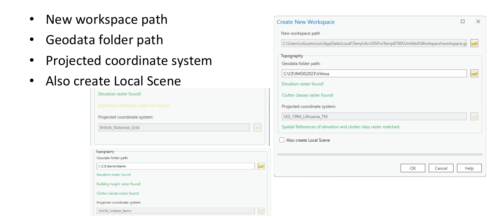
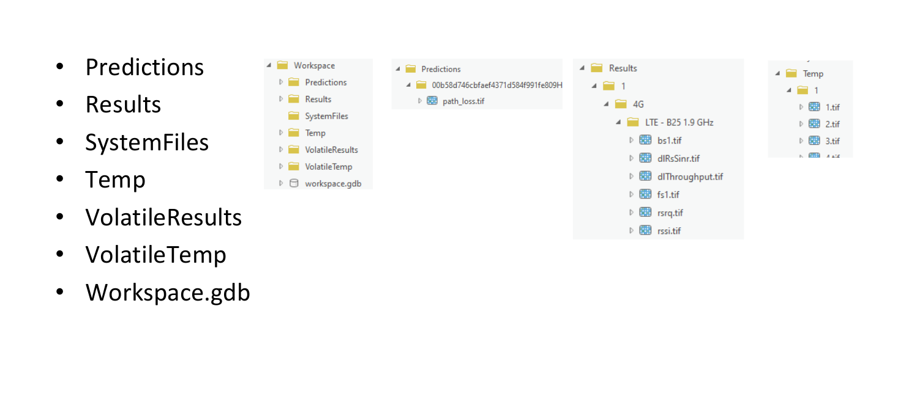
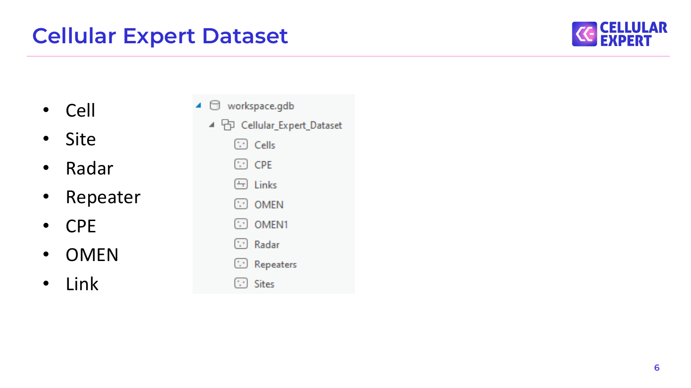
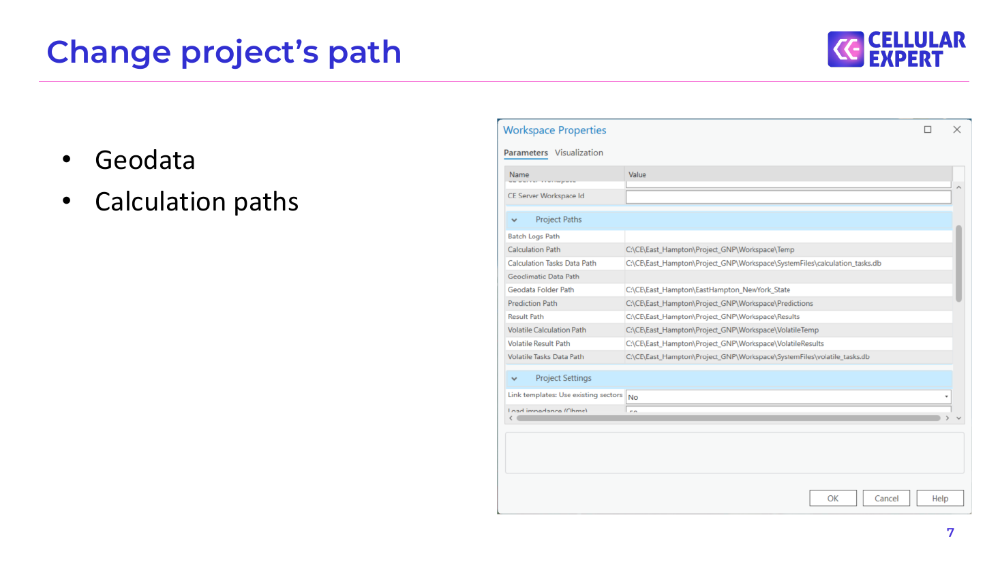
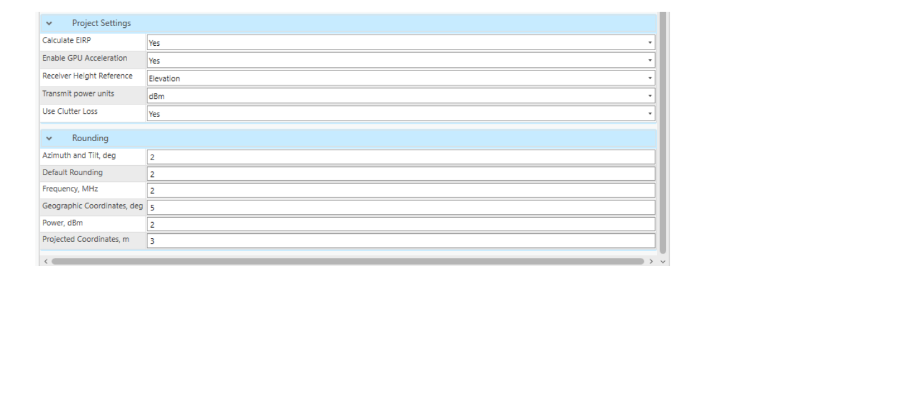
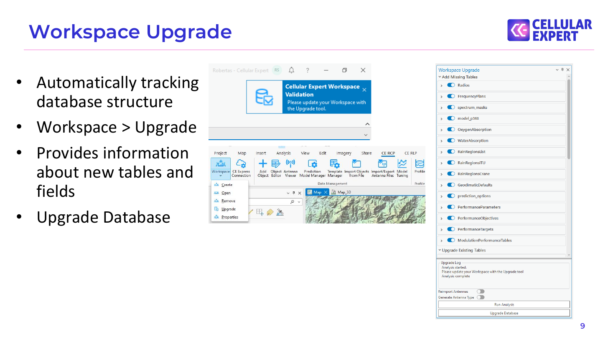

# 1. Creating Workspace

## Cellular Expert for ArcGIS Pro project

## CE Tools

- Workspace is not added

- Workspace is added

- Workspace is added, but Geodata is missing

## Create Workspace

- New workspace path

- Geodata folder path

- Projected coordinate system

- Also create Local Scene

## Cellular Expert Project Structure

- Predictions

- Results

- SystemFiles

- Temp

- VolatileResults

- VolatileTemp

- Workspace.gdb

## Cellular Expert Dataset

- Cell

- Site

- Radar

- Repeater

- CPE

- OMEN

- Link

## Change project’s path

- Geodata

- Calculation paths

## Project Settings and Rounding

## Workspace Upgrade

- Automatically tracking database structure

- Workspace > Upgrade

- Provides information about new tables and fields

- Upgrade Database

## Exercise

Description: C:\CE_Course\0. Descriptions

Name: 1. Create workspace.pdf

## Thank you!

Tel.: +370 5 2150575

S.Konarskio g. 28A LT-03127 Vilnius Lithuania

