# 2. Line of Sight (Profile)

## Modelling Outdoor coverage

The CE tools make use of three distinct GIS data layers to obtain high precision modelling of radio wave propagation losses: 1. Digital Terrain Model (DTM), also known as Digital Elevation Model (DEM), which describes Earth surface, i.e., path terrain profile in terms of ground elevation above uniform sea level. 2. Obstacles layer, delineating buildings and other such objects above Earth surface that may be considered to be principal impediments for radio wave propagation. 3. Clutter layer, delineating natural occurring or human cultivated ground cover that may be partially penetrable by radio waves, such as natural vegetation (e.g., forests, trees, bushes) or various crops, gardens, parks, etc. Diffraction           Free Space Loss

Diffraction Hobstacles Hclutter                                                  DSM Clutter losses

UE DTM

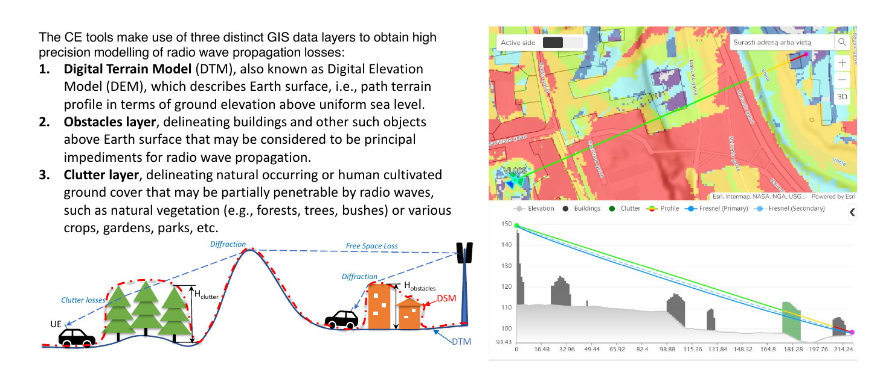

## Point to point (Profile) input

- Geodata

- Elevation

- Buildings

- Clutter

- Frequency

- Fresnel zone (%)

- Earth radius

- Transmitter

- Height

- Power

- Receiver

- Height

- Power

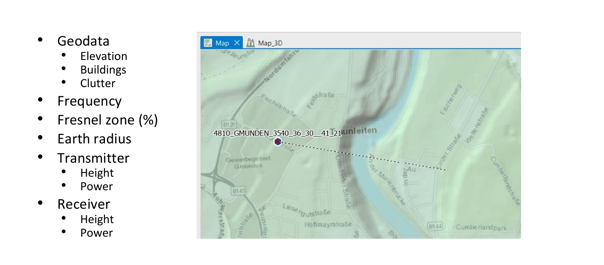

## Profile calculations

- General

- Clearance

- Clearance Percentage

- Clearance Distance

- Distance to NLOS

- Distance to OLOS

- Power Budget

- Downlink FS

- Uplink FS

- FWA downlink RSL

- FWA uplink RSL

- Path Loss

- Total Path Loss

- Model Loss

- Diffraction Loss

- Penetration Loss

- Receiver Clutter Loss

- Clutter Loss

- Angles

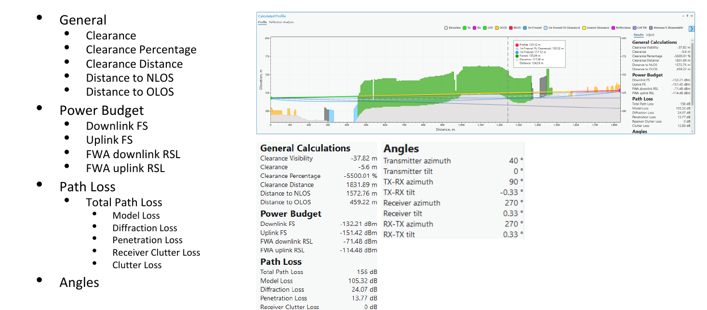

## Dynamic profile

- Fix transmitter

- Dynamic option

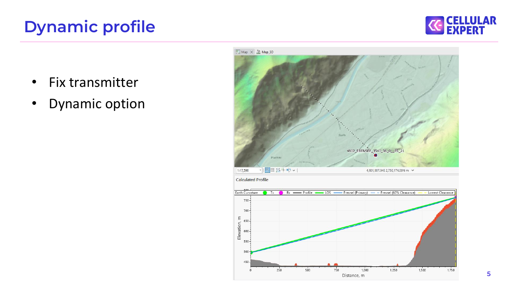

## Profile symbology

- Define colors for each object in profile

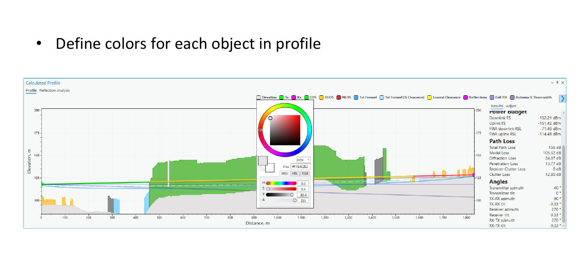

## Profile 3D

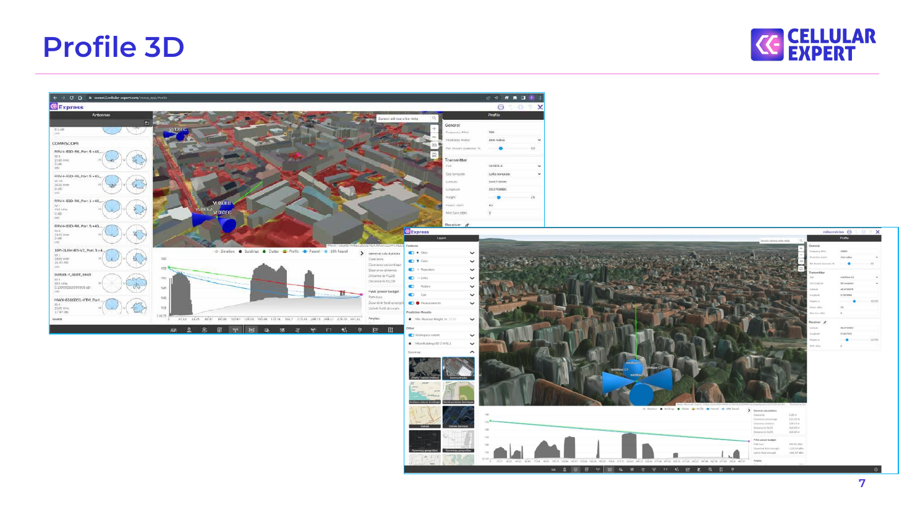

## Profile 3D

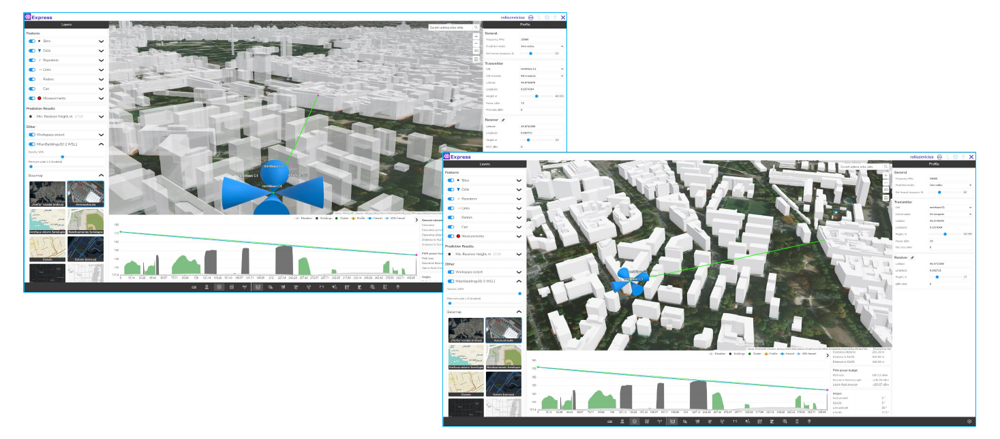

## Visibility prediction input

- Geodata

- Elevation

- Obstacle

- Frequency

- Calculation radius

- Earth radius

- Transmitter

- Receiver (height)

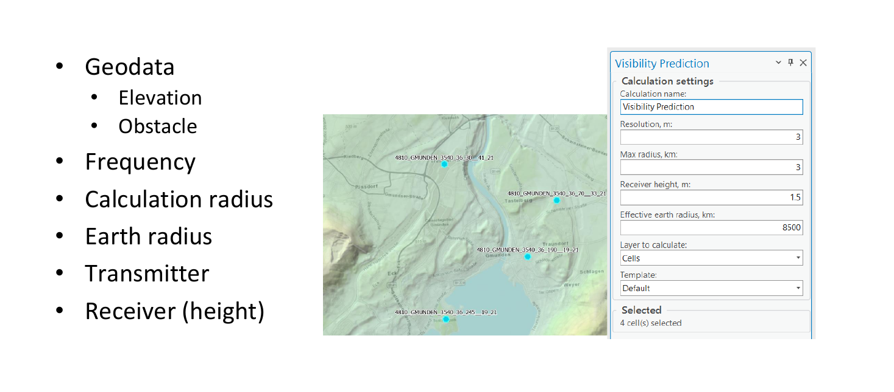

## Visibility Results

- Line of Sight

- Required height for LoS

- Clearance

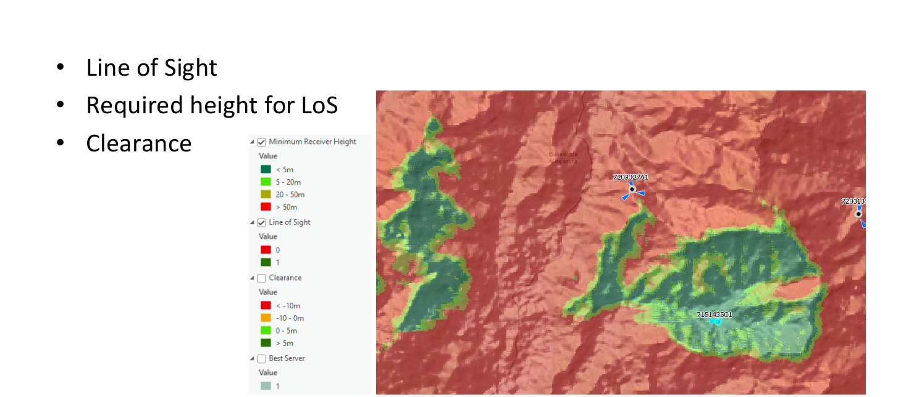

## Visibility: Line of Sight

Possible values:

- 0

- 1

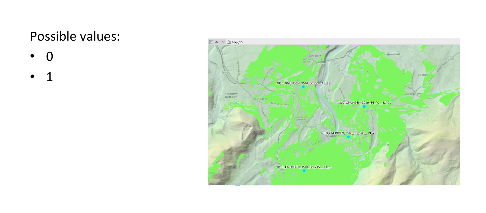

## Visibility: Clearance

- Clearance – clearance of visibility line between Tx to Rx as a distance in meters

Height, m       Clearance = 6.5 m

0   100       200       300   400 Distance, m

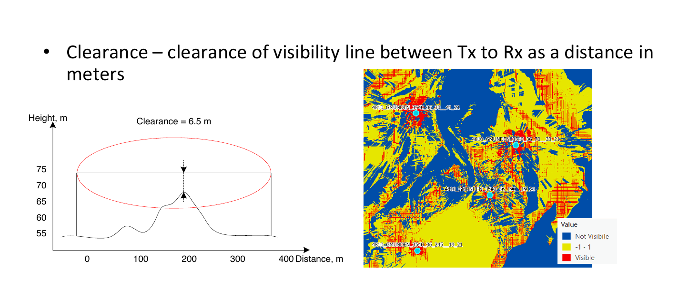

## Visibility: Minimum Receiver Height

- Receiver height – calculate required receiver heights to have a visibility

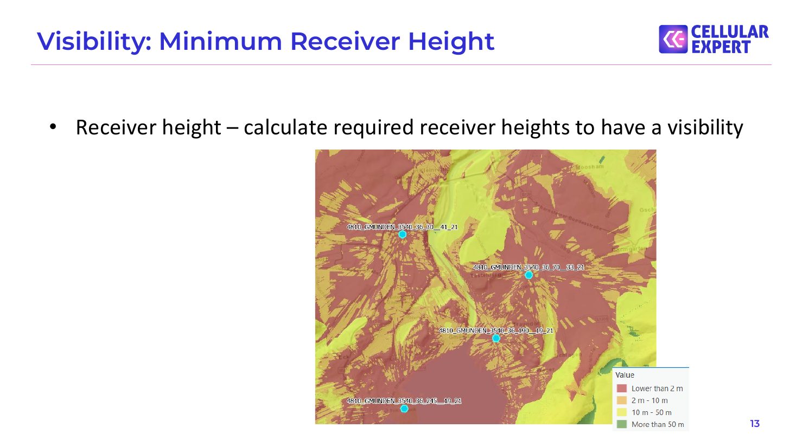

## Visibility: Line of Sight sum meter topo data

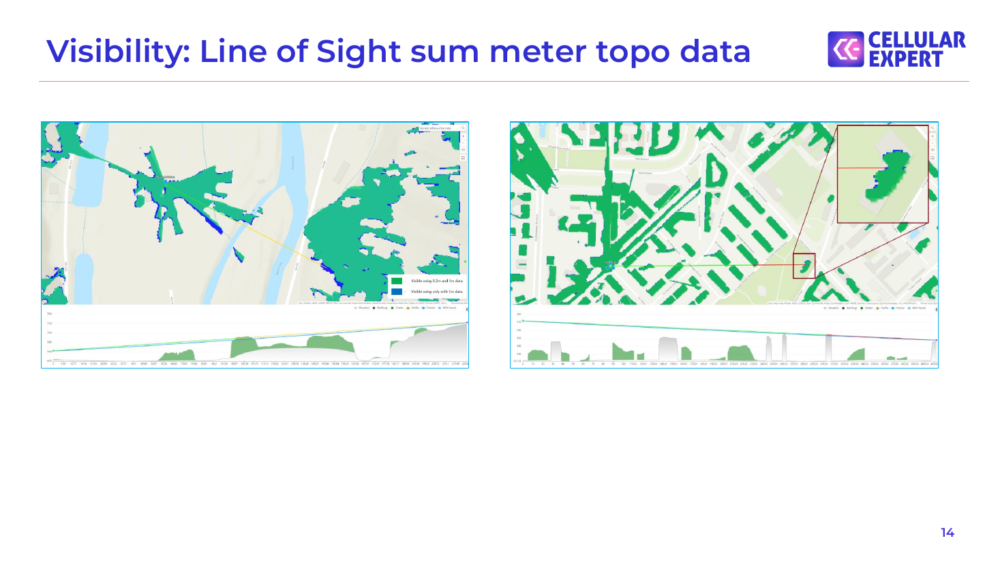

## Surface vs Eelevation+Obstacles

Tx Visible Rx

Visible

Rx Surface grid Tx

Obstacles grid Visible        Not visible Rx               Rx Elevation grid

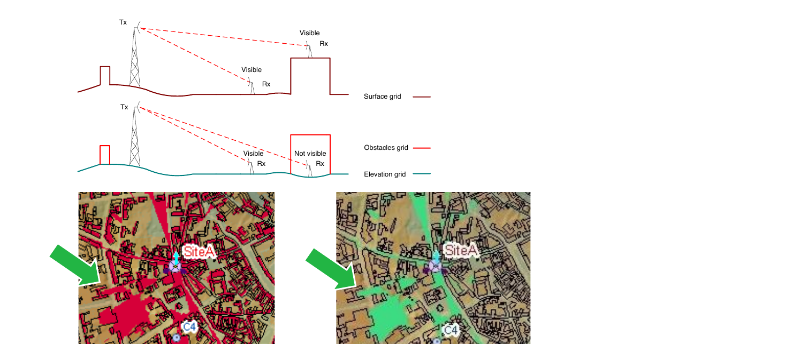

## Surface

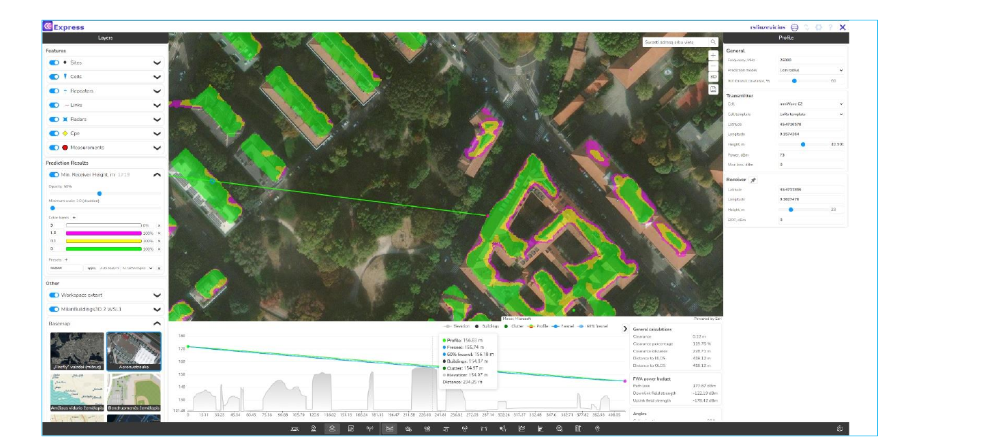

## DTM + Obstacles (Buildings/Vegetation)

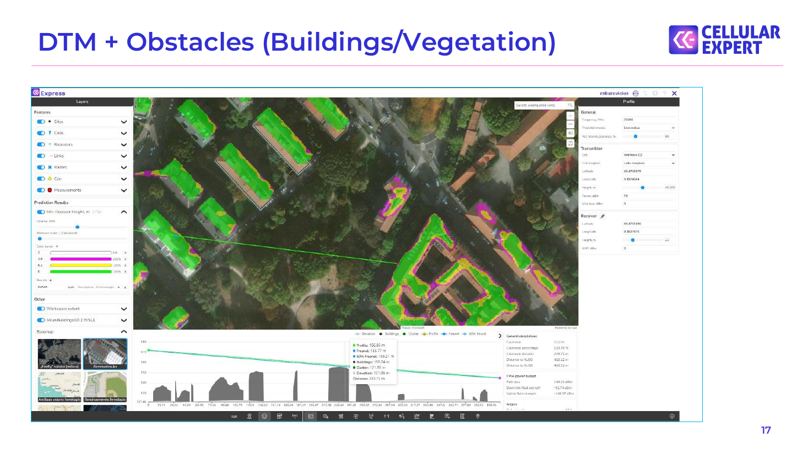

## DTM + Buildings + Vegetation

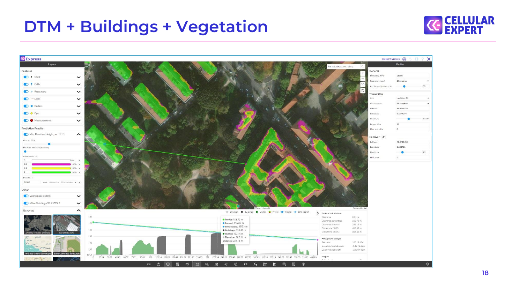

## Exercise

Description: C:\CE_Course\0. Descriptions

Name: 2. Line of Sight (Profile).pdf

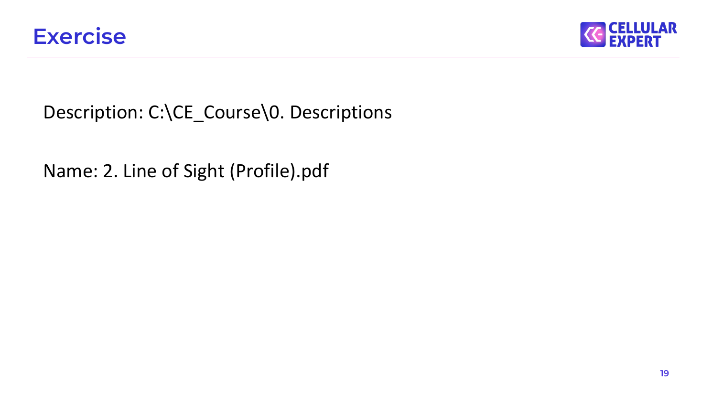

## Thank you!

Tel.: +370 5 2150575

S.Konarskio g. 28A LT-03127 Vilnius Lithuania

