# 7. RL Prediction

## Equipment

- Antennas > Parabolic

- Radio Models

- Frequency Plans

- Spectrum Mask

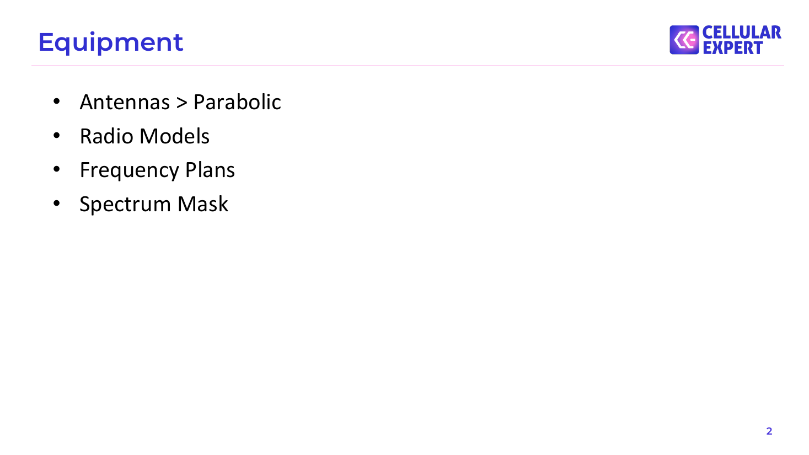

## Antennas

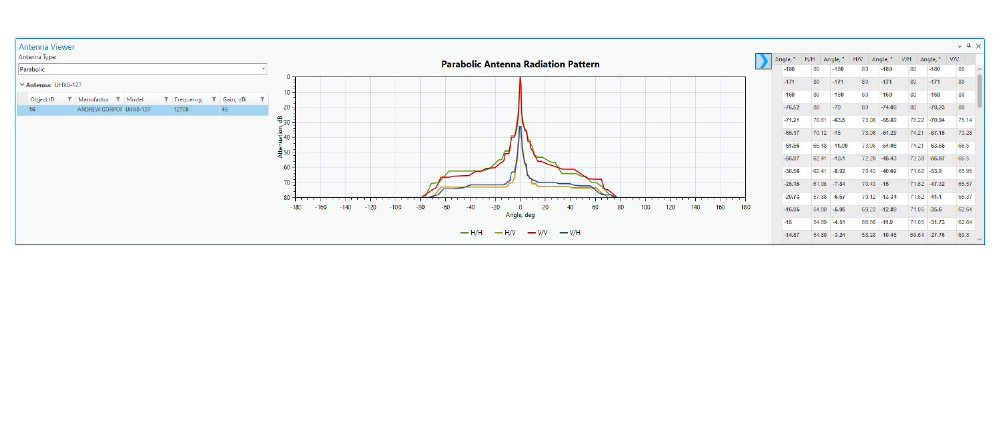

## Radio Models

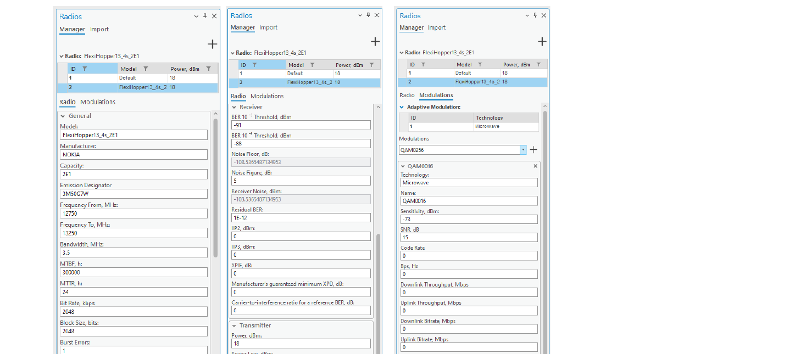

## Frequency Plans

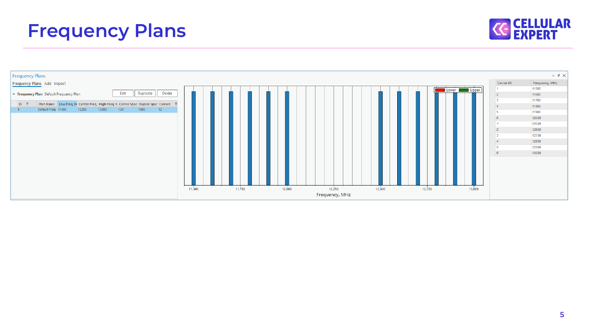

## Spectrum Mask

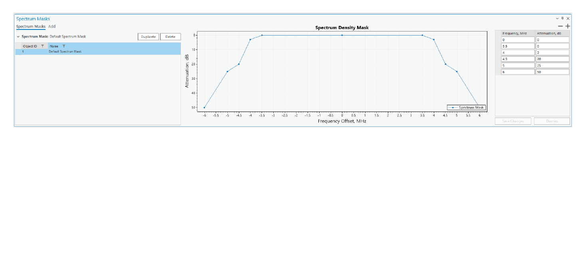

## Transmission Network

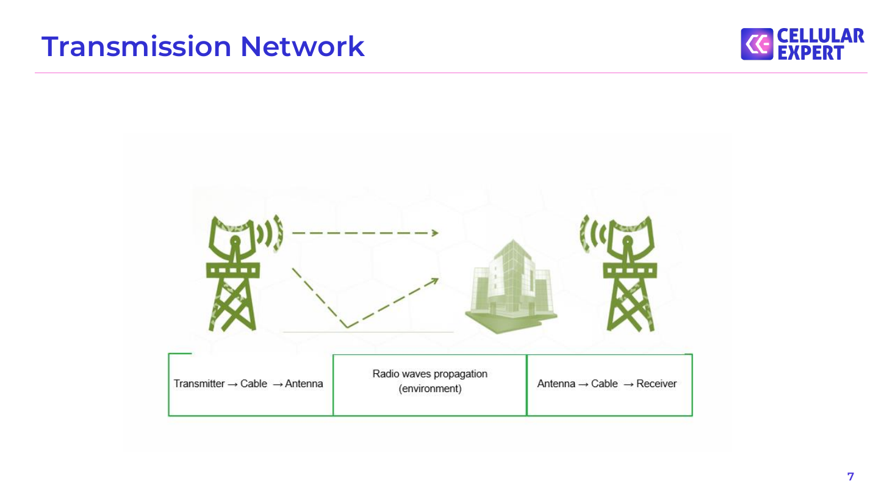

## Transmission Network

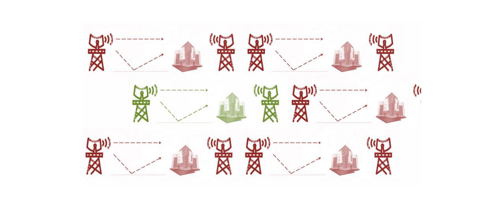

## Microwave link planning

❑ Power budget

❑ Path loss

❑ Profile graphical view

❑ Interference From

❑ Interference To

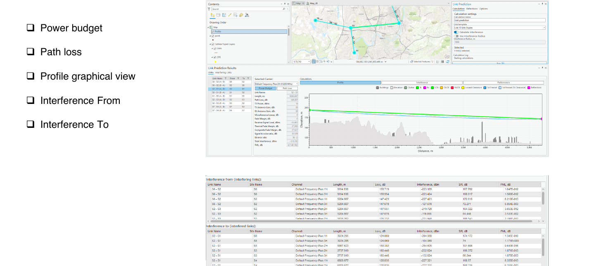

## Microwave link planning. Power Budget

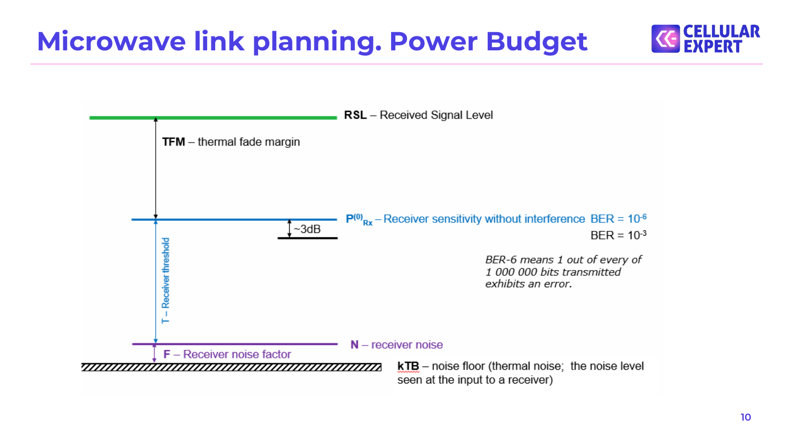

## Microwave link planning. Power Budget

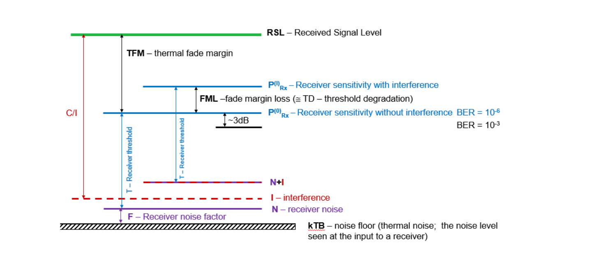

## Microwave link planning. Power Budget

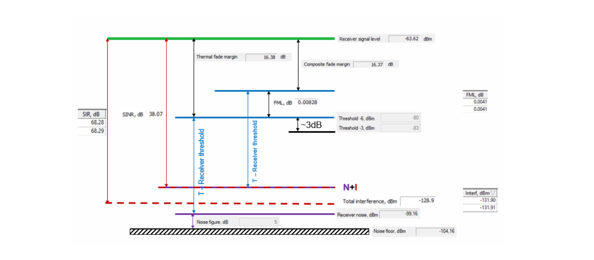

## Microwave link planning. Geoclimatic data

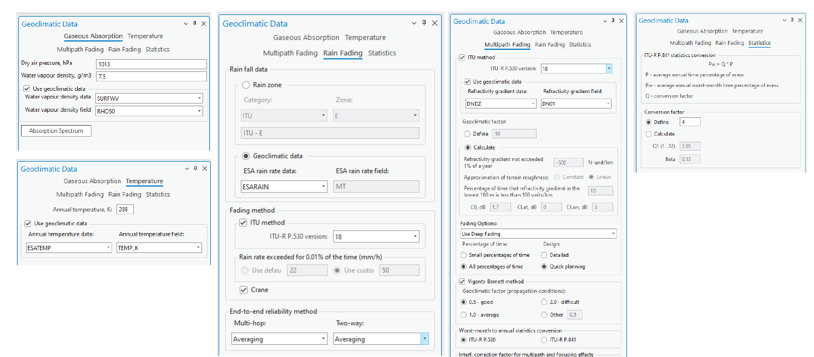

## Microwave link planning: Interfering Links

❑ Interfering link on the map

❑ Power budget

❑ Path loss

❑ Profile graphical view

❑ Spectrum Mask

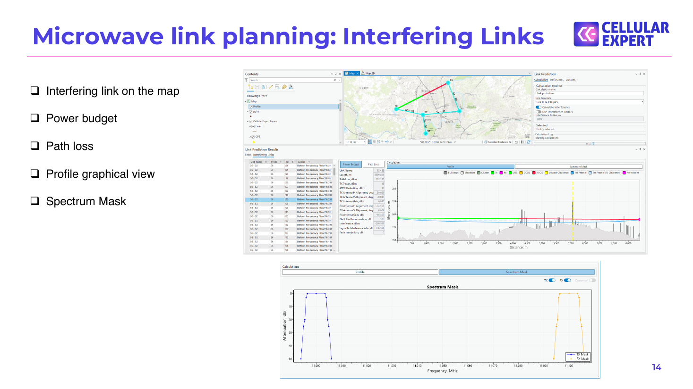

## Exercise

Description: C:\CE_Course\0. Descriptions

Name: 7. RL Introduction.pdf

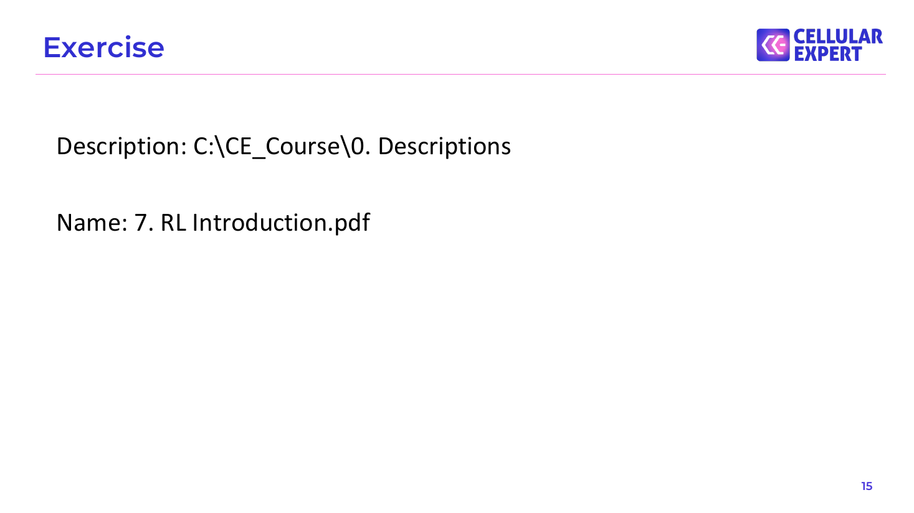

## Thank you!

Tel.: +370 5 2150575

S.Konarskio g. 28A LT-03127 Vilnius Lithuania

