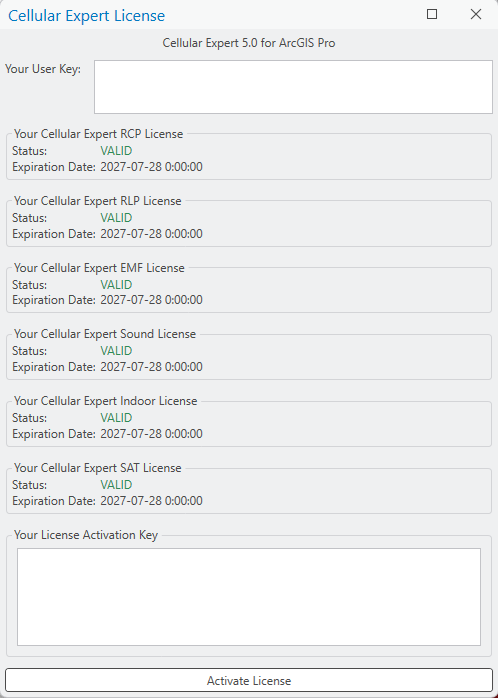
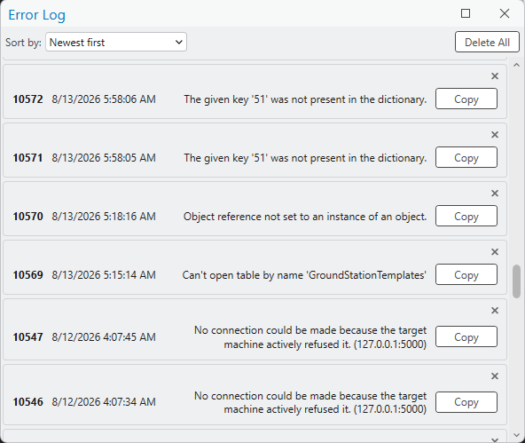

# About

## License Information

Click the License Information button to open the License Information dialog. License Information is a useful resource to see your current version of Cellular Expert for ArcGIS Pro, user key, currently active licenses, and their expiration dates. The license information window is also used when a user is enabling the CE for ArcGIS Pro extension on their computer. For more information about license activation, see [Activation](2-getting-started.md#activation).

## Help

### Documentation

Click the Documentation button in the Help dropdown list to open the documentation for CE for ArcGIS Pro. Here you will find extensive documentation of the add-on. This should also be the first place you check when trying to figure out a problem.

### What's New

Click the What's New button in the Help dropdown list to open the What's New document. This document is updated for each new release of Cellular Expert for ArcGIS Pro, and here you will find the changelog for the currently installed version. This document serves as the introduction to added new features, enhancements, bug fixes, and other changes.

### Error Log

Click the Error Log button in the Help dropdown list to open the Error Log dialog. Here you will find information about errors that have occurred during certain processes of the CE for ArcGIS Pro extension's lifetime. These logs are crucial to improving the overall quality of the user experience. When an error happens and you decide to contact Cellular Expert, you will be asked to send these logs so that the problems you encounter can be patched as soon as possible. The error logs can be sorted by either newest first (default option) or lowest first.

| Button | Description |
|---|---|
| Copy | Copies the necessary error information into your clipboard, to send to Cellular Expert. A notification appears on the screen indicating that the information was copied to the clipboard successfully. |
| Delete All | If the error log ever gets too crowded, deletes all errors from it. |

## Technical Support

Click the Technical Support button in the Help dropdown list to open the Technical Support page in your default internet browser. On the Cellular Expert Support page, you can browse the Knowledge Base for instructions and solutions related to Cellular Expert for ArcGIS Pro, such as how to prepare geodata for a project. You can also log in or sign up to submit a new support ticket.

For any issues, you can also e-mail support at `support@cellular-expert.com` and your ticket will be registered. When you contact support, please describe your issue precisely and completely — mention which steps you already tried, when the problem appears, etc. — and attach a screenshot of the Cellular Expert log files (see [Error Log](#error-log) above).

> **Note:** All provided information remains confidential and is used only for solving your issue. Other users cannot see your ticket, and it is not published in any other way.
