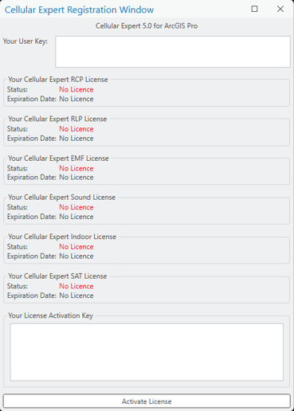
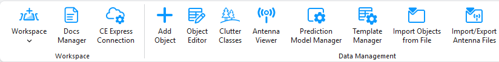
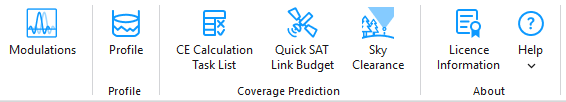
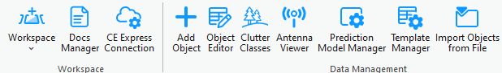
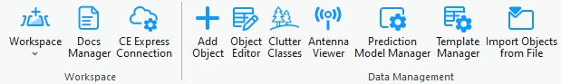
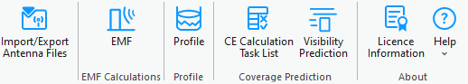
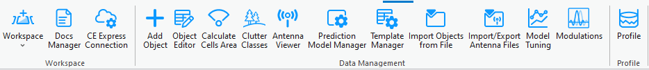
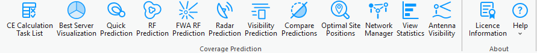
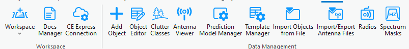
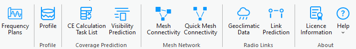

# Getting Started

Welcome to Cellular Expert. This chapter guides you through project creation and analysis. It covers installing and preparing the Cellular Expert extension, activating your license, and locating the tools for the first time.

## System Requirements

Requirements can vary significantly, depending on the acceptable calculation time and task complexity.

### Minimal Requirements for Hardware

#### Processor (CPU)

| Level | Requirement |
|---|---|
| Minimum | 8 cores, hyperthreaded |
| Recommended | 16 cores |

**(Optional) Requirements for GPU-accelerated calculations**

- GPU — any NVIDIA GPU with CUDA capabilities ([developer.nvidia.com/cuda-gpus](https://developer.nvidia.com/cuda-gpus))
- Driver version: 456.38 or later
- CUDA Toolkit 11.0 or later

#### Memory/RAM

| Level | Requirement |
|---|---|
| Minimum | 16 GB |
| Recommended | 32 GB |

#### Storage

| Level | Requirement |
|---|---|
| Minimum | 500 GB of free space |
| Recommended | 2 TB or more of free space on a solid-state drive (SSD) |

### Minimal Requirements for Software

Cellular Expert runs on Microsoft Windows 10 or higher. It requires:

- Microsoft .NET 10.0 — [Download .NET 10.0 Desktop Runtime (v10.0.11) – Windows x64 Installer](https://dotnet.microsoft.com/)
- Microsoft Visual C++ Redistributable packages 2015–2022 — [vc_redist.x64.exe](https://aka.ms/vs/17/release/vc_redist.x64.exe)
- .NET support for ArcGIS libraries
- ArcGIS Pro from version 3.7.x

## Installation

1. If applicable, uninstall the previous version of Cellular Expert for ArcGIS Pro.
2. Make sure that .NET 10.0 is installed.
3. Make sure that ArcGIS Pro 3.7.x is installed.
4. Run the `ceProSetup.msi` file to install the new version of Cellular Expert for ArcGIS Pro.
5. After a successful installation, open **Task Manager > Services**, and run `CE_Pro_Prediction_Service`.

## Activation

This step is required for new users. If the Cellular Expert for ArcGIS Pro license has already been activated, you can skip this step.

You can activate the license in two ways.

### First way

1. Open ArcGIS Pro and select **Settings**.
2. Navigate to **Licensing → External Extensions**.
3. Find the Cellular Expert entry in the extensions table.
4. Click the checkmark in the **Enabled** field. The License Activation dialog appears.
5. Copy the **User Key** and send it to `support@cellular-expert.com`. You will be provided with a **License Activation Key**, which must be entered into the same dialog.
6. Press **Activate License** — the license is activated, enabling the acquired versions of the add-on.

### Second way

1. Create an empty ArcGIS Pro project.
2. Navigate to **Insert** and select **New Map**. After the map is inserted, the Cellular Expert tabs are enabled.
3. Navigate to any of the Cellular Expert tabs and select **License Information** in the **About** group.
4. Copy the **User Key** and send it to `support@cellular-expert.com`. You will be provided with a **License Activation Key**, which must be entered into the same dialog.
5. Press **Activate License** — the license is activated, enabling the acquired versions of the add-on.

If you want to check the expiration date of the license, you can:

1. Open ArcGIS Pro and start/open a project with an active map.
2. Navigate to the Cellular Expert tab.
3. Select **License Information** in the **About** group.

If you encounter any problems or want additional details about the license, contact Cellular Expert at `support@cellular-expert.com`. For more information, see [About](10-about.md).

## Tools

The Cellular Expert tools are part of the Cellular Expert add-on. They appear automatically after installation of CE for ArcGIS Pro and are found in the menu ribbon.

There are 6 types of licenses and therefore 6 different tabs with various tool configurations:

- SAT
- Sound
- EMF
- Indoor
- RCP
- RLP

Each tab exposes the Workspace, Data Management, Profile, and Coverage Prediction groups relevant to that license — for example, RCP and SAT additionally expose **Calculate Cells Area** and **Model Tuning**, and RLP exposes **Radios**, **Spectrum Masks**, and **Frequency Plans** instead of the network-object tools used by the other modules. The exact tool set shown on each tab is illustrated below, license by license.

### SAT

### Sound / Indoor

Sound and Indoor share the same base Data Management tool set and expose no license-specific Coverage Prediction tool of their own — only the shared [CE Calculation Task List](7-coverage-prediction/7-1-ce-calculation-task-list.md) and [Visibility Prediction](7-coverage-prediction/7-2-visibility-prediction.md) tools. Indoor additionally exposes [Create Indoor Workspace](4-workspace/4-2-create-indoor-workspace.md) in the Workspace group.

### EMF

EMF additionally exposes an **EMF Calculations** group with the **EMF** button, described in [EMF Calculations](8-emf-calculations.md).

### RCP

### RLP

RLP replaces the shared network-object tools with **Radios**, **Spectrum Masks**, and **Frequency Plans** in Data Management, and adds dedicated **Mesh Network** and **Radio Links** groups.

