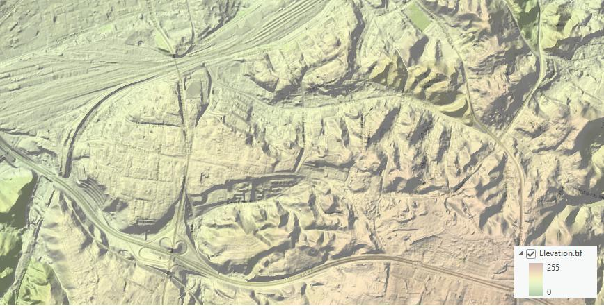
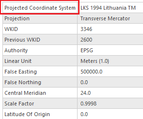
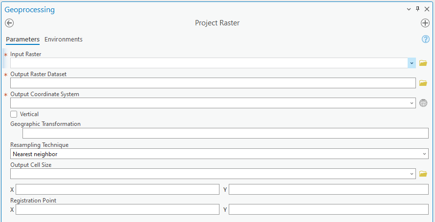
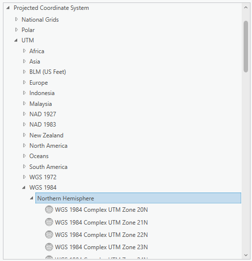
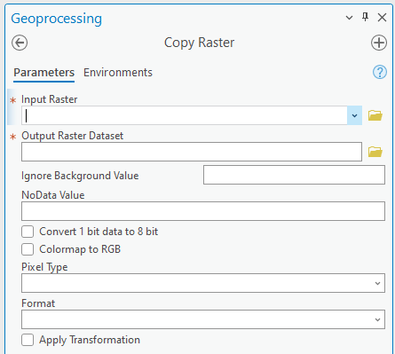
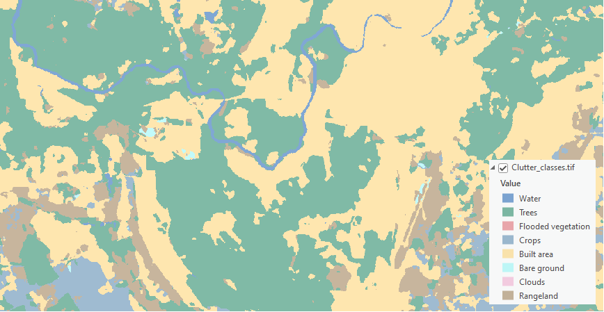
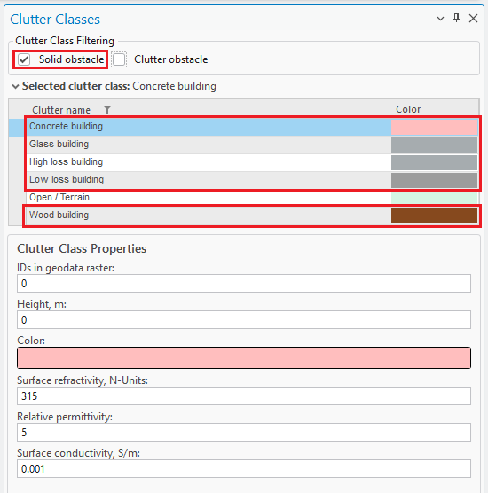
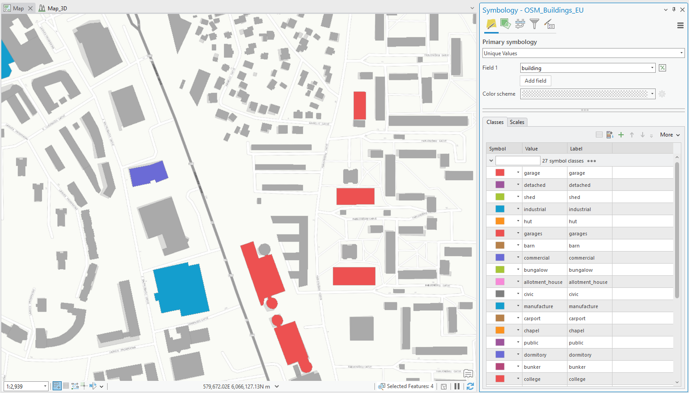

# Geographic Data

CE Desktop is designed to work with any geospatial data available to the customer and to fully exploit its precision for the most accurate coverage and QoS calculations. The platform supports multi-resolution input datasets — from freely available global sources such as [Sentinel-2 10 m land cover](https://livingatlas.arcgis.com/landcoverexplorer/) and ASTER DEM, to premium high-resolution terrain and 3D building models when provided by the customer or government agencies.

By leveraging whatever data is available locally, Cellular Expert performs calculations at the maximum feasible resolution, accurately modeling signal propagation even in dense urban environments. Support for 3D multi-height calculations ensures that coverage predictions reflect street-level, indoor, and rooftop conditions, providing a realistic representation of service availability.

This flexibility means existing GIS assets, open datasets, or commercial data already licensed can be turned into actionable coverage maps without additional data procurement.

By using terrain elevation, obstacles, and clutter classification in every calculation, Cellular Expert accurately models:

- **Line-of-Sight and Non-Line-of-Sight Conditions** — determining diffraction, reflection, and shadowing effects over hills, valleys, and urban obstacles.
- **Coverage Footprints** — generating precise signal strength maps at national, regional, and local levels.
- **Capacity and Interference Analysis** — modeling realistic signal overlaps and interference zones for multi-operator, multi-technology environments.

The CE tools make use of three distinct GIS data layers to obtain high-precision modeling of radio wave propagation losses:

1. **Digital Terrain Model (DTM)**, also known as Digital Elevation Model (DEM) — describes the Earth's surface, i.e. the path terrain profile in terms of ground elevation above uniform sea level.
2. **Obstacles layer** — delineates buildings and other objects above the Earth's surface that are principal impediments to radio wave propagation.
3. **Clutter layer** — delineates naturally occurring or human-cultivated ground cover that may be partially penetrable by radio waves, such as natural vegetation (forests, trees, bushes) or crops, gardens, parks, etc.

The resolution of the input data has a direct impact on prediction accuracy:

- Coverage calculated using **25 m resolution** ASTER DEM data gives a general view of signal distribution but with limited detail, especially in dense urban areas.
- Coverage calculated using **1 m resolution** data reveals a much more precise propagation pattern, including building-level shadowing and accurate street-by-street coverage.

Cellular Expert can easily integrate and process 1 m or even sub-meter topographical data, providing highly detailed RF calculations. This level of precision is essential for:

- Modeling 2G/3G/4G/5G, small cell, and mmWave networks.
- Identifying exact coverage gaps at the building and street level.
- Supporting regulatory-grade broadband mapping and planning.

By using high-resolution terrain and clutter data, Cellular Expert ensures that its calculations match real-world conditions as closely as possible, resulting in better network design decisions and more reliable planning outcomes.

## Geographic Data Requirements

Only **GeoTIFF** is supported. Topographical data must use specific file names:

| Data | Required file name |
|---|---|
| Digital Terrain Model | `elevation.tif` |
| Land use / clutter grid | `clutterClasses.tif` |
| Clutter heights (building, vegetation height) | `clutterHeight.tif` |

Mandatory geographical data:

- Digital Terrain Model (DTM) grid.

All geodata must be located in one catalog.

### Digital Terrain Model (DTM) Grid

> **Mandatory**

The Digital Terrain Model (DTM), also known as Digital Elevation Model (DEM), represents the Earth's ground level above sea level. Each raster pixel has its own height value.

A sample DTM raster represents, for example, 5 square meters per pixel with its height value. In reality, within a one-pixel area the height is not the same everywhere — the pixel's height value is the height at its center, or the maximum. The smaller the pixels, the more accurate the grid, but also the more data there is to calculate.



**Prepare DTM raster**

The Digital Terrain Model (DTM) has the following requirements.

**Projection**

The raster must use a Projected Coordinate System. To check the coordinate system of your raster, use the Properties function in ArcGIS Pro: add the raster to your project, right-click it, and select **Properties**. Then go to the **Source** tab **> Spatial Reference** and check the **Coordinate System Type** parameter to confirm it is a Projected Coordinate System.



If your raster is in a Geographic Coordinate System or needs a different projection, use the **Geoprocessing > Project Raster** tool to update it.



In the **Output Coordinate System**, specify a new coordinate system. It is recommended to use a UTM coordinate system under the WGS 1984 projection. You can find the appropriate [UTM zone for your area](https://www.arcgis.com/apps/mapviewer/index.html?layers=b294795270aa4fb3bd25286bf09edc51) online.



**Correct NoData value and raster name**

After setting the correct projection, assign the NoData attribute and specify the appropriate name for the DTM raster using the **Copy Raster** tool in Geoprocessing:



| Parameter | Value |
|---|---|
| Input Raster | Your newly projected DTM raster |
| Output Raster Dataset | Output location, with the raster name set to `elevation.tif` |
| NoData Value | `-9999` |
| Pixel Type | 32-bit signed or 32-bit float |
| Format | TIFF (set automatically) |

### Clutter Classes Grid

Land use, or clutter, refers to the classification of the Earth's surface into categories such as urban, suburban, rural, forest, water, and open land — each of which affects radio propagation differently. Clutter data is crucial because it determines how signals are absorbed, reflected, or diffracted by the environment, directly influencing coverage, interference, and quality of service.



The naming and classification of land use types varies by source. One example is the [Sentinel-2 Land Cover dataset from the Living Atlas](https://livingatlas.arcgis.com/landcoverexplorer/), which is freely available worldwide and is detailed in Cellular Expert databases. Once the workspace is created, a default clutter class table is automatically applied for each land use class.

These are the standard clutter types in the default workspace database and cannot be edited. You must map your clutter raster to these predefined clutter types. Standard mapping has already been configured for the Sentinel-2 Land Cover dataset from the Living Atlas.

If you have a different clutter class layer, it can be used for predictions by remapping it in the [Clutter Classes](5-data-management/5-5-clutter-classes.md) tool and specifying the IDs in the geodata raster parameter. If multiple clutter classes correspond to a single default clutter type, separate the ID values with commas. This mapping can also be adjusted in the Clutter table.

Once clutter classes are successfully mapped, the prediction algorithms recognize the clutter types, apply distinct symbols, and adjust path loss calculations accordingly, based on the parameters set in the prediction model.

### Prepare Clutter Classes raster

The Clutter Classes raster has the same requirements as the DTM raster above.

*Projection*

It must have the same coordinate system as your `elevation.tif` raster. If it has a different coordinate system, use **Geoprocessing > Project Raster** to fix it. In the Output Coordinate System, click the **Select Coordinate System** button and choose the same coordinate system as your `elevation.tif`.

*Correct NoData value and raster name*

After setting the correct projection, assign the NoData attribute and specify the appropriate name for the Clutter Class raster using the **Copy Raster** tool in Geoprocessing:

| Parameter | Value |
|---|---|
| Input Raster | Your newly projected Clutter Class raster |
| Output Raster Dataset | Output location, with the raster name set to `clutterClasses.tif` |
| NoData Value | `-9999` |
| Pixel Type | 32-bit signed or 32-bit float |
| Format | TIFF (set automatically) |

### Clutter Heights

Represents actual clutter heights, which override the default heights specified in the Clutter table. The clutter heights raster requires the accompanying `clutterClasses.tif` raster and cannot be used independently.

A clutter height raster can be derived from a Digital Surface Model (DSM) raster and a DTM raster using the ArcGIS Raster Calculator tool. Open **Geoprocessing > Spatial Analyst > Map Algebra > Raster Calculator** and use the following formula:

```
DSM – DTM
```

The calculation output is the difference between the DSM and DTM grids, representing the clutter heights.

### Prepare Clutter Height raster

The Clutter Height raster has the same requirements as the DTM raster above.

**Projection**

It must have the same coordinate system as your `elevation.tif` raster. If it has a different coordinate system, use **Geoprocessing > Project Raster** to fix it. In the Output Coordinate System, click the **Select Coordinate System** button and choose the same coordinate system as your `elevation.tif`.

**Correct NoData value and raster name**

After setting the correct projection, assign the NoData attribute and specify the appropriate name for the Clutter Height raster using the **Copy Raster** tool in Geoprocessing:

| Parameter | Value |
|---|---|
| Input Raster | Your newly projected Clutter Height raster |
| Output Raster Dataset | Output location, with the raster name set to `clutterHeight.tif` |
| NoData Value | `-9999` |
| Pixel Type | 32-bit signed or 32-bit float |
| Format | TIFF (set automatically) |

### Buildings

Building features within the Clutter Classes raster are automatically identified and categorized using a range of dedicated building-specific clutter types. These clutter types are available within the [Clutter Classes](5-data-management/5-5-clutter-classes.md) tool and are specifically designed to represent different architectural materials and structural characteristics.

All building-related clutter classes are treated as **Solid Obstacles**, ensuring accurate modeling of signal attenuation and reflection in propagation calculations. This classification enhances the realism and precision of both indoor and outdoor network predictions by accounting for the physical impact of built environments.



You can edit your Clutter Classes raster using standard ArcGIS Geoprocessing tools to integrate detailed building data into your existing clutter layer. The process supports both vector and raster input formats, depending on your data source — whether you are working with CAD-derived vectors or pre-classified raster layers.

If your building data is in vector format (e.g. polygons), first convert it to raster before incorporating it into the Clutter Classes layer:



1. **Convert Vector to Raster** — use the **Polygon to Raster** tool in the Geoprocessing pane to transform your vector-based building footprints into a raster format suitable for clutter classification.
2. **Update Clutter Classes Using Raster Calculator** — after conversion, open **Geoprocessing > Spatial Analyst > Map Algebra > Raster Calculator** to integrate the new raster into your existing clutter layer. Use a map algebra expression to merge or replace values as needed, assigning appropriate clutter class codes to building areas, for example:

```
Con(IsNull("building raster"), "Clutter_classes.tif", 0)
```

> **Note:** When incorporating building data into the Clutter Classes raster, you can assign any numeric value to represent the "Buildings" clutter class — in the example above, a value of `0` is used, but you may choose any value as long as it does not conflict with existing clutter class values already present in your raster. Document your chosen value and update your Clutter Class definitions accordingly within the Clutter Classes tool to maintain consistency across your modeling environment.

All propagation and prediction calculations reference the clutter types defined in the Clutter Classes table. Each building-related clutter class is assigned a unique ID value, which is used during modeling to apply the appropriate path loss parameters for solid structures — ensuring buildings are accurately represented in simulations and contribute to more realistic signal behavior in both indoor and outdoor environments.

**Building height determination in clutter-based modeling**

Pixels assigned to a building clutter class ID are automatically recognized as a solid obstacle during prediction calculations. Their heights are determined using the following priority:

1. From the associated Clutter Height raster, if available — this provides the most accurate, location-specific height information.
2. If no Clutter Height raster is present, the system defaults to the height value defined in the Clutter Classes table for the corresponding clutter ID.
