# Workspace

This chapter describes the Cellular Expert workspace functionality, shared across all CE Pro modules. For the Indoor-specific creation flow, see [Create Indoor Workspace](4-2-create-indoor-workspace.md).

## Workspace Tool

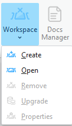

### Workspace Table

A Cellular Expert workspace is a geodatabase containing data tables, feature datasets, and the workspace definition table. After creating a new workspace database, the workspace definition table is named `CE_WORKSPACE` and contains information about the dataset.

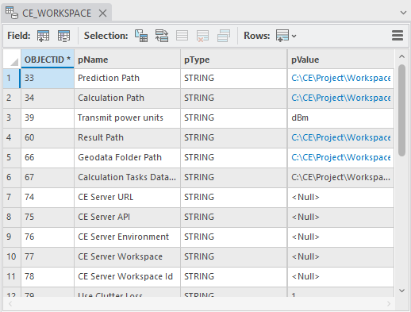

Data field types and values:

| Field | Type |
|---|---|
| OBJECTID | Long integer |
| pName | Text |
| pType | Text |
| pValue | Text |

When moving your project's directory to another location (e.g. to another computer), it is necessary to update the workspace parameters by referencing the new paths so the project loads correctly:

- **Prediction Path** — path for storing prediction grids.
- **Calculation Path** — path for temporary calculations.
- **Calculation Tasks Data Path** — path for saving calculation tasks.
- **Geodata Folder Path** — path for geodata (prediction models do not have geodata options; topographical data is taken from the Geodata Folder Path).
- **Result Path** — path for final results.

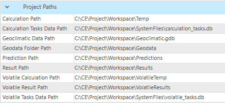

Workspace calculation paths and settings can be previewed in **Workspace > Properties**, which shows all parameters listed in the `CE_WORKSPACE` table.

### Create Workspace

Steps to create a new workspace:

1. Click the **Create** button in the Cellular Expert **Workspace** menu.
2. The **Create** dialog appears. Fill in the minimum required data:

   **New workspace path**
   Automatically filled based on the ArcGIS Pro project location. It is recommended to first save your ArcGIS Pro project and then open **Workspace > Create**. The project's workspace folder is automatically created in the ArcGIS Pro project location catalog, so both the ArcGIS Pro and CE workspace live in the same location.

   **Geodata folder path**
   The catalog where geodata files are stored — see [Geographic Data](../3-geographic-data.md) for requirements. Click **Browse** to define the Geodata catalog. Geodata must use specific names:
   - The Digital Terrain Model must be named `elevation.tif`
   - The land use (or clutter) grid must be named `clutterClasses.tif`
   - The clutter heights (typically building and vegetation height) grid must be named `clutterHeight.tif`

   > **Note:** The projected coordinate system is filled in automatically, taken from the defined Elevation grid. This coordinate system is then assigned to your project feature layers.

   When creating a new workspace using geodata that contains a clutter classes raster, default class IDs can be set by clicking **Set Default Clutter Class IDs**. The default ID values are based on Living Atlas clutter. Clutter class IDs can also be set manually, either before or after the default values are set — click **Manually Set Clutter Class IDs** to open the manual editor, where each clutter class can be edited to designate its used and unused types, indicated by distinct colors.

   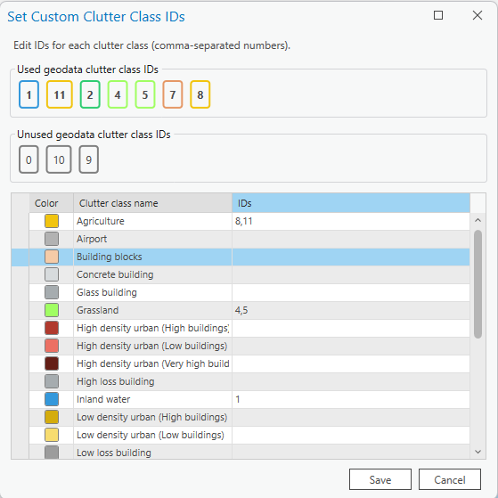

   Several messages relate to Geodata:
   - If only Elevation exists in the Geodata catalog, the tool notes that Clutter Classes and Clutter Height are optional.

     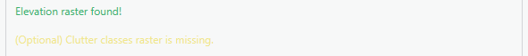

   - If the coordinates of elevation and clutter mismatch, close the **Create** tool and fix the geodata — use the Geoprocessing **Define Projection** tool to assign the same coordinate system as `elevation.tif` to your `clutterClasses.tif` and, if present, `clutterHeight.tif` rasters.

     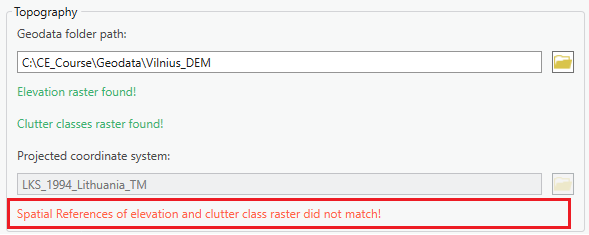

     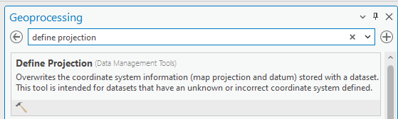

   **Also Create Local Scene**
   Creates a second scene for 3D visualization.

   

   **Included Templates**
   When creating a new workspace, you can also choose which Cell and Repeater templates are provisioned into it, grouped by technology (2G, 3G, 4G, 5G, WiFi for Cells; 2G, 3G, 4G, 5G for Repeaters). Individual templates or entire technology groups can be selected or deselected. By default, all templates are enabled — deselecting unused technologies keeps the new workspace clean and uncluttered by objects from unrelated technology stacks. This selection does not affect previously created workspaces.

   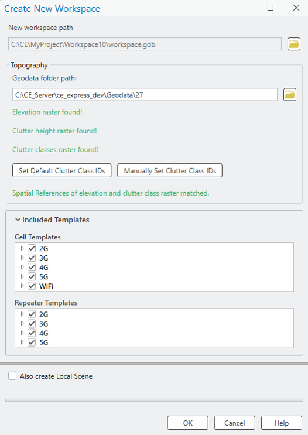

3. Press **OK** to start the workspace creation procedure. The Cellular Expert layer and geodata are added to the project, and the workspace geodatabase and required folders are created.

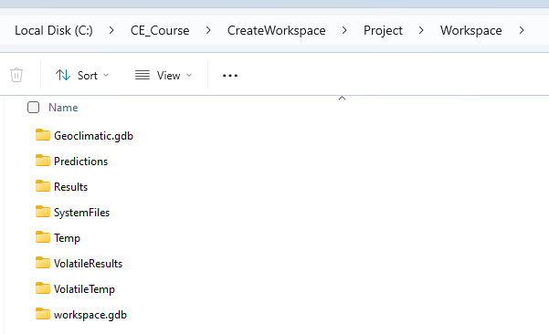

The Project Paths are filled in under **Workspace Properties > Parameters**.

### Open Workspace

Steps to open a workspace:

1. Click **Open** in the **Workspace** menu of the Cellular Expert toolbar.
2. Specify the workspace name and click **OK**.

The specified workspace is activated automatically.

### Remove Workspace

Selecting **Remove** in the **Workspace** dropdown menu removes the workspace from the currently open ArcGIS Pro project.

### Workspace Upgrade

Workspace Upgrade is a tool that lets you update missing tables from the default database (`default.gdb`). If a table exists, Workspace Upgrade also checks whether all default fields are present in it. Toggled tables are updated (upgraded) by the tool.

New versions of CE for ArcGIS Pro usually bring changes to the default data tables. This tool is especially useful for checking whether the newest version's tables correspond to the current project's tables. Workspace Upgrade automatically checks these parameters and notifies the user on project start-up.

| Parameter | Description |
|---|---|
| Refresh Cellular Expert Layers | Imports missing layers from the Cellular Expert Dataset. |
| Reimport Antennas | Imports the deleted default antennas back into the Antennas table. |
| Generate Antenna Type | Based on the Antenna data, assigns antennas a type if they are missing one. |
| Run Analysis | Manually checks whether the default tables and their fields exist in the project. |

**Upgrade Database**
Creates the missing tables and/or adds back the missing fields from the default tables.

If a project with incompatible geodata is loaded, the Workspace Upgrade tool analyzes the current geodata as well as the owned Esri Extension licenses to offer the optimal geodata upgrade path. This process is one-time only and is triggered by checking the **Upgrade Geodata** toggle:

- If only `elevation` and `buildingHeight` rasters exist, `buildingHeight` can automatically be renamed to `clutterHeight`.
- (Image Analyst and Spatial Analyst licenses only) If `elevation`, `buildingHeight`, and `clutterHeight` rasters exist, raster calculations merge the `buildingHeight` and `clutterHeight` rasters.
- (Image Analyst and Spatial Analyst licenses only) If `elevation`, `buildingHeight`, `clutterHeight`, and `clutterClasses` rasters exist, raster calculations merge the `buildingHeight` and `clutterHeight` rasters, and modify the `clutterClasses` raster to add building outlines with ID `0`.

### Workspace Properties

The Workspace Properties dialog shows all workspace information from the `CE_WORKSPACE` data table and lets you customize the symbol visualization. To open it, click the **Workspace** menu icon and choose **Properties**.

**Parameters**

All information from the `CE_WORKSPACE` table is represented in the **Parameters** tab.

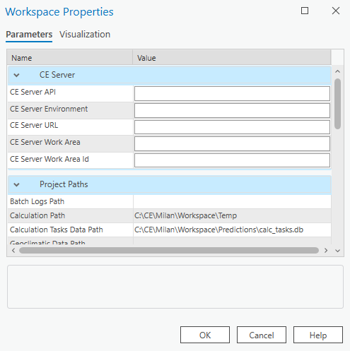

*CE Server Parameters*

| Parameter | Description |
|---|---|
| ArcGIS Portal URL | Connection URL to the ArcGIS Portal website. |
| CE Server API | Connection URL to the Cellular Expert Server API. |
| CE Server Environment | The Cellular Expert Server environment in which it is run. |
| CE Server URL | Connection URL to the Cellular Expert Server. |
| CE Server Workspace | The workspace used in the Cellular Expert Server. |
| CE Server Workspace ID | The ID of the workspace used in the Cellular Expert Server. |

*Project Paths Parameters*

| Parameter | Description |
|---|---|
| Calculation Path | Path for temporary calculation results. |
| Calculation Tasks Data Path | Path for the calculation results displayed in the [CE Calculation Task List](../7-coverage-prediction/7-1-ce-calculation-task-list.md). |
| Geodata Folder Path | Path to the folder where the geodata for the Cellular Expert Workspace is stored. |
| Prediction Path | Path for storing prediction grids. |
| Result Path | Path for storing the final calculation results. |
| Volatile Calculation Path | Path for temporary Quick Prediction calculation results. |
| Volatile Result Path | Path for storing the final Quick Prediction calculation results. |
| Volatile Tasks Data Path | Path for the Quick Prediction calculation results displayed in the CE Calculation Task List. |

*Project Settings Parameters*

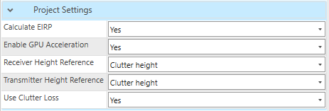

**Calculate EIRP**
Determines whether EIRP is calculated in prediction calculations.
- **Yes** — EIRP is calculated based on Power, Antenna Gain, and Misc. Loss values.
- **No** — EIRP is taken as the single value defined in the Power field.

**Enable GPU Acceleration**
Enables GPU acceleration, which optimizes prediction calculations and makes them run faster. Possible values: Yes/No.

**Transmit Power Units**
Represents the power value in dBm or Watts.

**Receiver/Transmitter Height Reference**
The reference raster for calculating the receiver's and transmitter's height for Profile, RF Predictions, Quick Predictions, Visibility, and other prediction tools. Possible values:

- **Elevation** — the reference layer is the `elevation.tif` raster. Default.
- **Clutter height** — the reference layer is the `clutterHeight.tif` raster; receiver/transmitter height is calculated over the Clutter Height raster. A `clutterHeight.tif` raster is required to enable this option.
- **Clutter height (buildings only)** — height reference is calculated using the Building class from the `clutterClasses.tif` raster. The Building class is defined in the Clutter Classes dialog and linked to a specific clutter class ID in the `clutterClasses.tif` raster.
- **Absolute** — the receiver's and/or transmitter's absolute height (relative to sea level) is used in relevant calculations.

**Use Clutter Loss**
Determines whether `clutterClasses.tif` and `clutterHeight.tif` rasters are used in prediction calculations. Possible values: Yes/No.

**Rounding**
The rounding value applied to different parameters (Azimuth and Tilt, Default Rounding, Frequency, Geographic Coordinates, Power, Projected Coordinates).

**Visualization**

The Cellular Expert network objects (Sites, Cells, OMEN) and calculation result rasters are represented in ArcGIS with the symbology defined in `.lyr` files, located in the **Visualization** tab (`CE_LAYERS` table).

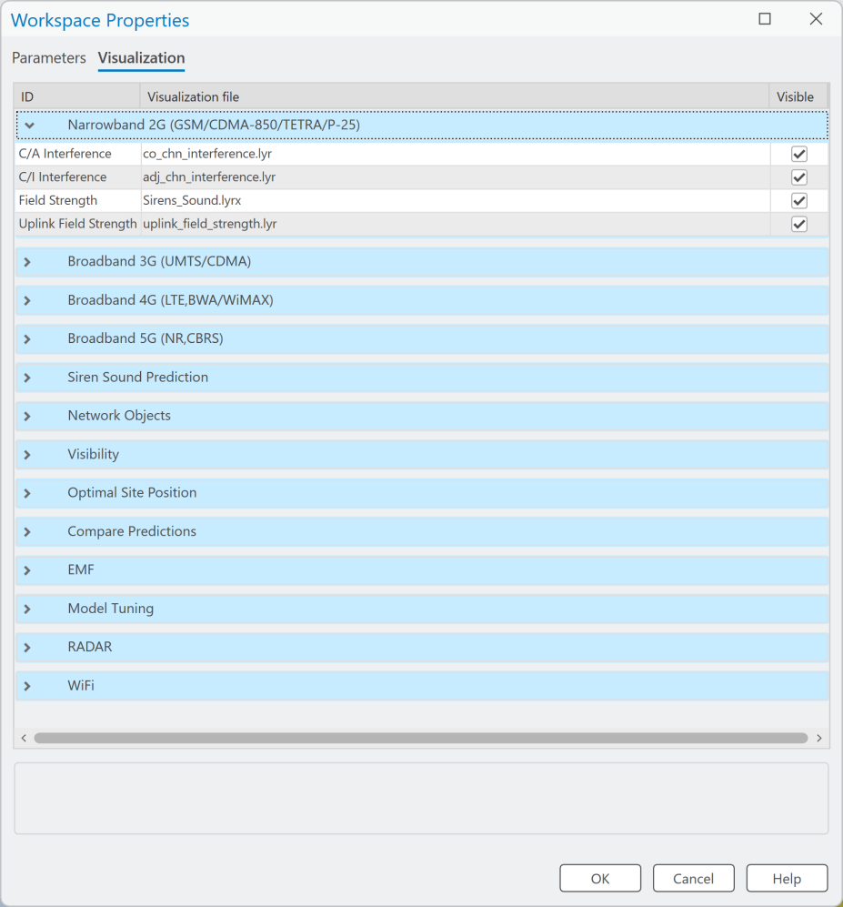

All visualization settings have **Visible** set to On by default. If **Visible** is set to off, the next time a relevant calculation is performed, the associated rasters are added to the map with visibility disabled. This applies only to calculations performed after the setting is changed, and does not affect rasters already on the map.

The symbology is defined as a list of layers and `.lyr` files:

- **Narrowband 2G (GSM/CDMA-850/TETRA/P-25)** — second-generation network (e.g. GSM) calculations, or technology-independent calculations (for example, the symbology for antenna loss by tilt is defined by the same file for WiMAX, LTE, and other technologies).
- **Broadband 3G (UMTS/HSDPA)** — results for UMTS, HSDPA, and other 3–3.5 generation technologies.
- **Broadband 4G (LTE, BWA/WiMAX)** — results of LTE technology calculations.
- **Broadband 5G (NR, CBRS)** — results of 5G-NR technology calculations.
- **Siren Sound Prediction** — results of sirens calculations.  **Applies to:** RCP.
- **Network objects** — Sites, Cells, OMEN.
- **Visibility** — results of Visibility Calculations.
- **Optimal Site Position** — results of optimal site positioning.
- **Compare predictions** — results of comparing several predictions.
- **EMF** — results of EMF calculations.
- **Model Tuning** — results of model calibration.
- **Radar** — results of radar coverage calculations.
- **Wi-Fi** — results of Wi-Fi coverage calculations.

For example, the layer "4G Downlink Throughput" with the path `dl_ul_throughput.lyr` means the 4G downlink bitrate prediction raster is represented in ArcGIS using the symbology file `.../Cellular Expert/Layers/dl_ul_throughput.lyr`.

> **Note:** If you change the symbology using ArcGIS tools, the change is saved only in the current ArcGIS project. When you re-open the same Cellular Expert workspace in another ArcGIS project, the symbology defined in the Visualization tab of the Workspace Properties dialog is used instead.

To create a new visualization and register it in Workspace Properties:

1. Right-click the layer with the modified symbology (e.g. Sites) in the ArcGIS Table Of Contents.
2. Choose **Sharing > Save As Layer File…**.
3. Save the file with a given name (e.g. `Sites_my_symbol.lyrx`).
4. Copy/paste it to `C:\Program Files\Cellular Expert\Layers`.
5. Open the Cellular Expert workspace in which you want to use your symbology.
6. Open **Workspace Properties** and select the **Visualization** tab.
7. Select the row with the corresponding layer name (e.g. Sites).
8. Click the browse button and locate your layer file (e.g. `C:\Program Files\Cellular Expert\Layers\Sites_my_symbol.lyrx`), which contains the modified symbols. Press **OK**.

The symbology for the Cellular Expert network objects (Sites, Cells, OMEN) is applied to the layers the next time you open the workspace. To see the changes immediately, re-open the workspace (close it with **Remove** and open it again with **Open** from the Workspace menu).

The new symbology is uploaded and remains assigned to the workspace database independently of the ArcGIS project file.

> **Note:** When using layer files for visualization, remember that if you move your workspace to another location, the file path settings can become incorrect. If Cellular Expert cannot find your defined symbology file, it uses the default file from `.../Cellular Expert/Layers`.

## Docs Manager

Docs Manager manages saved Profiles between the transmitter (Tx) and receiver (Rx) generated in the [Profile](../6-profile.md) tool, as well as saved Link Prediction results, Profile Reports, and Link Prediction Reports. When a profile is saved in the Profile tool, it is automatically stored in Docs Manager, allowing users to reopen it at any time — preserving all parameters and calculations related to Tx and Rx for future reference, without needing to reconfigure settings repeatedly. The same applies to Link Prediction results, and reports can be reopened even if the originally exported document has since been deleted or moved.

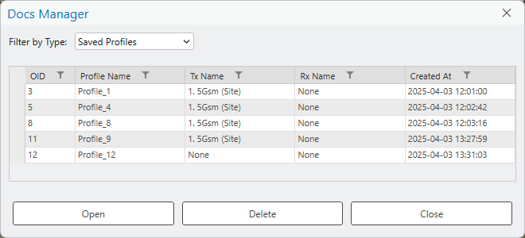

**How to find a saved profile**
Use the filter option on each column to quickly locate the required item from the list.

**How to open a Profile**
A saved profile can be accessed in two ways:

1. Double-click the desired profile.
2. Select the profile and click **Open**.

**Additional functions**

- **Delete** — removes the selected item.
- **Close** — closes the Docs Manager dialog.

**How to open a Link Prediction**
A saved Link Prediction, like a Profile, can be accessed either by double-clicking the desired result, or by selecting it and clicking **Open**.

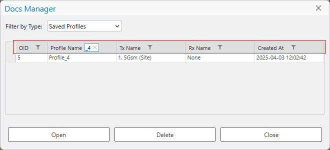

**How to save a Link Prediction**
A Link Prediction result can be saved to Docs Manager by enabling **Save result to Docs Manager** in the Link Prediction tool.

**How to open a Profile Report**
A Profile Report document can be accessed either by double-clicking the desired Profile Report, or by selecting it and clicking **Open**. It opens in your default PDF document reader.

**How to save a Profile Report**
A Profile Report of the currently drawn profile can be saved to Docs Manager by enabling **Save result to Docs Manager** in the **Export** tab of the Profile tool.

**How to open a Link Prediction Report**
A Link Prediction Report document can be accessed either by double-clicking the desired report, or by selecting it and clicking **Open**. It opens in your default PDF document reader.

**How to save a Link Prediction Report**
A Link Prediction Report can be saved to Docs Manager by enabling **Save result to Docs Manager** in the **Export** tab of the Link Prediction tool.

## CE Express Connection

CE Express Connection establishes a connection between the CE Express database and CE for ArcGIS Pro. Once the connection is established, data can be retrieved from CE Express and uploaded to the CE for ArcGIS Pro workspace.

For the connection to be established, you must have access to ArcGIS Portal and a valid CE Express URL.

### Properties

Click the CE Express Connection button and select the **Properties** tab to open the CE Express Connection dialog. To connect to CE Server Express and get the list of workspaces, insert the Server URL in the corresponding field, then press **Get Workspaces**. If you select one of the resulting workspaces, its properties are saved to your current ArcGIS Pro project automatically.

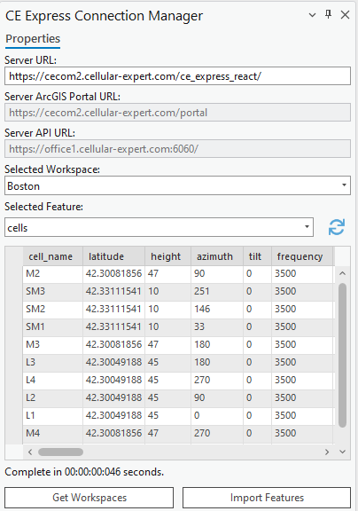

| Parameter | Description |
|---|---|
| Server URL | The URL to the CE Express database where the workspaces are located. Required to connect to the database. |
| Server ArcGIS Portal URL | The URL to your organization's ArcGIS Portal (filled in automatically). |
| Server API URL | The API used in the connection process (filled in automatically). |
| Selected Workspace | The list of all workspaces retrieved from the CE Express database. |

**Get Workspaces**
Establishes the connection between the provided Server URL and CE for ArcGIS Pro. You may be redirected to a browser window to log in to ArcGIS Portal — after doing so, the workspaces are retrieved.

**Import Features**
Imports the retrieved objects into the currently open CE workspace.
