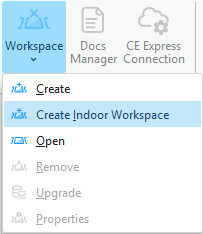
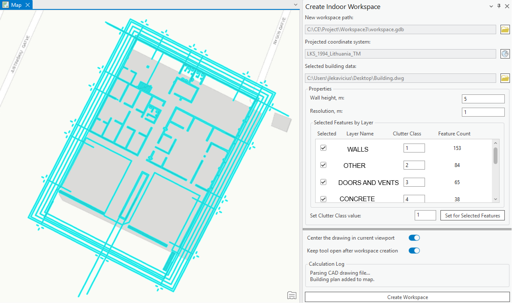

# Create Indoor Workspace

> **Applies to:** Indoor.

Create Indoor Workspace builds a Cellular Expert workspace directly from a CAD building drawing, generating the `elevation.tif`, `clutterClasses.tif`, and `clutterHeight.tif` rasters needed for indoor coverage prediction. It complements the generic [Create Workspace](4-1-workspace.md#create-workspace) flow described on the shared Workspace page.

Steps to create a workspace from a CAD drawing:

1. Click **Create Indoor Workspace** in the Cellular Expert **Workspace** menu.

2. The **Create Indoor Workspace** dockpane appears. A new workspace path with a new directory is created automatically, but can also be changed with the browse button. Select the projected coordinate system by clicking the button with the globe icon.

3. Before selecting the building data, if the data is not georeferenced, enable **Center the drawing in current viewport** (on by default) — this centers and scales the building drawing to the current map viewport. If the building data is already georeferenced, turn this option off to place it in its intended location on the map.

4. Once the projected coordinate system is selected, select the building data. Click the folder button and choose the file. Supported formats: `.DWG`, `.DXF`, `.SHP` (line shapefile), `.PDF` (raster and vector documents).

## If a CAD Drawing (`.DXF`, `.DWG`) Is Selected

Once the CAD drawing is selected, it is added to the map and its properties can be adjusted:

| Property | Description |
|---|---|
| Feature type | Default selected type is **Polyline** — the polyline layer/group used to select the features that are transformed into geodata. |
| Wall height, m | The value used in the resulting `clutterHeight.tif` raster. |
| Resolution, m | Also affects the width of the drawing lines — e.g. walls are thicker or thinner depending on the resolution. |

## If Line Shapefile Data (`.SHP`) Is Selected

The same procedure applies as for CAD files. However, several `.SHP` files can be selected in the file selection dialog — if more than one is selected, they are treated as a single building data unit.

## If a PDF Document (`.PDF`) Is Selected

There are two options for converting a PDF document into a building plan drawing (DXF format):

- **Vector** — select this if the PDF document contains the building plan as vector lines.
- **Raster** — select this if the building plan is an image within the PDF document.

If **Vector** is selected, an option to filter text in the PDF document appears. When on (default), text in the document is filtered out, keeping only the building drawing; when off, text is retained in the building drawing.

If **Raster** is selected, an option to define the PDF document DPI appears. A higher DPI produces a more accurate building plan conversion but takes longer to process.

For PDF documents, the page containing the building plan data must be selected (by default, the first page).

## Finishing the Workspace

Use the **Select** tool on the map to specify which features are used for workspace creation (for instance, if only some features are required). Clutter classes for each layer can also be edited — by default they are incremented from 1 to the number of layers selected — or a single clutter class value can be applied to all layers by clicking **Set Class for All Features**.

If you need to scale, move, or rotate the selected section of the building, use the **Move** tool.

Once you have transformed the selected territory with the Move tool (or Scale/Rotate) and confirmed the location of the selection, click **Create Workspace** to start the workspace creation procedure. The workspace is activated automatically.

If **Keep tool open after workspace creation** is enabled, the dockpane remains open and the created polylines are retained, so you can reposition the drawing and recreate the geodata again.

The created `clutterHeight.tif`, `clutterClasses.tif`, and `elevation.tif` rasters are stored in the Geodata folder, located inside the workspace folder.
