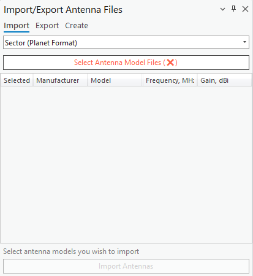
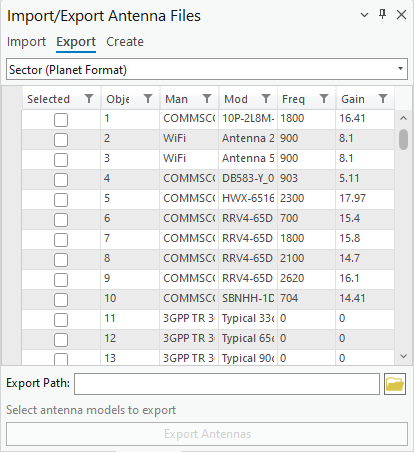
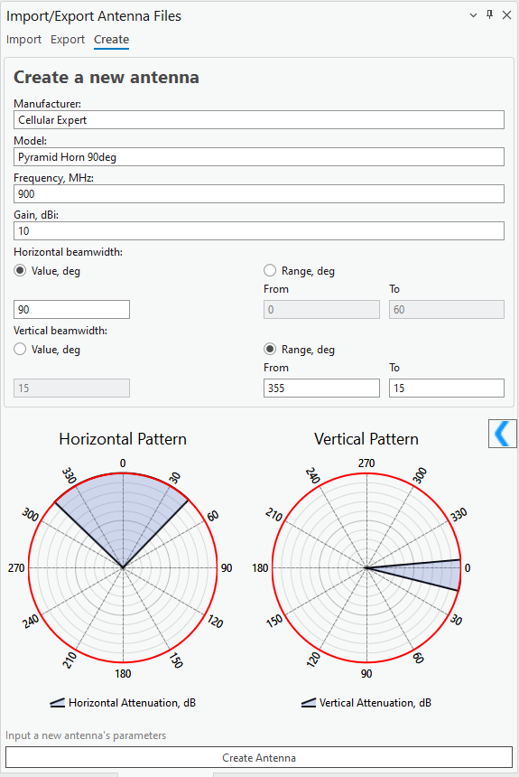

# Import / Export Antenna Files

## Import Antennas

Click the Import/Export Antenna Files toolbar button and select **Import** to import antenna patterns. This opens a dialog where you select the antenna pattern files to import into the Cellular Expert database — select the antenna type from the dropdown list, then proceed.

| Control | Description |
|---|---|
| Select Files | Opens a dialog to select one or more antenna pattern files to import. Supported formats: Planet, Andrew, and NSMA. |
| Import Antennas | Imports the selected antenna pattern files into the Cellular Expert database. |
| Refresh | Refreshes the data table if changes have been made to it. |

## Export Antennas

Exports selected antennas to a chosen format. Click the Import/Export Antenna Files button and select **Export**, choose the export path on your local hard drive, check the desired antennas, and click **Export**.

| Field | Description |
|---|---|
| Export Path | The destination folder on your local hard drive for the exported antennas. Enter manually, or click the browse button to select it. After the antenna format is defined, all available antennas of that format are displayed in the Antennas table. Supported formats: Planet, Andrew, and NSMA. |
| Export Antennas | Exports the chosen antennas to the selected destination folder. |

## Create Antennas

Creates new antennas from input parameters. Click the Import/Export Antenna Files button and select **Create**.

| Field | Description |
|---|---|
| Manufacturer | The antenna manufacturer name. |
| Model | The antenna model name. |
| Frequency, MHz | The antenna's operating frequency. |
| Gain, dBi | The antenna gain. |
| Horizontal beamwidth | Set as a single **Value, deg**, or as a **Range, deg** (From/To). |
| Vertical beamwidth | Set as a single **Value, deg**, or as a **Range, deg** (From/To). |

For the selected horizontal and vertical values or ranges, the horizontal and vertical attenuations are set to `0` within the beamwidth, while all other attenuations are set to `1000`. Based on the horizontal and vertical beamwidths, the horizontal and vertical antenna patterns are displayed live in the panel. Click **Create Antenna** to save the new antenna.
