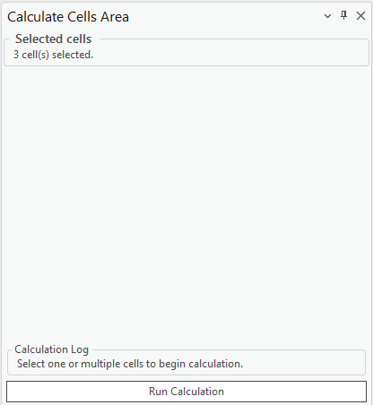
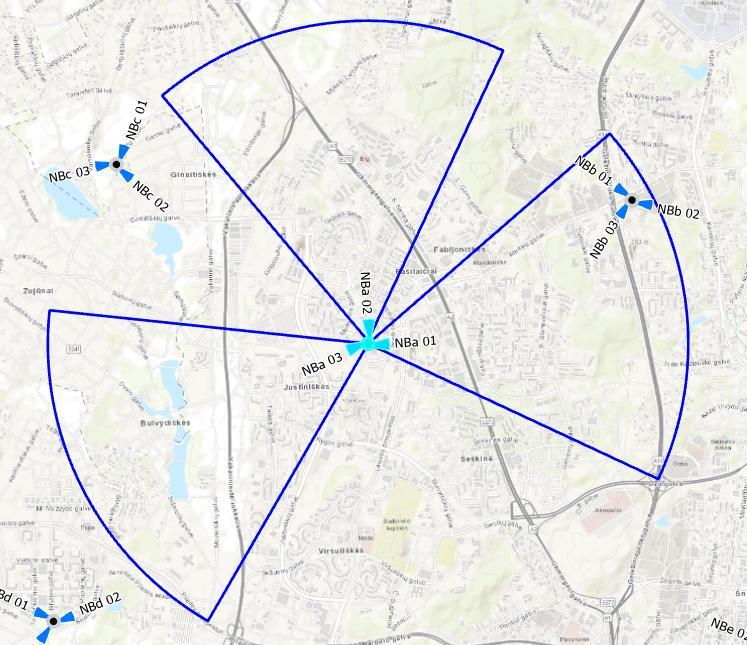

# Calculate Cells Area

> **Applies to:** SAT, RCP.

The Calculate Cells Area tool computes the service areas of selected cell sites within the map and displays them as polygons in a new layer. By selecting one or more cells, you can initiate a calculation that considers parameters such as cell azimuth, horizontal beamwidth, and antenna patterns to generate precise coverage polygons.

1. Choose the Calculate Cells Area button to open the tool.
2. Select the cells the calculation will be performed for, then press **Run Calculation**.

The cell areas are drawn on the map in a separate layer, **CE Cell Area Results**. In the results group layer, the servitude polygons can be toggled for each cell.

The polygons represent the cell area where the antenna's horizontal pattern attenuation at each angle is lower than a threshold of 3 dB.

> **Note:** The maximum radius depends on the defined Prediction Model and the Radius value set for the Cell object — for example, the CEC ITU-R (100MHz–6GHz) model shown above uses a 3 km radius. Using a bigger radius produces larger service-area polygons.
