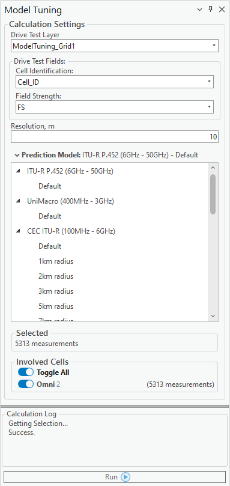
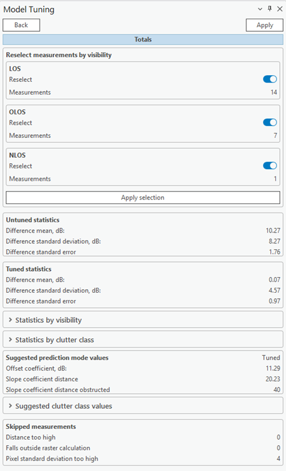

# Model Tuning

> **Applies to:** SAT, RCP.

Click the Model Tuning button to open the dialog. Model Tuning optimizes prediction model parameters based on drive test points. These measurements must be placed on a custom feature class and bound to a cell by its cell ID.

The custom drive test feature layer (class) must have these fields:

- Field Strength (`fs` in the class table)
- Latitude
- Longitude
- `Cell_id` (binds the drive test point to a cell network object)

Cells must be present on the map for the calculation to work — their Object ID should correspond to the `cell_id` present in the feature class's table. Once you select a Drive Test Layer, the following properties become visible:

| Field | Description |
|---|---|
| Drive Test Layer | The feature layer (class) used to tune the prediction model parameters. |
| Cell Identification | The cell name field in the drive test layer. The tool uses the Object ID value of Cell network objects to map drive test points. |
| Field Strength | The Field Strength field name in the drive test layer. |
| Resolution | Cell size for model tuning. |
| Prediction Model | The prediction model name and type whose parameters will be tuned. |
| Selected | The count of all measurement points. |

**Involved Cells**

Information about each cell — name, cell ID, and number of measurements assigned to it. Measuring for a single cell at a time is supported.

- **Toggle All** — include/exclude all selected cells.
- **Toggle button by the cell** — include/exclude specific cells from the test calculations.

Select the cells for the drive test by clicking the checkboxes, then press **Run Calculation**. Results appear in the dockpane, containing the general, prediction model, and clutter values of the calculation.

Measurement points can be reselected by visibility — **LOS**, **OLOS**, or **NLOS** — allowing an easy rerun of the tool with only the relevant points, for further tuning of the model.

## Untuned and Tuned Statistics

The comparison between the untuned and tuned prediction models is presented by highlighting the differences in their mean values, standard deviations, and standard errors:

- **Difference Mean** measures how the average prediction accuracy/performance improves after optimizing model parameters, compared to the default settings — for example, tuning might reduce the average prediction error, leading to more accurate coverage or signal estimations.
- **Standard Deviation** reflects the variability in prediction performance. Comparing standard deviations between untuned and tuned models shows whether tuning makes predictions more consistent and reliable — a lower standard deviation after tuning indicates the model's predictions are less scattered and more stable.
- **Standard Error** quantifies the precision of the mean prediction. A lower standard error in the tuned model suggests the average prediction is more reliable and less influenced by sample variability, indicating improved model stability and confidence in its performance.

Statistics by visibility and by clutter class are also available. Untuned and tuned difference points are also visualized on the map, as part of the model tuning calculation result, in separate layers.

The results panel also reports:

- **Suggested prediction model values** — model coefficients recommended for change, e.g. Offset coefficient (default `32` dB), Slope coefficient distance (default `20`), Slope coefficient distance obstructed (default `40`).
- **Suggested clutter class values** — recommended clutter loss values.
- **Skipped measurements** — points excluded for reasons such as distance too high, falling outside the raster calculation, or pixel standard deviation too high.

| Button | Description |
|---|---|
| Apply | Edits the tuned prediction model with the suggested model and clutter class values. |
| Back | Returns to the main Model Tuning calculation window. |
