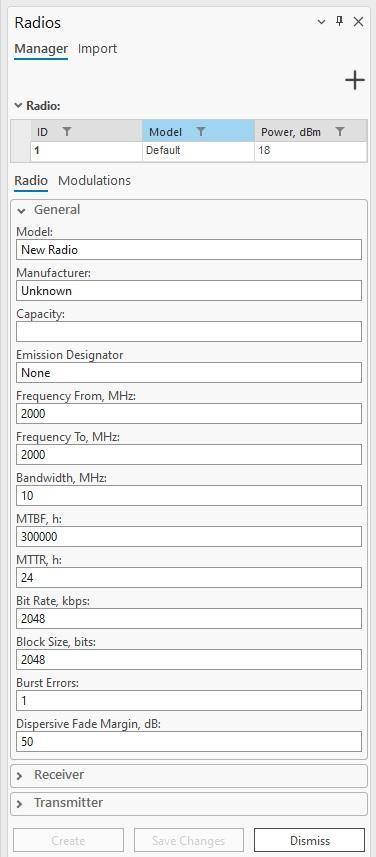
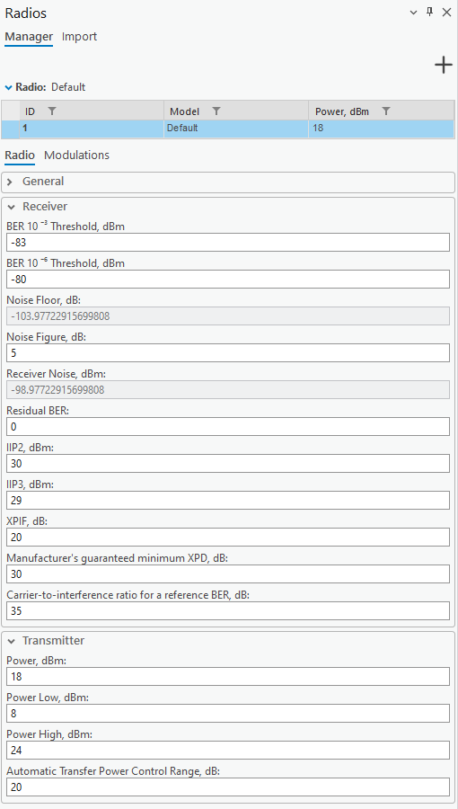

# Radios

> **Applies to:** RLP.

Click the Radios button to open the Radios dockpane. The **Manager** tab lets you create, delete, edit, or duplicate radios. The **Import** tab lets you import radios from supported format (`.raf`) files.

Radios are specific to the CE for ArcGIS Pro RLP license. Radios are required to create a [Link](../5-2-add-object/5-2-6-rlp/5-2-6-2-add-link.md) and are used in Link calculations.

## Manager Tab

Click an existing radio in the table at the top of the dockpane to edit its properties and save them. Right-clicking an existing radio opens a context menu with **Duplicate** and **Delete** options.

| Control | Description |
|---|---|
| + | Initializes a new radio with default parameters. |
| Save Changes | Saves changes to the radio currently being edited. |
| Create | Creates a new radio with the specified parameters. |
| Dismiss | Cancels all changes made to the radio and closes the dockpane. |

### Radio Properties — General

| Parameter | Description |
|---|---|
| Model | Radio identification or name. |
| Manufacturer | Radio manufacturer (company or entity). |
| Capacity | Maximum data throughput of the radio. |
| Emission Designator | Code describing the characteristics of the radio emission, including modulation type, signal nature, and bandwidth. |
| Frequency From, MHz | The lower limit of the frequency range for the radio communication channel. |
| Frequency To, MHz | The upper limit of the frequency range for the radio communication channel. |
| Bandwidth, MHz | Range of frequencies within which the radio operates. Required for 4G and 5G technologies. |
| MTBF, h | Mean Time Between Failures — average time between successive failures of the radio system during normal operation, indicating reliability. |
| MTTR, h | Mean Time To Repair — average time required to repair the radio system after a failure, indicating maintainability. |
| Bit Rate, kbps | Number of bits transmitted per second over the communication channel. |
| Block Size, bits | Number of bits grouped as a single unit of data for transmission or processing. |
| Burst Errors | Sequences of errors occurring in clusters, typically caused by noise or interference affecting multiple consecutive bits. |
| Dispersive Fade Margin, dB | Additional signal strength required to overcome dispersion and fading effects in the radio communication system. |

### Radio Properties — Receiver

| Parameter | Description |
|---|---|
| BER 10⁻³ Threshold, dBm | Receiver sensitivity threshold for BER = 10⁻³. |
| BER 10⁻⁶ Threshold, dBm | Receiver sensitivity threshold for BER = 10⁻⁶. |
| Noise Floor, dB | The minimum power level of unwanted noise or interference at the receiver at the base station. |
| Noise Figure, dB | Degradation of the signal-to-noise ratio (SNR) as a signal passes through a radio component or system. Required for 4G and 5G technologies. |
| Receiver Noise, dBm | The sum of Noise Floor and Noise Figure. |
| Residual BER | The remaining bit error rate after all error correction methods have been applied. |
| IIP2, dBm | Second-order intercept point — indicates the linearity of a radio receiver's resistance to second-order intermodulation distortion. |
| IIP3, dBm | Third-order intercept point — indicates the linearity of a radio receiver's resistance to third-order intermodulation distortion. |
| XPIF, dB | Cross-polarization interference factor — interference from signal components with orthogonal polarization states. Default `20`. Must be greater than 0 for rain ITU fading calculations to work. |
| Manufacturer's guaranteed minimum XPD, dB | The manufacturer's guaranteed minimum cross-polar discrimination. Default `30`. |
| Carrier-to-interference ratio for a reference BER, dB | Default `35`. |

### Radio Properties — Transmitter

| Parameter | Description |
|---|---|
| Power, dBm | Power value. |
| Power Low, dBm | The minimum power level at which the radio transmits. |
| Power High, dBm | The maximum power level at which the radio transmits. |
| Automatic Transfer Power Control Range, dB | The range over which the radio can automatically adjust its transmission power. |

### Modulations

Selecting the **Modulations** tab lets you assign a modulation to a radio. Adaptive modulations are displayed in a table by ID and technology name. The modulations available for assignment are listed in a dropdown below the table — press the assign button to add the selected modulation to the radio. Several modulations can be assigned to a radio, and their parameters can be edited.

## Import Tab

Selecting the **Import** tab shows a **Select Data File** button for importing radio data files (RAF format supported). Once a supported radio file is selected, its parameters can be edited (General, Receiver, and Transmitter categories). The message "Radio file has been uploaded successfully" appears at the bottom of the dockpane, and the **Import** button becomes enabled. Clicking **Import** adds the radio to the database — it also appears in the Manager tab.

## Export Tab

Radios can be exported to RAF data files, version 4 or 5. Depending on the selected file version, the structure of the exported data differs.
