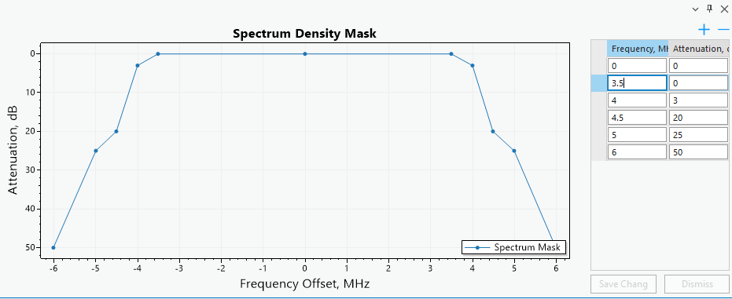

# Spectrum Masks

> **Applies to:** RLP.

Click the Spectrum Masks button to open the Spectrum Masks dialog. Spectrum Masks are specific to the CE for ArcGIS Pro RLP license — the tool lets you create spectrum masks for use in Link calculations.

## View Spectrum Masks

View, edit, and delete all spectrum masks from the **Spectrum Masks** tab on the Spectrum Masks dockpane. Selecting a spectrum mask shows its properties, which can be changed or deleted. Changes to the mask point values are reflected in the graph.

| Control | Description |
|---|---|
| Delete | Deletes the selected spectrum mask. |
| Duplicate | Creates a copy of the selected spectrum mask. |
| Save Changes | Saves changes made to the current spectrum mask. |
| Dismiss | Cancels any changes made to the current spectrum mask. |

When you create a spectrum mask, you see its visual representation as well as the values of each mask point (frequency and attenuation). Changing any point value updates the graph. Use the point-list controls to remove the currently selected mask point, or add a new mask point to the spectrum mask.

## Add Spectrum Mask

Add a spectrum mask from the **Add** tab on the Spectrum Masks dockpane.

| Parameter | Description |
|---|---|
| Mask Name | Spectrum mask identification. |
| Bandwidth | Value in MHz. Required for 4G and 5G technologies. |
| Number of Mask Points | The number of points the resulting spectrum mask will have. |

Press **Add Spectrum Mask** to create the new mask.

## Import Spectrum Mask

You can add a spectrum mask by importing it from a JSON format file. The selected spectrum mask can be visually inspected before importing, by clicking its entry in the container.

## Export Spectrum Mask

Spectrum masks can be exported to JSON file format.
