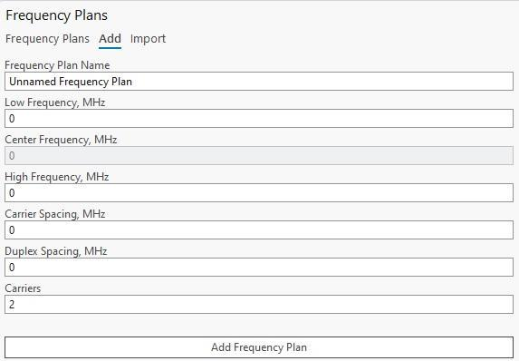
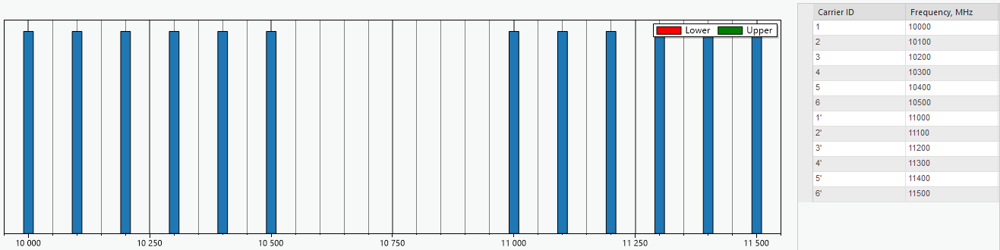
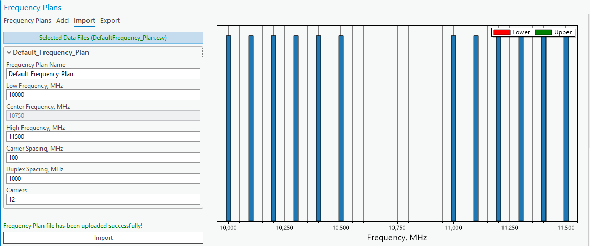
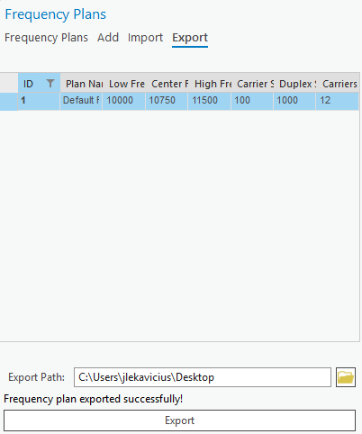
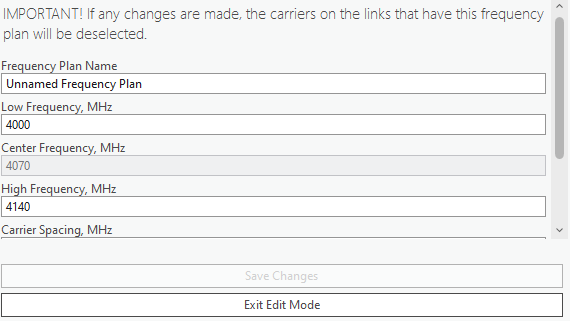

# Frequency Plans

> **Applies to:** RLP.

Click the Frequency Plans button to open the Frequency Plans dialog. Frequency Plans are specific to the CE for ArcGIS Pro RLP license — the tool lets you create frequency plans, needed to create a [Link](../5-2-add-object/5-2-6-rlp/5-2-6-2-add-link.md) and later used in calculations.

## Add Frequency Plan

Add a frequency plan from the **Add** tab on the Frequency Plans dockpane.

| Parameter | Description |
|---|---|
| Frequency Plan Name | Frequency plan identification. |
| Low, Center, High Frequency | Frequencies in MHz. |
| Carrier Spacing, MHz | The frequency separation between adjacent carrier frequencies, ensuring non-interference between carriers. |
| Duplex Spacing, MHz | Frequency separation between the transmit and receive bands in a two-way communication system. |
| Carriers | Specific frequencies used to modulate and transmit information over the communication medium. |

Press **Add Frequency Plan** to create the plan. Once created, its graphical representation and each carrier's frequency are shown. Selecting entries in the carrier table highlights the corresponding carrier on the plot.

Carriers with a prime symbol (`'`) are Upper carriers; the others are Lower carriers.

| Column | Description |
|---|---|
| Carrier ID | Carrier identifier. |
| Frequency | The carrier's frequency value in MHz. |

## Import Frequency Plan

Frequency plans can be imported into the CE workspace as CSV format files. Press **Select Data Files**, then navigate to the frequency plan CSV file. The frequency plan can be edited before importing. Click **Import** to finalize the import.

## Export Frequency Plan

Select the frequency plan in the table, define the export path by clicking the folder icon to open the path selection dialog, then click **Export** to save the frequency plan as a CSV file.

## View Frequency Plans

View, edit, and delete all frequency plans from the **Frequency Plans** tab on the Frequency Plans dockpane.

> **Note:** If any changes are made to a frequency plan, the carriers on the Links that use it are deselected.

