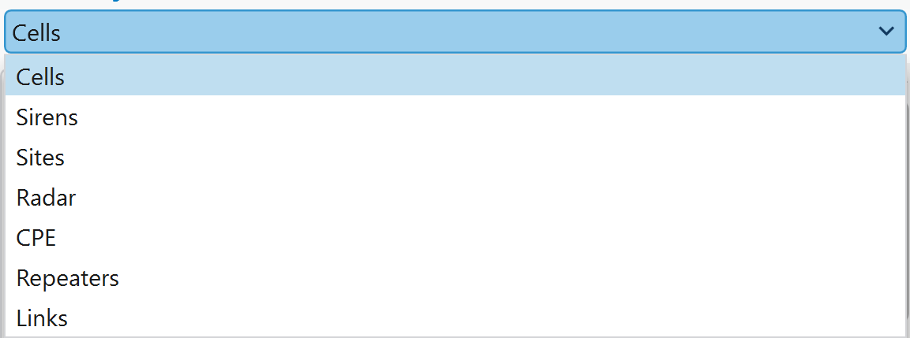
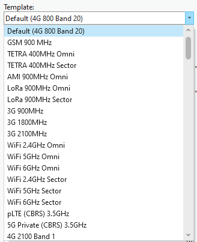
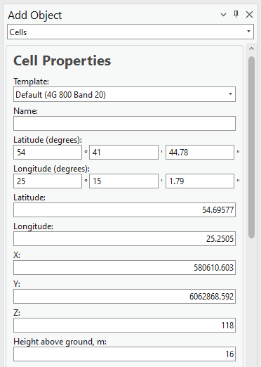
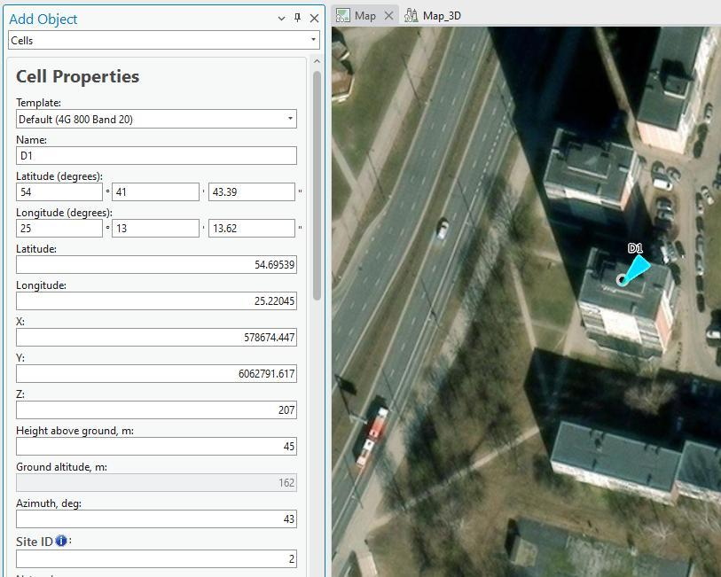

# Add Cell

> **Applies to:** Sound, EMF, Indoor, RCP.

## Adding a Cell

The Cell object represents both physical parameters (e.g. height, antenna, azimuth) and logical parameters (e.g. bandwidth, frequency, technology). It is essentially similar to a Sector object but is referred to as a Cell and includes additional cell-specific parameters. This object is the primary element for performing coverage predictions and supports various technologies, including 2G, 3G, 4G, 5G, and WiFi. It is also used in critical networks such as TETRA, APCO, and P-25, as well as military applications, to model antenna coverage within a specific area.

For a mobile operator, if one sector has several carriers — for example, 3 carriers — then 3 Cells should be created in the CE database.

1. Choose the **Add Object** button from the toolbar and select **Cells** from the dropdown list.

   

2. Left-click on the map to define the location of the object. Left-click a second time in your preferred direction to define its azimuth. The Add Object > Cell dialog is filled with coordinates and parameters from the default template, and an azimuth value based on the direction defined on the map.

   The Cell object can also be created by entering exact coordinates in:
   - Latitude (degrees) and Longitude (degrees)
   - Latitude and Longitude (decimal degrees)
   - X and Y (projected coordinate system)

3. The parameters can be changed all at once by applying a different template, available from the default database — see [Template Manager](../5-8-template-manager.md).

   

   

4. Define a **Name** for the new Cell object.
5. Press **Save Changes** to save the Cell object to the database.

| Button | Description |
|---|---|
| Save Changes | Creates the object with the given parameters. |
| Dismiss | Cancels object creation and closes the dialog. |
| View Antenna | Opens the [Antenna Viewer](../5-6-antenna-viewer.md) with the corresponding antenna patterns. |

### Assign a Cell to a Site

> **Applies to:** RCP.

A Cell object can be created directly on top of a Site object, or near it, and assigned that Site's ID:

1. Open the Add Cell function.
2. Move the mouse cursor over the Site object — the mouse automatically snaps to that Site.
3. Define the direction, as when creating a Cell on an empty location. The Site ID is automatically assigned to the new Cell.

### Add Several Cells in the Same Position

Once a Cell is created, do not close the dialog. Change the **Name** and **Azimuth** parameters (and any other parameters as required), then press **Save Changes** — a new Cell object is created at the same location. Repeat as needed for additional Cells at that location.

### Add Cells on the Corner of Buildings

Cells can be created on the corner of a building and assigned to the same Site. The **Site ID** parameter should be adjusted for every Cell.

## Cell Properties

| Parameter | Description |
|---|---|
| Template | Fills all empty or unspecified fields with default values that are not necessary for predictions. |
| Name | Cell identification. |
| Latitude (degrees) | Latitude in degrees, minutes, and seconds (Y coordinate) in the WGS 1984 geographical coordinate system. |
| Longitude (degrees) | Longitude in degrees, minutes, and seconds (X coordinate) in the WGS 1984 geographical coordinate system. |
| Latitude | Decimal degrees Y coordinate in the WGS 1984 geographical coordinate system. |
| Longitude | Decimal degrees X coordinate in the WGS 1984 geographical coordinate system. |
| X | Coordinate in the projected coordinate system. |
| Y | Coordinate in the projected coordinate system. |
| Z | 3D height above sea level, used for visualizing the object in a 3D scene. |
| Ground Altitude | Ground elevation above sea level at the network object's location. |
| Azimuth | Cell direction from North, in degrees. |
| Site ID | Describes which Site the Cell belongs to. |
| Tilt | Mechanical tilt value. |
| Frequency | Frequency value in MHz. |
| Frequency Group | Divides calculations into parts. If the selection range includes two or more different frequency group values, those cells are not predicted together. |
| Power | Power value in dBm. |
| Antenna Gain | Can be left empty — the value is taken automatically from the defined antenna. |
| Misc Loss | Miscellaneous loss value in dB. |
| Bandwidth | Value in MHz. Required for 4G and 5G technologies; for other technologies, define the value as `0.015`. |
| Noise Figure | Value in dB. Required for 4G and 5G technologies. |
| Downlink Duplex Factor | Value from 0 to 1. Required for TDD duplex mode (4G/5G), used for Downlink Throughput calculations. For example, a value of `0.7` dedicates 70% of available bandwidth to downlink and 30% to uplink. |
| Subcarrier Spacing | Value in kHz. Required for 4G and 5G technologies; for other technologies, define the value as `15`. |
| Tx Mimo | Transmitter antenna count. Available values: 1, 2, 4, 8, 16, 32, 64. |
| Rx Mimo | Receiver antenna count. Available values: 1, 2, 4, 8, 16, 32, 64. |
| Active Antenna Effect | Dedicated to smart antenna modeling. Default `0`; if massive MIMO is used, a smart antenna effect can be included to lower interference and boost throughput. Recommended: `6` for MIMO 32x32, `9` for MIMO 64x64. |
| Cell Load | Percentage (0–100) describing how loaded the cell is. Affects RSSI, RSRQ, and DL Throughput calculations — a higher Cell Load results in lower DL Throughput. |
| Network Name | Divides cells into networks, to help manage different technologies and frequencies in the project; automatically tracks changes for cells. |
| Technology | The network object's technology: 2G, 3G, 4G, or 5G. |
| Duplex Mode | FDD or TDD. Required for 4G and 5G technologies; for other technologies, define the value as FDD. |
| Antenna | Defines the antenna pattern for the Cell object. |
| Carriers | Carrier values used for 2G calculations (C/I and C/A interference). Written in brackets, e.g. `[1, 5]` for multiple values, or `[]` if no carrier information is available. |
| Select Model | Prediction model used for Path Loss simulation. |

> **Applies to:** RCP
>
> **EIRP** — Not editable. Represents the total radiated power for the Cell object and is automatically calculated based on Power, Miscellaneous Loss, Antenna Gain, and Tx MIMO.
