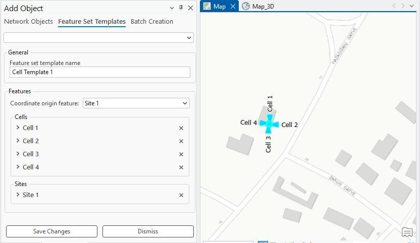
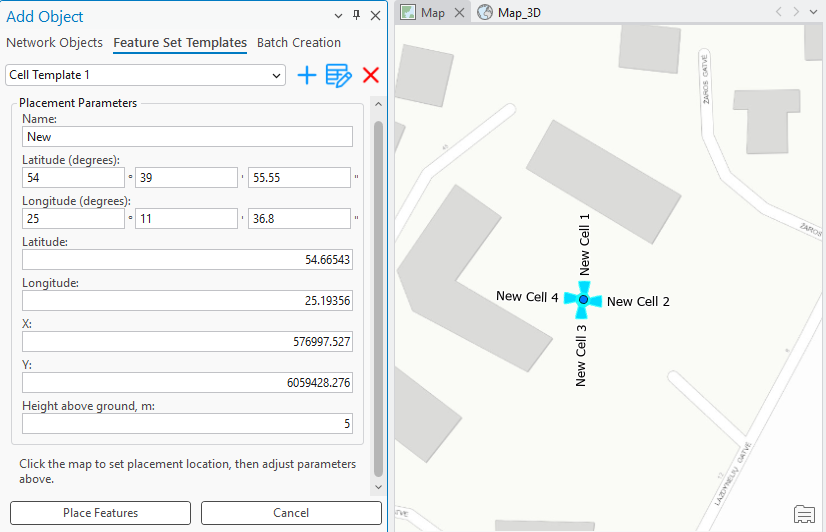

# Feature Set Templates

The **Feature Set Templates** tab in Add Object supports composite templates that describe a group of multiple objects while preserving the relative geometry between them. A composite template is created by selecting two or more existing objects and saving them as a template.

When a composite template is selected in the Add Object tool, the whole group can be placed on the map in a single action — either by clicking a location on the map or by entering explicit coordinates (X/Y or latitude/longitude). All objects in the group are created at their correct positions relative to the placement point, and remain individually editable after placement.

Selecting a template shows its **Placement Parameters** — Name, Latitude (degrees), Longitude (degrees), Latitude, Longitude, X, Y, and Height above ground, m. Click the map to set the placement location, then adjust the parameters above as needed. Press **Place Features** to create the whole group of objects, or **Cancel** to discard the placement.
