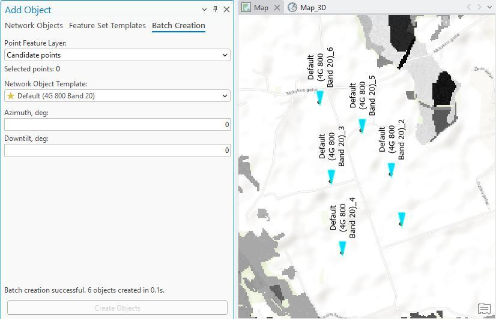

# Batch Creation

Objects can also be created in bulk from an existing point feature layer. Select points from any point feature layer available in the ArcGIS Pro project, pick a network object template, and create an object (or an object group) at each selected location using the template's default values.

| Field | Description |
|---|---|
| Point Feature Layer | The point feature layer supplying the candidate locations. |
| Selected points | Number of points currently selected from the layer. |
| Network Object Template | The template used to create an object at each selected point. |
| Azimuth, deg | Azimuth applied to each created object. |
| Downtilt, deg | Downtilt applied to each created object. |

Progress is shown for larger batches, and a completion summary reports the total number of points selected, the objects successfully created, and any failures with their reasons. Objects created in a batch are individually editable afterwards, and the source feature layer is not modified.
