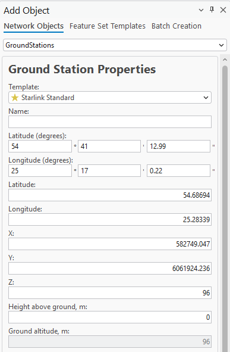

# Add Ground Station

> **Applies to:** SAT.

The Ground Station object represents a fixed, earth-based satellite terminal. It carries the station's location, the antenna it uses, and the terminal and link parameters needed for satellite calculations. It is used in the [Sky Clearance](../../../7-coverage-prediction/7-3-sat/7-3-2-sky-clearance.md) and [Quick SAT Link Budget](../../../7-coverage-prediction/7-3-sat/7-3-1-quick-sat-link-budget.md) calculations.

1. Choose the **Add Object** button from the toolbar and select **GroundStations** from the dropdown list.
2. Define the location of the new Ground Station by pressing the left mouse button on the map. The new Ground Station is placed at that location.

   The Ground Station object can also be created by entering exact coordinates in:
   - Latitude (degrees) and Longitude (degrees)
   - Latitude and Longitude (decimal degrees)
   - X and Y (projected coordinate system)

3. Define the Ground Station **Name** and press **Save Changes** to save the object to the database.

| Button | Description |
|---|---|
| Save Changes | Creates the object with the given parameters. |
| Dismiss | Cancels object creation and closes the dialog. |

## Ground Station Properties

| Parameter | Description |
|---|---|
| Name | Ground Station identification. |
| Latitude (degrees) | Latitude in degrees, minutes, and seconds (Y coordinate) in the WGS 1984 geographical coordinate system. |
| Longitude (degrees) | Longitude in degrees, minutes, and seconds (X coordinate) in the WGS 1984 geographical coordinate system. |
| Latitude | Decimal degrees Y coordinate in the WGS 1984 geographical coordinate system. |
| Longitude | Decimal degrees X coordinate in the WGS 1984 geographical coordinate system. |
| X | Coordinate in the projected coordinate system. |
| Y | Coordinate in the projected coordinate system. |
| Z | 3D height above sea level, used for visualizing the object in a 3D scene. |
| Height Above Ground | The object's height above the terrain. |
| Ground Altitude | Ground elevation above sea level at the network object's location. |
| Antenna | Defines the antenna pattern for the Ground Station object. |
| Terminal G/T | Ratio of antenna gain to system noise temperature. Determines the terminal's receive sensitivity. Value in dB/K. |
| Minimum Elevation | Lowest elevation angle at which the terminal can use a satellite. Value in degrees. |
| Polarization | Signal polarization: Horizontal, Vertical, or Circular. |
| Band | Frequency band of the terminal, such as Ka, Ku, or C. |
| EIRP | Effective isotropic radiated power of the terminal. Value in dBW. |
| Downlink Frequency | Receive (downlink) frequency. Value in MHz. |
| Uplink Frequency | Transmit (uplink) frequency. Value in MHz. |
| Bandwidth | Channel bandwidth. Value in MHz. |
| Required C/N | Minimum carrier-to-noise ratio needed for the link to close. Value in dB. |
