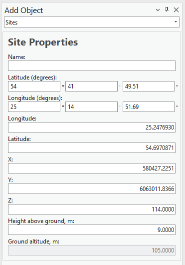

# Add Site

> **Applies to:** RCP.

The Site object represents a tower or site location. It carries several parameters, such as Site Name, coordinates, or height. It is used only in 4G or 5G carrier-aggregation calculations, when Total Downlink Throughput is calculated.

> **Note:** RLP has its own Add Site workflow with a different field set — see [Add Site (RLP)](../5-2-6-rlp/5-2-6-1-add-site.md).

1. Choose the **Add Object** button from the toolbar and select **Site** from the dropdown list.
2. Define the location of the new Site by pressing the left mouse button on the map. The new Site is placed at that location.

   The Site object can also be created by entering exact coordinates in:
   - Latitude (degrees) and Longitude (degrees)
   - Latitude and Longitude (decimal degrees)
   - X and Y (projected coordinate system)

3. Define the Site **Name** and press **Save Changes** to save the object to the database.

| Button | Description |
|---|---|
| Save Changes | Creates the object with the given parameters. |
| Dismiss | Cancels object creation and closes the dialog. |

## Site Properties

| Parameter | Description |
|---|---|
| Name | Site identification. |
| Latitude (degrees) | Latitude in degrees, minutes, and seconds (Y coordinate) in the WGS 1984 geographical coordinate system. |
| Longitude (degrees) | Longitude in degrees, minutes, and seconds (X coordinate) in the WGS 1984 geographical coordinate system. |
| Latitude | Decimal degrees Y coordinate in the WGS 1984 geographical coordinate system. |
| Longitude | Decimal degrees X coordinate in the WGS 1984 geographical coordinate system. |
| X | Coordinate in the projected coordinate system. |
| Y | Coordinate in the projected coordinate system. |
| Z | 3D height above sea level, used for visualizing the object in a 3D scene. |
| Height Above Ground | The object's height above the terrain. |
| Ground Altitude | Ground elevation above sea level at the network object's location. |
