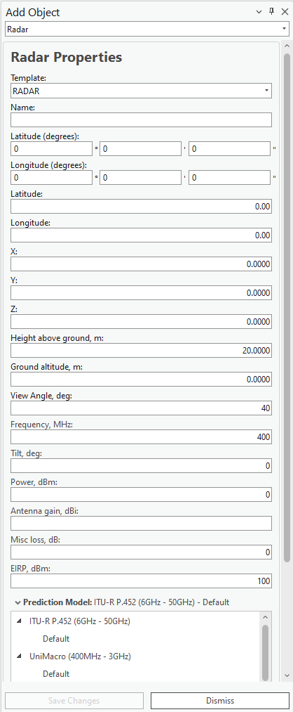

# Add Radar

> **Applies to:** RCP.

The Radar object is used by the [Radar Prediction](../../../7-coverage-prediction/7-4-rcp/7-4-5-radar-prediction.md) tool, which performs theoretical radar coverage calculations and provides the results in the project.

1. Choose the **Add Object** button from the toolbar and select **Radar** from the dropdown list.
2. Define the location of the new Radar by pressing the left mouse button on the map. The new Radar is placed at that location.

   The Radar object can also be created by entering exact coordinates in:
   - Latitude (degrees) and Longitude (degrees)
   - Latitude and Longitude (decimal degrees)
   - X and Y (projected coordinate system)

3. Define the Radar **Name** and press **Save Changes** to save the object to the database.

| Button | Description |
|---|---|
| Save Changes | Creates the object with the given parameters. |
| Dismiss | Cancels object creation and closes the dialog. |

## Radar Properties

| Parameter | Description |
|---|---|
| Template | Fills all empty or unspecified fields with default values that are not necessary for predictions. |
| Name | Radar identification. |
| Latitude (degrees) | Latitude in degrees, minutes, and seconds (Y coordinate) in the WGS 1984 geographical coordinate system. |
| Longitude (degrees) | Longitude in degrees, minutes, and seconds (X coordinate) in the WGS 1984 geographical coordinate system. |
| Latitude | Decimal degrees Y coordinate in the WGS 1984 geographical coordinate system. |
| Longitude | Decimal degrees X coordinate in the WGS 1984 geographical coordinate system. |
| X | Coordinate in the projected coordinate system. |
| Y | Coordinate in the projected coordinate system. |
| Z | 3D height above sea level, used for visualizing the object in a 3D scene. |
| Height Above Ground | The object's height above the terrain. |
| Ground Altitude | Ground elevation above sea level at the network object's location. |
| Azimuth | Direction from North, in degrees. |
| View Angle | The radar's visible field (vertical angle), in degrees. |
| Frequency | Frequency value in MHz. |
| Tilt | Mechanical tilt value. |
| Power (Optional) | Power value in dBm. |
| Antenna Gain (Optional) | Antenna gain value from the applied antenna. |
| Misc Loss (Optional) | Miscellaneous loss value in dB. |
| EIRP | Total radar power in dBm, used for calculations. Can be generated automatically from Power, Antenna Gain, and Misc Loss, or entered directly, leaving those three fields empty. |
| Prediction Model | Prediction model used for Path Loss simulation. |
