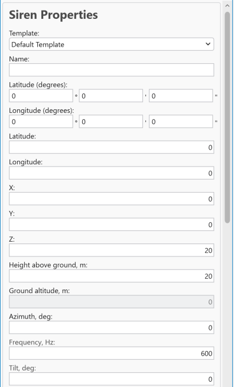
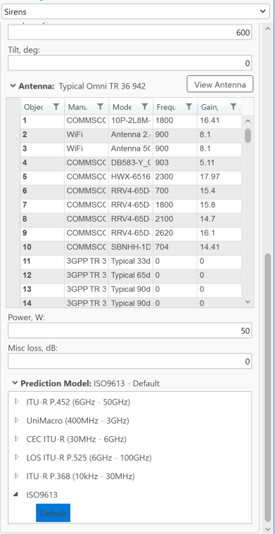

# Add Sirens

> **Applies to:** RCP.

A Siren object represents a sound-emitting device used for warning and alerting purposes. The software calculates the siren's sound level based on parameters such as power, frequency, environmental conditions, and distance — allowing users to analyze sound propagation and ensure effective coverage for emergency and safety applications.

1. Choose the **Add Object** button from the toolbar and select **Sirens** from the dropdown list.
2. Left-click on the map to define the location of the object. Left-click a second time in your preferred direction to define its direction.

   The Siren object can also be created by entering exact coordinates in:
   - Latitude (degrees) and Longitude (degrees)
   - Latitude and Longitude (decimal degrees)
   - X and Y (projected coordinate system)

3. Define the Siren **Name** and press **Save Changes** to save the object to the database.

| Button | Description |
|---|---|
| Save Changes | Creates the object with the given parameters. |
| Dismiss | Cancels object creation and closes the dialog. |
| View Antenna | Opens the [Antenna Viewer](../../5-6-antenna-viewer.md) with the corresponding antenna patterns. |

## Siren Properties

| Parameter | Description |
|---|---|
| Template | Fills all empty or unspecified fields with default values that are not necessary for predictions. |
| Name | Siren identification. |
| Latitude (degrees) | Latitude in degrees, minutes, and seconds (Y coordinate) in the WGS 1984 geographical coordinate system. |
| Longitude (degrees) | Longitude in degrees, minutes, and seconds (X coordinate) in the WGS 1984 geographical coordinate system. |
| Latitude | Decimal degrees Y coordinate in the WGS 1984 geographical coordinate system. |
| Longitude | Decimal degrees X coordinate in the WGS 1984 geographical coordinate system. |
| X | Coordinate in the projected coordinate system. |
| Y | Coordinate in the projected coordinate system. |
| Z | 3D height above sea level, used for visualizing the object in a 3D scene. |
| Height Above Ground | The object's height above the terrain. |
| Ground Altitude | Ground elevation above sea level at the network object's location. |
| Azimuth | Direction from North, in degrees. |
| Frequency | Frequency value in Hz. |
| Tilt | Mechanical tilt. |
| Antenna | Antenna name for the Siren object. |
| Power | Power value in W. |
| Misc Loss | Miscellaneous loss value in dB. |
| Prediction Model | Only **ISO9613** can be applied to calculate sound loss for the siren. |

> **Note:** Siren sound-level prediction is based on the ISO9613 standard for outdoor sound propagation attenuation — it is the only prediction model available for Siren objects.
