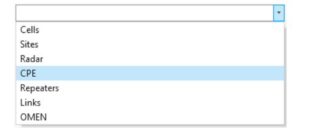
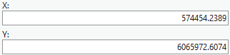

# Add CPE

> **Applies to:** RCP.

The CPE (Customer Premises Equipment) object represents a customer location. It carries information about the customer's location, name, height, and installed antenna.

1. Choose the **Add Object** button from the toolbar and select **CPE** from the dropdown list.

   

   > **Note:** This dropdown lists **OMEN** rather than **Sirens** — see the equivalent note on [Add Cell](../5-2-1-add-cell.md).

2. Left-click on the map to define the location of the object. Left-click a second time in your preferred direction to define its antenna direction.

   The CPE object can also be created by entering exact coordinates in:
   - Latitude (degrees) and Longitude (degrees)
   - Latitude and Longitude (decimal degrees)
   - X and Y (projected coordinate system)

3. Define the CPE **Name** and press **Save Changes** to save the object to the database.

| Button | Description |
|---|---|
| Save Changes | Creates the object with the given parameters. |
| Dismiss | Cancels object creation and closes the dialog. |
| View Antenna | Opens the [Antenna Viewer](../../5-6-antenna-viewer.md) with the corresponding antenna patterns. |

## CPE Properties

| Parameter | Description |
|---|---|
| Name | CPE identification. |
| Latitude (degrees) | Latitude in degrees, minutes, and seconds (Y coordinate) in the WGS 1984 geographical coordinate system. |
| Longitude (degrees) | Longitude in degrees, minutes, and seconds (X coordinate) in the WGS 1984 geographical coordinate system. |
| Latitude | Decimal degrees Y coordinate in the WGS 1984 geographical coordinate system. |
| Longitude | Decimal degrees X coordinate in the WGS 1984 geographical coordinate system. |
| X | Coordinate in the projected coordinate system. |
| Y | Coordinate in the projected coordinate system. |
| Z | 3D height above sea level, used for visualizing the object in a 3D scene. |
| Height Above Ground | The object's height above the terrain. |
| Ground Altitude | Ground elevation above sea level at the network object's location. |
| Azimuth | Direction from North, in degrees. |
| Cell ID | Describes which Cell the CPE point belongs to. |
| Template | Fills all empty or unspecified fields with values that are necessary for predictions. |
| Antenna | Antenna name for the CPE location. |
| Throughput | The speed at which data is transferred, measured in Mb/s. |
| Status | Current status of the network object. |
| Notes | Additional information for network predictions can be noted here. |
