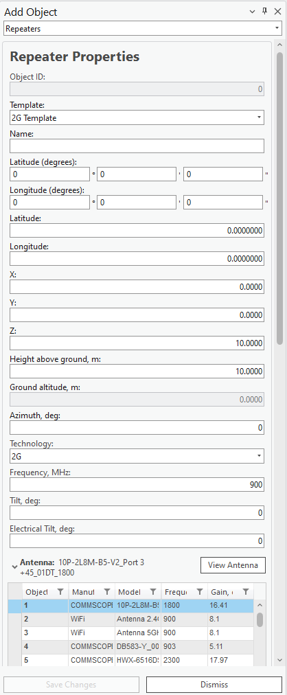

# Add Repeater

> **Applies to:** RCP.

A repeater is a device used to extend wireless coverage by amplifying and retransmitting signals between a base station and mobile devices. In 2G technology, repeaters help enhance signal strength in areas with weak coverage, such as remote or obstructed locations. For multipoint applications, repeaters can support communication across multiple user devices within their range, ensuring consistent connectivity and improved service quality.

1. Choose the **Add Object** button from the toolbar and select **Repeater** from the dropdown list.
2. Left-click on the map to define the location of the object. Left-click a second time in your preferred direction to define its antenna direction.

   The Repeater object can also be created by entering exact coordinates in:
   - Latitude (degrees) and Longitude (degrees)
   - Latitude and Longitude (decimal degrees)
   - X and Y (projected coordinate system)

3. Define the Repeater **Name** and press **Save Changes** to save the object to the database.

| Button | Description |
|---|---|
| Save Changes | Creates the object with the given parameters. |
| Dismiss | Cancels object creation and closes the dialog. |
| View Antenna | Opens the [Antenna Viewer](../../5-6-antenna-viewer.md) with the corresponding antenna patterns. |

## Repeater Properties

| Parameter | Description |
|---|---|
| Template | Fills all empty or unspecified fields with default values that are not necessary for predictions. |
| Name | Repeater identification. |
| Latitude (degrees) | Latitude in degrees, minutes, and seconds (Y coordinate) in the WGS 1984 geographical coordinate system. |
| Longitude (degrees) | Longitude in degrees, minutes, and seconds (X coordinate) in the WGS 1984 geographical coordinate system. |
| Latitude | Decimal degrees Y coordinate in the WGS 1984 geographical coordinate system. |
| Longitude | Decimal degrees X coordinate in the WGS 1984 geographical coordinate system. |
| X | Coordinate in the projected coordinate system. |
| Y | Coordinate in the projected coordinate system. |
| Z | 3D height above sea level, used for visualizing the object in a 3D scene. |
| Height Above Ground | The object's height above the terrain. |
| Ground Altitude | Ground elevation above sea level at the network object's location. |
| Azimuth | Direction from North, in degrees. |
| Technology | The network object's technology: 2G, 3G, 4G, or 5G. |
| Frequency | Frequency value in MHz. |
| Tilt | The physical angling of the antenna, used to optimize signal coverage. |
| Electrical Tilt | The electronic adjustment of the antenna's vertical radiation pattern, used to optimize coverage and reduce interference. |
| Antenna | Antenna name for the Repeater object. |
| Thresholds 1, 2, 3 | Signal-strength thresholds. The three parameters must be written in decreasing order — if an antenna's threshold is below one of the threshold parameters, the next threshold parameter is evaluated. |
| Power 1, 2, 3 | Power assigned to cells based on the repeater thresholds and cell signal strength — once a cell's signal strength is categorized, the corresponding repeater power is assigned. |
| Threshold | Power maximum threshold. |
| Misc Loss (Optional) | Miscellaneous loss value in dB. |
| Bandwidth | Value in MHz. Required for 4G and 5G technologies; for other technologies, define the value as `0.015`. |
| Subcarrier Spacing | Value in kHz. Required for 4G and 5G technologies; for other technologies, define the value as `15`. |
| Tx Mimo | Transmitter antenna count. Available values: 1, 2, 4, 8, 16, 32, 64. |
| Rx Mimo | Receiver antenna count. Available values: 1, 2, 4, 8, 16, 32, 64. |
| Prediction Model | Lets you select which prediction model and configuration to use for calculations. |
