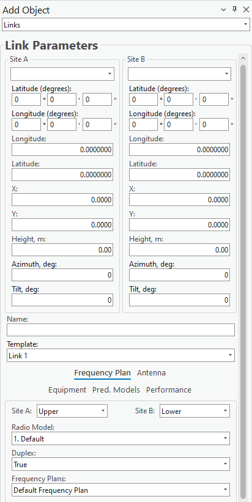
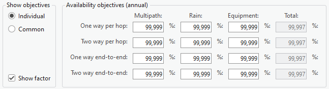

# Add Link

> **Applies to:** RLP.

The Link object represents a microwave link and holds all the information about frequencies, antennas, and radio equipment. It is a line feature class.

1. Choose the **Add Object** button from the toolbar and select **Links** from the dropdown list.
2. Define the location of the new Link by left-clicking on the map and selecting two distinct points, or two existing Sites. The new Link is created as a geometry between those two points.
3. Press **Save Changes** to save the object to the database.

| Button | Description |
|---|---|
| Save Changes | Creates the object with the given parameters. |
| Dismiss | Cancels object creation and closes the dialog. |

## Link Parameters

| Parameter | Description |
|---|---|
| Site (A, B) | The Sites assigned to the transmitter and receiver points of the link. If no Sites were assigned when the Link was created, new Sites are created and assigned to the Link automatically. |
| Latitude (degrees) (A, B) | Latitude in degrees, minutes, and seconds (Y coordinate) in the WGS 1984 geographical coordinate system. |
| Longitude (degrees) (A, B) | Longitude in degrees, minutes, and seconds (X coordinate) in the WGS 1984 geographical coordinate system. |
| Latitude (A, B) | Decimal degrees Y coordinate in the WGS 1984 geographical coordinate system. |
| Longitude (A, B) | Decimal degrees X coordinate in the WGS 1984 geographical coordinate system. |
| X (A, B) | Coordinate in the projected coordinate system. |
| Y (A, B) | Coordinate in the projected coordinate system. |
| Z (A, B) | 3D height above sea level, used for visualizing the object in a 3D scene. |
| Height (A, B) | The object's height above the terrain. |
| Azimuth (A, B) | Direction from North, in degrees. |
| Tilt (A, B) | The physical angling of the antenna, used to optimize signal coverage. |
| Link Name | Link identification. |
| Template | Fills all empty or unspecified fields with default values that are not necessary for predictions. |

### Frequency Plan

| Parameter | Description |
|---|---|
| Band (A, B) | Specifies whether the transmitter operates in Upper or Lower frequencies. If the link type is duplex, also determines the receiver band. |
| Radio Model | The radio equipment parameters assigned to the Link. |
| Duplex | Specifies whether the signal can be transmitted and received simultaneously. Changing the duplex mode affects carrier selection. |
| Frequency Plan | The [frequency plan](../../5-13-rlp/5-13-3-frequency-plans.md) applied to the Link. Changing it affects carrier selection. |
| Carrier Selection | Carriers assigned to the created Link — required before the Link can be created. In duplex mode, both Upper and Lower band carriers can be edited; selecting one carrier selects its paired Upper/Lower carrier by ID. |
| Protection configuration | 1+1 or M:N protection configuration. The selected configuration determines the transmitter/receiver switching scheme: |

| Link configuration | Tx combining | Rx combining |
|---|---|---|
| 1+1 | Hot standby | Combining/Switching |
| 1:1 | Switching | Combining/Switching |
| M:N | Switching | Switching |

| Parameter | Description |
|---|---|
| Diversity | Space, frequency, space and frequency (with two or four receivers), or angle diversity. Use the **Diversity properties** command to define diversity options (antenna or frequency separation values). For space diversity, the antenna, vertical separation (m), gain of the diversity antenna, and misc. loss (dB) can be configured. |
| Apply parameter settings to duplex link | When enabled, saves the receiver band carrier parameters to the transmitter band carrier parameters, overwriting any changes made to the selected carriers. |

> **Note:** Protection and diversity improvement calculation algorithms are provided in the Cellular Expert Technical Reference.

### Antenna

| Parameter | Description |
|---|---|
| Antenna (A, B) | Antenna name, parameters, and patterns used for predictions. |
| Misc Loss (Optional) | Miscellaneous loss value in dB. |
| View Antenna | Opens the [Antenna Viewer](../../5-6-antenna-viewer.md) with the corresponding antenna patterns. |

### Equipment

| Parameter | Description |
|---|---|
| Spectrum Mask | The [mask](../../5-13-rlp/5-13-2-spectrum-masks.md) applied to the selected carriers. |
| Radio Model | The [radio](../../5-13-rlp/5-13-1-radios.md) equipment parameters assigned to the Link. |
| View Mask | Opens Spectrum Masks with the selected spectrum mask patterns. |

### Pred. Models

This tab lets you select which [prediction model](../../5-7-prediction-model-manager.md) and configuration to use for calculations.

### Performance

**Performance Objectives** opens a dialog for assigning individual performance objectives to the current Link — availability and performance objectives predefined for the radio link under analysis.

The first group of objectives is annual availability objectives for multipath, rain, and equipment. Total availability is recalculated automatically as a sum after entering objectives for multipath, rain, and equipment. Objectives are expressed as a percentage over the average year, separately for one-way and two-way paths, for single-hop and end-to-end radio paths.

The second group is performance objectives, of two kinds:

- **Individual** — prescribed for a given link. Accessible only when the Performance Objectives dialog is launched from the selected Link's properties dialog.
- **Common** — valid for all links subject to the prediction procedure.

This framework enables evaluating one group of performance objectives for a whole radio link network, together with specialized objectives for separate parts of the network.

To create a new performance objective, select the required performance parameter, the target defining an objective for it, and the condition that applies to a given link or group of links, then add the objective. To remove one, select it in the table and delete it.

| Field | Description |
|---|---|
| Value | If the value of a given performance objective depends on the path length of a link, it can be represented directly as a value. |
| Show Factor | If the value of a given performance objective depends on the path length of a link, it can instead be represented as a multiplication factor, expressed as a formatted string. |
