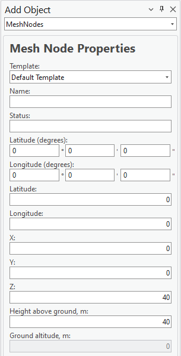

# Add Mesh Node

> **Applies to:** RLP.

The Mesh Node object represents a node used in mesh network calculations and serves as an endpoint for [Link](5-2-6-2-add-link.md) objects. It includes configurable parameters such as name, geographic coordinates, height, maximum number of connections, group affiliation, and additional technical attributes.

1. Choose the **Add Object** button from the toolbar and select **MeshNodes** from the dropdown list.
2. Define the location of the new Mesh Node by pressing the left mouse button on the map. The new Mesh Node is placed at that location.

   The Mesh Node object can also be created by entering exact coordinates in:
   - Latitude (degrees) and Longitude (degrees)
   - Latitude and Longitude (decimal degrees)
   - X and Y (projected coordinate system)

3. Define the Mesh Node **Name** and press **Save Changes** to save the object to the database.

| Button | Description |
|---|---|
| Save Changes | Creates the object with the given parameters. |
| Dismiss | Cancels object creation and closes the dialog. |

## Mesh Node Properties

| Parameter | Description |
|---|---|
| Name | Mesh node identification. |
| Status | Mesh node status. |
| Latitude (degrees) | Latitude in degrees, minutes, and seconds (Y coordinate) in the WGS 1984 geographical coordinate system. |
| Longitude (degrees) | Longitude in degrees, minutes, and seconds (X coordinate) in the WGS 1984 geographical coordinate system. |
| Latitude | Decimal degrees Y coordinate in the WGS 1984 geographical coordinate system. |
| Longitude | Decimal degrees X coordinate in the WGS 1984 geographical coordinate system. |
| X | Coordinate in the projected coordinate system. |
| Y | Coordinate in the projected coordinate system. |
| Z | 3D height above sea level, used for visualizing the object in a 3D scene. |
| Height Above Ground | The object's height above the terrain. |
| Ground Altitude | Ground elevation above sea level at the network object's location. |
| Frequency, MHz | Frequency of the mesh node. |
| Antenna | Defines the antenna pattern for the mesh node object. |
| Power, dBm | Power value of the mesh node. |
| Misc Loss, dB | Miscellaneous loss value of the mesh node. |
| Sensitivity, dBm | Sensitivity value of the mesh node. |
| Type | Type of the mesh node (text description). |
| Max Connections | The maximum number of connections the mesh node can have — used for [Mesh Connectivity](../../../9-rlp/9-1-mesh-network/9-1-1-mesh-connectivity.md) calculations. |
| Layer | The layer of the mesh node (numeric value). Used for priority calculations in [Automatic Frequency Planning](../../../9-rlp/9-2-radio-links/9-2-3-automatic-frequency-planning.md). |
| Group Name | The group name of the mesh node (text description). Several mesh nodes may belong to the same group. |
| Prediction Model | The prediction model used for the mesh node in [Mesh Connectivity and Quick Mesh Connectivity](../../../9-rlp/9-1-mesh-network/9-1-1-mesh-connectivity.md) calculations. Default: LOS ITU-R P.525 (6GHz–100GHz) – Default. |

> **Note:** The source manual lists this field as "Misc Loss, dBm" while describing it as the mesh node's sensitivity value — it is documented here as **Sensitivity, dBm** to avoid confusion with the separate Misc Loss, dB field above.
